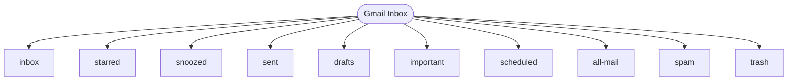

# Gmail Live Mapping Run

- Timestamp (UTC): `2026-02-24T22:20:06.191305Z`
- Source: `http://localhost:9224`
- Sections visited: `10`

## Section Evidence
- `inbox`: url=`https://mail.google.com/mail/u/0/#inbox` rows=50 sign_in=False
- `starred`: url=`https://mail.google.com/mail/u/0/#starred` rows=71 sign_in=False
- `snoozed`: url=`https://mail.google.com/mail/u/0/#snoozed` rows=71 sign_in=False
- `sent`: url=`https://mail.google.com/mail/u/0/#sent` rows=100 sign_in=False
- `drafts`: url=`https://mail.google.com/mail/u/0/#drafts` rows=129 sign_in=False
- `important`: url=`https://mail.google.com/mail/u/0/#important` rows=129 sign_in=False
- `scheduled`: url=`https://mail.google.com/mail/u/0/#scheduled` rows=79 sign_in=False
- `all-mail`: url=`https://mail.google.com/mail/u/0/#all` rows=100 sign_in=False
- `spam`: url=`https://mail.google.com/mail/u/0/#spam` rows=146 sign_in=False
- `trash`: url=`https://mail.google.com/mail/u/0/#trash` rows=103 sign_in=False
