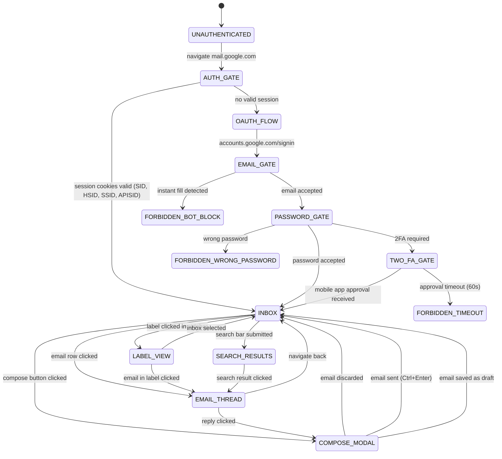

# Prime Mermaid: Gmail Page Flow

**Node ID**: `gmail-page-flow`
**Version**: 1.0.0
**Format**: prime-mermaid v1.1.0 (triplet)
**Authority**: 65537
**Status**: ACTIVE
**Created**: 2026-02-21
**Expires**: 2026-08-21

---

## Canonical Files (Triplet)

| File | Role | SHA256 |
|------|------|--------|
| `gmail-page-flow.prime-mermaid.md` | Human spec (this file) | — |
| `gmail-page-flow.mmd` | Canonical body (bytes for SHA256) | `bdf04329dc825b08ae7b96517b548990222ad53e06138cd96bbbbe92354dea79` |
| `gmail-page-flow.sha256` | Drift detector | see file |

**FORBIDDEN**: `JSON_AS_SOURCE_OF_TRUTH`
**VERIFY**: `sha256sum gmail-page-flow.mmd` must match `gmail-page-flow.sha256`.

---

## Domain: Gmail — Page Navigation State Machine

**Purpose**: Models Gmail authenticated page states and navigation for email automation.

**Selector Map**:
| State | Key Selector |
|-------|-------------|
| `INBOX` | `div[role=main]` |
| `COMPOSE_MODAL` | `div[role=dialog].T-I.T-I-KE` |
| `EMAIL_THREAD` | `h2.hP` (thread header) |
| `LABEL_VIEW` | `a[href^="#inbox"]` sidebar |
| `SEARCH_RESULTS` | `.Tm.aeJ` search results |
| `AUTH_GATE` | redirects to `accounts.google.com` |

**Auth Cookies Required**: `SID`, `HSID`, `SSID`, `APISID`, `__Secure-3PAPISID`

**CRITICAL**: Gmail bot detection is behavior-based. Use char-by-char typing (80-200ms/char).
See `gmail-bot-detection-bypass.primemermaid.md` for full bypass documentation.

---

## State Machine Diagram

See `gmail-page-flow.mmd` for canonical Mermaid source.



---

## See Also

- `gmail-oauth2.prime-mermaid.md` — detailed OAuth2 authentication flow
- `gmail-bot-detection-bypass.primemermaid.md` — bot bypass patterns (legacy format, high value)
- `gmail-automation-100.primewiki.md` — full automation techniques

## Drift Detection

```bash
sha256sum gmail-page-flow.mmd
# Must match: bdf04329dc825b08ae7b96517b548990222ad53e06138cd96bbbbe92354dea79
```
