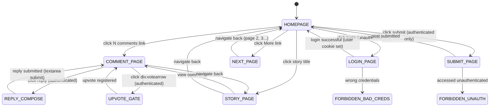

# Prime Mermaid: HackerNews Page Flow

**Node ID**: `hackernews-page-flow`
**Version**: 1.0.0
**Format**: prime-mermaid v1.1.0 (triplet)
**Authority**: 65537
**Status**: ACTIVE
**Created**: 2026-02-21
**Expires**: 2027-02-21 (HN UI is extremely stable, 1-year expiry)

---

## Canonical Files (Triplet)

| File | Role | SHA256 |
|------|------|--------|
| `hackernews-page-flow.prime-mermaid.md` | Human spec (this file) | — |
| `hackernews-page-flow.mmd` | Canonical body (bytes for SHA256) | `c8842aa4480db550c2ee3f22233a55daa624890a5f2d30826bcad058b99cec45` |
| `hackernews-page-flow.sha256` | Drift detector | see file |

**FORBIDDEN**: `JSON_AS_SOURCE_OF_TRUTH`
**VERIFY**: `sha256sum hackernews-page-flow.mmd` must match `hackernews-page-flow.sha256`.

---

## Domain: HackerNews — Page Navigation State Machine

**Purpose**: Models HackerNews page states and navigation for automation. HN uses server-rendered HTML with minimal JavaScript — extremely stable selectors.

**Selector Map**:
| State | Key Selector |
|-------|-------------|
| `HOMEPAGE` | `table.itemlist` |
| `STORY_PAGE` | `a.storylink` (or `span.titleline a`) |
| `COMMENT_PAGE` | `table.comment-tree` |
| `SUBMIT_PAGE` | `form[action=r]` |
| `LOGIN_PAGE` | `form[action=login]` |
| `UPVOTE` | `div.votearrow` (authenticated only) |
| `REPLY_COMPOSE` | `textarea[name=text]` |

**Auth**: Cookie-based (`user` cookie). No OAuth. Simple username/password.
**Domain**: `news.ycombinator.com`

**HN Stability**: Server-rendered HTML, almost no CSS class changes in 10+ years.
Selectors are among the most stable of any major website.

---

## State Machine Diagram

See `hackernews-page-flow.mmd` for canonical Mermaid source.



---

## See Also

- `hackernews-homepage-phase1.primewiki.md` — detailed homepage portal analysis
- `hackernews-architecture-vision.primewiki.md` — automation architecture
- `hackernews-semantic-layer.primewiki.md` — semantic knowledge layer
- `hackernews-ux-design-layer.primewiki.md` — UX patterns

## Drift Detection

```bash
sha256sum hackernews-page-flow.mmd
# Must match: c8842aa4480db550c2ee3f22233a55daa624890a5f2d30826bcad058b99cec45
```
