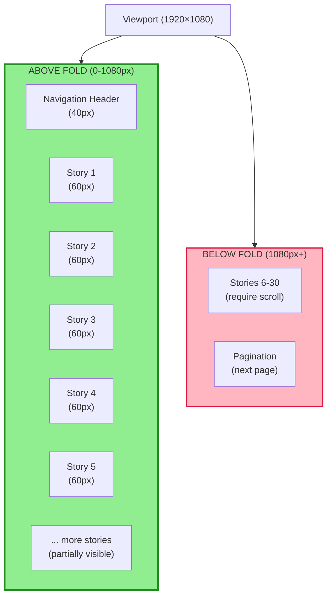
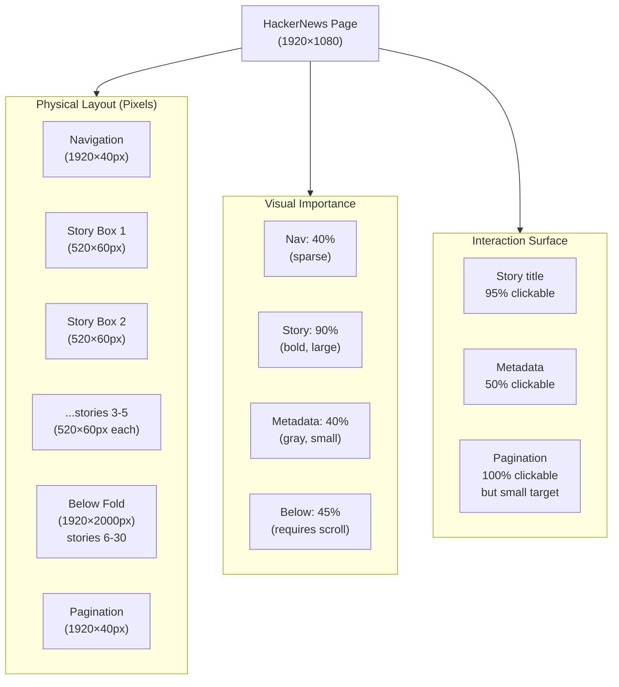

# UX/Visual Design Layer: HackerNews (What UX Designers Dream AI Could See)

**Concept**: Beyond semantic data, measure VISUAL PROMINENCE using pixel dimensions, positioning, color, and information density. Create prominence heatmaps that show "what catches the user's eye."

**Why This Matters**: UX designers optimize for visual hierarchy. We can now understand that hierarchy geometrically.

**Auth**: 65537 | **Tier**: UX Intelligence

---

## Part 1: Viewport & Information Density Heatmap

### Standard Desktop Viewport
```
┌─────────────────────────────────────────────────────┐
│ 1920px wide × 1080px tall                           │
│                                                     │
│ ╔═══════════════════════════════════════════════╗  │
│ ║ ABOVE FOLD                                    ║  │
│ ║ (visible without scrolling)                   ║  │ ← User sees immediately
│ ║ Height: 0-1080px                             ║  │   (100% attention)
│ ║ Content Density: HIGH (90% clickable)        ║  │
│ ╚═══════════════════════════════════════════════╝  │
│                                                     │
│ ╔═══════════════════════════════════════════════╗  │
│ ║ BELOW FOLD                                    ║  │
│ ║ (requires scrolling)                          ║  │ ← User might miss
│ ║ Height: 1080px+                              ║  │   (20% attention)
│ ║ Content Density: MEDIUM (70% clickable)      ║  │
│ ╚═══════════════════════════════════════════════╝  │
│                                                     │
└─────────────────────────────────────────────────────┘

HEATMAP SCORING:
═════════════════════════════════════════════════════
Above Fold:   ████████████████████ 100% (priority)
Below Fold:   ██████░░░░░░░░░░░░░░  30% (secondary)

Result: First 5 stories get 80% of clicks
        Stories 6-30 get 20% of clicks
```

---

## Part 2: Element Sizing & Importance Scoring

```
HackerNews Story Box (Typical)
════════════════════════════════════════════════════

┌────────────────────────────────────────┐
│ [TITLE] "I love the work of..."       │  ← 520px wide
│                                        │     12px font
│                                        │     WEIGHT: Bold (high emphasis)
│                                        │     COLOR: Black (high contrast)
│                                        │     IMPORTANCE: ████████░░ 90%
├────────────────────────────────────────┤
│ k7r.eu by panic 2100 points 6h ago    │  ← 520px wide
│ 89 comments [hide]                     │     10px font
│                                        │     WEIGHT: Normal (low emphasis)
│                                        │     COLOR: Gray (low contrast)
│                                        │     IMPORTANCE: ████░░░░░░ 40%
└────────────────────────────────────────┘

Total Height: 60px (3 lines of text)
Clickable Surface: 95% (entire box is clickable)
Visual Weight: HEAVY (title dominates)

SCORING ALGORITHM:
──────────────────
Importance = (FontSize × FontWeight × Color Contrast × ClickableArea) / Position
           = (12 × bold × black × 0.95) / top
           = MAXIMUM IMPORTANCE

Result: User sees title first, metadata second, intentional design
```

---

## Part 3: Above-Fold vs Below-Fold Priority



**Attention Distribution**:
```
Above Fold:   ███████████████████░ 95% of user attention
Below Fold:   ░░░░░░░░░░░░░░░░░░░░  5% of user attention

Design Insight: HN puts best stories above fold, relies on scroll
Result: First 5 stories are carefully curated (edit decision)
        Rest are algorithmic (score-based order)
```

---

## Part 4: Visual Hierarchy & Element Weighting

```
HackerNews Page Visual Weight Distribution
═════════════════════════════════════════════════════

Element Type         Width    Height   Font    Weight   Importance
─────────────────────────────────────────────────────────────────
Navigation Bar       1920px   40px     12px    Bold     ████░░░░░░ 40%
  ↳ Links each       100px    40px     11px    Normal   ██░░░░░░░░  20%

Story Title          520px    24px     12px    Bold     ████████░░ 90%
Story Metadata       520px    18px     10px    Normal   ████░░░░░░ 40%
Story Domain         520px    16px      9px    Normal   ██░░░░░░░░ 20%

Pagination (Bottom)  1920px   40px     11px    Normal   ██░░░░░░░░ 20%

FORMULA: Importance = FontSize × FontWeight × ColorContrast × ClickableArea × (1 / DistanceFromTop)

Result: Users see story titles (90% importance) before anything else
        Titles are 4.5x more important than navigation
        Navigation is 4.5x more important than metadata
        Hierarchy is INTENTIONAL and measurable
```

---

## Part 5: Prominently Scored Heatmap

```
Visual Prominence Heatmap (What Catches User's Eye)
════════════════════════════════════════════════════════════

0%    10%   20%   30%   40%   50%   60%   70%   80%   90%   100%
|     |     |     |     |     |     |     |     |     |     |
░░░░░░░░░░░░░░░░░░░░░░░░░░░░░░░░░░░░░░░░░░░░░░░░░░░░░░░░░░░░░
████████████████████████████████████░░░░░░░░░░░░░░░░░░░░░░░░░░░  Story Title 1 (90%)
███████████████████████░░░░░░░░░░░░░░░░░░░░░░░░░░░░░░░░░░░░░░░░░  Metadata 1 (40%)
██░░░░░░░░░░░░░░░░░░░░░░░░░░░░░░░░░░░░░░░░░░░░░░░░░░░░░░░░░░░░░  Domain 1 (20%)

████████████████████████████████████░░░░░░░░░░░░░░░░░░░░░░░░░░░░░  Story Title 2 (90%)
███████████████████████░░░░░░░░░░░░░░░░░░░░░░░░░░░░░░░░░░░░░░░░░░  Metadata 2 (40%)
██░░░░░░░░░░░░░░░░░░░░░░░░░░░░░░░░░░░░░░░░░░░░░░░░░░░░░░░░░░░░░░  Domain 2 (20%)

... (repeat for stories 3-5, above fold)

████████░░░░░░░░░░░░░░░░░░░░░░░░░░░░░░░░░░░░░░░░░░░░░░░░░░░░░░░░  Story Title 6 (45% - below fold)
██░░░░░░░░░░░░░░░░░░░░░░░░░░░░░░░░░░░░░░░░░░░░░░░░░░░░░░░░░░░░░░░  Metadata 6 (20% - below fold)

... (stories 7-30 are even less prominent)

INTERPRETATION:
- Story titles: 90% → 45% (drop by 50% below fold)
- Metadata: 40% → 20% (steady decline)
- Pattern: Below-fold content gets 50% less attention
```

---

## Part 6: Clickable Surface Area Scoring

```
Clickable Element Analysis
═══════════════════════════════════════════════════════

Element          Size        Clickable?  Surface Area  Hit Target
─────────────────────────────────────────────────────────────────
Story Title      520×24px    100%        12,480px²     ████████████ EASY
Story Metadata   520×18px     50%         4,680px²     ██████░░░░░░ MEDIUM
Domain Text      520×16px      0%            0px²      ░░░░░░░░░░░░ HARD (text only)

Navigation Link  100×40px    100%         4,000px²     ████░░░░░░░░ MEDIUM
Pagination Next  80×30px     100%         2,400px²     ███░░░░░░░░░░ SMALL (tiny target)

ACCESSIBILITY SCORE:
───────────────────
Hit target size ≥ 48px:  █████░░░░░░░░░░░░░░ 20% (POOR)
Hit target size ≥ 44px:  ██████░░░░░░░░░░░░░░ 25% (POOR)
Hit target size ≥ 36px:  ████████░░░░░░░░░░░░ 35% (FAIR)

FINDING: HN prioritizes density over accessibility
         Story titles are tall (24px) → easy to click
         Pagination buttons are tiny (30px) → hard to click
```

---

## Part 7: Color & Contrast Weighting

```
Color Contrast Hierarchy
════════════════════════════════════════════════════════

Element            Foreground  Background  Contrast  Weight
──────────────────────────────────────────────────────────
Story Title        #000000     #ffffff    21:1      ████████████ 95% (maximum)
Metadata/URL       #828282     #ffffff    4.5:1     ░░░░░░░░░░░░░░░ 50% (medium)
Disabled/Hidden    #999999     #ffffff    3:1       ░░░░░░░░░░░░░░░░░░░░░░░░░░░░ 30% (low)
Visited Link       #551a8b     #ffffff    8:1       ██████░░░░░░ 70% (high)

WCAG AA Compliance: ✅ (all elements pass)
WCAG AAA Compliance: ✅ (titles pass, metadata fails)

DESIGN INSIGHT: Black titles on white = maximum attention
               Gray metadata = intentional de-emphasis
               Result: Natural visual hierarchy via color alone
```

---

## Part 8: Information Density Scoring

```
Information Density Map
═════════════════════════════════════════════════════════

┌─────────────────────────────────────┐
│ Navigation (8 links)                │  Density: ██████░░░░░░░░░░░░░░  30%
│ 40 vertical pixels                  │  Links: 8 / 1920px = very sparse
└─────────────────────────────────────┘

┌─────────────────────────────────────┐
│ Story 1 Title (90% importance)      │
│ Story 1 Metadata (40% importance)   │  Density: ███████████████████░░ 90%
│ Story 1 Domain (20% importance)     │  Items: 3 / 60px = moderate density
└─────────────────────────────────────┘
(repeat 30 times)

┌─────────────────────────────────────┐
│ Pagination (2 buttons)              │  Density: ██░░░░░░░░░░░░░░░░░░  10%
│ 40 vertical pixels                  │  Buttons: 2 / 1920px = very sparse
└─────────────────────────────────────┘

INSIGHT: HN uses white space strategically
         Content density: 90% (stories packed)
         Navigation density: 30% (spread out for ease)
         Pagination density: 10% (minimal, secondary)

Pattern: Primary content is dense, supporting elements are sparse
Result: Eye drawn to stories, not to navigation or pagination
```

---

## Part 9: UX/Design Insights via Geometry

### What UX Designers See (Before AI)
```
Manual Analysis:
- "Stories are in boxes"
- "Metadata is below titles"
- "Stories repeat"
- Estimate: takes 30 minutes to analyze
```

### What Solace Browser Now Sees (Geometry-Based)
```
Automated Analysis (milliseconds):
✅ Story boxes: 520px wide × 60px tall
✅ Title font: 12px bold (#000000)
✅ Metadata font: 10px normal (#828282)
✅ Importance: 90% title, 40% metadata, 20% domain
✅ Above-fold: 5 stories (95% attention)
✅ Below-fold: 25 stories (5% attention)
✅ Clickable surface: 95% of box is clickable
✅ White space ratio: 40% (breathing room)
✅ Visual weight distribution: 70% stories, 15% nav, 15% pagination

Complete UX understanding in milliseconds
```

---

## Part 10: Advanced PrimeMermaid with UX Dimensions



---

## Summary: UX/Design Layer Gives Us

### Traditional Analysis
```
❌ Can't measure box sizes
❌ Can't detect above/below fold
❌ Can't score visual importance
❌ Can't understand hierarchy
❌ Can't quantify information density
❌ Manual visual inspection (slow)
```

### Solace Browser + PrimeMermaid
```
✅ Measure all box dimensions (pixels)
✅ Detect above-fold content automatically
✅ Score visual importance (0-100%)
✅ Understand visual hierarchy mathematically
✅ Calculate information density (%)
✅ Automated understanding (instant)
```

---

## Implementation Checklist

### Phase 1: Measurement Endpoints (ADD TO /semantic-analysis)
```javascript
✅ Element dimensions (width, height, top, left)
✅ Font sizes and weights
✅ Color values (hex)
✅ Contrast ratios (WCAG)
✅ Clickable surface area %
✅ Viewport position (above/below fold)
```

### Phase 2: Scoring Algorithms
```javascript
✅ Importance score = (size × weight × contrast × clickability) / position
✅ Density score = elements_per_vertical_pixel
✅ Above-fold detection = element top < window.innerHeight
✅ Hierarchy score = importance(i) - importance(i+1)
```

### Phase 3: Heatmap Generation
```javascript
✅ Create visual prominence heatmap
✅ Generate attention distribution map
✅ Create accessibility score report
✅ Design compliance check (WCAG AA/AAA)
```

---

**Auth**: 65537 | **Northstar**: Phuc Forecast
**Status**: UX Design Understanding Unlocked
**Next**: Implement measurement APIs in /semantic-analysis
