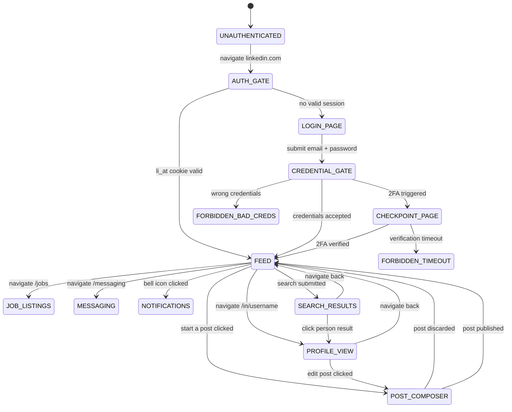

# Prime Mermaid: LinkedIn Page Flow

**Node ID**: `linkedin-page-flow`
**Version**: 1.0.0
**Format**: prime-mermaid v1.1.0 (triplet)
**Authority**: 65537
**Status**: ACTIVE
**Created**: 2026-02-21
**Expires**: 2026-08-21

---

## Canonical Files (Triplet)

| File | Role | SHA256 |
|------|------|--------|
| `linkedin-page-flow.prime-mermaid.md` | Human spec (this file) | — |
| `linkedin-page-flow.mmd` | Canonical body (bytes for SHA256) | `406d4fca887833b8b500a8c68b246be60b80c9f63177f629b9079d986c772e26` |
| `linkedin-page-flow.sha256` | Drift detector | see file |

**FORBIDDEN**: `JSON_AS_SOURCE_OF_TRUTH` — JSON/YAML are derived transport only.
**VERIFY**: `sha256sum linkedin-page-flow.mmd` must match `linkedin-page-flow.sha256`.

---

## Domain: LinkedIn — Page Navigation State Machine

**Purpose**: Models the authenticated/unauthenticated page states and transitions for LinkedIn automation.

**Selector Map**:
| State | Key Selector |
|-------|-------------|
| `FEED` | `.scaffold-layout__main` |
| `POST_COMPOSER` | `artdeco-modal` (modal overlay) |
| `MESSAGING` | `a[href="/messaging/"]` |
| `NOTIFICATIONS` | `a[href="/notifications/"]` |
| `PROFILE_VIEW` | `section.pv-profile-section` |
| `SEARCH_RESULTS` | `.search-results-container` |
| `AUTH_GATE` | redirects to `/login/` |

**Auth Cookie**: `li_at` (httpOnly, secure, session-bound)

---

## State Machine Diagram

See `linkedin-page-flow.mmd` for canonical Mermaid source.



---

## Known Edge Cases

- **CHECKPOINT_PAGE**: Appears after >30 days without re-login, or from new IP
- **POST_COMPOSER**: Uses `artdeco-modal` overlay — wait for `.artdeco-modal__content` before typing
- **li_at expiry**: Sessions expire ~30 days; cloud execution must re-login before task
- **Rate limiting**: LinkedIn throttles at ~50 profile views/hour; recipe must respect this

## Recipes That Use This Map

- `linkedin-discover-posts.recipe.json`
- `linkedin-create-post.recipe.json`
- `linkedin-react.recipe.json`
- `linkedin-comment.recipe.json`

## Drift Detection

```bash
# Verify canonical body has not drifted:
sha256sum linkedin-page-flow.mmd
# Must match: 406d4fca887833b8b500a8c68b246be60b80c9f63177f629b9079d986c772e26
```

**Invalidation triggers**: Login page DOM change, artdeco-modal selector broken, li_at cookie name change.
