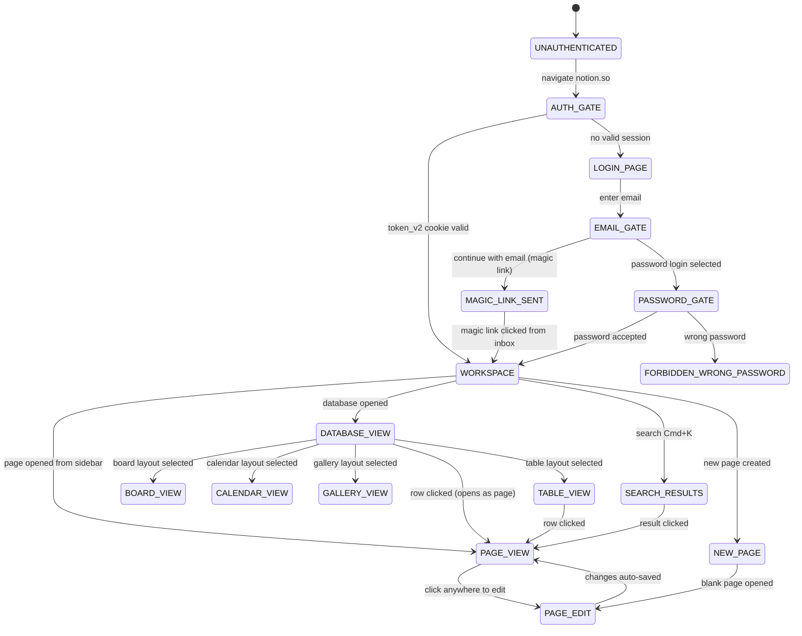

# Prime Mermaid: Notion Page Flow

**Node ID**: `notion-page-flow`
**Version**: 1.0.0
**Format**: prime-mermaid v1.1.0 (triplet)
**Authority**: 65537
**Status**: ACTIVE
**Created**: 2026-02-21
**Expires**: 2026-08-21

---

## Canonical Files (Triplet)

| File | Role | SHA256 |
|------|------|--------|
| `notion-page-flow.prime-mermaid.md` | Human spec (this file) | — |
| `notion-page-flow.mmd` | Canonical body (bytes for SHA256) | `2dd5124ab1b51487b12fbdc023ea6f788300bc03ebc10e0e97cc1b9395ec13c4` |
| `notion-page-flow.sha256` | Drift detector | see file |

**FORBIDDEN**: `JSON_AS_SOURCE_OF_TRUTH`
**VERIFY**: `sha256sum notion-page-flow.mmd` must match `notion-page-flow.sha256`.

---

## Domain: Notion — Page Navigation State Machine

**Purpose**: Models Notion workspace navigation and editing states for automation.

**Selector Map**:
| State | Key Selector |
|-------|-------------|
| `WORKSPACE` | `.notion-workspace` |
| `PAGE_VIEW` | `.notion-page-content` |
| `PAGE_EDIT` | `.notion-page-content [contenteditable=true]` |
| `DATABASE_VIEW` | `.notion-collection-view-body` |
| `TABLE_VIEW` | `.notion-table-view` |
| `BOARD_VIEW` | `.notion-board-view` |
| `SEARCH_RESULTS` | `.notion-overlay-container .notion-search` |

**Auth Cookie**: `token_v2` (httpOnly, essential for session)

**Key Behavior**: Auto-save on every keystroke — no explicit save button.
**Keyboard shortcut for search**: `Cmd+K` (Mac) / `Ctrl+K` (Linux/Windows)

---

## State Machine Diagram

See `notion-page-flow.mmd` for canonical Mermaid source.



---

## Login Methods

| Method | Reliability | Notes |
|--------|-------------|-------|
| Magic link (email) | HIGH (0.95) | Requires access to email inbox — chain with Gmail recipe |
| Password | MED (0.85) | Not all Notion accounts have password set |
| Google OAuth | MED (0.80) | Same bot detection issues as Gmail OAuth |

## Drift Detection

```bash
sha256sum notion-page-flow.mmd
# Must match: 2dd5124ab1b51487b12fbdc023ea6f788300bc03ebc10e0e97cc1b9395ec13c4
```
