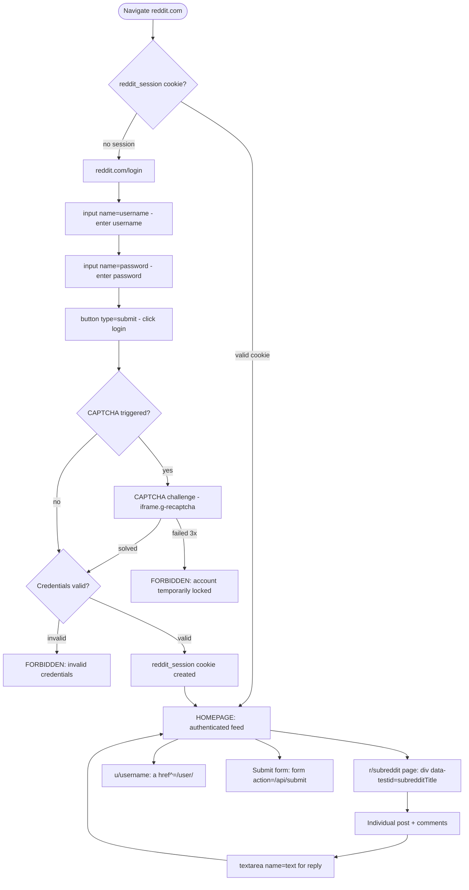

# Prime Mermaid: Reddit Login Flow

**Node ID**: `reddit-login`
**Version**: 1.0.0
**Format**: prime-mermaid v1.1.0 (triplet)
**Authority**: 65537
**Status**: ACTIVE
**Created**: 2026-02-21
**Expires**: 2026-08-21
**Supersedes**: `reddit_login_page.primewiki.json` (archived)

---

## Canonical Files (Triplet)

| File | Role | SHA256 |
|------|------|--------|
| `reddit-login.prime-mermaid.md` | Human spec (this file) | — |
| `reddit-login.mmd` | Canonical body (bytes for SHA256) | `47b3319fb6ba04f1a87aa375013465bbd59fa332e285da9481dea4b3e58ec279` |
| `reddit-login.sha256` | Drift detector | see file |

**FORBIDDEN**: `JSON_AS_SOURCE_OF_TRUTH`
**ARCHIVED**: `../archive/reddit_login_page.primewiki.json` — superseded by this PM triplet.
**ARCHIVED**: `../archive/reddit_homepage_loggedout.primewiki.json` — superseded.
**ARCHIVED**: `../archive/reddit_subreddit_page.primewiki.json` — superseded.

---

## Domain: Reddit — Login + Navigation Flow

**Purpose**: Models Reddit authentication and primary navigation states.

**Selector Map**:
| State | Key Selector |
|-------|-------------|
| `LOGIN_PAGE` | `reddit.com/login` |
| `USERNAME_INPUT` | `input[name="username"]` |
| `PASSWORD_INPUT` | `input[name="password"]` |
| `SUBMIT_BTN` | `button[type="submit"]` |
| `CAPTCHA_GATE` | `iframe.g-recaptcha` |
| `FEED` | `div[data-testid="post-container"]` |
| `SUBREDDIT` | `div[data-testid="subredditTitle"]` |

**Auth Cookie**: `reddit_session` (+ `token_v2`, `edgebucket`)

---

## Authentication Flow

See `reddit-login.mmd` for canonical Mermaid source.



---

## Known Risks

- **CAPTCHA**: Reddit adds CAPTCHA after multiple failed logins or suspicious IP
- **Rate limiting**: 60 requests/minute API limit; respect `X-Ratelimit-*` headers
- **New Reddit vs Old Reddit**: `reddit.com` = new React SPA; `old.reddit.com` = legacy server-rendered
  - Selectors differ significantly between the two
  - Recipes should specify which domain they target

## See Also

- `reddit-homepage-phase1.primewiki.md` — homepage knowledge graph (legacy, keep)
- `reddit-exploration-summary.md` → archived (not PM standard)

## Drift Detection

```bash
sha256sum reddit-login.mmd
# Must match: 47b3319fb6ba04f1a87aa375013465bbd59fa332e285da9481dea4b3e58ec279
```
