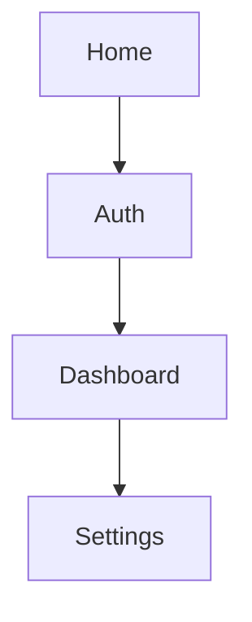

# Prime Mermaid: wave6-live.example.com

- Site: `wave6-live.example.com`
- Auth: unknown (discovered baseline)
- Page types: home, auth, dashboard, settings

## Selector Seeds
- login_button: "button[type=submit]"
- nav_links: "a[href]"
