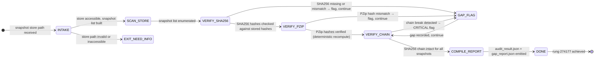

# Recipe: Browser Snapshot Audit

> "In clinical trials, 'trust me' is not evidence. Only the original, timestamped, attributable record is evidence."
> — Phuc Truong, CRIO founder

The Browser Snapshot Audit is a periodic verification pass over the snapshot store. It confirms that every snapshot produced by the browser agent meets the evidence contract: SHA256 hash computed, PZip compression applied, evidence bundle linked, and SHA256 chain unbroken.

```
AUDIT SCOPE:
  Every snapshot in ~/.solace/evidence/snapshots/
  Verified against: SHA256 hash | PZip hash | bundle linkage | chain link

HALTING CRITERION: all snapshots scanned, compliance report emitted
                   gap_report.json produced for any non-compliant snapshot
```

**Rung target:** 274177
**Lane:** A (produces audit_result.json as verifiable artifact)
**Time estimate:** 1-5 minutes depending on snapshot count
**Agent:** Evidence Reviewer (data/default/swarms/evidence-reviewer.md)

---



---

## Prerequisites

- [ ] Snapshot store accessible at `~/.solace/evidence/snapshots/`
- [ ] Evidence index file exists: `~/.solace/evidence/index.json`
- [ ] PZip decompressor available (to recompute hashes)
- [ ] SHA256 verification tool available
- [ ] No snapshot store write-lock held by another process

---

## Step 1: Enumerate Snapshot Store

**Action:** List all snapshots in store, load index file.

**Artifact emitted:** `snapshot_inventory.json`

```json
{
  "store_path": "~/.solace/evidence/snapshots/",
  "snapshot_count": 0,
  "index_version": "1.0.0",
  "scan_timestamp": "<ISO8601>",
  "snapshots": [
    {
      "snapshot_id": "<sha256>",
      "filename": "<filename>",
      "size_bytes": 0,
      "created_at": "<ISO8601>",
      "pzip_compressed": true
    }
  ]
}
```

**Gate:** snapshot_count > 0, index file valid schema.

---

## Step 2: Verify SHA256 Hashes

**Action:** For each snapshot, recompute SHA256 from file bytes and compare to stored hash.

**Verification method:**
```
stored_hash   = index.snapshots[i].sha256
computed_hash = sha256(read_bytes(snapshots/snapshot_id.pzip))
match         = stored_hash == computed_hash
```

**Gap conditions:**
- `SHA256_MISSING`: snapshot in store but no hash in index
- `SHA256_MISMATCH`: computed hash != stored hash (tamper indicator)
- `SHA256_FORMAT_INVALID`: stored hash not 64-char hex

**Artifact emitted:** `sha256_verification.json` with per-snapshot results.

---

## Step 3: Verify PZip Compression

**Action:** For each snapshot, verify PZip hash is deterministic and matches stored value.

**Verification method:**
```
pzip_hash_stored   = index.snapshots[i].pzip_hash
pzip_hash_computed = pzip_hash(snapshot_file)
match              = pzip_hash_stored == pzip_hash_computed
```

**Gap conditions:**
- `PZIP_MISSING`: snapshot stored as raw HTML (not compressed)
- `PZIP_HASH_MISMATCH`: PZip hash mismatch (file corruption indicator)
- `PZIP_CORRUPT`: PZip decompression fails

**Artifact emitted:** `pzip_verification.json` with per-snapshot results.

---

## Step 4: Verify SHA256 Chain

**Action:** Walk the SHA256 chain from most recent snapshot back to genesis. Each bundle's `sha256_chain_link` must match the previous bundle's `bundle_id`.

**Verification method:**
```
for bundle in bundles, newest to oldest:
  expected_prev = bundle.sha256_chain_link
  actual_prev   = bundles[index - 1].bundle_id
  if expected_prev != actual_prev: CHAIN_BREAK detected
```

**Gap conditions:**
- `CHAIN_BREAK`: any link in the chain does not match — CRITICAL severity
- `ORPHANED_BUNDLE`: bundle with no chain link and not genesis bundle
- `CHAIN_LOOP`: sha256_chain_link points to a future bundle (timestamp anomaly)

**Artifact emitted:** `chain_verification.json`

---

## Step 5: Compile Audit Report

**Action:** Aggregate all verification results into final audit_result.json and gap_report.json.

**Artifact structure:**

```json
{
  "schema_version": "1.0.0",
  "audit_id": "<uuid>",
  "audit_timestamp": "<ISO8601>",
  "snapshots_audited": 0,
  "sha256_pass": 0,
  "sha256_fail": 0,
  "pzip_pass": 0,
  "pzip_fail": 0,
  "chain_intact": true,
  "chain_break_at": null,
  "overall_status": "COMPLIANT|NON_COMPLIANT|PARTIALLY_COMPLIANT",
  "compliance_rate": 1.0,
  "rung_achieved": 274177
}
```

---

## Evidence Requirements

| Evidence Type | Required | Format |
|--------------|---------|-------|
| snapshot_inventory.json | Yes | JSON with snapshot list |
| sha256_verification.json | Yes | Per-snapshot hash results |
| pzip_verification.json | Yes | Per-snapshot PZip results |
| chain_verification.json | Yes | Chain walk results |
| audit_result.json | Yes | Final compliance summary |
| gap_report.json | Yes | All gaps with severity |

---

## GLOW Score

| Dimension | Score | Notes |
|-----------|-------|-------|
| **G**oal alignment | 10/10 | Directly verifies evidence pipeline integrity |
| **L**everage | 9/10 | One run audits entire snapshot store |
| **O**rthogonality | 10/10 | Read-only — no modifications to store |
| **W**orkability | 9/10 | SHA256 and PZip verification are deterministic |

**Overall GLOW: 9.5/10**

---

## Skill Requirements

```yaml
required_skills:
  - prime-safety      # god-skill; credentials guard; no write to evidence store
  - browser-evidence  # evidence bundle schema; SHA256 chain; PZip; ALCOA+
```

## Trigger Conditions

- Scheduled: run daily at 03:00 UTC
- On-demand: when evidence gap suspected
- Pre-audit: before any Part 11 compliance review
- Post-migration: after snapshot store migration
