```mermaid
stateDiagram-v2
    direction LR
    [*] --> CONSENT_UI : user initiates task
    CONSENT_UI --> TOKEN_ISSUED : user approves scopes in consent UI
    CONSENT_UI --> EXIT_BLOCKED : user denies consent → stop (no action)
    TOKEN_ISSUED --> G1_TOKEN_CHECK : token created with scopes + expiry
    G1_TOKEN_CHECK --> G2_EXPIRY_CHECK : G1 PASS (token exists)
    G1_TOKEN_CHECK --> EXIT_BLOCKED : G1 FAIL (no token) → BLOCKED
    G2_EXPIRY_CHECK --> G3_SCOPE_CHECK : G2 PASS (not expired)
    G2_EXPIRY_CHECK --> CONSENT_UI : G2 FAIL (expired) → re-consent
    G3_SCOPE_CHECK --> G4_STEP_UP_CHECK : G3 PASS (scope present)
    G3_SCOPE_CHECK --> EXIT_BLOCKED : G3 FAIL (scope missing) → BLOCKED + scope_gap
    G4_STEP_UP_CHECK --> ACTION_EXECUTE : G4 PASS (step-up satisfied for destructive)
    G4_STEP_UP_CHECK --> STEP_UP_UI : G4 required for destructive action
    STEP_UP_UI --> ACTION_EXECUTE : step-up confirmed
    STEP_UP_UI --> EXIT_BLOCKED : step-up denied → BLOCKED
    ACTION_EXECUTE --> EVIDENCE_BUNDLE : action completed
    ACTION_EXECUTE --> EXIT_BLOCKED : action fails → rollback + evidence
    EVIDENCE_BUNDLE --> DONE : bundle signed, chain-linked, stored
    DONE --> [*] : rung 65537 achieved

    note right of CONSENT_UI
        REQUIRED: Consent UI renders exact scopes in plain language.
        "Allow SolaceAI to post on LinkedIn on your behalf"
        NOT: "Allow access to your account" (too vague)
    end note

    note right of G3_SCOPE_CHECK
        Scope must be exact match — no wildcards.
        linkedin.create_post ≠ linkedin.*
    end note
```

# Recipe: OAuth3 Consent Flow

> "Consent is not a checkbox — it is a provable, revocable, time-bounded delegation of agency."
> — SolaceBrowser OAuth3 Design Principle

The OAuth3 Consent Flow is the canonical lifecycle of AI browser delegation. It starts with the user granting consent through a transparent UI, proceeds through token issuance, scope verification, action execution, and terminates with a Part 11 evidence bundle that proves the consent was real, the scope was matched, and the action was faithfully executed.

```
CONSENT FLOW:
  USER_GRANTS_CONSENT → TOKEN_ISSUED → SCOPE_VERIFIED → ACTION_EXECUTED → EVIDENCE_BUNDLED

HALTING CRITERION: action executed with all 4 OAuth3 gates passed,
                   evidence bundle signed and chain-linked
```

**Rung target:** 65537
**Lane:** A (produces consent_record.json + evidence_bundle.json)
**Time estimate:** 5-30 seconds per action (network-dependent)
**Agent:** OAuth3 Auditor + Recipe Builder (for action execution)

---



---

## Prerequisites

- [ ] User is authenticated (session exists for platform)
- [ ] Platform is in supported list (linkedin, gmail, twitter, reddit, hackernews, ...)
- [ ] Action type is declared before consent UI renders
- [ ] OAuth3 vault accessible at `~/.solace/vault/`
- [ ] Evidence store accessible and writable

---

## Step 1: Render Consent UI

**Action:** Display consent UI to user with exact scopes in plain language.

**Required consent UI fields:**
```
Platform:    LinkedIn
Action:      Create a post on your behalf
Scope:       linkedin.create_post
Duration:    This session only | 24 hours | 7 days | 30 days
Revoke at:   solaceagi.com/consent or CLI: solace revoke linkedin.create_post
```

**Gate:** User clicks "Allow" — explicit affirmative consent required. Dismissing UI = denial.

**Artifact emitted:**
```json
{
  "consent_event_id": "<uuid>",
  "platform": "linkedin",
  "scopes_displayed": ["linkedin.create_post"],
  "user_decision": "allow|deny",
  "consent_timestamp": "<ISO8601>",
  "consent_ui_hash": "<sha256 of rendered UI content>"
}
```

---

## Step 2: Issue Token

**Action:** Create OAuth3 token with consented scopes, expiry, and signature.

**Token structure:**
```json
{
  "token_id": "<sha256(platform + scopes + user_id + issued_at)>",
  "platform": "linkedin",
  "scopes": ["linkedin.create_post"],
  "issued_at": "<ISO8601>",
  "expires_at": "<ISO8601>",
  "user_id": "<local user identifier>",
  "consent_event_id": "<uuid>",
  "signature": "<aes_256_gcm>",
  "revoked": false
}
```

**Gate:** token_id is SHA256-derived, signature valid, expiry > issued_at.

---

## Step 3: Run 4-Gate OAuth3 Cascade

**Action:** Before any browser action, run all 4 gates in sequence.

```
G1: Token exists for platform   → PASS: token_id found in vault
G2: Token not expired           → PASS: expires_at > now()
G3: Required scope present      → PASS: "linkedin.create_post" in token.scopes
G4: Step-up (if destructive)    → N/A for create_post (read/write only, not delete/execute)
```

**All 4 gates must PASS.** Any FAIL = BLOCKED. No gate skip.

**Artifact emitted:** `gate_audit.json` with per-gate results.

---

## Step 4: Execute Action

**Action:** Execute the recipe action with OAuth3 authorization confirmed.

**Required before execute:**
- `gate_audit.json` with all 4 gates PASS
- Fresh DOM snapshot (browser-snapshot)
- Before-state snapshot captured (browser-evidence)

**During execution:**
- Checkpoint at each destructive step
- Rollback plan active throughout

**After execution:**
- After-state snapshot captured

---

## Step 5: Bundle Evidence

**Action:** Produce Part 11 evidence bundle covering the complete consent-to-action lifecycle.

**Bundle structure:**
```json
{
  "schema_version": "1.0.0",
  "bundle_id": "<sha256>",
  "consent_event_id": "<uuid>",
  "token_id": "<sha256>",
  "gate_audit_id": "<uuid>",
  "action_type": "linkedin.create_post",
  "before_snapshot_pzip": "<hash>",
  "after_snapshot_pzip": "<hash>",
  "diff_hash": "<sha256>",
  "alcoa_fields": {
    "attributable": "<token_id identifies agent + user>",
    "legible": true,
    "contemporaneous": "<timestamp>",
    "original": true,
    "accurate": true
  },
  "sha256_chain_link": "<prev_bundle_id>",
  "signature": "<aes_256_gcm>",
  "timestamp_iso8601": "<ISO8601>",
  "rung_achieved": 65537
}
```

---

## Evidence Requirements

| Evidence Type | Required | Format |
|--------------|---------|-------|
| consent_event.json | Yes | User's consent decision + UI hash |
| token.json | Yes | Token (no raw value in output) |
| gate_audit.json | Yes | All 4 gate results |
| before_snapshot (PZip) | Yes | DOM state before action |
| after_snapshot (PZip) | Yes | DOM state after action |
| evidence_bundle.json | Yes | Full bundle with ALCOA+ fields |

---

## GLOW Score

| Dimension | Score | Notes |
|-----------|-------|-------|
| **G**oal alignment | 10/10 | This IS the OAuth3 lifecycle — it IS the goal |
| **L**everage | 10/10 | Establishes trust protocol for every future action |
| **O**rthogonality | 9/10 | Consent, token, gate, execute, evidence are distinct lanes |
| **W**orkability | 9/10 | All gates are binary; consent UI is explicit; evidence is hash-verified |

**Overall GLOW: 9.5/10**

---

## Skill Requirements

```yaml
required_skills:
  - prime-safety          # god-skill; consent cannot be bypassed
  - browser-oauth3-gate   # 4-gate cascade; step-up protocol; audit schema
  - browser-evidence      # evidence bundle; SHA256 chain; PZip; ALCOA+
  - browser-snapshot      # DOM snapshot before/after action
```

## Forbidden States

| State | Description |
|-------|-------------|
| `SCOPELESS_EXECUTION` | Action executed without G3 scope check | BLOCKED |
| `EXPIRED_TOKEN_USED` | G2 not checked, expired token accepted | BLOCKED |
| `STEP_UP_BYPASSED` | Destructive action without G4 step-up | BLOCKED |
| `CONSENT_FABRICATED` | Consent record created without user interaction | BLOCKED |
| `EVIDENCE_SKIPPED` | Action executed without evidence bundle | BLOCKED |
| `IMPLICIT_CONSENT` | "Continuing to use means you agree" | BLOCKED — explicit only |
