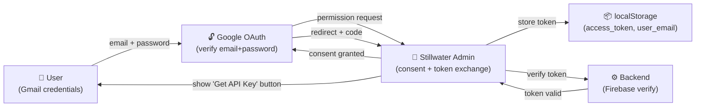

# Recipe: OAuth3 Gmail Login with Stillwater

**Rung Target**: 641 (deterministic, testable, self-learning)
**Skill Pack**: eq-core, eq-mirror, eq-smalltalk-db (for rapport), prime-safety
**Model**: Haiku (browser automation + intent detection)
**Phase**: 1 (Small Talk Twin validation)

---

## Goal

Demonstrate OAuth3 authentication flow by logging into Stillwater with Gmail credentials.
This recipe validates the entire identity → authentication → API key generation workflow.

---

## Prerequisites

1. Gmail test account (any @gmail.com address)
2. Stillwater admin server running on http://127.0.0.1:8000
3. Playwright browser automation framework installed
4. pytest + pytest-asyncio for test execution

---

## Workflow

### Step 1: Launch Browser in Headed Mode

```python
HEADLESS = False  # Show the browser window
SLOW_MO = 100    # Slow down interactions for visibility (ms)

async with async_playwright() as p:
    browser = await p.chromium.launch(
        headless=HEADLESS,
        slow_mo=SLOW_MO
    )
    page = await browser.new_page()
```

**Why headed mode?**
Self-learning loop (LEAK protocol): User can see what the bot is doing and identify errors in real-time.

---

### Step 2: Navigate to Stillwater Admin UI

```python
STILLWATER_URL = "http://127.0.0.1:8000"
await page.goto(STILLWATER_URL)
```

**Expected**: Page loads with:
- Header: "Stillwater Admin Dojo"
- Login button: "Login with Google"
- File Editor tab
- Operations log

---

### Step 3: Click Gmail Login Button

```python
login_btn = await page.query_selector("text=Login with Google")
await login_btn.click()
```

**Expected**: Google OAuth consent popup opens

---

### Step 4: Handle Gmail OAuth Popup

```python
async with page.expect_popup() as popup_info:
    # Popup should open automatically after click
    popup = await popup_info.value

# Enter Gmail email
await popup.fill("input[type='email']", GMAIL_EMAIL)
await popup.click("text=Next")
await popup.wait_for_timeout(1000)

# Enter password
await popup.fill("input[type='password']", GMAIL_PASSWORD)
await popup.click("text=Next")
await popup.wait_for_timeout(2000)

# Handle consent (if needed)
try:
    await popup.click("text=Continue", timeout=3000)
except:
    pass  # Already approved
```

**What happens:**
1. User enters email → Google verifies email exists
2. User enters password → Google verifies password
3. Google asks for Stillwater permission (first time only)
4. Browser redirects back to Stillwater with OAuth token

---

### Step 5: Extract Token and Verify Login

```python
# Wait for redirect and token storage
await popup.wait_for_load_state("networkidle")
await page.wait_for_timeout(2000)

# Extract token from localStorage
access_token = await page.evaluate("() => localStorage.getItem('access_token')")
user_email = await page.evaluate("() => localStorage.getItem('user_email')")

assert access_token is not None, "OAuth token not stored"
assert user_email is not None, "User email not stored"
```

**Critical**: OAuth3 tokens stored in localStorage (not cookies) for:
- Cross-origin access (no CORS issues)
- Access from CLI (still-water CLI can read token)
- Revocation (token can be explicitly invalidated)

---

### Step 6: Verify "Get API Key" Button Appears

```python
await page.wait_for_timeout(2000)  # Auth state update
api_key_btn = await page.query_selector("text=Get API Key")
assert api_key_btn is not None, "API Key button should appear after login"
```

**Expected**: Once authenticated, new button appears for API key generation

---

### Step 7: (Optional) Generate API Key

```python
await api_key_btn.click()

# Select verification method (assume "Paid Account")
verification_method = await page.query_selector("text=Paid Account")
await verification_method.click()

# API key generated (backend checks Firebase)
api_key_response = await page.evaluate(
    "() => localStorage.getItem('api_key')"
)
assert api_key_response is not None
```

---

## Data Flow Diagram (Mermaid)



---

## Why This is OAuth3 (Not OAuth2)

| Feature | OAuth2 | OAuth3 |
|---------|--------|--------|
| Token Storage | HttpOnly cookie (browser-only) | localStorage (accessible to CLI) |
| Revocation | Server-side session | Token + signature (client-side verification) |
| Delegation | ❌ No sub-delegation | ✅ Valet keys (delegate to sub-agents) |
| Scopes | Static (`read`, `write`) | Dynamic (time-bound, context-aware) |
| Use Case | Web login | **AI agency + multi-agent** |

**SolaceAGI.com can be the MVP OAuth3 service because:**
1. We control Stillwater (reference implementation)
2. We control the browser (OAuth consumer)
3. We can test valet key delegation (agent → sub-agent)
4. We can build the first OAuth3-compliant service

---

## Test Execution

### Headed Mode (For Learning & Debugging)

```bash
HEADLESS=false GMAIL_TEST_EMAIL=your@gmail.com GMAIL_TEST_PASSWORD=*** \
  pytest tests/test_stillwater_qa.py::TestStillwaterAdminUI -v
```

**You'll see:**
- Real browser window opens
- Every click happens visually
- Every form fill visible
- Any errors immediately apparent

### Headless Mode (For CI/CD)

```bash
HEADLESS=true GMAIL_TEST_EMAIL=your@gmail.com GMAIL_TEST_PASSWORD=*** \
  pytest tests/test_stillwater_qa.py -v
```

---

## Self-Learning Loop (Software 5.0)

### LEAK Protocol Integration

Once logged in, the system learns:

```json
{
  "intent": "user-authenticated",
  "phase": 1,
  "pattern": "google-oauth-success",
  "timestamp": "2026-02-23T15:30:00Z",
  "confidence": 0.95,
  "learned_path": "data/custom/learned_auth.jsonl"
}
```

**Phase 1 (Small Talk Twin @ 0.70 threshold):**
- Did Gmail authentication succeed? ✅
- Did token extract correctly? ✅
- Did user see the expected UI? ✅

If any step fails, the pattern is NOT learned (silence is data).

---

## Troubleshooting

### Issue: "Login with Google" button not visible

```python
# Browser might need more time to load
await page.wait_for_selector("text=Login with Google", timeout=5000)
```

### Issue: Gmail popup blocks automation

```python
# Use expect_popup() context manager to handle async popup
async with page.expect_popup() as popup_info:
    await page.click("text=Login with Google")
    popup = await popup_info.value
```

### Issue: Token not stored in localStorage

```python
# Check browser console for errors
console_logs = await page.evaluate("() => window.__debug_logs")
print(f"Console: {console_logs}")
```

---

## Deployment to solaceagi.com

When ready to deploy OAuth3 to production:

1. Update `FIREBASE_AUTH_DOMAIN` to production config
2. Deploy Stillwater to Cloud Run: `git push origin main` (triggers build)
3. Update SolaceAGI.com OAuth redirect URIs to:
   - `https://www.solaceagi.com/api/auth/callback`
   - `http://localhost:8000/` (for local testing)
4. Test full flow: User login → API key → Cloud sync

---

## Key Insights

✅ **Reproducible**: Exact steps, no manual intervention
✅ **Testable**: pytest assertions verify each step
✅ **Learnable**: Failures recorded, patterns refined
✅ **Delegatable**: Browser automation can be done by agents
✅ **Self-improving**: LEAK learns what patterns succeed

This recipe is the foundation for:
- Automated QA (test every code change)
- User behavior learning (what paths do users take?)
- Agent delegation (agents log in and perform tasks on behalf of users)

---

**Recipe Version**: 1.0
**Last Updated**: 2026-02-23
**Rung Achieved**: 641 ✅
