```mermaid
stateDiagram-v2
    direction LR
    [*] --> INTAKE : broken recipe + error trace
    INTAKE --> DOM_SNAPSHOT : recipe_id + platform + failure_url confirmed
    DOM_SNAPSHOT --> SELECTOR_DIFF : fresh snapshot captured, ref-map built
    DOM_SNAPSHOT --> EXIT_NEED_INFO : page inaccessible (auth required)
    SELECTOR_DIFF --> ARIA_HEAL : broken selectors identified in diff
    SELECTOR_DIFF --> EXIT_BLOCKED : no broken selectors found (failure has different cause)
    ARIA_HEAL --> TEST_CANDIDATES : ARIA role + accessible name candidates proposed
    ARIA_HEAL --> ROLE_TEXT_HEAL : ARIA strategy finds no candidate
    ROLE_TEXT_HEAL --> TEST_CANDIDATES : role + text content candidates proposed
    ROLE_TEXT_HEAL --> CSS_HEAL : role+text finds no candidate
    CSS_HEAL --> TEST_CANDIDATES : CSS structural candidates proposed
    CSS_HEAL --> XPATH_HEAL : CSS finds no candidate
    XPATH_HEAL --> TEST_CANDIDATES : XPath candidates proposed
    XPATH_HEAL --> EXIT_BLOCKED : no healing strategy works → full rebuild required
    TEST_CANDIDATES --> PATCH_RECIPE : all candidates tested, all pass
    TEST_CANDIDATES --> ARIA_HEAL : candidate fails → try next strategy
    PATCH_RECIPE --> EVIDENCE : recipe selectors updated, version bumped
    EVIDENCE --> DONE : healed_selectors.json + regression_test.json signed
    DONE --> [*] : rung 274177 achieved
```

# Recipe: Selector Heal

> "The best time to fix a broken selector is before the user sees the failure. The second best time is immediately after."
> — SolaceBrowser Engineering Principle

Selector Heal is the reactive maintenance path for the recipe library. When a recipe execution fails because a website changed its DOM structure, this recipe coordinates the repair: capture a fresh snapshot, diff against the broken selectors, find working alternatives through the healing chain, test each alternative, and patch the recipe.

```
HEAL FLOW:
  FAILURE_DETECTED → DOM_SNAPSHOT → SELECTOR_DIFF →
  HEAL_CANDIDATES → TEST_CANDIDATES → PATCH_RECIPE → EVIDENCE

HALTING CRITERION: all broken selectors replaced with tested alternatives,
                   recipe updated, regression_test.json produced
```

**Rung target:** 274177
**Lane:** A (produces healed_selectors.json + regression_test.json)
**Time estimate:** 15-60 seconds (depends on number of broken selectors)
**Agent:** Selector Healer (data/default/swarms/selector-healer.md)

---



---

## Prerequisites

- [ ] Broken recipe identified by recipe_id
- [ ] Error trace from failed execution (selector_not_found or element_stale errors)
- [ ] Active browser session for target platform (to capture fresh snapshot)
- [ ] Recipe has not already been marked for full rebuild (complexity check)
- [ ] Healing budget not exceeded (max 3 heal cycles before escalating to recipe-builder)

---

## Step 1: Parse Failure

**Action:** Extract broken selectors from error trace.

**Error trace parsing:**
```
Expected error patterns:
  "Locator.click: Timeout 5000ms exceeded ... waiting for locator"
  "Element not found: aria/[role='button'][name='Post']"
  "StaleElementReferenceException: stale element reference"

Extract from error:
  - failed_step number
  - failed_selector string
  - error_type: not_found | stale | timeout
```

**Artifact emitted:** `failure_analysis.json`
```json
{
  "recipe_id": "<sha256>",
  "execution_id": "<uuid>",
  "failures": [
    {
      "step": 3,
      "selector": "aria/[role='button'][name='Post']",
      "error_type": "not_found",
      "error_message": "<exact error string>"
    }
  ]
}
```

---

## Step 2: Capture Fresh DOM Snapshot

**Action:** Navigate to the failure URL and capture a fresh DOM snapshot.

**Snapshot requirements:**
- Freshness: captured within 5 seconds of this step
- Mode: full DOM (not AI-only) to maximize selector discovery
- Auth required: use current session (same session that produced the failure)

**Gate:** Snapshot freshness check. STALE_SNAPSHOT_USED → BLOCKED.

---

## Step 3: Selector Diff

**Action:** For each broken selector, search the new DOM for what changed.

**Diff analysis:**
```
For each broken_selector:
  1. Try to find exact selector in new DOM → not found (confirms breakage)
  2. Find semantically similar elements:
     - Same ARIA role, different name?
     - Same text content, different role?
     - Same position in structure, different class/id?
  3. Classify change type: class_rename | element_removed | restructure | text_change
```

**Artifact emitted:** `dom_diff.json` with change classification per broken selector.

---

## Step 4: Healing Chain (4-Strategy Priority)

**For each broken selector, attempt strategies in order:**

**Strategy 1: ARIA Role + Accessible Name**
```
If element has ARIA role and accessible name that uniquely identifies it:
  candidate = aria/[role='<role>'][name='<accessible_name>']
  If candidate found in new DOM: proceed to TEST
```

**Strategy 2: Role + Text Content**
```
If element has visible text that uniquely identifies it:
  candidate = :text('<visible_text>')
  If candidate found: proceed to TEST
```

**Strategy 3: CSS Structural**
```
Walk DOM structure from nearest stable ancestor:
  candidate = <stable_parent> > <child_path> (no dynamic class segments)
  If candidate found: proceed to TEST
```

**Strategy 4: XPath (Last Resort)**
```
Build XPath from semantic attributes and text:
  candidate = //button[contains(@aria-label,'<name>')]
  If candidate found: proceed to TEST
```

**If all 4 strategies fail:** EXIT_BLOCKED. Recipe requires full rebuild.

---

## Step 5: Test Candidates

**Action:** Test each healing candidate against live DOM.

**Test protocol per candidate:**
```
1. element = page.locator(candidate)
2. Assert: element.count() == 1 (unique)
3. Assert: element.is_visible()
4. Assert: element.is_enabled() (if interactive element)
5. For click targets: element.hover() (verify no tooltip obscures)
```

**Record:** test_result per candidate (PASS/FAIL + details).

---

## Step 6: Patch Recipe

**Action:** Update recipe.json with healed selectors. Bump minor version.

**Patch protocol:**
```json
{
  "recipe_id": "<sha256>",
  "version_before": "1.0.2",
  "version_after": "1.0.3",
  "changes": [
    {
      "step": 3,
      "selector_before": "aria/[role='button'][name='Post']",
      "selector_after": "aria/[role='button'][name='Share']",
      "healing_strategy": "aria_role",
      "test_verified": true
    }
  ],
  "never_worse_test_ids": ["<test_ids that must still pass>"]
}
```

**Never-worse gate:** After patching, run all existing test cases. Any regression → BLOCKED.

---

## Step 7: Regression Test + Evidence

**Action:** Run the full recipe with healed selectors to confirm end-to-end functionality.

**Artifact emitted:** `regression_test.json` (all tests PASS) + `healed_selectors.json` + `evidence_bundle.json`.

---

## Evidence Requirements

| Evidence Type | Required | Format |
|--------------|---------|-------|
| failure_analysis.json | Yes | Extracted broken selectors + error types |
| dom_diff.json | Yes | Change classification per selector |
| healed_selectors.json | Yes | All healed selectors with strategy used |
| regression_test.json | Yes | All tests pass with healed recipe |
| evidence_bundle.json | Yes | Before/after snapshots of healing |

---

## GLOW Score

| Dimension | Score | Notes |
|-----------|-------|-------|
| **G**oal alignment | 10/10 | Directly defends recipe hit rate against DOM drift |
| **L**everage | 9/10 | Healing is far cheaper than full recipe rebuild |
| **O**rthogonality | 10/10 | Healer only touches selectors — recipe logic untouched |
| **W**orkability | 9/10 | Each strategy is deterministic; test is live DOM verification |

**Overall GLOW: 9.5/10**

---

## Skill Requirements

```yaml
required_skills:
  - prime-safety        # god-skill
  - browser-snapshot    # fresh DOM capture; ref-map; healing chain strategies
  - browser-evidence    # before/after evidence bundle for healing session
  - browser-recipe-engine  # version bump; never-worse gate
```

## Escalation: When to Rebuild vs. Heal

| Condition | Action |
|-----------|--------|
| 1-3 broken selectors, same page structure | Heal (this recipe) |
| 4+ broken selectors on same page | Rebuild (recipe-builder recipe) |
| Page completely restructured | Rebuild |
| heal_cycle_count >= 3 | Rebuild (DOM instability signal) |
| EXIT_BLOCKED from selector-heal | Rebuild |
