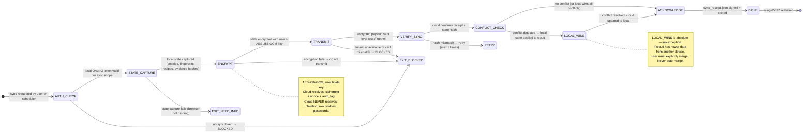

# Recipe: Twin Sync

> "Log in once. SolaceAI handles the rest — checking your email, applying to jobs, and monitoring your feeds while you sleep."
> — SolaceBrowser NORTHSTAR

The Twin Sync recipe is the bridge between local and cloud execution. It captures the user's authenticated browser state on their local machine, encrypts it with a key only the user holds (zero-knowledge: cloud sees ciphertext only), and transfers it to the cloud twin. The cloud can then execute tasks using the user's sessions without the user being present.

```
SYNC FLOW:
  STATE_CAPTURE → ENCRYPT → TRANSFER → VERIFY_SYNC → ACKNOWLEDGE

LOCAL_WINS rule: if local state conflicts with cloud state, local always wins.
ZERO_KNOWLEDGE rule: cloud never sees plaintext. User key never leaves local machine.

HALTING CRITERION: cloud twin state matches local state hash,
                   sync_receipt.json produced and stored
```

**Rung target:** 65537
**Lane:** A (produces sync_receipt.json as verifiable artifact)
**Time estimate:** 5-30 seconds (network and state size dependent)
**Agent:** browser-twin-sync skill

---



---

## Prerequisites

- [ ] Local browser running and reachable at localhost:9222
- [ ] User authenticated on platforms to sync (sessions active)
- [ ] OAuth3 token present with `sync.upload` scope
- [ ] Cloud twin endpoint reachable (solaceagi.com/twin/ws)
- [ ] User's encryption key available in local key store
- [ ] wss:// tunnel established with certificate pinning verified

---

## Step 1: Authentication Check

**Action:** Verify local OAuth3 token has `sync.upload` scope before any state is captured.

**Gate:** 4-gate cascade for sync.upload scope.
```
G1: sync token exists in vault
G2: token not expired
G3: sync.upload scope present
G4: step-up not required for read-only sync (required for delegation)
```

**Failure:** Any gate fail → EXIT_BLOCKED. Do not capture state. Do not transmit.

---

## Step 2: State Capture

**Action:** Capture complete local browser state required for cloud twin synchronization.

**State bundle contents:**
```json
{
  "state_id": "<sha256(capture_timestamp + platform_list)>",
  "capture_timestamp": "<ISO8601>",
  "platforms": [
    {
      "platform": "linkedin",
      "session_active": true,
      "storage_state_hash": "<sha256 of storage_state.json>",
      "cookies_count": 0,
      "session_age_days": 3
    }
  ],
  "fingerprint_hash": "<sha256 of browser fingerprint profile>",
  "recipes_version": "<sha256 of recipe store manifest>",
  "evidence_chain_tip": "<sha256 of most recent evidence bundle>",
  "local_wins_version": "<monotonic counter — incremented on each sync>"
}
```

**Note:** Raw cookies and storage_state are captured locally but NEVER transmitted in plaintext. Only hashes appear in the state bundle; full state travels encrypted only.

---

## Step 3: Encrypt State

**Action:** Encrypt full state (including storage_state files) with user's AES-256-GCM key.

**Encryption protocol:**
```
key    = user_master_key (derived from user password, never stored on disk)
nonce  = random 96-bit nonce (new per sync)
state  = json_bytes(full_state_bundle)
cipher = AES-256-GCM(key=key, nonce=nonce, plaintext=state)
output = { ciphertext, nonce, auth_tag }
```

**Zero-knowledge guarantee:**
- User key is never stored on disk, never transmitted, never logged
- Cloud receives only: ciphertext, nonce, auth_tag
- Cloud cannot decrypt without user's key
- Cloud confirms receipt by echoing sha256(ciphertext)

---

## Step 4: Transmit Over Tunnel

**Action:** Send encrypted payload over wss:// tunnel with certificate pinning.

**Tunnel requirements:**
- wss:// only (no ws://)
- Certificate pinned to solaceagi.com leaf certificate
- Token-authenticated tunnel (sync OAuth3 token in Authorization header)
- Bandwidth tracked per user (rate limiting applied server-side)

**Failure modes:**
- Certificate mismatch → TUNNEL_DOWNGRADE → EXIT_BLOCKED
- Network timeout → retry (max 3 times with exponential backoff)
- Auth failure → EXIT_BLOCKED

---

## Step 5: Verify Sync

**Action:** Cloud confirms receipt by returning sha256(received_ciphertext). Local verifies match.

```
sent_hash     = sha256(ciphertext_payload)
received_hash = cloud_confirmation.payload_hash
match         = sent_hash == received_hash
```

**If mismatch:** retry transmit (max 3). After 3 failures: EXIT_BLOCKED, user notified.

---

## Step 6: Conflict Check and LOCAL_WINS

**Action:** Cloud reports any state conflicts (e.g., cloud has newer evidence bundles from a previous delegation session).

**LOCAL_WINS protocol:**
```
if conflict:
  local_version = local.local_wins_version
  cloud_version = cloud.local_wins_version
  if local_version >= cloud_version: apply local to cloud (LOCAL_WINS)
  else: require explicit user merge confirmation (MANUAL_MERGE required)
```

**No auto-merge without user confirmation.** Cloud cannot overwrite local.

---

## Step 7: Acknowledge and Store Receipt

**Action:** Produce sync_receipt.json and store locally.

```json
{
  "schema_version": "1.0.0",
  "sync_id": "<uuid>",
  "sync_timestamp": "<ISO8601>",
  "state_id": "<sha256>",
  "cloud_payload_hash_confirmed": "<sha256>",
  "conflict_detected": false,
  "local_wins_applied": false,
  "rung_achieved": 65537,
  "tunnel_cert_pinned": true
}
```

---

## Evidence Requirements

| Evidence Type | Required | Format |
|--------------|---------|-------|
| sync_receipt.json | Yes | Sync confirmation with hash verification |
| gate_audit.json | Yes | 4-gate results for sync.upload scope |
| tunnel_log.json | Yes | Tunnel establishment + cert pinning confirmation |
| conflict_log.json | If conflict | LOCAL_WINS decision record |

---

## GLOW Score

| Dimension | Score | Notes |
|-----------|-------|-------|
| **G**oal alignment | 10/10 | Twin sync is the core enabler of "delegate while you sleep" |
| **L**everage | 10/10 | One sync enables unlimited cloud tasks using user's session |
| **O**rthogonality | 9/10 | Sync is independent of task execution — clean separation |
| **W**orkability | 9/10 | AES-256-GCM + hash verification + LOCAL_WINS = deterministic |

**Overall GLOW: 9.5/10**

---

## Skill Requirements

```yaml
required_skills:
  - prime-safety        # god-skill; KEY_ESCROW forbidden; PLAINTEXT_COOKIES forbidden
  - browser-twin-sync   # zero-knowledge protocol; LOCAL_WINS; tunnel management
  - browser-evidence    # sync_receipt evidence bundle; SHA256 chain
  - browser-oauth3-gate # sync.upload scope verification
```

## Forbidden States

| State | Description |
|-------|-------------|
| `UNENCRYPTED_SYNC` | Any state transmitted without AES-256-GCM | BLOCKED |
| `CLOUD_OVERRIDES_LOCAL` | Cloud state overwrites local without user confirmation | BLOCKED |
| `KEY_ESCROW` | User key stored on server or transmitted | BLOCKED |
| `PLAINTEXT_COOKIES` | Raw cookies transmitted in plaintext | BLOCKED |
| `TUNNEL_DOWNGRADE` | Tunnel connection falls back to ws:// | BLOCKED |
| `SYNC_WITHOUT_AUTH` | Sync attempted without valid sync OAuth3 token | BLOCKED |
| `EVIDENCE_DESYNC` | Evidence bundle hashes differ between local and cloud without reconciliation | BLOCKED |
