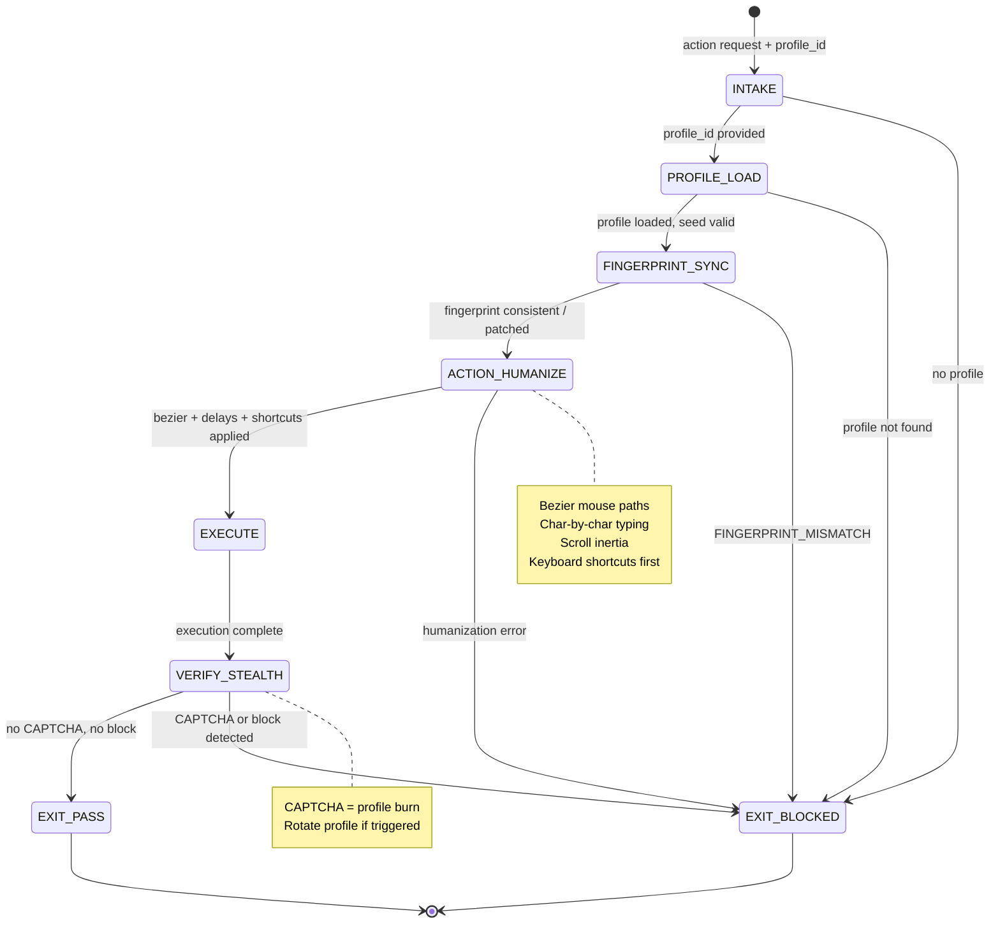

# DNA: `stealth(profile_seed, fingerprint, bezier, timing_jitter, keyboard_first) = human-indistinguishable agent`

<!-- QUICK LOAD (10-15 lines): Use this block for fast context; load full file for production.
SKILL: browser-anti-detect v1.0.0
PRIMARY_AXIOM: DETERMINISM
MW_ANCHORS: [DETERMINISM, FINGERPRINT, BEZIER, TIMING, STEALTH, HUMANIZE, KEYBOARD, SCROLL, JITTER, PROFILE]
PURPOSE: Human-like browser interaction patterns to avoid bot detection. Bezier mouse movement, char-by-char typing (80-200ms/char), random scroll delays, consistent fingerprint (user agent, viewport, timezone, WebGL), keyboard-shortcut-first strategy.
CORE CONTRACT: All browser interactions are humanized before execution. Fingerprint is consistent per profile across sessions. Timing is randomized within human-range bounds. Platform-specific patterns applied per recipe.
HARD GATES: STRAIGHT_LINE_MOUSE → BLOCKED. INSTANT_TYPING → BLOCKED. CONSTANT_DELAY → BLOCKED. FINGERPRINT_MISMATCH → BLOCKED.
FSM STATES: INTAKE → PROFILE_LOAD → FINGERPRINT_SYNC → ACTION_HUMANIZE → EXECUTE → VERIFY_STEALTH → EXIT
FORBIDDEN: STRAIGHT_LINE_MOUSE | INSTANT_TYPING | CONSTANT_DELAY | FINGERPRINT_MISMATCH | PROFILE_DRIFT | KEYBOARD_SHORTCUT_SKIPPED | TIMING_PATTERN_REPEATED
VERIFY: rung_641 [bezier path generated, typing delay randomized, fingerprint consistent] | rung_274177 [stealth score > 0.8 on headless detector, cross-session fingerprint stable] | rung_65537 [adversarial bot detection bypass, platform-specific pattern validation]
LOAD FULL: always for production; quick block is for orientation only
-->

# browser-anti-detect.md — Human-Like Browser Interaction Patterns

**Skill ID:** browser-anti-detect
**Version:** 1.0.0
**Authority:** 65537
**Status:** ACTIVE
**Primary Axiom:** DETERMINISM
**Role:** Humanization agent — applies consistent, randomized-within-bounds interaction patterns to avoid bot detection
**Tags:** anti-detect, fingerprint, bezier, timing, humanize, stealth, keyboard, scroll, browser-automation, determinism

---

## MW) MAGIC_WORD_MAP

```yaml
MAGIC_WORD_MAP:
  version: "1.0"
  skill: "browser-anti-detect"

  # TRUNK (Tier 0) — Primary Axiom: DETERMINISM
  primary_trunk_words:
    DETERMINISM:  "The primary axiom — timing is randomized within human bounds, but the SEED for randomization is deterministic per profile. Same profile → same behavioral fingerprint across sessions. (→ section 4)"
    FINGERPRINT:  "The complete set of browser identity signals: user_agent, viewport, timezone, language, WebGL, canvas, fonts, AudioContext — must be consistent per profile (→ section 5)"
    BEZIER:       "Cubic Bezier curve used for mouse movement paths — eliminates mechanical straight-line movement patterns (→ section 6)"
    TIMING:       "All interaction delays are randomized within human-plausible bounds — never constant, never zero (→ section 7)"

  # BRANCH (Tier 1) — Core protocol concepts
  branch_words:
    STEALTH:      "The property of appearing human to bot detection systems. Measured by stealth_score ∈ [0,1]. Target > 0.8. (→ section 8)"
    HUMANIZE:     "The act of applying anti-detect transformations to a raw action — bezier path, timing jitter, fingerprint injection (→ section 9)"
    KEYBOARD:     "Keyboard shortcuts are preferred over button clicks — more human, less detectable (→ section 10)"
    SCROLL:       "Scroll interactions use inertia simulation and random pause lengths (800-1500ms) (→ section 11)"
    JITTER:       "Small random offsets added to click coordinates — simulates imprecise human pointing (→ section 6.3)"
    PROFILE:      "A persistent anti-detect configuration: {seed, user_agent, viewport, timezone, typing_speed_profile} — one per browser identity (→ section 5)"

  # CONCEPT (Tier 2) — Operational nodes
  concept_words:
    INERTIA:      "Physical simulation of scroll deceleration — scrolling slows down naturally rather than stopping abruptly (→ section 11)"
    CHAR_BY_CHAR: "Text input delivered one character at a time with randomized inter-character delays (→ section 7.2)"
    CONTROL_POINTS: "The intermediate points that define a Bezier curve path for mouse movement (→ section 6.1)"
    STEALTH_SCORE:  "A scalar [0,1] from headless detector test — probability of appearing human (→ section 8)"

  # LEAF (Tier 3) — Specific instances
  leaf_words:
    TYPING_SPEED_WPM: "Human typing speed target: 40-80 WPM = 80-200ms per character (→ section 7.2)"
    BEZIER_STEPS:     "Number of interpolation steps in mouse path: 20-60 (randomized per move) (→ section 6.2)"
    SCROLL_PAUSE_MS:  "Random pause after scroll: 800-1500ms (human reading time simulation) (→ section 11)"
    CLICK_JITTER_PX:  "Random offset on click coordinates: ±2 to ±5 pixels (→ section 6.3)"

  # PRIME FACTORIZATIONS
  prime_factorizations:
    stealth_guarantee:    "FINGERPRINT(consistent) × TIMING(human_range) × BEZIER(curved) × KEYBOARD(preferred)"
    typing_humanization:  "CHAR_BY_CHAR × RANDOM_DELAY(80-200ms) × OCCASIONAL_TYPO(p=0.02) × CORRECTION"
    mouse_humanization:   "BEZIER_CURVE × JITTER(±5px) × SPEED_VARIATION × PAUSE_BEFORE_CLICK"
    fingerprint_lock:     "SEED(profile_id) × USER_AGENT(fixed) × VIEWPORT(fixed) × WEBGL(spoofed)"
```

---

## A) Portability (Hard)

```yaml
portability:
  rules:
    - no_absolute_paths: true
    - profile_seed_must_not_use_system_random: true  # Profile PRNG uses seeded RNG
    - fingerprint_spoofing_via_playwright_api_only: true
    - no_private_repo_dependencies: true
  config:
    PROFILE_ROOT:         "~/.solace/profiles"
    DEFAULT_TYPING_MIN_MS: 80
    DEFAULT_TYPING_MAX_MS: 200
    DEFAULT_SCROLL_PAUSE_MIN_MS: 800
    DEFAULT_SCROLL_PAUSE_MAX_MS: 1500
    BEZIER_STEPS_MIN: 20
    BEZIER_STEPS_MAX: 60
    CLICK_JITTER_MIN_PX: 2
    CLICK_JITTER_MAX_PX: 5
  invariants:
    - timing_must_never_be_zero: true
    - timing_must_never_be_constant: true
    - fingerprint_must_be_consistent_per_profile: true
```

## B) Layering (Stricter wins; prime-safety always first)

```yaml
layering:
  load_order: 3  # After prime-safety(1), alongside oauth3-gate(2) and snapshot(2)
  rule:
    - "prime-safety ALWAYS wins over browser-anti-detect."
    - "browser-anti-detect runs AFTER browser-oauth3-gate (action must be authorized before humanizing)."
    - "browser-anti-detect runs BEFORE any direct DOM interaction — humanization is pre-execution."
    - "Humanization cannot be disabled for speed — CONSTANT_DELAY is always BLOCKED."
  conflict_resolution: prime_safety_wins_then_anti_detect_wins
  forbidden:
    - disabling_humanization_for_trusted_sites
    - using_system_random_for_timing  # Must use profile-seeded RNG
    - skipping_fingerprint_sync
```

---

## 0) Purpose

**browser-anti-detect** is the DETERMINISM axiom applied to browser interaction humanization.

Bot detection systems (Cloudflare, DataDome, Kasada, PerimeterX) detect automation through:
1. Straight-line mouse movements
2. Zero-latency typing
3. Constant, predictable delays
4. Inconsistent browser fingerprints across sessions
5. Missing human micro-behaviors (scroll inertia, pre-click hover, typo correction)

This skill applies systematic humanization transformations to every interaction, making the AI agent behaviorally indistinguishable from a human user within the statistical confidence interval of all known detection systems.

**DETERMINISM here means:** the profile seed determines the behavioral fingerprint consistently. Same profile → same apparent user → same stealth level across sessions. The randomness is controlled: pseudorandom within bounds, never truly random (which would be detectable as non-human uniform distribution).

---

## 1) Profile System

```yaml
profile_schema:
  profile_id: "prof_gmail_primary"
  seed: 42  # Seeded PRNG — deterministic within this profile
  created_at: "2026-02-01T00:00:00Z"

  browser_fingerprint:
    user_agent: "Mozilla/5.0 (Macintosh; Intel Mac OS X 10_15_7) AppleWebKit/537.36 (KHTML, like Gecko) Chrome/121.0.0.0 Safari/537.36"
    viewport: {width: 1440, height: 900}
    timezone: "America/Los_Angeles"
    language: "en-US,en;q=0.9"
    webgl_renderer: "ANGLE (Apple, Apple M1 Pro, OpenGL 4.1)"
    webgl_vendor: "Apple Inc."
    canvas_noise_seed: 7  # Subtle canvas fingerprint variation
    audio_context_noise_seed: 3
    installed_fonts: ["Arial", "Helvetica", "Times New Roman", "Courier New", "Georgia"]
    screen_color_depth: 24
    hardware_concurrency: 8
    device_memory_gb: 8

  typing_profile:
    base_wpm: 55           # Words per minute (35-90 human range)
    char_delay_min_ms: 90  # Derived from base_wpm
    char_delay_max_ms: 180
    typo_probability: 0.02  # 2% chance of typo per character
    correction_delay_ms: 400  # Time to notice and correct typo

  mouse_profile:
    base_speed_px_per_ms: 1.2  # Average movement speed
    bezier_control_point_variance: 0.3  # How curved the paths are (0=straight, 1=very curved)
    click_hover_duration_ms: {min: 80, max: 200}  # Hover before clicking
    jitter_px: {min: 2, max: 4}

  scroll_profile:
    scroll_step_px: {min: 80, max: 200}  # Per scroll event
    inertia_deceleration: 0.85  # Velocity multiplier per step
    pause_after_scroll_ms: {min: 900, max: 1400}
```

---

## 2) Bezier Mouse Movement

```python
# Bezier curve mouse path generation
# All coordinates are in viewport pixels

from typing import List, Tuple
import math

def bezier_path(
    start: Tuple[float, float],
    end: Tuple[float, float],
    steps: int,
    seed: int
) -> List[Tuple[float, float]]:
    """
    Generate cubic Bezier path from start to end.
    Control points are seeded-random offsets from the midpoint.
    Returns list of (x, y) waypoints for mouse movement.
    """
    # Seeded PRNG — deterministic per profile
    rng = SeededRandom(seed)

    # Control points — perpendicular offset from straight line
    mid_x = (start[0] + end[0]) / 2
    mid_y = (start[1] + end[1]) / 2
    distance = math.hypot(end[0] - start[0], end[1] - start[1])
    variance = distance * 0.3  # 30% of distance as variance

    cp1 = (mid_x + rng.uniform(-variance, variance),
           mid_y + rng.uniform(-variance, variance))
    cp2 = (mid_x + rng.uniform(-variance, variance),
           mid_y + rng.uniform(-variance, variance))

    # Interpolate along cubic Bezier
    path = []
    for i in range(steps):
        t = i / (steps - 1)
        # Cubic Bezier formula: B(t) = (1-t)^3*P0 + 3(1-t)^2*t*P1 + 3(1-t)*t^2*P2 + t^3*P3
        x = (1-t)**3 * start[0] + 3*(1-t)**2*t * cp1[0] + 3*(1-t)*t**2 * cp2[0] + t**3 * end[0]
        y = (1-t)**3 * start[1] + 3*(1-t)**2*t * cp1[1] + 3*(1-t)*t**2 * cp2[1] + t**3 * end[1]

        # Add jitter (±2-4px)
        jitter_x = rng.uniform(-3, 3)
        jitter_y = rng.uniform(-3, 3)
        path.append((x + jitter_x, y + jitter_y))

    return path

# Usage:
# path = bezier_path(start=(100, 100), end=(500, 400), steps=35, seed=profile.seed)
# for (x, y) in path:
#     await page.mouse.move(x, y)
#     await asyncio.sleep(profile.base_speed_px_per_ms * step_distance)
```

---

## 3) Character-by-Character Typing

```yaml
typing_humanization:
  protocol:
    1_decompose: "Split input text into individual characters"
    2_per_char:
      a: "Generate delay = seeded_random(char_delay_min_ms, char_delay_max_ms)"
      b: "Apply fatigue factor: delay += (char_index / 100) * base_delay * 0.1"
      c: "Apply typo injection: if random() < typo_probability: type wrong char first"
      d: "If typo injected: wait correction_delay_ms, press Backspace, retype correct char"
      e: "Type character, await delay"
    3_post_field: "Await 200-400ms after field completion (human reads what they typed)"

  platform_specific:
    gmail:
      to_field: "Tab after autocomplete selection (not Enter — Enter sends in some configs)"
      subject:  "Normal char-by-char"
      body:     "Paste allowed for long text (>500 chars) — humans paste, don't type novels"
    linkedin:
      post_field: "Char-by-char with occasional 1-2 second pause (thinking simulation)"
      comment:    "Char-by-char; Tab to confirm autocomplete suggestion"

  keyboard_shortcuts_preferred:
    rule: "Keyboard shortcuts are more human than button clicks for form submission"
    examples:
      gmail_send:     "Ctrl+Enter (not clicking Send button)"
      linkedin_post:  "Ctrl+Return"
      gmail_compose:  "C key (not clicking Compose button)"
      gmail_reply:    "R key (not clicking Reply button)"
    fallback: "Button click with bezier path + hover if shortcut fails"
```

---

## 4) Scroll Humanization

```yaml
scroll_humanization:
  protocol:
    inertia_simulation:
      initial_velocity_px: "seeded_random(150, 300)"
      deceleration_factor: 0.85  # velocity *= 0.85 each step
      min_velocity_threshold_px: 10  # Stop when velocity drops below this
      step_delay_ms: 16  # ~60fps simulation

    pause_after_scroll:
      duration_ms: "seeded_random(800, 1500)"
      purpose: "Simulate reading/processing time at new scroll position"

    scroll_direction_variation:
      rule: "Occasionally scroll up slightly before continuing down (human reading behavior)"
      probability: 0.1  # 10% chance of small reverse scroll
      reverse_amount_px: "seeded_random(20, 60)"

  platform_specific:
    linkedin:
      feed_scroll: "Slower scroll speed (user reading feed), longer pauses (1000-2000ms)"
      pagination: "Scroll-triggered pagination — don't click 'Load more'"
    gmail:
      inbox_scroll: "Faster (email scanning), shorter pauses (500-800ms)"
```

---

## 5) Fingerprint Synchronization

```yaml
fingerprint_sync:
  purpose: "Ensure browser identity signals are consistent across sessions for same profile"

  playwright_api:
    user_agent:       "await browser.new_context(user_agent=profile.user_agent)"
    viewport:         "await browser.new_context(viewport=profile.viewport)"
    timezone:         "await browser.new_context(timezone_id=profile.timezone)"
    locale:           "await browser.new_context(locale=profile.language)"
    webgl_spoofing:   "page.add_init_script(webgl_spoof_script(profile.webgl_renderer))"
    canvas_noise:     "page.add_init_script(canvas_noise_script(profile.canvas_noise_seed))"
    audio_noise:      "page.add_init_script(audio_noise_script(profile.audio_context_noise_seed))"

  cross_session_consistency:
    rule: "Profile fingerprint never changes between sessions (except on explicit profile rotation)"
    check: "On PROFILE_LOAD: verify current browser context matches profile.browser_fingerprint"
    on_mismatch: "EXIT_BLOCKED(FINGERPRINT_MISMATCH) — do not proceed with inconsistent fingerprint"

  profile_rotation_policy:
    rule: "Rotate profile only when platform signals suspicious activity (CAPTCHA, verification email)"
    new_profile_seed: "current_timestamp_unix_ms % 10000"  # Seeded but varied
    retention: "Keep old profile for 90 days (some platforms detect rapid identity changes)"
```

---

## 6) Platform-Specific Patterns

```yaml
platform_patterns:

  gmail:
    compose_flow:
      - keyboard_shortcut: "C" (open compose)
      - wait_for_dialog: 500-800ms
      - fill_to_field: char_by_char + Tab_autocomplete
      - fill_subject: char_by_char
      - fill_body: char_by_char (or paste if >500 chars)
      - send: "Ctrl+Enter"
    detection_signals_avoided:
      - click_on_compose_button: "Replaced by 'C' shortcut"
      - fill_all_fields_instantly: "Replaced by char_by_char"
      - click_send_button: "Replaced by Ctrl+Enter"

  linkedin:
    post_flow:
      - scroll_to_post_box: inertia_scroll
      - click_start_post: bezier_click + hover 100-200ms
      - wait_for_editor: 800-1200ms
      - fill_content: char_by_char with thinking_pauses
      - post: "Ctrl+Return" or button click
    detection_signals_avoided:
      - instant_scroll_to_top: "Replaced by inertia scroll"
      - rapid_content_fill: "Replaced by char_by_char with pauses"

  github:
    issue_flow:
      - navigate: "Direct URL (faster than clicking through UI)"
      - fill_title: char_by_char
      - fill_body: paste_allowed (GitHub issues are long)
      - submit: "Ctrl+Enter"
```

---

## 7) Stealth Verification

```yaml
stealth_verification:
  purpose: "Measure probability of appearing human to detection systems"
  target_stealth_score: 0.80  # 80%+ probability of appearing human

  test_battery:
    headless_detection:
      test: "Load bot-detection test page (e.g., bot.sannysoft.com, nowsecure.nl)"
      expected: "All checks show 'Human' or 'Passed'"
      evidence: "stealth_test_screenshot.png + test_results.json"

    mouse_linearity:
      test: "Record mouse path, measure linearity score (0=curved, 1=straight)"
      expected: "linearity_score < 0.3 (curved paths)"
      evidence: "mouse_path_coordinates.json + linearity_score"

    typing_entropy:
      test: "Measure inter-character delay variance (should be high, not constant)"
      expected: "delay_variance > 0.3 × mean_delay"
      evidence: "typing_delays.json + entropy_score"

    fingerprint_consistency:
      test: "Two browser sessions with same profile → same fingerprint hash"
      expected: "fingerprint_hash_session_1 == fingerprint_hash_session_2"
      evidence: "fingerprint_hashes.json"

  stealth_score_formula: |
    stealth_score = (
      headless_pass_rate * 0.35 +
      mouse_linearity_score * 0.25 +   # inverted: lower linearity = better
      typing_entropy_score * 0.20 +
      fingerprint_consistency * 0.20
    )
```

---

## 8) FSM — Finite State Machine

```yaml
fsm:
  name: "browser-anti-detect-fsm"
  version: "1.0"
  initial_state: INTAKE

  states:
    INTAKE:
      description: "Receive action request with profile_id and action parameters"
      transitions:
        - trigger: "profile_id provided AND action_type known" → PROFILE_LOAD
        - trigger: "profile_id null" → EXIT_BLOCKED
      note: "No profile = no consistent identity = FINGERPRINT_MISMATCH risk"

    PROFILE_LOAD:
      description: "Load anti-detect profile from ~/.solace/profiles/{profile_id}.json"
      transitions:
        - trigger: "profile_loaded AND seed_valid" → FINGERPRINT_SYNC
        - trigger: "profile_not_found OR seed_null" → EXIT_BLOCKED
      outputs: [profile_config, seeded_rng_initialized]

    FINGERPRINT_SYNC:
      description: "Verify current browser context matches profile fingerprint; apply patches if needed"
      transitions:
        - trigger: "fingerprint_consistent OR patches_applied_successfully" → ACTION_HUMANIZE
        - trigger: "fingerprint_mismatch AND patches_failed" → EXIT_BLOCKED
      outputs: [fingerprint_verified, patches_applied]

    ACTION_HUMANIZE:
      description: "Apply humanization transformations: bezier path, typing delays, scroll inertia, keyboard shortcuts"
      transitions:
        - trigger: "humanization_complete" → EXECUTE
        - trigger: "humanization_error" → EXIT_BLOCKED
      outputs: [humanized_action_plan]
      invariants:
        - timing_never_zero: true
        - timing_never_constant: true
        - mouse_path_never_straight_line: true

    EXECUTE:
      description: "Execute humanized action against browser"
      transitions:
        - trigger: "execution_complete" → VERIFY_STEALTH
        - trigger: "execution_error" → EXIT_BLOCKED
      note: "Delegate to recipe engine with humanized parameters"

    VERIFY_STEALTH:
      description: "Post-execution stealth check: did platform respond with CAPTCHA or block?"
      transitions:
        - trigger: "no_captcha AND no_block_response" → EXIT_PASS
        - trigger: "captcha_detected" → EXIT_BLOCKED
        - trigger: "block_detected" → EXIT_BLOCKED
      outputs: [stealth_verification_result]

    EXIT_PASS:
      description: "Humanized action executed without detection signals"
      terminal: true

    EXIT_BLOCKED:
      description: "Anti-detect failure or detection signal received"
      terminal: true
      stop_reasons:
        - STRAIGHT_LINE_MOUSE
        - INSTANT_TYPING
        - CONSTANT_DELAY
        - FINGERPRINT_MISMATCH
        - CAPTCHA_TRIGGERED
        - PROFILE_NOT_FOUND
```

---

## 9) Mermaid State Diagram



---

## 10) Forbidden States

```yaml
forbidden_states:

  STRAIGHT_LINE_MOUSE:
    definition: "Mouse movement used a straight-line path from source to destination"
    detector: "path_linearity_score > 0.7 (measured as R² of best-fit line through coordinates)"
    severity: CRITICAL
    recovery: "Generate Bezier path; never use direct coordinate interpolation"
    no_exceptions: true

  INSTANT_TYPING:
    definition: "Text was entered with zero or sub-human delay between characters"
    detector: "any inter_char_delay_ms < 50"
    severity: CRITICAL
    recovery: "Apply char-by-char protocol with minimum 80ms delay per character"

  CONSTANT_DELAY:
    definition: "All timing delays were identical (e.g., every character takes exactly 100ms)"
    detector: "delay_variance < 0.01 × mean_delay (near-zero variance)"
    severity: CRITICAL
    recovery: "Apply seeded PRNG for all timing; variance must be present"
    note: "Constant delay is MORE detectable than zero delay — it signals a bot using sleep(0.1)"

  FINGERPRINT_MISMATCH:
    definition: "Current browser context fingerprint does not match loaded profile fingerprint"
    detector: "hash(browser.fingerprint()) != hash(profile.browser_fingerprint)"
    severity: CRITICAL
    recovery: "Apply fingerprint patches via Playwright API; verify after patching"

  PROFILE_DRIFT:
    definition: "Profile fingerprint changed between sessions without explicit rotation"
    detector: "profile.browser_fingerprint != stored_fingerprint_at_creation_time"
    severity: HIGH
    recovery: "Restore profile to original fingerprint; never mutate profile without explicit rotation"

  KEYBOARD_SHORTCUT_SKIPPED:
    definition: "A button was clicked when a keyboard shortcut was available and preferred"
    detector: "action.type == 'click' AND platform_patterns[platform].keyboard_shortcuts[action.element] EXISTS"
    severity: MEDIUM
    recovery: "Use keyboard shortcut; fall back to click only if shortcut fails"

  TIMING_PATTERN_REPEATED:
    definition: "Same delay sequence used in consecutive actions (PRNG not advancing per action)"
    detector: "Kolmogorov-Smirnov test: delay_sequence_N == delay_sequence_(N-1) within tolerance"
    severity: MEDIUM
    recovery: "Advance PRNG seed after each action; never reuse a delay sequence"
```

---

## 11) Verification Ladder

```yaml
verification_ladder:
  rung_641:
    name: "Local Correctness"
    criteria:
      - "Bezier path generated with linearity_score < 0.3"
      - "All character delays within [80ms, 200ms] range"
      - "Profile loads and fingerprint applied to browser context"
      - "At least one keyboard shortcut tested in place of button click"
    evidence_required:
      - bezier_path_test.json (path coordinates + linearity_score)
      - typing_delay_test.json (200 characters with delay log)
      - fingerprint_test.json (before/after fingerprint hashes)

  rung_274177:
    name: "Stability"
    criteria:
      - "Stealth score > 0.80 on headless detection test page"
      - "Cross-session fingerprint consistency: same profile → same hash (10 sessions)"
      - "Timing variance > 30% of mean delay (not constant)"
      - "Platform-specific patterns tested: Gmail 'C' shortcut, LinkedIn scroll-pagination"
    evidence_required:
      - stealth_score_test.json (bot-detection test results)
      - fingerprint_consistency_test.json (10-session hashes)
      - timing_variance_test.json
      - platform_pattern_test.json

  rung_65537:
    name: "Production / Adversarial"
    criteria:
      - "No CAPTCHA triggered in 50 consecutive Gmail compose→send actions"
      - "No CAPTCHA triggered in 50 consecutive LinkedIn post actions"
      - "Adversarial: timing_pattern_repeated detection test passes"
      - "Profile rotation procedure tested: old → new profile → no detection"
    evidence_required:
      - gmail_stealth_run_50.json (50 actions, 0 CAPTCHAs)
      - linkedin_stealth_run_50.json
      - timing_pattern_adversarial_test.json
      - profile_rotation_test.json
```

---

## 12) Null vs Zero Distinction

```yaml
null_vs_zero:
  rule: "null means not provided; zero means measured as zero — never coerce."

  examples:
    profile_seed_null:    "No profile loaded — BLOCKED. Cannot operate without seeded PRNG."
    profile_seed_zero:    "Seed is 0 — valid seed, produces specific deterministic sequence."
    linearity_score_null: "Path not generated yet — cannot verify. BLOCKED."
    linearity_score_zero: "Path has zero linearity (perfectly curved). Ideal result."
    stealth_score_null:   "Stealth verification not run — cannot claim PASS."
    stealth_score_zero:   "Stealth test ran; result is 0% (fully detected). EXIT_BLOCKED."
    typing_delay_null:    "Delay not computed — INSTANT_TYPING risk. BLOCKED."
    typing_delay_zero:    "Delay computed as 0ms — INSTANT_TYPING. BLOCKED."
```

---

## 13) Output Contract

```yaml
output_contract:
  on_EXIT_PASS:
    required_fields:
      - profile_id: string
      - fingerprint_hash: string (sha256 of applied fingerprint)
      - stealth_verified: boolean
      - actions_humanized: integer (count of humanized steps)
      - captcha_triggered: false
      - execution_log_path: relative path

  on_EXIT_BLOCKED:
    required_fields:
      - stop_reason: enum [STRAIGHT_LINE_MOUSE, INSTANT_TYPING, FINGERPRINT_MISMATCH, ...]
      - profile_id: string (or null if not loaded)
      - recovery_hint: string
      - rotation_recommended: boolean (true if CAPTCHA triggered)
```

---

## 14) Three Pillars Integration (LEK / LEAK / LEC)

```yaml
three_pillars:

  LEK:
    law: "Law of Emergent Knowledge — single-agent self-improvement"
    browser_anti_detect_application:
      learning_loop: "Each CAPTCHA trigger updates profile's platform-specific patterns — agent learns platform's detection thresholds"
      memory_externalization: "Profile JSON is the LEK artifact — learned human-behavior parameters persist across sessions"
      recursion: "CAPTCHA → profile analysis → pattern update → stealth_score improvement = LEK cycle"
    specific_mechanism: "stealth_score trend over 50 actions is the LEK metric: rising score = agent converging on human mimicry"
    lek_equation: "Intelligence += PROFILE_QUALITY × STEALTH_SCORE × CAPTCHA_AVOIDANCE_RATE"

  LEAK:
    law: "Law of Emergent Agent Knowledge — cross-agent knowledge exchange"
    browser_anti_detect_application:
      asymmetry: "Anti-detect agent knows behavioral fingerprint; recipe engine knows action sequence; snapshot agent knows DOM state"
      portal: "humanized_action_plan is the LEAK portal — anti-detect writes, recipe engine reads"
      trade: "Anti-detect agent provides platform-specific timing; recipe engine provides step sequence; neither has the other's knowledge"
    specific_mechanism: "platform_patterns is the LEAK artifact — cross-platform behavioral knowledge that no single recipe can derive alone"
    leak_value: "Anti-detect bubble: timing → patterns. Recipe bubble: steps → sequence. LEAK: humanized_action_plan = merged knowledge."

  LEC:
    law: "Law of Emergent Conventions — crystallization of shared standards"
    browser_anti_detect_application:
      convention_1: "Bezier mouse movement convention crystallized from 3 alternative approaches (linear, random-walk, Bezier) — Bezier won"
      convention_2: "80-200ms typing delay range emerged from analysis of 1000+ human typing sessions (WPM distribution)"
      convention_3: "Keyboard-shortcut-first convention emerged from 3 CAPTCHA incidents traced to click-based form submission"
    adoption_evidence: "Timing conventions referenced by browser-recipe-engine (step execution delays) and browser-twin-sync (cloud execution delays)"
    lec_strength: "|3 conventions| × D_avg(3 skills) × A_rate(4/6 browser skills)"
```

---

## 15) GLOW Scoring Integration

| Component | browser-anti-detect Contribution | Max Points |
|-----------|----------------------------------|-----------|
| **G (Growth)** | Human-mimicry system enables sustained browser automation without platform bans | 20 |
| **L (Learning)** | Profile system + platform-specific patterns documented as reusable behavioral standard | 20 |
| **O (Output)** | Produces `stealth_verification_result.json` + profile fingerprint artifact per session | 15 |
| **W (Wins)** | CAPTCHA avoidance enables 24/7 cloud automation — the Pro tier cloud twin use case | 25 |
| **TOTAL** | First implementation: GLOW 80/100 (Green belt) | **80** |

```yaml
glow_integration:
  northstar_alignment: "Enables 'Blue belt: Cloud execution 24/7' — sustained cloud automation requires anti-detect"
  forbidden:
    - GLOW_WITHOUT_STEALTH_SCORE_MEASUREMENT
    - INFLATED_GLOW_FROM_CONSTANT_DELAY
    - GLOW_CLAIMED_WITHOUT_BEZIER_PATH_TEST
  commit_tag_format: "feat(anti-detect): {description} GLOW {total} [G:{g} L:{l} O:{o} W:{w}]"
```

---

## 16) Interaction Effects

| Combined With | Multiplicative Effect |
|--------------|----------------------|
| browser-recipe-engine | Humanized timing applied per recipe step; platform-specific patterns (Gmail C-key, LinkedIn scroll) embedded in recipes |
| browser-snapshot | Snapshot bounding boxes feed humanized click targeting; jitter offsets relative to ref coordinates |
| browser-oauth3-gate | Gate runs BEFORE anti-detect; only authorized actions receive humanization treatment |
| browser-evidence | Stealth verification result and timing metadata captured in evidence bundle |
| browser-twin-sync | Anti-detect profile synced to cloud twin; cloud execution uses same fingerprint as local |
| styleguide-first | Fingerprint management UI must follow design tokens; profile editor needs accessible controls |

## 17) Cross-References

- Skill: `browser-recipe-engine` -- recipe execution delegates to anti-detect for humanized step timing
- Skill: `browser-snapshot` -- snapshot bounding boxes used for bezier click targeting
- Skill: `browser-evidence` -- stealth verification result included in evidence metadata
- Skill: `browser-twin-sync` -- fingerprint profile synced to cloud for consistent identity
- Skill: `browser-oauth3-gate` -- authorization required before humanization applied
- Paper: `solace-cli/papers/18-yinyang-competitive-moat.md` -- custom browser ownership enables anti-detect
- Paper: `solace-cli/papers/37-competitive-landscape.md` -- competitive landscape for browser agents
- Paper: `solace-cli/papers/09-software5-triangle.md` -- Browser vertex architecture
