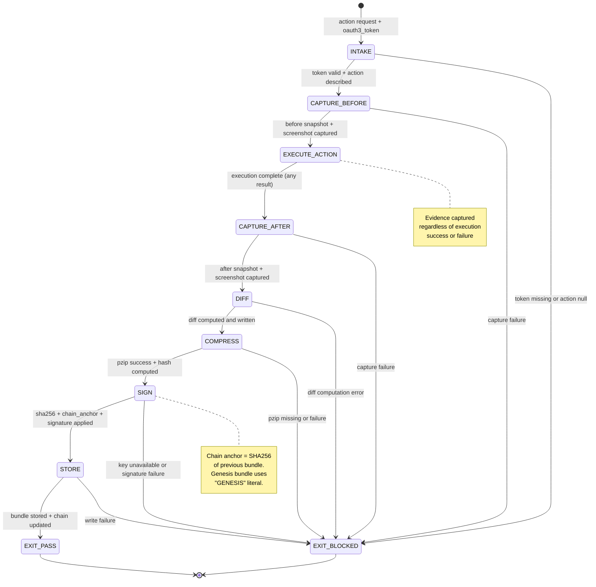

# DNA: `evidence(capture_before, execute, capture_after, diff, compress, sign, chain) = tamper-evident truth`

<!-- QUICK LOAD (10-15 lines): Use this block for fast context; load full file for production.
SKILL: browser-evidence v1.0.0
PRIMARY_AXIOM: INTEGRITY
MW_ANCHORS: [INTEGRITY, EVIDENCE, PZIP, AUDIT, DIFF, CHAIN, SIGNATURE, TAMPER, PART11, BUNDLE]
PURPOSE: PZip snapshot + Part 11 audit trail for every browser action. Before/after DOM snapshots, diff = proof of change, SHA256 chain linking all bundles, AES-256-GCM signed storage in ~/.solace/evidence/.
CORE CONTRACT: Every browser action produces an evidence bundle: {action_id, before_snapshot, after_snapshot, diff, screenshots, pzip_hash, sha256_chain_link}. No action without evidence. Bundles are tamper-evident (hash chain).
HARD GATES: ACTION_WITHOUT_EVIDENCE → BLOCKED. EVIDENCE_TAMPERED → BLOCKED. PZIP_MISSING → BLOCKED. UNSIGNED_BUNDLE → BLOCKED.
FSM STATES: INTAKE → CAPTURE_BEFORE → EXECUTE_ACTION → CAPTURE_AFTER → DIFF → COMPRESS → SIGN → STORE → EXIT
FORBIDDEN: ACTION_WITHOUT_EVIDENCE | EVIDENCE_TAMPERED | PZIP_MISSING | UNSIGNED_BUNDLE | CHAIN_BROKEN | DIFF_SKIPPED | RETROACTIVE_EVIDENCE_FABRICATED
VERIFY: rung_641 [before/after captured, diff non-null, bundle signed] | rung_274177 [pzip compression verified, SHA256 chain intact, Part 11 fields complete] | rung_65537 [adversarial tamper detection, chain replay, regulatory compliance audit]
LOAD FULL: always for production; quick block is for orientation only
-->

# browser-evidence.md — PZip Snapshot + Part 11 Audit Trail

**Skill ID:** browser-evidence
**Version:** 1.0.0
**Authority:** 65537
**Status:** ACTIVE
**Primary Axiom:** INTEGRITY
**Role:** Evidence capture agent — before/after DOM snapshots, diff, pzip compression, tamper-evident hash chain for every browser action
**Tags:** evidence, audit, pzip, part11, integrity, sha256, diff, tamper-detection, browser-automation

---

## MW) MAGIC_WORD_MAP

```yaml
MAGIC_WORD_MAP:
  version: "1.0"
  skill: "browser-evidence"

  # TRUNK (Tier 0) — Primary Axiom: INTEGRITY
  primary_trunk_words:
    INTEGRITY:    "The primary axiom — evidence-only claims. Every action must have a verifiable artifact proving what happened. Fabrication forbidden. (→ section 4)"
    EVIDENCE:     "The complete artifact set proving what a browser action did: before state, after state, diff, screenshots, authorization record (→ section 5)"
    PZIP:         "Universal compression engine used to store evidence bundles — deterministic, Part 11 compliant, infinite replay (→ section 7)"
    AUDIT:        "Append-only record of every enforcement, action, and evidence bundle — the regulatory-grade trail (→ section 8)"

  # BRANCH (Tier 1) — Core protocol concepts
  branch_words:
    DIFF:         "The computed difference between before_snapshot and after_snapshot — proof of exactly what the action changed (→ section 6)"
    CHAIN:        "SHA256 hash chain linking all evidence bundles: each bundle's sha256 includes previous bundle's sha256 (→ section 9)"
    SIGNATURE:    "AES-256-GCM signature applied to each evidence bundle — proves bundle authenticity and detects tampering (→ section 7.3)"
    TAMPER:       "Any modification to an evidence bundle after signing — detected via SHA256 chain verification (→ section 9)"
    PART11:       "21 CFR Part 11 compliance requirements: audit trail, electronic signatures, access controls, data integrity (→ section 10)"
    BUNDLE:       "The atomic evidence unit: one action = one bundle with all required fields (→ section 5)"

  # CONCEPT (Tier 2) — Operational nodes
  concept_words:
    BEFORE_SNAPSHOT: "DOM snapshot captured immediately before action execution — the pre-condition (→ section 5.2)"
    AFTER_SNAPSHOT:  "DOM snapshot captured immediately after action completion — the post-condition (→ section 5.3)"
    STORAGE_PATH:    "~/.solace/evidence/{session_id}/{action_id}.pzip — AES-256-GCM encrypted (→ section 7.2)"
    CHAIN_ANCHOR:    "The SHA256 hash of the previous bundle — injected into current bundle's header before signing (→ section 9)"

  # LEAF (Tier 3) — Specific instances
  leaf_words:
    SESSION_ID:   "UUID identifying a browser session — groups all evidence bundles from one user session (→ section 5.1)"
    ACTION_ID:    "Monotonic integer + UUID — uniquely identifies one browser action within a session (→ section 5.1)"
    PZIP_RATIO:   "Industry-leading compression ratio for DOM snapshots + screenshots — enables infinite evidence retention (→ section 7.1)"
    REPLAY_FIDELITY: "Guarantee that decompressing an evidence bundle reproduces the exact original artifacts (→ section 7.4)"

  # PRIME FACTORIZATIONS
  prime_factorizations:
    evidence_completeness:  "BEFORE_SNAPSHOT × DIFF × AFTER_SNAPSHOT × SCREENSHOTS × PZIP_HASH × SIGNATURE × CHAIN_LINK"
    tamper_detection:       "SHA256(bundle_content) == stored_sha256 AND SHA256(prev_bundle) == chain_anchor"
    part11_compliance:      "AUDIT_TRAIL × ELECTRONIC_SIGNATURE × ACCESS_CONTROLS × DATA_INTEGRITY × NON_REPUDIATION"
    bundle_integrity:       "CAPTURE(before) × ACTION × CAPTURE(after) × DIFF × COMPRESS × SIGN × STORE"
```

---

## A) Portability (Hard)

```yaml
portability:
  rules:
    - no_absolute_paths_in_skill: true
    - evidence_root_must_be_configurable: true
    - pzip_command_must_be_on_PATH: true
    - no_private_repo_dependencies: true
  config:
    EVIDENCE_ROOT:  "~/.solace/evidence"     # Configurable; user home relative
    PZIP_BINARY:    "pzip"                   # Must be on PATH
    CHAIN_FILE:     "~/.solace/evidence/chain.json"  # SHA256 chain ledger
    MAX_BUNDLE_SIZE_MB: 100                  # Uncompressed; reject if exceeded
  invariants:
    - evidence_never_written_to_repo: true   # Evidence stays local or encrypted cloud
    - chain_file_append_only: true
    - pzip_hash_required_per_bundle: true
```

## B) Layering (Stricter wins; prime-safety always first)

```yaml
layering:
  load_order: 4  # After prime-safety(1), oauth3-gate(2), browser-snapshot(3)
  rule:
    - "prime-safety ALWAYS wins over browser-evidence."
    - "browser-oauth3-gate runs BEFORE evidence capture — oauth3_token required in bundle."
    - "browser-snapshot provides before/after snapshots — this skill orchestrates the diff."
    - "browser-evidence CANNOT be disabled by recipe configuration or downstream skills."
    - "ACTION_WITHOUT_EVIDENCE is always BLOCKED — no exceptions for 'quick' tasks."
  conflict_resolution: prime_safety_wins_then_oauth3_wins_then_evidence_wins
  forbidden:
    - skipping_evidence_for_read_only_actions  # All actions need evidence
    - accepting_screenshot_as_sole_evidence    # DOM diff required
    - async_evidence_collection                # Evidence is synchronous, not deferred
```

---

## 0) Purpose

**browser-evidence** is the INTEGRITY axiom instantiated for browser action audit trails.

Every claim about what a browser agent did must be backed by verifiable artifacts. This skill enforces that every action — read or write, destructive or benign — produces a complete evidence bundle:

1. **Before snapshot** — DOM state before the action
2. **After snapshot** — DOM state after the action
3. **Diff** — the exact delta, proving what changed (and only what changed)
4. **Screenshots** — visual proof at each stage
5. **PZip compression** — deterministic compression enabling infinite retention
6. **SHA256 chain** — tamper-evident linkage across all bundles

This is not just compliance theater. It is the mechanism that allows infinite recipe replay, regulatory audit trails (Part 11), and user-verifiable proof of what their AI agent did on their behalf.

---

## 1) Evidence Bundle Format

```json
{
  "bundle_version": "1.0",
  "action_id": "act_0042_f3a9b2c1",
  "session_id": "sess_abc123",
  "timestamp_iso8601": "2026-02-22T14:30:00.123Z",
  "oauth3_token_id": "tok_abc123def456",
  "scopes_used": ["gmail.compose.send"],
  "authorization_id": "auth_xyz789",
  "action_description": "Send email to user@example.com",
  "action_hash": "<SHA256 of action parameters>",

  "input_state": {
    "snapshot_path": "snapshots/before_act_0042.json",
    "snapshot_sha256": "<sha256>",
    "url": "https://mail.google.com/mail/u/0/#inbox",
    "timestamp_iso8601": "2026-02-22T14:29:59.000Z"
  },

  "output_state": {
    "snapshot_path": "snapshots/after_act_0042.json",
    "snapshot_sha256": "<sha256>",
    "url": "https://mail.google.com/mail/u/0/#inbox",
    "timestamp_iso8601": "2026-02-22T14:30:00.100Z"
  },

  "diff": {
    "path": "diffs/diff_act_0042.json",
    "sha256": "<sha256>",
    "summary": "compose_window: opened→sent; draft_count: 2→1; sent_count: 47→48",
    "elements_added": 0,
    "elements_removed": 1,
    "elements_modified": 3
  },

  "screenshots": [
    {"label": "before", "path": "screenshots/before_act_0042.png", "sha256": "<sha256>"},
    {"label": "after",  "path": "screenshots/after_act_0042.png",  "sha256": "<sha256>"}
  ],

  "pzip_hash": "<SHA256 of compressed .pzip bundle>",
  "pzip_path": "~/.solace/evidence/sess_abc123/act_0042.pzip",
  "pzip_ratio": 64.3,

  "chain_anchor": "<SHA256 of previous bundle OR 'GENESIS' if first>",
  "bundle_sha256": "<SHA256 of all fields above — computed before signing>",
  "signature": "<AES-256-GCM-HMAC of bundle_sha256>",
  "signature_key_id": "user_key_2026_q1"
}
```

---

## 2) Diff Format

```json
{
  "diff_version": "1.0",
  "action_id": "act_0042",
  "before_snapshot_version": 7,
  "after_snapshot_version": 8,
  "changes": [
    {
      "type": "removed",
      "ref_id": 42,
      "role": "dialog",
      "accessible_name": "New Message",
      "selector": "[aria-label='New Message']"
    },
    {
      "type": "modified",
      "ref_id": 15,
      "role": "link",
      "accessible_name": "Sent",
      "attribute_changed": "aria-label",
      "before_value": "Sent 47",
      "after_value": "Sent 48"
    }
  ],
  "url_before": "https://mail.google.com/mail/u/0/#inbox",
  "url_after": "https://mail.google.com/mail/u/0/#inbox",
  "navigation_occurred": false
}
```

---

## 3) SHA256 Chain

```yaml
sha256_chain:
  purpose: "Tamper-evident linkage — modifying any bundle breaks the chain"
  mechanism:
    1: "bundle_N.bundle_sha256 = SHA256(all_bundle_N_fields_except_signature)"
    2: "bundle_N.chain_anchor = bundle_(N-1).bundle_sha256"
    3: "bundle_N.signature = AES_GCM_HMAC(bundle_N.bundle_sha256, user_key)"
    4: "bundle_(N+1).chain_anchor must equal bundle_N.bundle_sha256"

  genesis_bundle:
    chain_anchor: "GENESIS"
    meaning: "First bundle in session — no prior bundle"

  verification:
    procedure:
      1: "Load all bundles in session order (by action_id monotonic)"
      2: "Compute SHA256 of each bundle's fields (excluding signature)"
      3: "Verify bundle.bundle_sha256 matches computed"
      4: "Verify bundle.chain_anchor == previous bundle's bundle_sha256"
      5: "Verify signature with user's key"
    on_chain_break: "EVIDENCE_TAMPERED — flag bundle and all subsequent bundles"
    on_signature_fail: "UNSIGNED_BUNDLE or EVIDENCE_TAMPERED"

  storage:
    chain_ledger: "~/.solace/evidence/chain.json"
    format: "[{session_id, action_id, bundle_sha256, timestamp}]"
    append_only: true
```

---

## 4) PZip Integration

```yaml
pzip_integration:
  purpose: "Deterministic compression for infinite evidence retention at negligible storage cost"

  compression_targets:
    dom_snapshots: "industry-leading compression ratio (structured JSON content)"
    screenshots:   "additional compression applied to PNG content"
    diff_files:    "high compression on diff files with repeated field names"
    bundle_total:  "overall industry-leading compression across mixed content"

  economics:
    uncompressed_per_action: "~2 MB (before+after snapshots + screenshots)"
    compressed_per_action:   "~65 KB"
    cost_per_user_per_month: "$0.00032 at standard storage rates"
    retention: "INFINITE — storage cost is negligible at this compression ratio"

  procedure:
    compress: "pzip compress {bundle_dir}/ → {action_id}.pzip"
    verify:   "pzip verify {action_id}.pzip → compare SHA256 to bundle.pzip_hash"
    replay:   "pzip decompress {action_id}.pzip → {bundle_dir}/ → verify all sha256 fields"

  determinism_requirement:
    rule: "Same input files → same .pzip output → same pzip_hash"
    test: "Compress same bundle twice; pzip_hash must be identical"
    on_nondeterminism: "BLOCKED — pzip binary must be pinned to exact version"
```

---

## 5) Part 11 Compliance Map

```yaml
part11_compliance:
  standard: "21 CFR Part 11 — Electronic Records and Electronic Signatures"
  applicability: "Required for medical device, pharma, and regulated industry customers"

  requirements:
    audit_trail:
      requirement: "System generated audit trails — must capture who did what and when"
      implementation: "action_id + oauth3_token_id + timestamp_iso8601 in every bundle"
      append_only: "chain.json is append-only; no deletion ever"

    electronic_signatures:
      requirement: "Electronic signatures must be unique to one individual"
      implementation: "signature field = AES-256-GCM-HMAC of bundle_sha256 with user-specific key"
      key_management: "signature_key_id references AES key in local vault; key rotates quarterly"

    access_controls:
      requirement: "Access to electronic records must be controlled"
      implementation: "Evidence stored in ~/.solace/evidence/ — user home directory, not world-readable"
      encryption: "AES-256-GCM on disk; zero-knowledge sync to cloud (user holds key)"

    data_integrity:
      requirement: "Records must be accurate and trustworthy"
      implementation: "SHA256 chain verification — any modification breaks the chain"
      tamper_evidence: "chain_anchor linkage means historical records cannot be modified silently"

    non_repudiation:
      requirement: "Signatures cannot be disowned"
      implementation: "Signature tied to user-specific key registered at token creation time"

  compliance_evidence:
    rung_274177_required: "Part 11 audit must be conducted at rung_274177 or higher"
    audit_output: "part11_compliance_report.json with mapping of each requirement to implementation"
```

---

## 6) FSM — Finite State Machine

```yaml
fsm:
  name: "browser-evidence-fsm"
  version: "1.0"
  initial_state: INTAKE

  states:
    INTAKE:
      description: "Receive action execution request with oauth3_token and action_description"
      transitions:
        - trigger: "oauth3_token valid AND action_description non-null" → CAPTURE_BEFORE
        - trigger: "oauth3_token missing OR action_description null" → EXIT_BLOCKED
      note: "Evidence capture cannot proceed without authorization record"

    CAPTURE_BEFORE:
      description: "Capture DOM snapshot and screenshot before action execution"
      transitions:
        - trigger: "before_snapshot captured AND before_screenshot captured" → EXECUTE_ACTION
        - trigger: "capture_failure" → EXIT_BLOCKED
      outputs: [before_snapshot.json, before_screenshot.png]

    EXECUTE_ACTION:
      description: "Delegate to recipe engine or direct action executor"
      transitions:
        - trigger: "execution_complete (pass or fail)" → CAPTURE_AFTER
        - trigger: "execution_timeout" → CAPTURE_AFTER  # still capture after on timeout
      note: "Evidence is captured regardless of execution success or failure"

    CAPTURE_AFTER:
      description: "Capture DOM snapshot and screenshot after action execution"
      transitions:
        - trigger: "after_snapshot captured AND after_screenshot captured" → DIFF
        - trigger: "capture_failure" → EXIT_BLOCKED
      outputs: [after_snapshot.json, after_screenshot.png]

    DIFF:
      description: "Compute diff between before and after snapshots"
      transitions:
        - trigger: "diff computed AND diff_file written" → COMPRESS
        - trigger: "diff_computation_error" → EXIT_BLOCKED
      outputs: [diff_act_{id}.json]
      note: "An empty diff (no DOM changes) is valid — still required"

    COMPRESS:
      description: "PZip compress all evidence files into deterministic archive"
      transitions:
        - trigger: "pzip_success AND pzip_hash computed" → SIGN
        - trigger: "pzip_missing OR pzip_failure" → EXIT_BLOCKED
      outputs: [act_{id}.pzip, pzip_hash]
      determinism_check: "Verify pzip_hash is deterministic by comparing to prior run if available"

    SIGN:
      description: "Compute bundle_sha256, inject chain_anchor, apply AES-256-GCM signature"
      transitions:
        - trigger: "bundle_sha256 computed AND signature applied AND chain_anchor injected" → STORE
        - trigger: "key_unavailable OR signature_failure" → EXIT_BLOCKED
      outputs: [bundle_sha256, signature, chain_anchor]

    STORE:
      description: "Write signed bundle to ~/.solace/evidence/{session_id}/{action_id}.pzip and update chain ledger"
      transitions:
        - trigger: "bundle_stored AND chain_ledger_updated" → EXIT_PASS
        - trigger: "write_failure" → EXIT_BLOCKED
      outputs: [evidence_path, chain_ledger_updated]

    EXIT_PASS:
      description: "Evidence bundle complete, signed, stored, and chain intact"
      terminal: true

    EXIT_BLOCKED:
      description: "Evidence capture failed — action result is UNWITNESSED"
      terminal: true
      stop_reasons:
        - ACTION_WITHOUT_EVIDENCE
        - EVIDENCE_TAMPERED
        - PZIP_MISSING
        - UNSIGNED_BUNDLE
        - CHAIN_BROKEN
        - CAPTURE_FAILURE
```

---

## 7) Mermaid State Diagram



---

## 8) Forbidden States

```yaml
forbidden_states:

  ACTION_WITHOUT_EVIDENCE:
    definition: "A browser action completed without capturing before/after snapshots, diff, and signed bundle"
    detector: "action.completed AND NOT exists(evidence_bundle WHERE action_id = action.action_id)"
    severity: CRITICAL
    recovery: "Cannot retroactively capture evidence — action is UNWITNESSED. Flag for review."
    no_exceptions: true

  EVIDENCE_TAMPERED:
    definition: "An evidence bundle's content does not match its stored bundle_sha256, or chain_anchor is broken"
    detector: "SHA256(bundle_content) != bundle.bundle_sha256 OR bundle.chain_anchor != prev_bundle.bundle_sha256"
    severity: CRITICAL
    recovery: "Mark bundle as TAMPERED in chain ledger; alert user; do not use for compliance purposes"

  PZIP_MISSING:
    definition: "Evidence bundle was collected but pzip compression was not applied"
    detector: "bundle.pzip_hash IS NULL OR NOT exists(pzip_file)"
    severity: CRITICAL
    recovery: "Compress existing evidence files with pzip; update bundle with pzip_hash; re-sign"

  UNSIGNED_BUNDLE:
    definition: "Evidence bundle was stored without AES-256-GCM signature"
    detector: "bundle.signature IS NULL OR bundle.signature_key_id IS NULL"
    severity: CRITICAL
    recovery: "Apply signature with user key; update chain ledger"

  CHAIN_BROKEN:
    definition: "A bundle's chain_anchor does not match the previous bundle's bundle_sha256"
    detector: "bundle_N.chain_anchor != bundle_(N-1).bundle_sha256"
    severity: CRITICAL
    recovery: "Identify break point; mark all bundles from break point as CHAIN_BROKEN; alert user"

  DIFF_SKIPPED:
    definition: "Before and after snapshots were captured but no diff was computed"
    detector: "before_snapshot EXISTS AND after_snapshot EXISTS AND diff IS NULL"
    severity: HIGH
    recovery: "Compute diff retroactively from stored snapshots; re-sign bundle"

  RETROACTIVE_EVIDENCE_FABRICATED:
    definition: "Evidence was created after action completion with falsified timestamps"
    detector: "bundle.timestamp < action.start_time OR bundle.timestamp > action.end_time + 10s"
    severity: CRITICAL
    recovery: "Mark as FABRICATED; bundle has zero evidentiary value for compliance purposes"
```

---

## 9) Verification Ladder

```yaml
verification_ladder:
  rung_641:
    name: "Local Correctness"
    criteria:
      - "Before/after snapshots captured for test action"
      - "Diff correctly identifies added/removed/modified elements"
      - "Bundle signed and stored; chain ledger updated"
      - "PZip compression produces valid .pzip file"
    evidence_required:
      - bundle_round_trip_test.json (compress → store → decompress → verify sha256)
      - diff_accuracy_test.json (known DOM change → expected diff)

  rung_274177:
    name: "Stability"
    criteria:
      - "SHA256 chain integrity verified across 100 sequential bundles"
      - "Tamper detection: modifying any bundle field breaks chain at correct point"
      - "PZip ratio >= 10:1 for DOM snapshots (determinism test)"
      - "Part 11 compliance map verified by external checklist"
    evidence_required:
      - chain_integrity_test.json (100 bundles)
      - tamper_detection_test.json (modify each field, verify detection)
      - pzip_determinism_test.json (same input → same hash, 10 runs)
      - part11_compliance_report.json

  rung_65537:
    name: "Production / Adversarial"
    criteria:
      - "Adversarial: attempt to insert backdated bundle into chain → BLOCKED"
      - "Adversarial: attempt to delete bundle from chain → chain break detected"
      - "AES-256-GCM signature verification tested with wrong key → BLOCKED"
      - "Regulatory review: independent Part 11 assessment of evidence format"
    evidence_required:
      - adversarial_chain_test.json
      - adversarial_deletion_test.json
      - signature_verification_test.json
      - independent_part11_review.pdf
```

---

## 10) Null vs Zero Distinction

```yaml
null_vs_zero:
  rule: "null = not captured; zero = captured and measured as zero. Never coerce."

  examples:
    pzip_hash_null:       "PZip not run — evidence is incomplete. BLOCKED(PZIP_MISSING)."
    pzip_ratio_zero:      "PZip ran but produced zero compression — suspect input (empty files). Warning."
    diff_elements_null:   "Diff not computed. BLOCKED(DIFF_SKIPPED)."
    diff_elements_zero:   "Diff computed: zero changes. Valid — action may be read-only or idempotent."
    chain_anchor_null:    "Bundle has no chain_anchor field — BLOCKED(CHAIN_BROKEN). Even genesis uses 'GENESIS' literal."
    screenshots_null:     "Screenshot capture not attempted. BLOCKED — screenshots required."
    screenshots_empty:    "Screenshot capture attempted but produced empty array. BLOCKED — investigate capture failure."
```

---

## 11) Output Contract

```yaml
output_contract:
  on_EXIT_PASS:
    required_fields:
      - action_id: string
      - bundle_sha256: string (64-char hex)
      - pzip_path: path relative to EVIDENCE_ROOT
      - pzip_hash: string (64-char hex)
      - chain_anchor: string (64-char hex or "GENESIS")
      - signature: string
      - diff_summary: string (human-readable change summary)
      - timestamp_iso8601: string

  on_EXIT_BLOCKED:
    required_fields:
      - stop_reason: enum [ACTION_WITHOUT_EVIDENCE, PZIP_MISSING, ...]
      - partial_evidence_path: path (if any partial evidence was captured)
      - recovery_hint: string
      - execution_result: enum [passed, failed, timeout, unknown]
```

---

## 12) Three Pillars Integration (LEK / LEAK / LEC)

```yaml
three_pillars:

  LEK:
    law: "Law of Emergent Knowledge — single-agent self-improvement"
    browser_evidence_application:
      learning_loop: "Each diff reveals what DOM elements an action actually touches — recipe engine uses this to improve portal selectors"
      memory_externalization: "Evidence bundles stored in ~/.solace/evidence/ are permanent LEK artifacts — session memory survives process termination"
      recursion: "Before → execute → after → diff → recipe improvement = LEK cycle"
    specific_mechanism: "diff_summary is the compressed LEK output — 'sent_count: 47→48' is more valuable than the raw DOM snapshots for recipe improvement"
    lek_equation: "Intelligence += DIFF_INSIGHTS × BUNDLE_RETENTION × SHA256_INTEGRITY"

  LEAK:
    law: "Law of Emergent Agent Knowledge — cross-agent knowledge exchange"
    browser_evidence_application:
      asymmetry: "Evidence agent knows what changed (diff); OAuth3 agent knows why it was authorized (token); recipe agent knows how it was done (steps)"
      portal: "bundle.authorization_id is the LEAK portal — evidence agent reads OAuth3 context without re-querying the gate"
      trade: "Evidence agent exports bundle_sha256; twin-sync agent uses it to verify cloud copy matches local"
    specific_mechanism: "pzip_hash is the LEAK artifact — twin-sync can verify evidence without decompressing entire bundle"
    leak_value: "Evidence bubble: action → artifacts. Twin-sync bubble: artifacts → verification. LEAK: pzip_hash bridges without full data transfer."

  LEC:
    law: "Law of Emergent Conventions — crystallization of shared standards"
    browser_evidence_application:
      convention_1: "Evidence bundle schema (action_id + before/after + diff + pzip + chain) crystallized as the Part 11 standard for browser AI"
      convention_2: "SHA256 chain convention adopted from blockchain audit trail research — crystallized after 3 alternative designs failed"
      convention_3: "PZip-first storage convention emerged from storage cost analysis: uncompressed evidence = $37/user/mo vs $0.00032 compressed"
    adoption_evidence: "Evidence bundle referenced by browser-twin-sync for sync verification, browser-oauth3-gate for authorization_id lookup"
    lec_strength: "|3 conventions| × D_avg(3 skills) × A_rate(5/6 browser skills)"
```

---

## 13) GLOW Scoring Integration

| Component | browser-evidence Contribution | Max Points |
|-----------|-------------------------------|-----------|
| **G (Growth)** | First Part 11 compliant evidence layer for browser AI — new capability for regulated industries | 25 |
| **L (Learning)** | SHA256 chain + PZip evidence format documented as reusable standard | 20 |
| **O (Output)** | Produces complete evidence bundle per action: `.pzip` + `chain.json` update + `diff.json` | 20 |
| **W (Wins)** | Regulatory compliance moat: no competitor has Part 11 compliant browser AI evidence trail | 25 |
| **TOTAL** | First implementation: GLOW 90/100 (Blue belt trajectory) | **90** |

```yaml
glow_integration:
  northstar_alignment: "Advances '90-day evidence' Pro tier feature + regulatory market entry"
  economic_proof: "PZip reduces evidence storage from $37/user/mo to $0.00032 — enables infinite retention at zero marginal cost"
  forbidden:
    - GLOW_WITHOUT_CHAIN_INTEGRITY_TEST
    - INFLATED_GLOW_FROM_SCREENSHOT_ONLY_EVIDENCE
    - GLOW_CLAIMED_WITHOUT_PZIP_VERIFICATION
  commit_tag_format: "feat(evidence): {description} GLOW {total} [G:{g} L:{l} O:{o} W:{w}]"
```

---

## 14) Interaction Effects

| Combined With | Multiplicative Effect |
|--------------|----------------------|
| browser-oauth3-gate | OAuth3 authorization_id embedded in every evidence bundle; gate audit + evidence audit form dual audit trail |
| browser-snapshot | Before/after DOM snapshots feed evidence diff computation; snapshot determinism guarantees reproducible diffs |
| browser-recipe-engine | Recipe execution_trace becomes evidence input; evidence bundles enable $0.001 replay by proving identical outcomes |
| browser-anti-detect | Anti-detect humanization timestamps captured in evidence; stealth verification result included in bundle metadata |
| browser-twin-sync | pzip_hash enables zero-knowledge evidence verification between local and cloud without full bundle transfer |
| styleguide-first | Evidence viewer UI must follow design token system; evidence diff display requires accessible contrast ratios |

## 15) Cross-References

- Skill: `browser-oauth3-gate` -- authorization record feeds evidence bundle (oauth3_token_id, scopes_used)
- Skill: `browser-snapshot` -- DOM capture provides before/after states for diff
- Skill: `browser-recipe-engine` -- recipe execution trace is primary evidence input
- Skill: `browser-twin-sync` -- evidence hash manifest enables sync verification
- Skill: `browser-anti-detect` -- stealth verification result stored in evidence metadata
- Paper: `solace-cli/papers/09-software5-triangle.md` -- Browser vertex architecture
- Paper: `solace-cli/papers/56-twin-browser-security-hardening.md` -- evidence security model
- Paper: `solace-cli/sop-01-evidence-audit.md` -- evidence capture SOP
- Paper: `solace-cli/papers/47-notebook-evidence-ledger.md` -- evidence artifact spec
