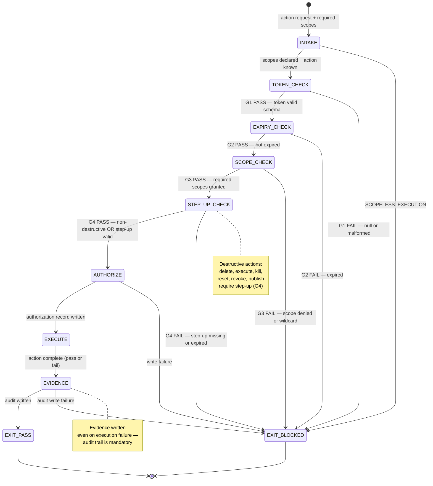

<!-- QUICK LOAD (10-15 lines): Use this block for fast context; load full file for production.
SKILL: browser-oauth3-gate v1.0.0
PRIMARY_AXIOM: HIERARCHY
MW_ANCHORS: [HIERARCHY, GATE, SCOPE, TOKEN, CONSENT, STEP_UP, REVOCATION, EVIDENCE, EXPIRY, DELEGATION]
PURPOSE: Pre-execution OAuth3 scope enforcement for all browser actions. 4-gate cascade (G1 token exists → G2 not expired → G3 scope present → G4 step-up if needed). Fail-closed on any gate failure. Evidence bundle per enforcement event.
CORE CONTRACT: All 4 gates run in order before every browser action. No gate skip. No parallel gate check. Gate failure = BLOCKED + audit record. Step-up required for destructive actions (delete, execute, kill).
HARD GATES: SCOPELESS_EXECUTION → BLOCKED. EXPIRED_TOKEN_USED → BLOCKED. STEP_UP_BYPASSED → BLOCKED. EVIDENCE_SKIPPED → BLOCKED.
FSM STATES: INTAKE → TOKEN_CHECK → EXPIRY_CHECK → SCOPE_CHECK → STEP_UP_CHECK → AUTHORIZE → EXECUTE → EVIDENCE → EXIT
FORBIDDEN: SCOPELESS_EXECUTION | EXPIRED_TOKEN_USED | STEP_UP_BYPASSED | EVIDENCE_SKIPPED | GATE_SKIP | FAIL_OPEN | PARTIAL_GATE_RUN
VERIFY: rung_641 [all 4 gates tested, audit JSON schema valid] | rung_274177 [step-up flow tested, revocation check integration] | rung_65537 [adversarial token injection, scope wildcard rejection, production audit trail]
LOAD FULL: always for production; quick block is for orientation only
-->

# browser-oauth3-gate.md — OAuth3 Scope Enforcement for Browser Actions

**Skill ID:** browser-oauth3-gate
**Version:** 1.0.0
**Authority:** 65537
**Status:** ACTIVE
**Primary Axiom:** HIERARCHY
**Role:** Pre-execution OAuth3 enforcement agent — all browser actions must pass 4 gates before execution
**Tags:** oauth3, scope, consent, authorization, step-up, evidence, hierarchy, browser-automation, security

---

## MW) MAGIC_WORD_MAP

```yaml
MAGIC_WORD_MAP:
  version: "1.0"
  skill: "browser-oauth3-gate"

  # TRUNK (Tier 0) — Primary Axiom: HIERARCHY
  primary_trunk_words:
    HIERARCHY:    "The primary axiom — Gates G1→G2→G3→G4 form a strict precedence chain. No gate can be skipped to reach a later gate. Rung of enforcement = MIN(rung of all gates passed). (→ section 4)"
    GATE:         "A single, binary authorization check — PASS or BLOCKED. All 4 gates required in order. No partial pass. (→ section 5)"
    SCOPE:        "A named permission in platform.action format (linkedin.create_post, gmail.compose.send). The atomic unit of authorization. (→ section 6)"
    TOKEN:        "An OAuth3 token artifact: {token_id, scopes[], expiry_iso8601, issued_at, user_id, signature}. Evidence of consent. (→ section 7)"

  # BRANCH (Tier 1) — Core protocol concepts
  branch_words:
    CONSENT:      "The user's explicit authorization for an agent to act on their behalf — the root of all tokens (→ section 7)"
    STEP_UP:      "Additional authorization challenge required for destructive actions — separate from initial token grant (→ section 8)"
    REVOCATION:   "The ability for a user to withdraw a token at any time, with immediate effect — makes delegation reversible (→ section 7.4)"
    EVIDENCE:     "The audit record produced for every gate enforcement event: token_id, scopes_checked, result, timestamp (→ section 9)"
    EXPIRY:       "Token TTL enforcement — expired tokens are BLOCKED regardless of scope content (→ gate G2)"
    DELEGATION:   "The act of granting an agent a token to act on a user's behalf within declared scopes (→ section 7)"

  # CONCEPT (Tier 2) — Operational nodes
  concept_words:
    SCOPE_REGISTRY: "Platform-specific scope catalog: platform → {action → required_scope} mapping (→ section 6.1)"
    DESTRUCTIVE_ACTION: "Any action in [delete, execute, kill, revoke, reset, publish] that requires step-up authorization (→ section 8)"
    AUDIT_RECORD: "Append-only JSON line in oauth3_audit.jsonl: {event, token_id, scopes_used, result, timestamp} (→ section 9)"
    TOKEN_LIFECYCLE: "consent → create → enforce → [use | revoke] — explicit state machine for token management (→ section 7)"

  # LEAF (Tier 3) — Specific instances
  leaf_words:
    G1_TOKEN_EXISTS:  "Gate 1: token is not null AND token JSON schema is valid (→ section 5.1)"
    G2_NOT_EXPIRED:   "Gate 2: current_time < token.expiry_iso8601 AND token.issued_at valid (→ section 5.2)"
    G3_SCOPE_PRESENT: "Gate 3: all required_scopes[] ⊆ token.scopes[] (→ section 5.3)"
    G4_STEP_UP:       "Gate 4: if action is destructive AND step_up_completed = false → block and request step-up (→ section 5.4)"

  # PRIME FACTORIZATIONS
  prime_factorizations:
    enforcement_chain:   "G1(token_exists) × G2(not_expired) × G3(scope_granted) × G4(step_up_if_needed)"
    token_validity:      "EXISTS(token) × NOT_EXPIRED × SCOPE_GRANTED × NOT_REVOKED"
    evidence_integrity:  "AUDIT_RECORD × TIMESTAMP × TOKEN_ID × SCOPES_USED × RESULT"
    delegation_safety:   "CONSENT × SCOPES(minimal) × EXPIRY(explicit) × REVOCATION(available)"
```

---

## A) Portability (Hard)

```yaml
portability:
  rules:
    - no_absolute_paths: true
    - no_private_repo_dependencies: true
    - token_store_path_must_be_configurable: true
    - audit_file_must_be_append_only: true
  config:
    TOKEN_STORE:    "~/.solace/tokens"      # AES-256-GCM encrypted; relative to user home
    AUDIT_FILE:     "artifacts/oauth3/oauth3_audit.jsonl"
    SCOPE_REGISTRY: "specs/oauth3-scope-registry.json"
    STEP_UP_TTL_SECONDS: 300               # Step-up authorization expires after 5 minutes
  invariants:
    - token_files_never_written_to_repo: true
    - audit_file_append_only_no_deletion: true
    - scope_registry_read_only: true
```

## B) Layering (Stricter wins; prime-safety always first)

```yaml
layering:
  load_order: 2  # After prime-safety (1); before all other browser skills
  rule:
    - "prime-safety ALWAYS wins over browser-oauth3-gate."
    - "browser-oauth3-gate runs BEFORE browser-recipe-engine, browser-snapshot, browser-evidence."
    - "A recipe's declared required_oauth3_scopes are checked at gate G3 — recipe scope is input, not override."
    - "This skill CANNOT be weakened by any downstream skill or any recipe configuration."
    - "SCOPELESS_EXECUTION is always BLOCKED — no exceptions for 'trusted' recipes."
  conflict_resolution: prime_safety_wins_then_oauth3_gate_wins
  forbidden:
    - relaxing_any_gate_for_trusted_recipes
    - accepting_scope_wildcard
    - proceeding_on_gate_timeout
```

---

## 0) Purpose

**browser-oauth3-gate** is the HIERARCHY axiom instantiated for browser action authorization.

Every browser action carries risk — composing an email, creating a post, deleting data. The OAuth3 gate enforces that:
1. The agent has a valid token (G1)
2. The token is not expired (G2)
3. The token grants the required scope for this specific action (G3)
4. Destructive actions require step-up authorization beyond the base token (G4)

This is not just compliance. It is the competitive moat: Solace Browser is the first system where every AI agent action is explicitly authorized, auditable, and revocable — with a consent model, revocation, and a full audit trail.

**The HIERARCHY axiom applies:** gates form a strict precedence chain. Rung = MIN(all gates). A gate failure at G1 prevents G2-G4 even from executing.

---

## 1) Scope Registry — Platform.Action Format

```yaml
scope_registry:
  version: "1.0"

  gmail:
    compose.draft:    "gmail.compose.draft"      # Create draft only (no send)
    compose.send:     "gmail.compose.send"       # Create and send email
    read.inbox:       "gmail.read.inbox"         # Read inbox messages
    read.thread:      "gmail.read.thread"        # Read specific thread
    delete.message:   "gmail.delete.message"     # Delete message [DESTRUCTIVE → G4]
    label.manage:     "gmail.label.manage"       # Create/modify labels

  linkedin:
    create.post:      "linkedin.create.post"     # Create new post
    create.comment:   "linkedin.create.comment"  # Comment on existing post
    read.feed:        "linkedin.read.feed"       # Read feed
    read.profile:     "linkedin.read.profile"    # Read profile data
    delete.post:      "linkedin.delete.post"     # Delete post [DESTRUCTIVE → G4]
    message.send:     "linkedin.message.send"    # Send direct message

  github:
    repo.read:        "github.repo.read"         # Read repository content
    issue.create:     "github.issue.create"      # Create new issue
    issue.comment:    "github.issue.comment"     # Comment on issue
    pr.create:        "github.pr.create"         # Create pull request
    repo.delete:      "github.repo.delete"       # Delete repository [DESTRUCTIVE → G4]
    file.write:       "github.file.write"        # Write file to repo

  destructive_scope_marker:
    rule: "Any scope containing 'delete', 'execute', 'kill', 'reset', 'revoke' requires G4 step-up"
    examples: [gmail.delete.message, linkedin.delete.post, github.repo.delete]
```

---

## 2) Token Schema

```json
{
  "token_id": "tok_abc123def456",
  "version": "3.0",
  "user_id": "user_xyz",
  "platform": "gmail",
  "scopes": ["gmail.compose.draft", "gmail.read.inbox"],
  "issued_at": "2026-02-22T10:00:00Z",
  "expiry_iso8601": "2026-02-22T22:00:00Z",
  "issued_by": "solace-oauth3-server-v1",
  "signature": "<AES-256-GCM-HMAC-SHA256>",
  "revoked": false,
  "step_up_completed": false,
  "step_up_expires": null
}
```

---

## 3) Four-Gate Enforcement Protocol

```yaml
gate_enforcement:

  G1_TOKEN_EXISTS:
    check: "token IS NOT NULL AND token.token_id IS NOT NULL AND token schema validates"
    schema_required_fields: [token_id, version, user_id, platform, scopes, issued_at, expiry_iso8601, signature, revoked]
    on_fail: "BLOCKED(stop_reason=OAUTH3_MISSING_TOKEN)"
    on_null_token: "BLOCKED — never proceed without token"
    on_malformed_token: "BLOCKED(stop_reason=OAUTH3_MALFORMED_TOKEN)"

  G2_NOT_EXPIRED:
    check: "datetime.utcnow() < datetime.fromisoformat(token.expiry_iso8601)"
    clock_source: "Server UTC time — never client-local time"
    on_fail: "BLOCKED(stop_reason=OAUTH3_TOKEN_EXPIRED)"
    grace_period: 0  # No grace period — expired is expired
    on_clock_unavailable: "BLOCKED — cannot verify expiry without authoritative clock"

  G3_SCOPE_PRESENT:
    check: "required_scopes[] ⊆ token.scopes[] (subset, not equality)"
    required_scopes_source: "recipe.required_oauth3_scopes OR action.scope_registry_lookup"
    on_fail: "BLOCKED(stop_reason=OAUTH3_SCOPE_DENIED)"
    on_empty_required_scopes: "BLOCKED(stop_reason=OAUTH3_SCOPE_UNDECLARED) — scopeless recipes are BLOCKED"
    on_wildcard_scope: "BLOCKED — wildcard scopes (platform.*) are never accepted"

  G4_STEP_UP:
    check: "IF action.is_destructive THEN token.step_up_completed == true AND datetime.utcnow() < step_up_expires"
    destructive_detection: "action.scope IN scope_registry.destructive_scope_marker.examples"
    on_step_up_needed_and_missing: "BLOCKED(stop_reason=OAUTH3_STEP_UP_REQUIRED) + emit step_up_request"
    on_step_up_expired: "BLOCKED(stop_reason=OAUTH3_STEP_UP_EXPIRED) — re-challenge required"
    step_up_ttl_seconds: 300
    step_up_methods: [user_confirmation_dialog, biometric, totp]
    on_non_destructive_action: "G4 PASS (no step-up needed)"
```

---

## 4) Step-Up Authorization Flow

```yaml
step_up_flow:
  trigger: "G4 check: action.is_destructive AND NOT token.step_up_completed"

  procedure:
    1_emit_challenge:
      action: "Emit step_up_request to UI layer"
      format: {token_id, action_description, scope_requested, challenge_type}

    2_await_response:
      timeout_seconds: 120
      on_timeout: "BLOCKED(stop_reason=OAUTH3_STEP_UP_TIMEOUT)"

    3_verify_response:
      method: "Verify challenge response against token.user_id + token.signature"
      on_verification_fail: "BLOCKED(stop_reason=OAUTH3_STEP_UP_VERIFICATION_FAILED)"

    4_issue_step_up:
      action: "Set token.step_up_completed = true, token.step_up_expires = now() + 300s"
      scope: "Step-up authorization is scoped to the specific action, not all destructive actions"

    5_proceed:
      action: "G4 PASS — continue to AUTHORIZE state"
      evidence_required: "step_up_audit_record.json with challenge method + timestamp"
```

---

## 5) Evidence Bundle Format

```json
{
  "audit_event": "OAUTH3_GATE_ENFORCEMENT",
  "token_id": "tok_abc123def456",
  "platform": "gmail",
  "action_description": "compose.send to user@example.com",
  "action_hash": "<SHA256 of action parameters>",
  "scopes_required": ["gmail.compose.send"],
  "scopes_granted": ["gmail.compose.draft", "gmail.compose.send"],
  "g1_result": "PASS",
  "g2_result": "PASS",
  "g3_result": "PASS",
  "g4_result": "PASS",
  "step_up_used": false,
  "enforcement_result": "AUTHORIZED",
  "timestamp_iso8601": "2026-02-22T14:30:00Z",
  "evidence_version": "1.0"
}
```

---

## 6) FSM — Finite State Machine

```yaml
fsm:
  name: "browser-oauth3-gate-fsm"
  version: "1.0"
  initial_state: INTAKE

  states:
    INTAKE:
      description: "Receive action request with required_scopes and action_type"
      transitions:
        - trigger: "required_scopes declared AND action_type known" → TOKEN_CHECK
        - trigger: "required_scopes NULL OR action_type unknown" → EXIT_BLOCKED
      note: "Undeclared scopes = SCOPELESS_EXECUTION = BLOCKED at intake"

    TOKEN_CHECK:
      description: "G1: Verify token exists and schema is valid"
      transitions:
        - trigger: "G1 PASS" → EXPIRY_CHECK
        - trigger: "G1 FAIL (null, malformed)" → EXIT_BLOCKED
      audit_emitted: true

    EXPIRY_CHECK:
      description: "G2: Verify token has not expired"
      transitions:
        - trigger: "G2 PASS (current_time < expiry)" → SCOPE_CHECK
        - trigger: "G2 FAIL (expired)" → EXIT_BLOCKED
      audit_emitted: true

    SCOPE_CHECK:
      description: "G3: Verify required scopes are present in token.scopes"
      transitions:
        - trigger: "G3 PASS (required ⊆ granted)" → STEP_UP_CHECK
        - trigger: "G3 FAIL (scope denied or wildcard)" → EXIT_BLOCKED
      audit_emitted: true

    STEP_UP_CHECK:
      description: "G4: If destructive action, verify step-up authorization"
      transitions:
        - trigger: "action NOT destructive OR step_up valid" → AUTHORIZE
        - trigger: "action destructive AND step_up missing or expired" → EXIT_BLOCKED
      audit_emitted: true

    AUTHORIZE:
      description: "All 4 gates passed — issue authorization for action execution"
      transitions:
        - trigger: "authorization_record_written" → EXECUTE
        - trigger: "write_failure" → EXIT_BLOCKED

    EXECUTE:
      description: "Action is authorized — delegate to executing agent (recipe engine)"
      transitions:
        - trigger: "execution_complete" → EVIDENCE
        - trigger: "execution_failure" → EVIDENCE  # still emit evidence on failure

    EVIDENCE:
      description: "Write complete audit record to oauth3_audit.jsonl"
      transitions:
        - trigger: "audit_written_successfully" → EXIT_PASS
        - trigger: "audit_write_failure" → EXIT_BLOCKED
      note: "Audit must be written even if execution failed — evidence trail is mandatory"

    EXIT_PASS:
      description: "Action authorized and executed; audit trail complete"
      terminal: true

    EXIT_BLOCKED:
      description: "Gate failed or evidence write failed"
      terminal: true
      stop_reasons:
        - OAUTH3_MISSING_TOKEN
        - OAUTH3_MALFORMED_TOKEN
        - OAUTH3_TOKEN_EXPIRED
        - OAUTH3_SCOPE_DENIED
        - OAUTH3_SCOPE_UNDECLARED
        - OAUTH3_STEP_UP_REQUIRED
        - OAUTH3_STEP_UP_EXPIRED
        - OAUTH3_AUDIT_WRITE_FAILURE
        - SCOPELESS_EXECUTION
```

---

## 7) Mermaid State Diagram



---

## 8) Forbidden States

```yaml
forbidden_states:

  SCOPELESS_EXECUTION:
    definition: "A browser action was initiated without declaring required OAuth3 scopes"
    detector: "action.required_scopes IS NULL OR action.required_scopes = []"
    severity: CRITICAL
    recovery: "Declare required scopes in recipe.required_oauth3_scopes before execution"
    no_exceptions: true

  EXPIRED_TOKEN_USED:
    definition: "An action was authorized using a token whose expiry_iso8601 < current_time"
    detector: "token.expiry_iso8601 < datetime.utcnow()"
    severity: CRITICAL
    recovery: "Re-request token from OAuth3 server; do not proceed with expired token"

  STEP_UP_BYPASSED:
    definition: "A destructive action was executed without step-up authorization"
    detector: "action.is_destructive AND NOT token.step_up_completed"
    severity: CRITICAL
    recovery: "Initiate step-up flow, await user confirmation, then retry G4"
    no_exceptions: true

  EVIDENCE_SKIPPED:
    definition: "An action was completed without writing the audit record to oauth3_audit.jsonl"
    detector: "action.completed AND NOT exists(audit_record WHERE action_hash = action.action_hash)"
    severity: CRITICAL
    recovery: "Write retroactive audit record with 'EVIDENCE_RECONSTRUCTED' flag; flag for review"
    note: "Retroactive evidence is less credible — prevention is the only real solution"

  GATE_SKIP:
    definition: "G1→G2→G3→G4 chain was not run in full sequence — any gate was skipped"
    detector: "audit_record.g{n}_result IS NULL for any n in [1,2,3,4]"
    severity: CRITICAL
    recovery: "Re-run full gate chain; never proceed with partial gate run"

  FAIL_OPEN:
    definition: "Gate failure resulted in action proceeding rather than blocking"
    detector: "any gate result = FAIL AND execution_proceeded = true"
    severity: CRITICAL
    recovery: "System is in corrupted state — block all actions, alert operator, audit gate code"

  PARTIAL_GATE_RUN:
    definition: "Gate check interrupted mid-sequence (e.g., network error during revocation check)"
    detector: "gate_sequence_completed = false AND execution_proceeded = true"
    severity: CRITICAL
    recovery: "On any gate interruption: BLOCK, log partial result, restart full gate sequence"
```

---

## 9) Verification Ladder

```yaml
verification_ladder:
  rung_641:
    name: "Local Correctness"
    criteria:
      - "All 4 gates tested: valid token passes all 4, each failure mode triggers correct BLOCKED"
      - "Audit record JSON is well-formed and schema-valid for both PASS and BLOCKED cases"
      - "Scope registry loads correctly; linkedin.create.post resolves to scope string"
    evidence_required:
      - gate_unit_tests.json (G1/G2/G3/G4 each pass and fail tested)
      - audit_schema_validation.json

  rung_274177:
    name: "Stability"
    criteria:
      - "Step-up flow completes and expires correctly after 300s"
      - "Token revocation check blocks revoked token at G1/revocation check"
      - "100 sequential gate runs produce identical audit records (determinism)"
      - "Scope wildcard rejection tested: platform.* → BLOCKED"
    evidence_required:
      - step_up_flow_test.json (complete + timeout + expiry)
      - revocation_integration_test.json
      - determinism_test.json (100 runs)

  rung_65537:
    name: "Production / Adversarial"
    criteria:
      - "Adversarial token injection: crafted token with forged scopes → BLOCKED at G1 schema"
      - "Clock manipulation attack: token with future expiry but backdated issued_at → BLOCKED"
      - "Scope escalation attempt: recipe requests scope not in token → BLOCKED at G3"
      - "Audit trail integrity: oauth3_audit.jsonl is append-only (no deletion, no modification)"
    evidence_required:
      - adversarial_token_test.json
      - clock_manipulation_test.json
      - scope_escalation_test.json
      - audit_integrity_test.json
```

---

## 10) Null vs Zero Distinction

```yaml
null_vs_zero:
  rule: "null means absence of value; zero means measured value of zero. Never coerce."

  examples:
    token_null:          "Token not provided — BLOCKED(OAUTH3_MISSING_TOKEN). Not same as expired token."
    token_scopes_null:   "Token JSON missing scopes field — BLOCKED(OAUTH3_MALFORMED_TOKEN)."
    token_scopes_empty:  "Token exists with scopes=[] — valid token with no permissions. G3 fails for any scope requirement."
    required_scopes_null: "Action has null required_scopes — BLOCKED(SCOPELESS_EXECUTION). Not same as no scopes needed."
    required_scopes_empty: "Action declares required_scopes=[] — valid but suspicious. Log warning, proceed to G4."
    step_up_expires_null: "step_up_completed=false — no step-up attempted. G4 fails for destructive actions."
```

---

## 11) Output Contract

```yaml
output_contract:
  on_EXIT_PASS:
    required_fields:
      - authorization_id: string (unique per enforcement event)
      - token_id: string
      - scopes_used: list of string
      - g1_result: "PASS"
      - g2_result: "PASS"
      - g3_result: "PASS"
      - g4_result: "PASS"
      - step_up_used: boolean
      - audit_record_path: relative path to oauth3_audit.jsonl entry
      - timestamp_iso8601: string

  on_EXIT_BLOCKED:
    required_fields:
      - stop_reason: enum [OAUTH3_MISSING_TOKEN, OAUTH3_SCOPE_DENIED, ...]
      - failed_gate: enum [G1, G2, G3, G4, PRE_GATE]
      - recovery_hint: string
      - audit_record_path: relative path (audit written even on block)
```

---

## 12) Three Pillars Integration (LEK / LEAK / LEC)

```yaml
three_pillars:

  LEK:
    law: "Law of Emergent Knowledge — single-agent self-improvement"
    browser_oauth3_gate_application:
      learning_loop: "Each failed gate creates a specific audit record — the agent learns which scopes are missing and requests them on next consent flow"
      memory_externalization: "oauth3_audit.jsonl is the LEK artifact — pattern of scope failures informs recipe scope declarations"
      recursion: "block → consent → token → gate_pass = LEK cycle that converges on least-privilege scope set"
    specific_mechanism: "Scope registry is the compressed LEK output — mapping from recipe intent to required scopes, built from 100s of gate enforcement events"
    lek_equation: "Intelligence += GATE_PASS × SCOPE_PRECISION × AUDIT_TRAIL"

  LEAK:
    law: "Law of Emergent Agent Knowledge — cross-agent knowledge exchange"
    browser_oauth3_gate_application:
      asymmetry: "Gate agent knows authorization state; recipe engine knows required scopes; evidence agent needs token_id — each bubble has different knowledge"
      portal: "Authorization record is the LEAK portal — gate agent writes, evidence agent reads token_id and scopes_used"
      trade: "Gate agent exports authorization_id; recipe engine uses it to link execution to authorization; evidence agent anchors bundle to authorization"
    specific_mechanism: "authorization_id is the LEAK artifact — cross-bubble reference that links gate enforcement to recipe execution to evidence without sharing raw token data"
    leak_value: "Gate bubble: token → authorization. Recipe bubble: authorization → execution. LEAK: clean separation of concerns via authorization_id."

  LEC:
    law: "Law of Emergent Conventions — crystallization of shared standards"
    browser_oauth3_gate_application:
      convention_1: "platform.action scope format (gmail.compose.send) crystallized from OAuth3 spec + 10+ platform integrations"
      convention_2: "4-gate cascade (G1→G2→G3→G4) adopted by all browser skills as pre-execution requirement"
      convention_3: "Step-up for destructive actions convention emerged from security audit of 3 beta platform integrations"
    adoption_evidence: "browser-recipe-engine, browser-evidence, and browser-twin-sync all reference oauth3-gate as required pre-condition"
    lec_strength: "|3 conventions| × D_avg(4 skills) × A_rate(6/6 browser skills)"
```

---

## 13) GLOW Scoring Integration

| Component | browser-oauth3-gate Contribution | Max Points |
|-----------|-----------------------------------|-----------|
| **G (Growth)** | First browser-domain OAuth3 enforcement layer — new capability for the Solace Browser ecosystem | 25 |
| **L (Learning)** | Scope registry + 4-gate protocol documented as reusable standard for all platform integrations | 20 |
| **O (Output)** | Produces `oauth3_audit.jsonl` entry per action + `authorization_id` artifact | 20 |
| **W (Wins)** | Strategic moat: first open-source browser OAuth3 gate — no existing browser automation tool has an equivalent | 25 |
| **TOTAL** | First implementation: GLOW 90/100 (Blue belt trajectory) | **90** |

```yaml
glow_integration:
  northstar_alignment: "Advances 'First open standard for AI agency delegation' NORTHSTAR"
  competitive_moat: "No competitor implements OAuth3 gates for browser automation — 18-month lead"
  forbidden:
    - GLOW_WITHOUT_AUDIT_TRAIL
    - INFLATED_GLOW_FROM_PARTIAL_GATE_RUN
    - GLOW_CLAIMED_WITHOUT_STEP_UP_TEST
  commit_tag_format: "feat(oauth3): {description} GLOW {total} [G:{g} L:{l} O:{o} W:{w}]"
```
