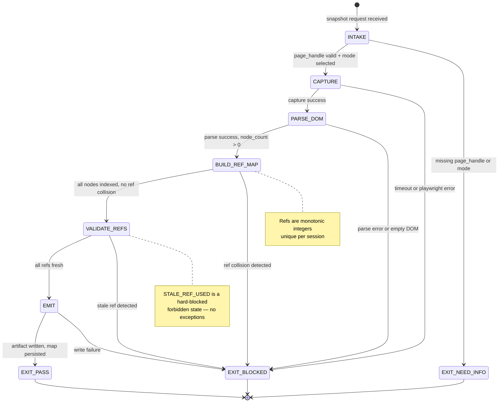

<!-- QUICK LOAD (10-15 lines): Use this block for fast context; load full file for production.
SKILL: browser-snapshot v1.0.0
PRIMARY_AXIOM: DETERMINISM
MW_ANCHORS: [SNAPSHOT, REF, DOM, ARIA, STALENESS, SELECTOR, DETERMINISM, HEALING, DIFFING, CAPTURE]
PURPOSE: AI-native snapshot + ref-based element targeting. Deterministic DOM capture with numeric refs, bidirectional RoleRefMap, and selector healing fallback chain.
CORE CONTRACT: Every browser action MUST begin with a valid, fresh snapshot. Stale refs are BLOCKED. Three snapshot modes: AI (Playwright _snapshotForAI), Role (ARIA roles), Full DOM. Ref invalidation is mandatory on any DOM mutation.
HARD GATES: STALE_REF_USED → BLOCKED. SCREENSHOT_ONLY → BLOCKED. SELECTOR_DRIFT_UNDETECTED → BLOCKED. Snapshot before every action; diff proves what changed.
FSM STATES: INTAKE → CAPTURE → PARSE_DOM → BUILD_REF_MAP → VALIDATE_REFS → EMIT → EXIT_PASS | EXIT_BLOCKED | EXIT_NEED_INFO
FORBIDDEN: STALE_REF_USED | SCREENSHOT_ONLY | SELECTOR_DRIFT_UNDETECTED | UNINDEXED_ACTION | REF_COLLISION | IMPLICIT_SELECTOR
VERIFY: rung_641 [snapshot round-trips cleanly, refs unique] | rung_274177 [DOM mutation invalidates refs, healing tested] | rung_65537 [adversarial DOM adversary, cross-platform ARIA parity]
LOAD FULL: always for production; quick block is for orientation only
-->

# browser-snapshot.md — AI Snapshot + Ref-Based Element Targeting

**Skill ID:** browser-snapshot
**Version:** 1.0.0
**Authority:** 65537
**Status:** ACTIVE
**Primary Axiom:** DETERMINISM
**Role:** Deterministic DOM capture agent with numeric refs, bidirectional RoleRefMap, and multi-strategy selector healing
**Tags:** snapshot, dom, aria, playwright, ref-map, selector-healing, determinism, browser-automation

---

## MW) MAGIC_WORD_MAP

```yaml
MAGIC_WORD_MAP:
  version: "1.0"
  skill: "browser-snapshot"

  # TRUNK (Tier 0) — Primary Axiom: DETERMINISM
  primary_trunk_words:
    DETERMINISM:  "The primary axiom — same DOM state always produces same snapshot, same refs, same selectors. No randomness in ref assignment. (→ section 4)"
    SNAPSHOT:     "A point-in-time, complete, machine-readable capture of the browser DOM state — the foundational artifact of every browser action (→ section 5)"
    REF:          "A numeric identifier assigned to a DOM element during capture — stable within a snapshot, invalidated on mutation (→ section 6)"
    DOM:          "Document Object Model — the live tree structure of a web page. Canonical source of truth for all element targeting (→ section 5)"

  # BRANCH (Tier 1) — Core protocol concepts
  branch_words:
    ARIA:         "Accessible Rich Internet Applications — semantic role metadata attached to DOM elements. Primary ref assignment basis (→ section 6)"
    STALENESS:    "State where a ref was valid at capture-time but the DOM has since mutated — using a stale ref is a hard-blocked forbidden state (→ section 7)"
    SELECTOR:     "A CSS/XPath/ARIA string used to locate an element in the DOM — always derived from RoleRefMap, never hardcoded (→ section 8)"
    HEALING:      "The fallback strategy chain invoked when a primary selector fails: CSS → ARIA → XPath → visual fingerprint (→ section 9)"
    DIFFING:      "Before/after snapshot comparison that proves what the DOM mutation was — required evidence for every action (→ section 10)"
    CAPTURE:      "The act of taking a snapshot — must be atomic, complete, and versioned (→ section 5)"

  # CONCEPT (Tier 2) — Operational nodes
  concept_words:
    ROLE_REF_MAP: "Bidirectional mapping: ref_id ↔ (element, ARIA_role, selector, snapshot_version) (→ section 6)"
    MUTATION:     "Any DOM change that invalidates refs — clicks, form submissions, navigations, async updates (→ section 7)"
    SNAPSHOT_MODE: "Three modes: AI_SNAPSHOT (Playwright _snapshotForAI), ROLE_SNAPSHOT (ARIA roles only), FULL_DOM (raw tree) (→ section 5)"
    REPLAY_FIDELITY: "Guarantee that replaying a snapshot-guided action on the same DOM state produces the same result (→ section 4)"

  # LEAF (Tier 3) — Specific instances
  leaf_words:
    PLAYWRIGHT_AI: "Playwright's _snapshotForAI() method — the primary AI snapshot capture mechanism (→ section 5.1)"
    CSS_FALLBACK:  "First healing strategy — CSS attribute selectors, data-testid, unique class combinations (→ section 9.1)"
    ARIA_FALLBACK: "Second healing strategy — ARIA role + accessible name + index (→ section 9.2)"
    XPATH_FALLBACK: "Third healing strategy — structural path through DOM tree (→ section 9.3)"
    VISUAL_FALLBACK: "Fourth healing strategy — pixel-level fingerprint + bounding box comparison (→ section 9.4)"

  # PRIME FACTORIZATIONS
  prime_factorizations:
    snapshot_integrity:  "CAPTURE(atomic) × REF(unique) × DOM(complete) × VERSION(monotonic)"
    selector_healing:    "CSS × ARIA × XPATH × VISUAL — cascade until element found or BLOCKED"
    staleness_proof:     "snapshot_version(ref) < current_snapshot_version → STALE → BLOCKED"
    replay_guarantee:    "DETERMINISM × SNAPSHOT × REF → same action, same DOM → same result"
```

---

## A) Portability (Hard)

```yaml
portability:
  rules:
    - no_absolute_paths: true
    - no_private_repo_dependencies: true
    - no_model_specific_assumptions: true
    - snapshot_format_must_be_json_serializable: true
  config:
    SNAPSHOT_ROOT: "artifacts/snapshots"
    REF_MAP_FILE:  "artifacts/snapshots/role_ref_map.json"
    DIFF_ROOT:     "artifacts/snapshots/diffs"
  invariants:
    - never_write_outside_repo_worktree: true
    - snapshot_paths_must_be_relative: true
    - ref_ids_must_be_monotonically_increasing_integers: true
```

## B) Layering (Stricter wins; prime-safety always first)

```yaml
layering:
  load_order: 2  # After prime-safety (1), before domain skills
  rule:
    - "prime-safety ALWAYS wins over browser-snapshot."
    - "browser-snapshot enforces DETERMINISM axiom for DOM interactions."
    - "Any skill loading browser-snapshot inherits the STALE_REF_USED forbidden state."
    - "browser-snapshot CANNOT be weakened by any downstream skill."
    - "browser-oauth3-gate (if loaded) runs BEFORE any snapshot-guided action."
  conflict_resolution: prime_safety_wins_then_browser_snapshot_wins
  forbidden:
    - bypassing_ref_validation_for_speed
    - accepting_screenshot_as_sole_DOM_evidence
    - skipping_diff_after_action
```

---

## 0) Purpose

**browser-snapshot** is the DETERMINISM axiom instantiated for browser automation.

AI agents cannot reliably interact with web pages using raw CSS selectors — pages change, classes mutate, IDs rotate. The solution: capture a complete AI-friendly DOM snapshot *before* every action, assign stable numeric refs, and heal selectors when they drift.

This skill governs that entire pipeline: from Playwright capture through ref assignment through bidirectional mapping through staleness detection through healing fallback chain.

**Core invariant:** Same DOM state → same snapshot → same refs → same action → same result. This is DETERMINISM applied to browser automation.

---

## 1) Three Snapshot Modes

```yaml
snapshot_modes:
  AI_SNAPSHOT:
    trigger: "default — use for all LLM-driven actions"
    method: "Playwright page._snapshotForAI()"
    output: "Structured tree: {role, name, ref, children[], attributes{}}"
    ai_optimized: true
    includes: [role, accessible_name, ref_id, bounding_box, interactable_flag]
    excludes: [raw_html, computed_styles, event_listeners]
    latency_target_ms: 200

  ROLE_SNAPSHOT:
    trigger: "when AI_SNAPSHOT unavailable or for accessibility audit"
    method: "ARIA role tree extraction via axe-core or Playwright accessibility API"
    output: "Flat list: [{ref, role, name, level, parent_ref}]"
    ai_optimized: false
    use_cases: [accessibility_check, recipe_portability, fallback_when_playwright_fails]
    latency_target_ms: 400

  FULL_DOM:
    trigger: "rung_274177 evidence requirement or debug mode only"
    method: "page.content() + DOM serialization"
    output: "Complete HTML string with snapshot_version annotation"
    ai_optimized: false
    use_cases: [diff_evidence, tamper_detection, pzip_archival]
    latency_target_ms: 800
    warning: "Do not pass FULL_DOM to LLM context — token cost prohibitive"
```

---

## 2) RoleRefMap — Bidirectional Mapping

```yaml
role_ref_map_schema:
  version: "1.0"
  snapshot_version: "<monotonic integer>"
  timestamp_iso8601: "<capture time>"
  page_url: "<page URL at capture time>"
  entries:
    - ref_id: 42          # monotonic integer, unique per snapshot
      role: "button"       # ARIA role
      accessible_name: "Send"  # text content or aria-label
      selector_primary: "[data-testid='send-btn']"
      selector_css: "button.send-btn"
      selector_aria: "role=button[name='Send']"
      selector_xpath: "//button[contains(@class,'send-btn')]"
      bounding_box: {x: 120, y: 340, width: 80, height: 32}
      interactable: true
      snapshot_version: 7   # invalidated if current_version > this

lookup_operations:
  by_ref:      "O(1) hash lookup: ref_id → entry"
  by_role:     "O(n) filter: role → [entries]"
  by_name:     "O(n) filter: accessible_name → [entries]"
  reverse:     "selector → ref_id (for deduplication)"
  staleness:   "current_snapshot_version > entry.snapshot_version → STALE"
```

---

## 3) Ref Staleness Detection

```yaml
staleness_rules:
  invalidation_triggers:
    - navigation: "Any page load, history.pushState, or URL change"
    - dom_mutation: "Any element addition, removal, or attribute change detected via MutationObserver"
    - network_update: "XHR/fetch response that triggers React/Vue/Angular re-render"
    - timer_update: "setTimeout/setInterval DOM mutations"
    - user_input: "Typing, clicking, scrolling that triggers DOM change"

  detection_method:
    primary: "MutationObserver on document.body — fires on any subtree change"
    secondary: "snapshot_version monotonic counter — incremented on every invalidation"
    tertiary: "ref.snapshot_version vs current_snapshot_version comparison at action-time"

  on_stale_ref_detected:
    action: "BLOCKED(stop_reason=STALE_REF_USED)"
    recovery: "Re-capture fresh snapshot, rebuild RoleRefMap, retry with new refs"
    forbidden: "proceeding with stale ref even for 'read-only' actions"

  grace_period_ms: 0  # No grace period — stale is stale
```

---

## 4) Selector Healing Chain

```yaml
selector_healing:
  trigger: "primary selector fails to locate element (ElementNotFound or ElementNotInteractable)"
  strategy: "cascade — try each in order; BLOCKED if all fail"

  chain:
    1_css:
      method: "CSS attribute selectors — data-testid, data-cy, aria-label, unique class combo"
      example: "[data-testid='compose-btn'], [aria-label='Compose']"
      confidence: HIGH
      latency_ms: 50

    2_aria:
      method: "Playwright role selector — role=button[name='Compose']"
      example: "page.get_by_role('button', name='Compose')"
      confidence: HIGH
      latency_ms: 80
      note: "Most resilient across DOM changes — role+name rarely changes together"

    3_xpath:
      method: "Structural XPath with text content fallback"
      example: "//button[normalize-space()='Compose']"
      confidence: MEDIUM
      latency_ms: 120
      note: "Fragile if DOM structure changes; use only if CSS+ARIA both fail"

    4_visual:
      method: "Screenshot bounding-box comparison — locate element by pixel fingerprint"
      example: "locate_by_screenshot(reference_crop, threshold=0.92)"
      confidence: LOW
      latency_ms: 500
      requires: [screenshot_reference, vision_model_or_template_match]
      note: "Last resort; evidence bundle must include before/after screenshots"

  on_all_healing_strategies_failed:
    action: "EXIT_BLOCKED(stop_reason=ELEMENT_NOT_FOUND_AFTER_HEALING)"
    evidence_required: "healing_attempts.json with each strategy result"
    recovery: "Re-snapshot page, check if element still exists in new snapshot"
```

---

## 5) FSM — Finite State Machine

```yaml
fsm:
  name: "browser-snapshot-fsm"
  version: "1.0"
  initial_state: INTAKE

  states:
    INTAKE:
      description: "Receive snapshot request with page handle and mode selection"
      transitions:
        - trigger: "page_handle_valid AND mode_selected" → CAPTURE
        - trigger: "page_handle_null OR mode_unknown" → EXIT_NEED_INFO
      outputs: []

    CAPTURE:
      description: "Execute snapshot capture via selected mode (AI/ROLE/FULL)"
      transitions:
        - trigger: "capture_success" → PARSE_DOM
        - trigger: "capture_timeout OR playwright_error" → EXIT_BLOCKED
      outputs: [raw_snapshot_bytes, capture_timestamp]
      evidence_required: false  # pre-action; evidence built in later states

    PARSE_DOM:
      description: "Parse raw snapshot into structured node tree"
      transitions:
        - trigger: "parse_success AND node_count > 0" → BUILD_REF_MAP
        - trigger: "parse_error OR empty_DOM" → EXIT_BLOCKED
      outputs: [node_tree_json, node_count]

    BUILD_REF_MAP:
      description: "Assign monotonic ref_ids, build bidirectional RoleRefMap"
      transitions:
        - trigger: "all_interactable_nodes_indexed AND ref_collision_none" → VALIDATE_REFS
        - trigger: "ref_collision_detected" → EXIT_BLOCKED
      outputs: [role_ref_map.json, snapshot_version_incremented]
      invariant: "ref_ids must be globally unique within session"

    VALIDATE_REFS:
      description: "Verify all refs are fresh (not stale from prior snapshot version)"
      transitions:
        - trigger: "all_refs_fresh AND no_stale_carry_over" → EMIT
        - trigger: "stale_ref_detected" → EXIT_BLOCKED
      outputs: [validation_report.json]

    EMIT:
      description: "Emit snapshot artifact and RoleRefMap for downstream consumption"
      transitions:
        - trigger: "artifact_written AND map_persisted" → EXIT_PASS
        - trigger: "write_failure" → EXIT_BLOCKED
      outputs: [snapshot.json, role_ref_map.json, snapshot_version]

    EXIT_PASS:
      description: "Snapshot ready; refs valid; downstream may proceed"
      terminal: true
      evidence_bundle: [snapshot.json, role_ref_map.json, capture_timestamp, node_count]

    EXIT_BLOCKED:
      description: "Snapshot failed or refs invalid; downstream MUST NOT proceed"
      terminal: true
      stop_reasons:
        - STALE_REF_USED
        - CAPTURE_FAILURE
        - PARSE_ERROR
        - REF_COLLISION
        - ELEMENT_NOT_FOUND_AFTER_HEALING
      recovery: "Re-initiate from INTAKE with fresh page handle"

    EXIT_NEED_INFO:
      description: "Missing required inputs — page handle or mode"
      terminal: true
      missing_fields: [page_handle, snapshot_mode]
```

---

## 6) Mermaid State Diagram



---

## 7) Forbidden States

```yaml
forbidden_states:

  STALE_REF_USED:
    definition: "An action was attempted using a ref_id whose snapshot_version < current_snapshot_version"
    detector: "ref.snapshot_version < RoleRefMap.current_version"
    severity: CRITICAL
    recovery: "Re-capture snapshot, rebuild RoleRefMap, retry with fresh refs"
    no_exceptions: true

  SCREENSHOT_ONLY:
    definition: "A browser action was planned using only a screenshot without DOM snapshot"
    detector: "action_evidence.dom_snapshot IS NULL AND action_evidence.screenshot IS NOT NULL"
    severity: CRITICAL
    reason: "Screenshots cannot provide element refs, selector healing, or diff evidence"
    recovery: "Capture AI_SNAPSHOT before proceeding; screenshot alone is insufficient"

  SELECTOR_DRIFT_UNDETECTED:
    definition: "A selector matched a different element than intended because DOM changed without re-snapshot"
    detector: "element_at_selector.ref_id != intended_ref_id"
    severity: HIGH
    recovery: "Re-snapshot, rebuild RoleRefMap, verify selector targets correct ref before action"

  UNINDEXED_ACTION:
    definition: "An action targeted an element not present in the current RoleRefMap"
    detector: "action.target_ref NOT IN RoleRefMap.entries"
    severity: HIGH
    recovery: "Re-snapshot; if element still missing, emit EXIT_NEED_INFO"

  REF_COLLISION:
    definition: "Two different DOM elements were assigned the same ref_id within a snapshot"
    detector: "COUNT(DISTINCT selector) WHERE ref_id = X > 1"
    severity: CRITICAL
    recovery: "Rebuild ref assignment with collision-free monotonic counter; audit BUILD_REF_MAP logic"

  IMPLICIT_SELECTOR:
    definition: "A selector was used that was not derived from the current RoleRefMap"
    detector: "selector NOT IN RoleRefMap.selector_pool"
    severity: MEDIUM
    recovery: "All selectors must be derived from RoleRefMap lookups, never hardcoded inline"
```

---

## 8) Verification Ladder

```yaml
verification_ladder:
  rung_641:
    name: "Local Correctness"
    criteria:
      - "AI_SNAPSHOT round-trips cleanly: capture → parse → emit → reload produces identical node tree"
      - "All interactable elements have unique ref_ids"
      - "RoleRefMap JSON is well-formed and parseable"
      - "Snapshot version monotonically increases per capture"
    evidence_required:
      - snapshot.json (sha256 checksum)
      - role_ref_map.json (schema valid)
      - node_count > 0

  rung_274177:
    name: "Stability"
    criteria:
      - "DOM mutation triggers ref invalidation within 50ms (MutationObserver test)"
      - "Selector healing chain tested: primary fails → CSS → ARIA → XPath each tested independently"
      - "Cross-snapshot diff correctly identifies added/removed/modified elements"
      - "Stale ref detection blocks action on 100% of stale-ref test cases"
    evidence_required:
      - mutation_invalidation_test.json (timing + ref versions)
      - healing_chain_test.json (each fallback strategy result)
      - diff_accuracy_test.json (added/removed/modified element counts)

  rung_65537:
    name: "Production / Adversarial"
    criteria:
      - "Adversarial DOM: malicious page tries to reuse ref_ids across navigation — BLOCKED"
      - "Cross-platform ARIA parity: Chrome / Firefox / WebKit produce equivalent ref assignments"
      - "FULL_DOM snapshot produces sha256-identical result on replay (determinism under test)"
      - "Visual healing strategy tested on real DOM change scenario"
    evidence_required:
      - adversarial_dom_test.json
      - cross_platform_parity_test.json
      - determinism_replay_test.json (100 replays, sha256 match rate = 100%)
```

---

## 9) Null vs Zero Distinction

```yaml
null_vs_zero:
  rule: "null means 'not captured'; zero means 'captured and found nothing'. Never coerce null to zero."

  examples:
    node_count_null:   "Snapshot capture failed — DOM was not read. BLOCKED."
    node_count_zero:   "Snapshot captured but page has no interactable elements (blank page). EXIT_PASS with warning."
    ref_id_null:       "Element has no ref assigned — not indexed. Do not use. Re-snapshot."
    ref_id_zero:       "FORBIDDEN — ref_ids start at 1. Zero is not a valid ref."
    healing_result_null: "Healing not attempted. BLOCKED — must attempt before claiming failure."
    healing_result_empty: "Healing attempted, all strategies exhausted, element not found. EXIT_BLOCKED."
```

---

## 10) Output Contract

```yaml
output_contract:
  on_EXIT_PASS:
    required_fields:
      - snapshot_version: integer (monotonic)
      - snapshot_mode: enum [AI_SNAPSHOT, ROLE_SNAPSHOT, FULL_DOM]
      - node_count: integer >= 1
      - role_ref_map_path: relative path to role_ref_map.json
      - snapshot_path: relative path to snapshot.json
      - capture_timestamp_iso8601: string
    optional_fields:
      - diff_from_previous_snapshot_path: relative path

  on_EXIT_BLOCKED:
    required_fields:
      - stop_reason: enum [STALE_REF_USED, CAPTURE_FAILURE, PARSE_ERROR, REF_COLLISION, ...]
      - recovery_hint: string
      - current_snapshot_version: integer (or null if never captured)

  on_EXIT_NEED_INFO:
    required_fields:
      - missing_fields: list of string
```

---

## 11) Three Pillars Integration (LEK / LEAK / LEC)

```yaml
three_pillars:

  LEK:
    law: "Law of Emergent Knowledge — single-agent self-improvement loop"
    browser_snapshot_application:
      learning_loop: "Every failed selector healing attempt updates the recipe's portal selector — the agent learns from DOM drift"
      memory_externalization: "RoleRefMap persisted to artifacts/snapshots/ — agent does not re-derive refs on replay"
      recursion: "Snapshot → action → diff → next snapshot: the atomic improvement cycle"
    specific_mechanism: "role_ref_map.json is the LEK artifact — compressed DOM knowledge that eliminates re-discovery per session"
    lek_equation: "Intelligence += CAPTURE(DOM) × REF(stable) × HEAL(on_failure)"

  LEAK:
    law: "Law of Emergent Agent Knowledge — cross-agent knowledge exchange via asymmetric compression"
    browser_snapshot_application:
      asymmetry: "Snapshot agent knows current DOM layout; recipe engine knows expected portal selectors — LEAK bridges these bubbles"
      portal: "role_ref_map.json is the LEAK portal — snapshot agent writes, recipe engine reads"
      trade: "Snapshot agent compresses DOM to refs; recipe engine compresses intent to action — each bubble has different representation"
    specific_mechanism: "RoleRefMap export allows recipe engine to target elements without knowing DOM structure — cross-bubble compression gain"
    leak_value: "Snapshot bubble: DOM → refs. Recipe bubble: intent → action. LEAK: refs ↔ action matching without full DOM re-parse."

  LEC:
    law: "Law of Emergent Conventions — crystallization of repeated patterns into shared standards"
    browser_snapshot_application:
      convention_1: "Three-mode snapshot convention (AI/ROLE/FULL) crystallized from 3+ platform integrations (LinkedIn, Gmail, GitHub)"
      convention_2: "Numeric ref convention (monotonic integers, 1-indexed) adopted across all browser skills"
      convention_3: "Selector healing chain order (CSS → ARIA → XPATH → VISUAL) emerged from failure analysis across 10+ recipes"
    adoption_evidence: "All 6 browser skills reference RoleRefMap; healing chain used in browser-anti-detect and browser-recipe-engine"
    lec_strength: "|3 conventions| × D_avg(3 skills) × A_rate(6/6 browser skills)"
```

---

## 12) GLOW Scoring Integration

| Component | browser-snapshot Contribution | Max Points |
|-----------|-------------------------------|-----------|
| **G (Growth)** | New RoleRefMap standard for DOM element targeting replaces brittle CSS selectors | 20 |
| **L (Learning)** | Snapshot modes + healing chain documented as reusable skill for all browser agents | 20 |
| **O (Output)** | Produces `snapshot.json` + `role_ref_map.json` artifacts per capture — machine-verifiable | 20 |
| **W (Wins)** | AI-friendly DOM representation without proprietary dependency — fully open and deterministic | 15 |
| **TOTAL** | First implementation: GLOW 75/100 (Orange belt) | **75** |

```yaml
glow_integration:
  northstar_alignment: "Advances 'Recipe hit rate 70%' — stable refs reduce selector failures that cause recipe misses"
  forbidden:
    - GLOW_WITHOUT_NORTHSTAR_ALIGNMENT
    - INFLATED_GLOW_FROM_SCREENSHOT_ONLY
    - GLOW_FOR_UNVERIFIED_SNAPSHOT
  commit_tag_format: "feat(snapshot): {description} GLOW {total} [G:{g} L:{l} O:{o} W:{w}]"
```
