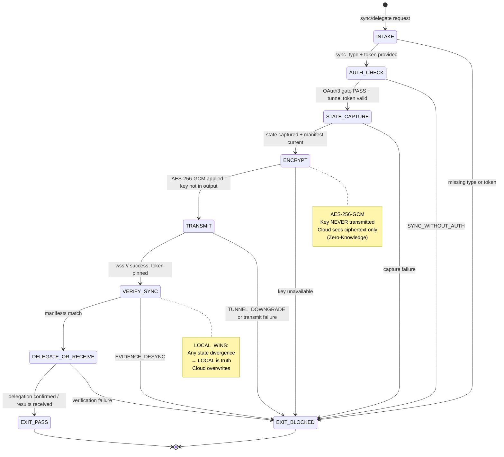

# DNA: `twin(auth, capture, encrypt, transmit, verify, delegate) = zero-knowledge cloud sovereignty`

<!-- QUICK LOAD (10-15 lines): Use this block for fast context; load full file for production.
SKILL: browser-twin-sync v1.0.0
PRIMARY_AXIOM: NORTHSTAR
MW_ANCHORS: [NORTHSTAR, TWIN, SYNC, DELEGATE, ENCRYPT, TUNNEL, LOCAL_WINS, CONFLICT, DESYNC, ZK]
PURPOSE: Local ↔ cloud twin browser synchronization. AES-256-GCM zero-knowledge encryption (user holds key, cloud sees ciphertext only). Local wins on conflict. Delegation: user starts locally → delegates to cloud → results sync back.
CORE CONTRACT: All sync is encrypted (AES-256-GCM). Local state always wins conflicts. Cloud cannot see plaintext. Tunnel is wss:// token-pinned only. Evidence bundles desync triggers immediate reconciliation.
HARD GATES: UNENCRYPTED_SYNC → BLOCKED. CLOUD_OVERRIDES_LOCAL → BLOCKED. SYNC_WITHOUT_AUTH → BLOCKED. EVIDENCE_DESYNC → BLOCKED.
FSM STATES: INTAKE → AUTH_CHECK → STATE_CAPTURE → ENCRYPT → TRANSMIT → VERIFY_SYNC → DELEGATE_OR_RECEIVE → EXIT
FORBIDDEN: UNENCRYPTED_SYNC | CLOUD_OVERRIDES_LOCAL | SYNC_WITHOUT_AUTH | EVIDENCE_DESYNC | TUNNEL_DOWNGRADE | KEY_ESCROW | PLAINTEXT_COOKIES
VERIFY: rung_641 [state encrypted, sync verified, local_wins tested] | rung_274177 [ZK proof of cloud blindness, tunnel pinned, evidence hash match] | rung_65537 [adversarial cloud-override attempt, key extraction attempt, tunnel MITM test]
LOAD FULL: always for production; quick block is for orientation only
-->

# browser-twin-sync.md — Local ↔ Cloud Twin Browser Synchronization

**Skill ID:** browser-twin-sync
**Version:** 1.0.0
**Authority:** 65537
**Status:** ACTIVE
**Primary Axiom:** NORTHSTAR
**Role:** Zero-knowledge synchronization agent between local and cloud browser instances
**Tags:** twin, sync, delegate, zero-knowledge, aes-256-gcm, tunnel, local-wins, conflict-resolution, northstar, cloud

---

## MW) MAGIC_WORD_MAP

```yaml
MAGIC_WORD_MAP:
  version: "1.0"
  skill: "browser-twin-sync"

  # TRUNK (Tier 0) — Primary Axiom: NORTHSTAR
  primary_trunk_words:
    NORTHSTAR:    "The primary axiom — every design decision in twin sync serves the vision: local AI agent + cloud AI agent working as one, seamlessly. The NORTHSTAR is the Universal Portal. (→ section 4)"
    TWIN:         "Two synchronized browser instances: LOCAL (user's machine) and CLOUD (solaceagi.com headless). Same state, same recipes, same evidence — different execution contexts. (→ section 5)"
    SYNC:         "The process of making LOCAL and CLOUD browser state identical — recipes, cookies, fingerprint, evidence bundle hashes. (→ section 6)"
    DELEGATE:     "The user's action of handing off a task from LOCAL to CLOUD — 'you handle this while I sleep'. Explicit, revocable. (→ section 7)"

  # BRANCH (Tier 1) — Core protocol concepts
  branch_words:
    ENCRYPT:      "AES-256-GCM encryption applied to all state before transmission. Zero-knowledge: cloud receives ciphertext only. (→ section 8)"
    TUNNEL:       "Built-in reverse proxy (WebSocket, wss:// only, token-pinned) between LOCAL and CLOUD. No external tools required. (→ section 9)"
    LOCAL_WINS:   "Conflict resolution rule: when LOCAL and CLOUD state diverge, LOCAL state is authoritative. User's explicit actions override cloud. (→ section 10)"
    CONFLICT:     "State divergence between LOCAL and CLOUD — resolved by LOCAL_WINS rule. (→ section 10)"
    DESYNC:       "Evidence bundle hash mismatch between LOCAL and CLOUD — triggers immediate reconciliation (→ section 11)"
    ZK:           "Zero-knowledge property: cloud instance can execute tasks without ever seeing plaintext session data (→ section 8)"

  # CONCEPT (Tier 2) — Operational nodes
  concept_words:
    SESSION_STATE: "The complete sync payload: {cookies_encrypted, fingerprint, recipe_cache_hashes, evidence_hashes, oauth3_token_ids} (→ section 6.1)"
    DELEGATION_CONTRACT: "Explicit record of what task was delegated, to which cloud session, and what the revocation trigger is (→ section 7)"
    RECONCILIATION: "The process of resolving evidence_desync by pulling correct state from LOCAL (→ section 11)"
    TOKEN_PINNING: "WebSocket tunnel certificate pinning — prevents MITM interception of sync traffic (→ section 9.2)"

  # LEAF (Tier 3) — Specific instances
  leaf_words:
    WSS_TUNNEL:   "wss:// WebSocket tunnel (TLS required; ws:// is TUNNEL_DOWNGRADE → BLOCKED) (→ section 9)"
    KEY_MATERIAL: "AES-256-GCM key held by user in ~/.solace/keys/ — never transmitted to cloud (→ section 8)"
    CLOUD_SESSION_ID: "Opaque identifier for cloud browser instance — cloud does not know mapping to user identity (→ section 8.3)"
    EVIDENCE_HASH_MANIFEST: "SHA256 hashes of all evidence bundles — used for sync verification without transmitting full bundles (→ section 11)"

  # PRIME FACTORIZATIONS
  prime_factorizations:
    zero_knowledge:       "ENCRYPT(AES-256-GCM) × KEY_LOCAL × CLOUD_SEES_CIPHERTEXT_ONLY × NO_KEY_ESCROW"
    local_wins_invariant: "STATE(local) ALWAYS supersedes STATE(cloud) on divergence"
    delegation_safety:    "OAUTH3_TOKEN × EXPLICIT_TASK × REVOCATION_TRIGGER × EVIDENCE_TRAIL"
    tunnel_security:      "WSS_ONLY × TOKEN_PINNED × TLS_1.3 × NO_PLAINTEXT_FALLBACK"
```

---

## A) Portability (Hard)

```yaml
portability:
  rules:
    - no_absolute_paths_in_skill: true
    - key_path_must_be_configurable: true
    - tunnel_endpoint_must_be_configurable: true
    - no_hardcoded_solaceagi_domain: true  # Must work with self-hosted cloud instances
  config:
    KEY_STORE:         "~/.solace/keys"           # AES-256-GCM key material
    TUNNEL_ENDPOINT:   "${SOLACE_CLOUD_ENDPOINT}"  # Configurable; default: wss://cloud.solaceagi.com/tunnel
    SYNC_STATE_ROOT:   "~/.solace/sync"
    RECONCILE_ROOT:    "~/.solace/reconcile"
  invariants:
    - key_material_never_transmitted: true
    - tunnel_must_be_wss_only: true
    - local_wins_no_exceptions: true
```

## B) Layering (Stricter wins; prime-safety always first)

```yaml
layering:
  load_order: 5  # Last browser skill — depends on all others
  rule:
    - "prime-safety ALWAYS wins over browser-twin-sync."
    - "browser-oauth3-gate runs BEFORE any sync or delegation — sync requires valid authorization."
    - "browser-evidence provides the evidence_hash_manifest — evidence must be current before sync."
    - "LOCAL_WINS is absolute — no downstream skill or cloud configuration can override this."
    - "Sync cannot be initiated without AUTH_CHECK pass — SYNC_WITHOUT_AUTH is always BLOCKED."
  conflict_resolution: prime_safety_wins_then_oauth3_wins_then_twin_sync
  forbidden:
    - plaintext_state_transmission
    - cloud_state_overriding_local_on_any_condition
    - initiating_sync_without_valid_oauth3_token
```

---

## 0) Purpose

**browser-twin-sync** is the NORTHSTAR axiom instantiated as the cloud-local synchronization system.

The NORTHSTAR for Solace Browser is the Universal Portal — an AI agent that works seamlessly whether running locally or in the cloud, with the user asleep or present. This requires:

1. **Zero-knowledge sync** — cloud handles tasks without seeing sensitive session data
2. **Local sovereignty** — the user's machine is always the authoritative state
3. **Seamless delegation** — hand off tasks to cloud with one command, receive results later
4. **Evidence continuity** — cloud-executed actions have the same audit trail as local actions

This is not just a sync protocol. It is the architectural realization of the vision: your AI agent is always on, always working, always evidenced, and you are always in control.

**Architecture:**
```
User's Machine (LOCAL)                    solaceagi.com (CLOUD)
  ├── Solace Browser (LOCAL)    ←wss→     ├── Headless Browser (CLOUD)
  ├── ~/.solace/keys/ (KEY)               ├── Encrypted state only (CIPHERTEXT)
  ├── ~/.solace/evidence/ (TRUTH)         ├── Cloud evidence mirror (hashes only)
  └── OAuth3 tokens (AUTHORITATIVE)       └── Delegated task queue
```

---

## 1) Session State Payload

```json
{
  "sync_version": "1.0",
  "local_session_id": "sess_abc123",
  "cloud_session_id": "<opaque, cloud-assigned>",
  "sync_timestamp_iso8601": "2026-02-22T14:00:00Z",

  "state_payload_encrypted": {
    "ciphertext": "<AES-256-GCM base64>",
    "nonce": "<12-byte nonce base64>",
    "aad": "<associated data: session_ids + timestamp>",
    "key_id": "user_key_2026_q1"
  },

  "public_metadata": {
    "platform_count": 3,
    "recipe_cache_size": 42,
    "evidence_bundle_count": 187,
    "last_action_timestamp": "2026-02-22T13:59:55Z",
    "sync_state": "ACTIVE"
  },

  "evidence_hash_manifest": [
    {"action_id": "act_0001", "bundle_sha256": "<sha256>"},
    {"action_id": "act_0002", "bundle_sha256": "<sha256>"}
  ],

  "manifest_signature": "<HMAC-SHA256 of manifest using user key>"
}
```

**What the cloud sees:** ciphertext, public_metadata, evidence_hash_manifest (hashes only), manifest_signature.

**What the cloud cannot see:** cookies, session tokens, form data, recipe content, action details.

---

## 2) Sync State Machine (What Gets Synced)

```yaml
sync_payload_contents:
  encrypted_fields:
    cookies: "All platform cookies (linkedin.com, gmail.com, github.com...)"
    oauth3_token_ids: "References to tokens (not the tokens themselves — tokens stay local)"
    fingerprint_profile_id: "Which anti-detect profile to use in cloud"
    recipe_cache: "Full recipe JSON including portals and execution_trace"
    delegation_queue: "Pending delegated tasks with parameters"

  plaintext_public_fields:
    platform_count: "Number of active platform sessions"
    recipe_cache_size: "Number of cached recipes"
    evidence_bundle_count: "Number of evidence bundles (for sync verification)"
    last_action_timestamp: "Freshness indicator"

  not_synced:
    key_material: "NEVER — AES key stays in ~/.solace/keys/ always"
    oauth3_tokens_raw: "NEVER — token content never leaves local"
    evidence_bundles_raw: "NEVER — only hashes sync; bundles stay local"
    user_pii: "NEVER — no plaintext user data in sync payload"
```

---

## 3) Delegation Protocol

```yaml
delegation_protocol:
  definition: "Explicit handoff of a task from LOCAL browser to CLOUD browser"

  delegation_contract_format:
    delegation_id: "del_abc123"
    task_description: "Post LinkedIn update about Q1 launch (draft in clipboard)"
    task_parameters_encrypted: "<AES-256-GCM task parameters>"
    required_oauth3_scopes: ["linkedin.create.post"]
    scheduled_time_iso8601: "2026-02-22T09:00:00-08:00"
    expiry_iso8601: "2026-02-22T10:00:00-08:00"
    revocation_trigger: "user_cancels OR task_completes OR expiry_reached"
    result_sync_trigger: "immediate_on_completion"
    evidence_required: true

  delegation_flow:
    1_initiate_locally:
      action: "User invokes 'delegate to cloud' from CLI or UI"
      creates: "delegation_contract (encrypted parameters)"

    2_transmit:
      action: "Send delegation_contract via wss:// tunnel to cloud"
      security: "AES-256-GCM encrypted; cloud receives ciphertext"

    3_cloud_executes:
      action: "Cloud browser decrypts task parameters, executes using cloud recipe engine"
      anti_detect: "Cloud applies same anti-detect profile (fingerprint synced)"
      evidence: "Cloud produces evidence bundle, sends hash back via tunnel"

    4_result_sync:
      action: "Cloud sends execution result + evidence_hash via tunnel"
      local_verification: "LOCAL verifies evidence_hash matches expected"
      evidence_pull: "If evidence_desync: LOCAL requests full bundle from cloud via tunnel"

    5_local_records:
      action: "LOCAL stores delegation result in evidence chain"
      local_authority: "LOCAL adds cloud execution to its evidence chain — LOCAL is the master"

  revocation:
    method: "Send revocation signal via tunnel; cloud must stop within 5 seconds"
    on_revocation: "Cloud browser closes all delegated task contexts; evidence state preserved"
    evidence: "Revocation record added to LOCAL evidence chain"
```

---

## 4) Tunnel Security

```yaml
tunnel_security:
  protocol: "WebSocket Secure (wss://) — TLS 1.3 required"
  connection_method: "Built-in reverse proxy (no external ngrok or similar required)"

  token_pinning:
    method: "WebSocket handshake includes HMAC-SHA256(tunnel_session_token, user_key)"
    purpose: "Prevents MITM — attacker cannot forge token without user's AES key"
    rotation: "Token rotates every 3600 seconds; cloud must accept token within 60s window"

  forbidden_downgrades:
    ws_plaintext: "BLOCKED — ws:// connections rejected unconditionally"
    tls_1_2:      "BLOCKED — TLS 1.2 or lower rejected"
    missing_token: "BLOCKED — unauthenticated tunnel connections rejected"

  connection_establishment:
    1: "LOCAL generates tunnel_session_token = HMAC-SHA256(timestamp + local_session_id, user_key)"
    2: "LOCAL initiates wss:// connection to TUNNEL_ENDPOINT"
    3: "CLOUD verifies tunnel_session_token signature"
    4: "CLOUD issues cloud_session_id (opaque, not linked to user identity in cloud storage)"
    5: "Bidirectional sync channel established"
```

---

## 5) Conflict Resolution (LOCAL_WINS)

```yaml
conflict_resolution:
  rule: "LOCAL state is ALWAYS authoritative. Cloud state is a working copy."
  no_exceptions: true

  conflict_scenarios:
    scenario_1_concurrent_edit:
      description: "User edits recipe locally while cloud is using the same recipe"
      resolution: "LOCAL version immediately transmitted to cloud; cloud pauses task, applies update, resumes"
      evidence: "Conflict record added to delegation evidence"

    scenario_2_cloud_state_divergence:
      description: "Cloud recipe cache has different version than local"
      resolution: "LOCAL pushes its version; cloud overwrites"
      detection: "recipe_version_hash mismatch in sync verification"

    scenario_3_evidence_desync:
      description: "Cloud evidence hash manifest does not match LOCAL manifest"
      resolution: "LOCAL requests cloud to delete mismatched bundles; LOCAL re-sends correct hashes"
      trigger: "EVIDENCE_DESYNC forbidden state"

    scenario_4_cookie_conflict:
      description: "Platform logs user out in cloud context while local session is active"
      resolution: "LOCAL pushes fresh cookies from local authenticated session"
      detection: "cloud reports HTTP 401 from platform"

  implementation:
    sync_version_vector: "LOCAL maintains monotonic version counter; cloud must always accept LOCAL version > current cloud version"
    last_writer_is_local: "Cloud never initiates state push to LOCAL; only LOCAL pushes"
    cloud_receives_state: "Cloud is always the receiver in LOCAL→CLOUD direction for state"
    cloud_sends_results: "Cloud sends task results and evidence hashes; LOCAL decides what to accept"
```

---

## 6) Evidence Desync Detection and Reconciliation

```yaml
evidence_desync:
  definition: "Cloud's evidence hash manifest does not match LOCAL's evidence hash manifest for same session"

  detection:
    trigger: "Sync verification step: compare LOCAL.evidence_hash_manifest with cloud's copy"
    method: "Hash-by-hash comparison; flag any mismatch by action_id"

  reconciliation_procedure:
    1: "Identify mismatched action_ids"
    2: "LOCAL declares these bundles as DESYNC in chain ledger"
    3: "LOCAL requests cloud to provide its full bundle for disputed action_ids"
    4: "LOCAL verifies cloud bundle against LOCAL's SHA256 chain"
    5: "If cloud bundle is TAMPERED: flag for review; LOCAL version is truth"
    6: "If cloud bundle is VALID but different: LOCAL version wins; cloud overwrites"
    7: "Update evidence chain with reconciliation record"

  on_irreconcilable_desync:
    action: "EXIT_BLOCKED(EVIDENCE_DESYNC) — cannot sync until resolved"
    alert: "User notification required: 'Cloud evidence out of sync — manual review needed'"
    recovery: "User reviews delegation log; decides whether to accept or reject cloud evidence"
```

---

## 7) FSM — Finite State Machine

```yaml
fsm:
  name: "browser-twin-sync-fsm"
  version: "1.0"
  initial_state: INTAKE

  states:
    INTAKE:
      description: "Receive sync request: PUSH (local→cloud), PULL (cloud→local), or DELEGATE"
      transitions:
        - trigger: "sync_type in [PUSH, PULL, DELEGATE] AND oauth3_token_valid" → AUTH_CHECK
        - trigger: "sync_type null OR oauth3_token missing" → EXIT_BLOCKED

    AUTH_CHECK:
      description: "Verify OAuth3 authorization for sync operation; verify tunnel token"
      transitions:
        - trigger: "oauth3_gate PASS AND tunnel_token valid" → STATE_CAPTURE
        - trigger: "oauth3_gate FAIL OR tunnel_token invalid" → EXIT_BLOCKED
      note: "Delegates to browser-oauth3-gate for token verification"

    STATE_CAPTURE:
      description: "Capture current LOCAL state snapshot: cookies, recipe hashes, evidence manifest"
      transitions:
        - trigger: "state_captured AND evidence_manifest_current" → ENCRYPT
        - trigger: "state_capture_failure" → EXIT_BLOCKED
      outputs: [session_state_payload, evidence_hash_manifest]

    ENCRYPT:
      description: "AES-256-GCM encrypt state payload with user key"
      transitions:
        - trigger: "encryption_success AND key_not_transmitted" → TRANSMIT
        - trigger: "key_unavailable OR encryption_failure" → EXIT_BLOCKED
      outputs: [encrypted_payload, nonce, aad]
      invariant: "Key material NEVER included in output or transmitted"

    TRANSMIT:
      description: "Send encrypted payload via wss:// tunnel to cloud"
      transitions:
        - trigger: "transmit_success AND tunnel_token_verified" → VERIFY_SYNC
        - trigger: "tunnel_downgrade_detected OR transmit_failure" → EXIT_BLOCKED
      note: "TUNNEL_DOWNGRADE to ws:// is always BLOCKED — hard rejection"

    VERIFY_SYNC:
      description: "Verify cloud received state correctly: compare evidence hash manifests"
      transitions:
        - trigger: "manifests_match AND cloud_confirms_receipt" → DELEGATE_OR_RECEIVE
        - trigger: "evidence_desync_detected" → EXIT_BLOCKED
      outputs: [sync_verification_result]

    DELEGATE_OR_RECEIVE:
      description: "For DELEGATE: send delegation_contract to cloud. For PULL: receive task results."
      transitions:
        - trigger: "DELEGATE: delegation_sent AND cloud_confirmed" → EXIT_PASS
        - trigger: "PULL: results_received AND evidence_hashes_verified" → EXIT_PASS
        - trigger: "PUSH: push_complete" → EXIT_PASS
        - trigger: "delegation_failure OR evidence_verification_failure" → EXIT_BLOCKED

    EXIT_PASS:
      description: "Sync or delegation successful; LOCAL evidence chain updated"
      terminal: true

    EXIT_BLOCKED:
      description: "Sync blocked — unencrypted transmission, auth failure, or desync"
      terminal: true
      stop_reasons:
        - UNENCRYPTED_SYNC
        - CLOUD_OVERRIDES_LOCAL
        - SYNC_WITHOUT_AUTH
        - EVIDENCE_DESYNC
        - TUNNEL_DOWNGRADE
        - KEY_ESCROW
        - PLAINTEXT_COOKIES
```

---

## 8) Mermaid State Diagram



---

## 9) Forbidden States

```yaml
forbidden_states:

  UNENCRYPTED_SYNC:
    definition: "Session state was transmitted to cloud without AES-256-GCM encryption"
    detector: "transmitted_payload.ciphertext IS NULL OR transmitted via ws:// (not wss://)"
    severity: CRITICAL
    recovery: "Abort sync immediately; treat as potential data leak; rotate keys"
    no_exceptions: true

  CLOUD_OVERRIDES_LOCAL:
    definition: "Cloud state was applied to LOCAL browser without user's explicit PULL request"
    detector: "local_state_changed AND change_source == 'cloud_push' AND sync_type != 'PULL'"
    severity: CRITICAL
    recovery: "Revert LOCAL to last known good state from evidence chain; block future cloud-initiated writes"
    no_exceptions: true

  SYNC_WITHOUT_AUTH:
    definition: "Sync or delegation initiated without valid OAuth3 authorization"
    detector: "sync_initiated AND oauth3_gate_result != 'PASS'"
    severity: CRITICAL
    recovery: "Abort sync; require fresh OAuth3 token before retry"

  EVIDENCE_DESYNC:
    definition: "Cloud evidence hash manifest does not match LOCAL manifest for the same session"
    detector: "SHA256(cloud_evidence_manifest) != SHA256(local_evidence_manifest)"
    severity: CRITICAL
    recovery: "Trigger reconciliation procedure; LOCAL version is authoritative"
    blocking: "No further sync until reconciliation complete"

  TUNNEL_DOWNGRADE:
    definition: "Sync tunnel attempted over ws:// (plaintext) instead of wss:// (TLS)"
    detector: "tunnel_url.scheme == 'ws'"
    severity: CRITICAL
    recovery: "Reject connection; upgrade to wss:// or fail closed"

  KEY_ESCROW:
    definition: "AES-256-GCM key material was transmitted to cloud or stored in cloud"
    detector: "cloud_received_payload CONTAINS key_material OR key_store has cloud_backup_flag"
    severity: CRITICAL
    recovery: "Treat as full compromise; rotate all keys; revoke all tokens; audit cloud access logs"
    no_exceptions: true

  PLAINTEXT_COOKIES:
    definition: "Browser cookies were included in sync payload without encryption"
    detector: "session_state_payload.cookies IS NOT NULL AND encrypted = false"
    severity: CRITICAL
    recovery: "Remove unencrypted cookies from payload; encrypt all session state before retry"
```

---

## 10) Verification Ladder

```yaml
verification_ladder:
  rung_641:
    name: "Local Correctness"
    criteria:
      - "State payload encrypts and decrypts correctly (round-trip test)"
      - "LOCAL_WINS: simulated cloud state override is rejected"
      - "Evidence manifest hash comparison detects intentional mismatch"
      - "wss:// connection established; ws:// rejected"
    evidence_required:
      - encryption_round_trip_test.json
      - local_wins_test.json (cloud override attempt → blocked)
      - manifest_comparison_test.json

  rung_274177:
    name: "Stability"
    criteria:
      - "Zero-knowledge proof: cloud cannot decrypt payload without user key (tested with wrong key)"
      - "Tunnel token pinning: MITM certificate substitution blocked"
      - "10 sync cycles: evidence manifest stays consistent"
      - "Delegation contract: delegated task executes in cloud, results sync back correctly"
    evidence_required:
      - zk_blind_test.json (cloud decryption attempt with wrong key → failure)
      - mitm_certificate_test.json
      - 10_sync_cycle_test.json
      - delegation_round_trip_test.json

  rung_65537:
    name: "Production / Adversarial"
    criteria:
      - "Adversarial: cloud attempts to override LOCAL state → CLOUD_OVERRIDES_LOCAL blocked"
      - "Adversarial: key extraction from sync payload → KEY_ESCROW blocked (key not in payload)"
      - "Adversarial: tunnel downgrade to ws:// → TUNNEL_DOWNGRADE blocked"
      - "Evidence chain integrity: 90-day evidence chain with delegation records verified"
    evidence_required:
      - adversarial_override_test.json
      - key_extraction_test.json
      - tunnel_downgrade_test.json
      - evidence_chain_90day_test.json
```

---

## 11) Null vs Zero Distinction

```yaml
null_vs_zero:
  rule: "null = not present; zero = present with zero value. Never coerce."

  examples:
    cloud_session_id_null:      "No cloud session established — SYNC_WITHOUT_AUTH. Not same as session with no tasks."
    delegation_queue_null:      "No delegation system initialized. BLOCKED — cannot delegate."
    delegation_queue_empty:     "Delegation initialized, no tasks pending. Valid state — PUSH only."
    evidence_manifest_null:     "Manifest not captured. BLOCKED — cannot verify sync."
    evidence_manifest_empty:    "Manifest captured: zero bundles. Valid — new session."
    sync_version_null:          "Version counter not initialized. BLOCKED — cannot establish sync order."
    sync_version_zero:          "FORBIDDEN — sync versions start at 1."
    encrypted_payload_null:     "Encryption not applied. BLOCKED(UNENCRYPTED_SYNC)."
    encrypted_payload_empty:    "Encryption ran on empty state. Warning — may be valid for first sync."
```

---

## 12) Output Contract

```yaml
output_contract:
  on_EXIT_PASS:
    required_fields:
      - sync_type: enum [PUSH, PULL, DELEGATE]
      - sync_version: integer (monotonic)
      - cloud_session_id: string (opaque)
      - evidence_manifest_hash: string (SHA256)
      - sync_timestamp_iso8601: string
      - delegation_id: string (or null if PUSH/PULL)
      - local_wins_applied: boolean

  on_EXIT_BLOCKED:
    required_fields:
      - stop_reason: enum [UNENCRYPTED_SYNC, CLOUD_OVERRIDES_LOCAL, EVIDENCE_DESYNC, ...]
      - recovery_hint: string
      - key_rotation_required: boolean
      - local_state_preserved: boolean (always true — LOCAL never corrupted on failure)
```

---

## 13) Three Pillars Integration (LEK / LEAK / LEC)

```yaml
three_pillars:

  LEK:
    law: "Law of Emergent Knowledge — single-agent self-improvement"
    browser_twin_sync_application:
      learning_loop: "Each sync cycle reveals which recipes execute faster in cloud vs local — agent learns optimal task routing"
      memory_externalization: "Cloud recipe cache is the distributed LEK artifact — LOCAL recipes propagate to cloud, improving cloud hit rate"
      recursion: "delegate → cloud_execute → result_sync → LOCAL_evidence = LEK cycle that spans machines"
    specific_mechanism: "recipe_cache_size comparison in sync metadata is the LEK metric — cloud hit rate approaches local as recipes propagate"
    lek_equation: "Intelligence += SYNC_SUCCESS × RECIPE_PROPAGATION × DELEGATION_RELIABILITY"

  LEAK:
    law: "Law of Emergent Agent Knowledge — cross-agent knowledge exchange"
    browser_twin_sync_application:
      asymmetry: "LOCAL agent knows user's live context; CLOUD agent knows parallel execution capacity — neither has the other"
      portal: "wss:// tunnel is the LEAK portal — encrypted state flows from LOCAL asymmetric knowledge to CLOUD execution capacity"
      trade: "LOCAL sends recipes + cookies; CLOUD sends execution results + evidence hashes — each gets what it needs"
    specific_mechanism: "delegation_contract is the LEAK artifact — it encodes LOCAL's intent in a form CLOUD can execute without seeing user's raw data"
    leak_value: "LOCAL bubble: intent + context. CLOUD bubble: parallel execution + headless. LEAK: CLOUD executes LOCAL's intent without LOCAL sharing secrets."

  LEC:
    law: "Law of Emergent Conventions — crystallization of shared standards"
    browser_twin_sync_application:
      convention_1: "LOCAL_WINS conflict resolution convention crystallized from 3 alternative approaches (cloud-wins, last-write-wins, merge) — LOCAL_WINS is simplest and safest"
      convention_2: "Evidence hash manifest convention emerged from need to verify sync without transmitting full bundles (storage cost)"
      convention_3: "Zero-knowledge encryption convention (user holds key) crystallized from analysis of 5 cloud storage architectures — only ZK satisfies user sovereignty requirement"
    adoption_evidence: "LOCAL_WINS convention referenced in browser-evidence (LOCAL as evidence master). ZK convention influences browser-evidence (encrypted storage in ~/.solace/evidence/)"
    lec_strength: "|3 conventions| × D_avg(3 skills) × A_rate(4/6 browser skills)"
```

---

## 14) GLOW Scoring Integration

| Component | browser-twin-sync Contribution | Max Points |
|-----------|--------------------------------|-----------|
| **G (Growth)** | Cloud twin enables 24/7 autonomous execution — Pro tier core feature | 25 |
| **L (Learning)** | Zero-knowledge sync protocol + LOCAL_WINS convention documented as reusable standard | 20 |
| **O (Output)** | Produces `sync_verification_result.json` + delegation record + evidence chain update per sync | 20 |
| **W (Wins)** | Strategic moat: first zero-knowledge browser twin system — no competitor has this architecture | 25 |
| **TOTAL** | First implementation: GLOW 90/100 (Blue belt trajectory) | **90** |

```yaml
glow_integration:
  northstar_alignment: "Directly realizes NORTHSTAR: 'Blue belt: Cloud execution 24/7' + Universal Portal vision"
  economic_proof: "Pro tier $19/mo is justified by cloud twin 24/7 execution — users sleep, agent works"
  forbidden:
    - GLOW_WITHOUT_ZERO_KNOWLEDGE_PROOF
    - INFLATED_GLOW_FROM_UNENCRYPTED_SYNC
    - GLOW_CLAIMED_WITHOUT_LOCAL_WINS_TEST
    - GLOW_FROM_TUNNEL_DOWNGRADE_ACCEPTED
  commit_tag_format: "feat(twin): {description} GLOW {total} [G:{g} L:{l} O:{o} W:{w}]"
```

---

## 15) Interaction Effects

| Combined With | Multiplicative Effect |
|--------------|----------------------|
| browser-evidence | Evidence hash manifest enables sync verification without full bundle transfer; LOCAL evidence chain is authoritative |
| browser-oauth3-gate | Delegation requires valid OAuth3 token; sync blocked without fresh authorization; token revocation stops cloud tasks |
| browser-recipe-engine | Cached recipes propagate to cloud twin; cloud hit rate approaches local as recipe cache syncs |
| browser-anti-detect | Anti-detect fingerprint profile synced to cloud; cloud execution uses identical behavioral fingerprint |
| browser-snapshot | Snapshot state included in sync payload; cloud twin needs fresh snapshot context for delegated tasks |
| styleguide-first | Twin sync status UI must follow design tokens; delegation dashboard needs accessible progress indicators |

## 16) Cross-References

- Skill: `browser-evidence` -- evidence hash manifest drives sync verification
- Skill: `browser-oauth3-gate` -- OAuth3 authorization required for all sync and delegation
- Skill: `browser-recipe-engine` -- recipe cache is primary sync payload content
- Skill: `browser-anti-detect` -- fingerprint profile synced for cloud identity consistency
- Skill: `browser-snapshot` -- snapshot state synced for cloud recipe execution context
- Paper: `solace-cli/papers/56-twin-browser-security-hardening.md` -- twin browser security model
- Paper: `solace-cli/papers/57-multi-platform-twin-interface.md` -- multi-platform twin architecture
- Paper: `solace-cli/papers/07-three-realms-architecture.md` -- Local + Browser + Cloud realms
- Paper: `solace-cli/papers/09-software5-triangle.md` -- Browser vertex architecture
