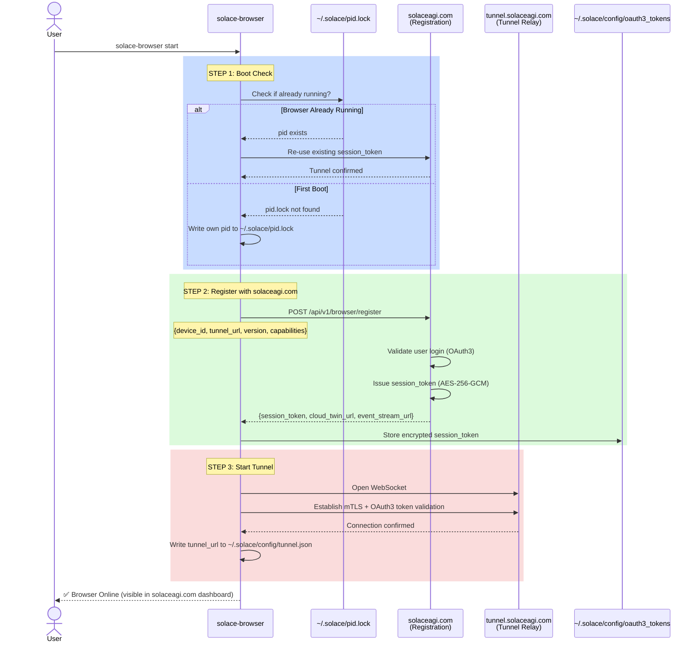

# Browser Startup Sequence (Q1 — 3-Step Boot)

Canonical architecture for `solace-browser start`

## Mermaid Diagram



## Detailed Spec

### Step 1: Boot Check
- **File:** `~/.solace/pid.lock`
- **Logic:**
  - If `pid.lock` exists → browser already running → skip to tunnel reconnection
  - If `pid.lock` missing → first boot → write own PID
- **Output:** Browser identifier (PID or device_id)

### Step 2: Register with solaceagi.com
- **Endpoint:** `POST /api/v1/browser/register`
- **Request Payload:**
  ```json
  {
    "device_id": "device_abc123",
    "tunnel_url": "https://tunnel.solaceagi.com/browser/device_abc123",
    "version": "1.0.0",
    "capabilities": ["navigate", "click", "fill", "screenshot"]
  }
  ```
- **Response Payload:**
  ```json
  {
    "session_token": "oauth3_token_xyz789",
    "cloud_twin_url": "https://cloud-twin-123.run.app",
    "event_stream_url": "wss://events.solaceagi.com/device_abc123"
  }
  ```
- **Storage:** Encrypted in `~/.solace/config/oauth3_tokens` (AES-256-GCM, key from system keyring)
- **Timing:** ~15 seconds (includes OAuth3 validation)

### Step 3: Start Tunnel
- **Protocol:** WebSocket + mTLS (mutual TLS with OAuth3 token as bearer)
- **Endpoint:** `wss://tunnel.solaceagi.com/browser`
- **Headers:** `Authorization: Bearer <session_token>`
- **Security:** mTLS certificate pinning + token revocation checks every 60 seconds
- **Result:** Browser now accessible from `solaceagi.com` web UI
- **User sees:** "Browser Online" badge on dashboard within 30 seconds

## Constraints (Software 5.0)
- **NO fallbacks:** If registration fails, stop (don't retry silently)
- **NO silent token expiry:** If token expires, raise error (user must re-login)
- **Determinism:** Same device_id + version = same startup behavior
- **Logging:** All 3 steps logged to `~/.solace/outbox/browser_startup.jsonl` with timestamps

## Acceptance Criteria
- ✅ Boot check succeeds (pid.lock integrity)
- ✅ Registration succeeds (OAuth3 token issued)
- ✅ Tunnel connects (mTLS + WebSocket established)
- ✅ User sees "Browser Online" in dashboard
- ✅ 3-step sequence logged to JSONL audit trail
- ✅ Timeout after 60 seconds → fail with error

---

**Source:** ARCHITECTURAL_DECISIONS_20_QUESTIONS.md § Q1
**Rung:** 641 (deterministic startup sequence)
**Status:** CANONICAL — locked for Phase 4 implementation
