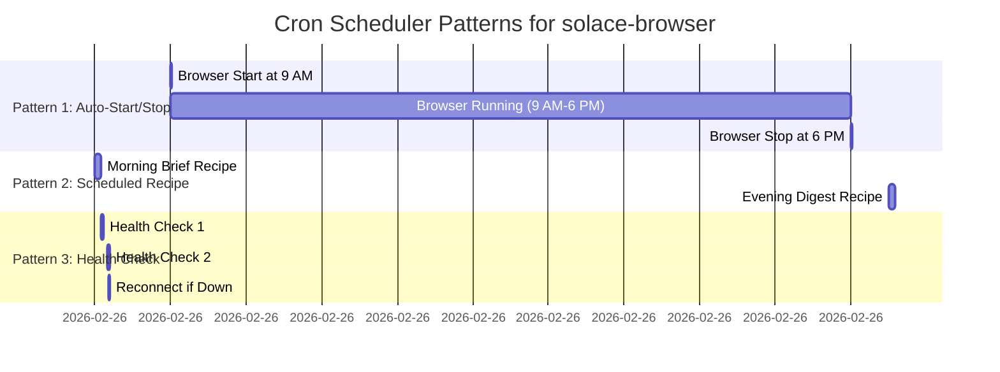

# Cron Scheduler Patterns (Q2 — Three Canonical Patterns)

Integration of solace-browser with cron for scheduled execution

## Mermaid Diagram



## Detailed Specification

### Pattern 1: Browser Auto-Start (Work Hours)

**Crontab Entry:**
```bash
# Start browser at 9 AM daily
0 9 * * * /usr/local/bin/solace-browser start

# Stop browser at 6 PM daily
0 18 * * * /usr/local/bin/solace-browser stop
```

**Behavior:**
1. At 09:00 → `solace-browser start` runs 3-step boot sequence (Q1 diagram)
2. Browser online from 09:00–18:00 (9 hours)
3. At 18:00 → `solace-browser stop` gracefully closes tunnel + clears pid.lock
4. User sees "Browser Offline" in dashboard

**Use Case:** Enterprise user who only needs browser during work hours (reduces tunnel relay costs)

**Audit Trail:**
```jsonl
{"timestamp": "2026-02-26T09:00:00Z", "event": "cron_start", "result": "success", "session_token": "..."}
{"timestamp": "2026-02-26T18:00:00Z", "event": "cron_stop", "result": "success"}
```

---

### Pattern 2: Scheduled Recipe Execution

**Crontab Entry:**
```bash
# Execute "morning-brief" recipe at 8 AM daily
0 8 * * * /usr/local/bin/solace-cli run recipe:morning-brief --browser-if-offline

# Execute "evening-digest" recipe at 6:30 PM daily
30 18 * * * /usr/local/bin/solace-cli run recipe:evening-digest
```

**Behavior:**
1. At 08:00 → solace-cli checks if browser online
   - If offline → auto-start browser (3-step boot)
   - If online → skip boot
2. Execute recipe against live browser
3. Capture screenshots + evidence + metrics
4. Log result to `~/.solace/outbox/recipe_execution.jsonl`

**Use Case:** Automated workflows (email triage, calendar sync, Slack posts)

**Recipe Execution Flow:**
```
solace-cli run recipe:morning-brief
├── Check browser online?
│   ├── If offline → solace-browser start (3-step boot)
│   └── If online → reuse tunnel
├── Fetch recipe from Stillwater Store (cache hit likely)
├── Compile recipe.mermaid → IR (intermediate representation)
├── Execute steps against browser (via OAuth3 scoped token)
├── Capture evidence (screenshots, metrics)
└── Log execution result
```

**Evidence Generated:**
```json
{
  "execution_id": "exec_2026_02_26_08_00_00",
  "recipe_id": "morning-brief",
  "version": "1.2.0",
  "status": "success",
  "duration_ms": 3421,
  "steps_executed": 8,
  "screenshots": ["step_1.png", "step_2.png", ...],
  "metrics": {
    "email_processed": 47,
    "spam_filtered": 5,
    "flagged_items": 2
  },
  "timestamp": "2026-02-26T08:00:00Z"
}
```

---

### Pattern 3: Periodic Health Check (Reconnect if Down)

**Crontab Entry:**
```bash
# Check tunnel every 5 minutes (if disconnected, reconnect)
*/5 * * * * /usr/local/bin/solace-browser health-check --reconnect-if-down
```

**Behavior:**
1. Every 5 minutes → `solace-browser health-check`
   - Ping `tunnel.solaceagi.com` via mTLS
   - Verify OAuth3 token still valid
   - Check `~/.solace/pid.lock` consistency
2. If tunnel down → auto-reconnect (Step 3 of boot sequence)
3. If token expired → raise error (require user re-login)
4. Log health status to `~/.solace/outbox/health_check.jsonl`

**Health Check Response:**
```json
{
  "timestamp": "2026-02-26T08:05:00Z",
  "status": "healthy",
  "tunnel_latency_ms": 47,
  "token_expires_in_seconds": 3599,
  "pid_lock_valid": true,
  "action": "none"
}
```

**Reconnection (if tunnel down):**
```json
{
  "timestamp": "2026-02-26T08:05:00Z",
  "status": "tunnel_down",
  "action": "reconnecting",
  "retry_attempt": 1
}
→
{
  "timestamp": "2026-02-26T08:05:30Z",
  "status": "healthy",
  "tunnel_latency_ms": 52,
  "action": "reconnect_success"
}
```

**Use Case:** 24/7 cloud twin (ensure continuous availability for scheduled recipes)

---

## Cron Scheduler Implementation

**Central Registry:** `~/.solace/outbox/cron_scheduler.jsonl`

```json
{
  "entry_id": "cron_001",
  "type": "auto_start",
  "schedule": "0 9 * * *",
  "command": "/usr/local/bin/solace-browser start",
  "next_run": "2026-02-27T09:00:00Z",
  "last_run": "2026-02-26T09:00:00Z",
  "last_result": "success"
}

{
  "entry_id": "cron_002",
  "type": "recipe_execution",
  "schedule": "0 8 * * *",
  "command": "/usr/local/bin/solace-cli run recipe:morning-brief",
  "next_run": "2026-02-27T08:00:00Z",
  "last_run": "2026-02-26T08:00:00Z",
  "last_result": "success",
  "metrics": {"duration_ms": 3421, "steps": 8}
}

{
  "entry_id": "cron_003",
  "type": "health_check",
  "schedule": "*/5 * * * *",
  "command": "/usr/local/bin/solace-browser health-check --reconnect-if-down",
  "runs_per_day": 288,
  "health_status": "healthy"
}
```

---

## Constraints (Software 5.0)

- **NO silent failures:** If cron job fails, log to `~/.solace/outbox/cron_errors.jsonl` + alert user
- **NO fallback retries:** If recipe execution fails, stop (don't retry forever)
- **Token safety:** If OAuth3 token expires during execution, halt immediately + log
- **Determinism:** Same schedule + recipe = same execution behavior (for 3-replay proof)

---

## Acceptance Criteria

- ✅ Pattern 1: Browser starts/stops on schedule
- ✅ Pattern 2: Recipes execute via cron with evidence capture
- ✅ Pattern 3: Health checks run every 5 min, reconnect if needed
- ✅ All executions logged to JSONL audit trail
- ✅ No silent failures (all errors raised explicitly)
- ✅ Token expiry detected + reported

---

**Source:** ARCHITECTURAL_DECISIONS_20_QUESTIONS.md § Q2
**Rung:** 641 (deterministic scheduled execution)
**Status:** CANONICAL — locked for Phase 4 implementation
