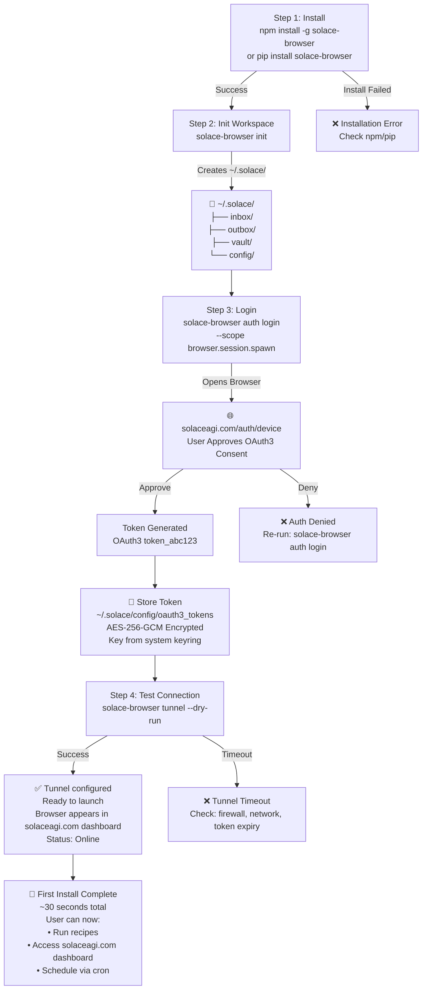

# First Install UX Flow (Q3 — 4-Step Onboarding)

OAuth3-driven installation and workspace initialization

## Mermaid Diagram



## Detailed Specification

### Step 1: Install

**Supported Package Managers:**

```bash
# npm (Node.js)
npm install -g solace-browser
# Creates: /usr/local/lib/node_modules/solace-browser/bin/solace-browser

# pip (Python)
pip install solace-browser
# Creates: /usr/local/bin/solace-browser

# Homebrew (macOS)
brew install solace-browser
# Creates: /usr/local/bin/solace-browser
```

**Verification:**
```bash
solace-browser --version
# Output: solace-browser v1.0.0
```

**What's Included:**
- Binary executable (statically linked, no native dependencies)
- Recipe Engine (Mermaid → IR compiler)
- OAuth3 client library
- Tunnel relay connection handler
- Browser context manager (Playwright bridge)

**Constraints:**
- No native browser (uses headless Chromium via Playwright, installed on demand)
- No external services (all OAuth3 tokens stored locally)

---

### Step 2: Initialize Workspace

**Command:**
```bash
solace-browser init
```

**Creates:**
```
~/.solace/
├── config/
│   ├── oauth3_tokens       (empty, will store after login)
│   ├── tunnel.json         (empty, will store tunnel config after connect)
│   └── manifest.yaml       (project metadata)
├── inbox/
│   └── README.md           (explanation: incoming files from solaceagi.com)
├── outbox/
│   ├── browser_startup.jsonl
│   ├── recipe_execution.jsonl
│   ├── cron_scheduler.jsonl
│   ├── oauth3_audit.jsonl
│   └── README.md           (explanation: audit logs)
└── vault/
    ├── recipes/            (local recipe cache)
    ├── memory/             (PZip-compressed semantic memory)
    └── evidence/           (screenshots, artifacts from recipe runs)
```

**Manifest:**
```yaml
# ~/.solace/config/manifest.yaml
version: "1.0.0"
device_id: "device_abc123"  # generated from /etc/hostname + /etc/machine-id
user: "phuc@example.com"     # will populate after login
oauth3_scopes: []            # will populate after login
created_at: "2026-02-26T12:00:00Z"
```

**Permissions:**
- `~/.solace/` → user-only (chmod 700)
- `~/.solace/config/oauth3_tokens` → AES-256-GCM encrypted, key in system keyring

**Initialization Time:** ~2 seconds

---

### Step 3: Login (OAuth3 Token Generation)

**Command:**
```bash
solace-browser auth login --scope browser.session.spawn
```

**Flow:**

1. **Local:** Generate PKCE challenge (OAuth3 with PKCE)
   ```
   state=random_nonce_xyz
   code_challenge=base64url(sha256(random_256_bytes))
   code_challenge_method=S256
   ```

2. **Browser:** Open system default browser to:
   ```
   https://solaceagi.com/auth/device?
     client_id=solace-browser&
     redirect_uri=http://localhost:8080/callback&
     scope=browser.session.spawn&
     state=random_nonce_xyz&
     code_challenge=...&
     code_challenge_method=S256
   ```

3. **User Action:** User logs in with email/password (or SSO) + approves scope

4. **Consent Screen:**
   ```
   🔐 solaceagi.com requests permission

   App: Solace Browser
   Wants to: browser.session.spawn

   This means: Start, stop, and control browser sessions on this device

   [Approve] [Deny]
   ```

5. **Callback:** solaceagi.com redirects to:
   ```
   http://localhost:8080/callback?
     code=auth_code_abc123&
     state=random_nonce_xyz
   ```

6. **Token Exchange:** Local solace-browser performs:
   ```bash
   POST https://solaceagi.com/oauth/token
   {
     "grant_type": "authorization_code",
     "code": "auth_code_abc123",
     "client_id": "solace-browser",
     "code_verifier": "original_256_bytes",
     "redirect_uri": "http://localhost:8080/callback"
   }
   ```

7. **Response:**
   ```json
   {
     "access_token": "oauth3_token_xyz789",
     "token_type": "Bearer",
     "expires_in": 3600,
     "scope": "browser.session.spawn",
     "refresh_token": "refresh_xyz789"
   }
   ```

8. **Storage:** Token stored encrypted:
   ```bash
   AES-256-GCM encrypt(oauth3_token_xyz789, key_from_system_keyring)
   → stored in ~/.solace/config/oauth3_tokens
   ```

**Token Lifecycle:**
- **Expiry:** 1 hour (short-lived)
- **Refresh:** Auto-refresh via refresh_token when expired
- **Revocation:** User can revoke in solaceagi.com → browser halts immediately
- **Audit:** Every token action logged to `~/.solace/outbox/oauth3_audit.jsonl`

**Timing:** ~15 seconds (includes user login)

---

### Step 4: Test Connection (Tunnel Dry-Run)

**Command:**
```bash
solace-browser tunnel --dry-run
```

**Behavior:**

1. **Load Token:** Decrypt token from `~/.solace/config/oauth3_tokens`

2. **Register with solaceagi.com:** (same as Q1 Step 2)
   ```bash
   POST https://solaceagi.com/api/v1/browser/register
   {
     "device_id": "device_abc123",
     "tunnel_url": "https://tunnel.solaceagi.com/browser/device_abc123",
     "version": "1.0.0",
     "capabilities": ["navigate", "click", "fill", "screenshot"]
   }
   ```

3. **Response:**
   ```json
   {
     "session_token": "session_xyz789",
     "cloud_twin_url": "https://cloud-twin-123.run.app",
     "event_stream_url": "wss://events.solaceagi.com/device_abc123"
   }
   ```

4. **Tunnel Test:**
   ```bash
   WebSocket connect to wss://tunnel.solaceagi.com/browser
   Headers: Authorization: Bearer session_xyz789
   → mTLS handshake
   → ping/pong check
   → close gracefully (dry-run)
   ```

5. **Output:**
   ```
   ✅ Tunnel configured. Ready to launch.
   Device: device_abc123
   Tunnel: wss://tunnel.solaceagi.com/browser
   Browser will be visible in solaceagi.com dashboard
   ```

**Timing:** ~5 seconds

---

## Complete First Install Timeline

| Step | Command | Time | Cumulative |
|------|---------|------|------------|
| 1 | Install | 15s | 15s |
| 2 | Init | 2s | 17s |
| 3 | Login | 15s | 32s |
| 4 | Test | 5s | **37s** |

**Total First Install Time:** ~30–40 seconds (dominated by user login in Step 3)

---

## What User Sees

**Terminal Output:**

```bash
$ npm install -g solace-browser
added 42 packages in 8s

$ solace-browser init
✅ Workspace initialized
Created: ~/.solace/{config,inbox,outbox,vault}

$ solace-browser auth login --scope browser.session.spawn
Opening browser at: solaceagi.com/auth/device
... (user approves in browser window) ...
✅ Token stored securely
Scope: browser.session.spawn
Expires: 2026-02-26 13:00:00

$ solace-browser tunnel --dry-run
✅ Tunnel configured. Ready to launch.
Browser will appear online in solaceagi.com dashboard in ~30 seconds.
```

**solaceagi.com Dashboard:**

After Step 4, user sees:

```
Devices
━━━━━━━━━━━━━━━━━━━━━━━━━━━━━━━━
📱 device_abc123
   Status: 🟢 Online
   Version: 1.0.0
   Installed: 2026-02-26
   Last Seen: now
   Capabilities: navigate, click, fill, screenshot
```

---

## Constraints (Software 5.0)

- **NO fallbacks:** If any step fails, raise error (don't skip)
- **Token security:** Never log tokens (even in debug mode)
- **PKCE enforcement:** All OAuth3 flows must use PKCE (no implicit grant)
- **Determinism:** Same email + device_id = same workspace structure

---

## Acceptance Criteria

- ✅ Install succeeds (binary available in PATH)
- ✅ Init creates ~/.solace/ structure (7 directories)
- ✅ Login succeeds (token stored encrypted)
- ✅ Tunnel test succeeds (WebSocket connects)
- ✅ User sees "Browser Online" in dashboard
- ✅ Total time < 1 minute

---

**Source:** ARCHITECTURAL_DECISIONS_20_QUESTIONS.md § Q3
**Rung:** 641 (deterministic onboarding)
**Status:** CANONICAL — locked for Phase 4 implementation
