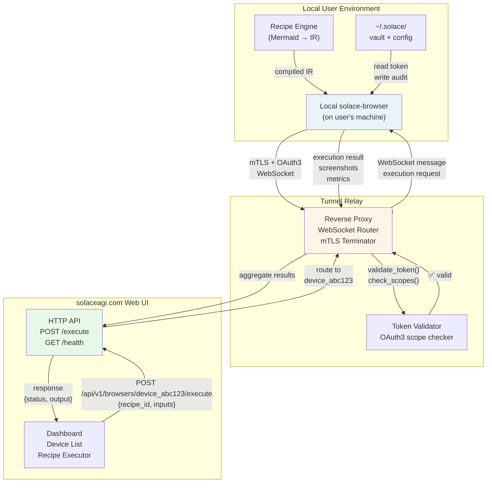
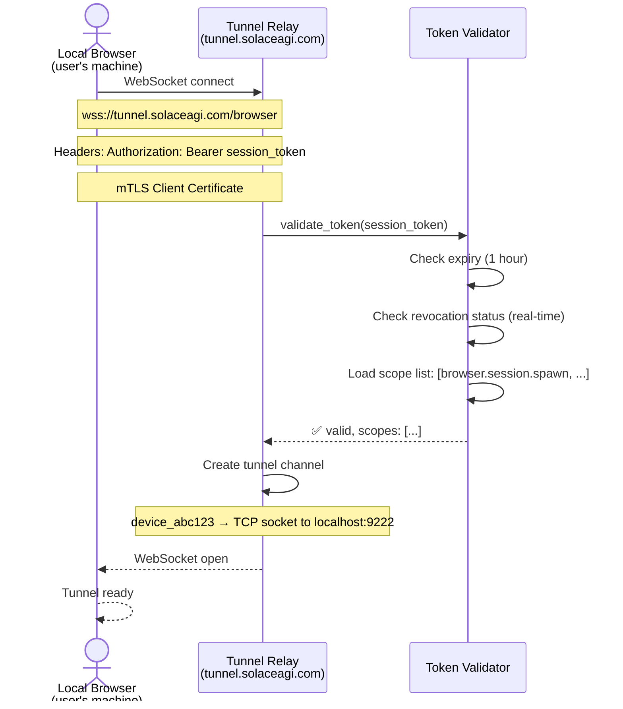
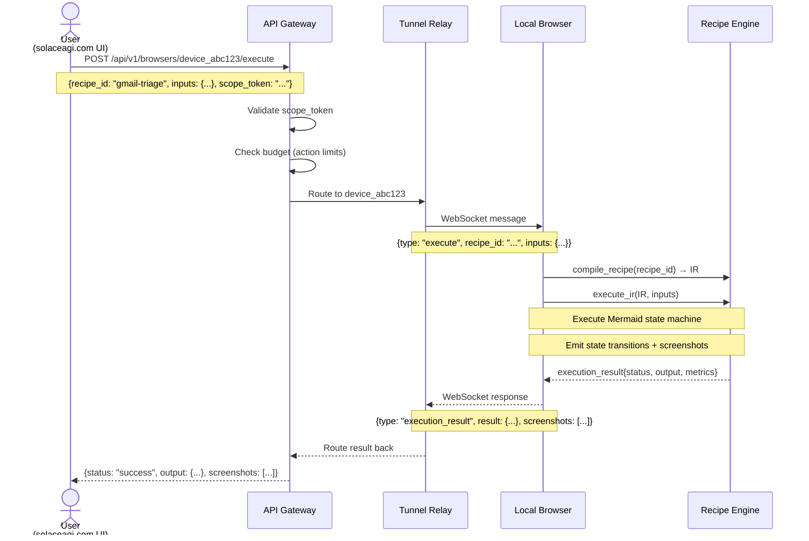

# Tunnel Architecture (Q7 — Secure Remote Browser Control)

Reverse proxy tunnel enabling remote control of local browsers via solaceagi.com

## Mermaid Diagram



## Detailed Specification

### Architecture Layers

```
┌─────────────────────────────────────────────────────────────────┐
│ Layer 1: Web UI (solaceagi.com Dashboard)                       │
│ - Device list (online/offline status)                           │
│ - Recipe execution interface                                    │
│ - Metrics + audit trail viewing                                 │
└──────────────────────────────────┬──────────────────────────────┘
                                   │
                  ┌────────────────▼──────────────┐
                  │ Layer 2: Tunnel Relay          │
                  │ (tunnel.solaceagi.com)         │
                  │ - WebSocket router             │
                  │ - mTLS terminator              │
                  │ - OAuth3 validator             │
                  │ - Request/response aggregator  │
                  └────────────────┬──────────────┘
                                   │
            ┌──────────────────────┼──────────────────────┐
            │ Encrypted WebSocket  │  mTLS Connection     │
            │ Per-Device Tunnel    │  Token-authenticated │
            └──────────────────────┼──────────────────────┘
                                   │
            ┌──────────────────────▼──────────────────────┐
            │ Layer 1: Local Browser Environment          │
            │ (solace-browser on user's machine)          │
            │ - Recipe Engine (Mermaid → IR)              │
            │ - Browser context manager                   │
            │ - OAuth3 token manager                       │
            │ - Local vault (encrypted)                    │
            └────────────────────────────────────────────┘
```

### Tunnel Connection Flow

**1. Browser Establishes Connection**



**2. Command Execution (Remote → Local)**



### Security Mechanisms

#### **mTLS (Mutual TLS)**

**Server Certificate (tunnel.solaceagi.com):**
- Issued by Let's Encrypt
- PEM-encoded X.509 certificate
- Pinned in solace-browser binary (prevent MITM)

**Client Certificate (solace-browser):**
- Generated at first install
- Stored in `~/.solace/config/client.pem`
- Unique per device (device_id in CN field)

**Handshake:**
```
solace-browser                          tunnel.solaceagi.com
    │                                         │
    ├─── TLS ClientHello ──────────────────────>
    │                                         │
    <─── TLS ServerHello + Cert ───────────────┤
    │                                         │
    ├─── TLS ClientCert + Verify ───────────────>
    │                                         │
    <─── TLS Finished ────────────────────────┤
    │                                         │
    ✅ Encrypted channel ready
```

#### **OAuth3 Token Validation**

**Per-Message Validation:**

Every incoming request validates:
1. Token not expired (issued < 1 hour ago)
2. Token not revoked (checked against revocation list every 60 seconds)
3. Scope includes required action (e.g., `browser.navigate` for click actions)
4. Step-up consent if action is sensitive (delete, send)

```
REQUEST: POST /api/v1/browsers/device_abc123/execute
HEADER: Authorization: Bearer oauth3_token_xyz789

VALIDATION CHAIN:
├─ Extract token from header
├─ Lookup token in cache (TTL 60 sec)
│  └─ If miss: fetch from solaceagi.com/oauth/token_info
├─ Check expiry: now < token.exp
├─ Check revocation: token not in revocation_list
├─ Check scope: "browser.navigate" in token.scopes
├─ Check step-up (if action sensitive)
└─ ✅ Allow or ❌ Deny

IF DENIED:
  return HTTP 403 Forbidden
  log to ~.solace/outbox/oauth3_audit.jsonl
```

#### **Per-Device Tunnels**

Each device has isolated tunnel:

```
Device 1 (device_abc123)
├─ Session ID: session_xyz789
├─ Tunnel: wss://tunnel.solaceagi.com/device/abc123
├─ Token: oauth3_token_xyz789 (scopes: [browser.navigate, browser.click])
└─ Status: online

Device 2 (device_def456)
├─ Session ID: session_uvw012
├─ Tunnel: wss://tunnel.solaceagi.com/device/def456
├─ Token: oauth3_token_uvw012 (scopes: [browser.navigate])
└─ Status: offline
```

**Token Isolation:** Each device gets separate OAuth3 token → can have different scopes and expiries.

### Tunnel Relay Capacity

**Per Instance (tunnel.solaceagi.com):**
- Max concurrent WebSockets: 10,000
- Max devices per instance: 10,000
- Memory per tunnel: ~100 KB (metadata + buffers)
- Bandwidth: unlimited (routing only)

**Scaling:**
- Auto-scale Cloud Run instances based on connection count
- Sticky routing: device_abc123 always routes to same instance (minimize state)
- Failover: if instance dies, devices reconnect to new instance (WebSocket automatic)

### Latency Budget

| Component | Latency |
|-----------|---------|
| Local Recipe Execution | ~500ms–5s |
| mTLS Handshake (first) | ~100ms |
| WebSocket Message (subsequent) | ~50ms |
| Token Validation | ~10ms |
| Tunnel Relay Routing | ~5ms |
| **Total Round-Trip** | **~500ms–5s** |

---

## Audit Trail

Every tunnel operation logged to `~/.solace/outbox/tunnel_audit.jsonl`:

```json
{
  "timestamp": "2026-02-26T12:34:56Z",
  "event": "tunnel_connect",
  "device_id": "device_abc123",
  "session_id": "session_xyz789",
  "status": "success",
  "latency_ms": 47
}

{
  "timestamp": "2026-02-26T12:35:00Z",
  "event": "execute_recipe",
  "device_id": "device_abc123",
  "recipe_id": "gmail-triage",
  "scope_token": "oauth3_token_xyz789",
  "action": "browser.navigate",
  "status": "success",
  "duration_ms": 2341
}

{
  "timestamp": "2026-02-26T12:35:15Z",
  "event": "token_validation_failed",
  "device_id": "device_abc123",
  "reason": "scope_insufficient (requested: browser.delete, has: [browser.navigate])",
  "status": "denied",
  "action_attempted": "delete_email"
}
```

---

## Constraints (Software 5.0)

- **NO token caching beyond 60 seconds** (catch revocations immediately)
- **NO silent scope violations** (raise HTTP 403 if scope insufficient)
- **NO device cross-contamination** (tunnel isolation is mandatory)
- **NO fallback authentication** (if token validation fails, deny request)
- **Determinism:** Same recipe_id + device = same tunnel behavior

---

## Acceptance Criteria

- ✅ mTLS connection succeeds (certificate pinning verified)
- ✅ OAuth3 token validated per-message
- ✅ Scope enforcement blocks invalid actions (HTTP 403)
- ✅ Per-device isolation (no cross-contamination)
- ✅ Latency < 5 seconds per request
- ✅ Tunnel resilience (auto-reconnect on disconnect)
- ✅ All operations audited to JSONL

---

**Source:** ARCHITECTURAL_DECISIONS_20_QUESTIONS.md § Q7
**Rung:** 641 (secure tunnel with OAuth3 enforcement)
**Status:** CANONICAL — locked for Phase 4 implementation
