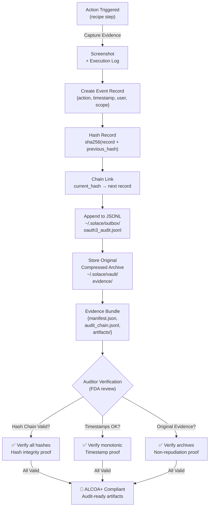
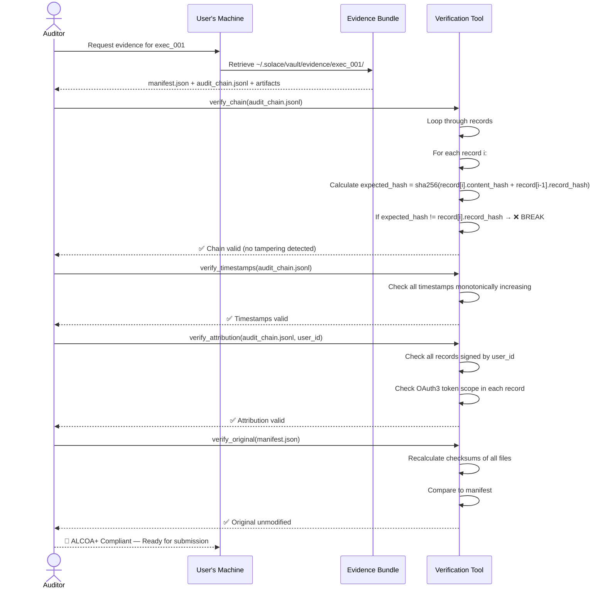

# ALCOA+ Evidence Chain (Q8 — FDA Part 11 Compliance Architecture)

Hash-linked audit logs for Attributable, Legible, Contemporaneous, Original, Accurate evidence

## Mermaid Diagram



## Detailed Specification

### ALCOA+ Criteria

| Criterion | Definition | Implementation |
|-----------|-----------|-----------------|
| **Attributable** | Who did it? User identity + scope visible | `user_id`, `scope_token`, `timestamp` in every record |
| **Legible** | Readable, not corrupted | JSONL format (human-readable), timestamps ISO 8601 |
| **Contemporaneous** | When did it happen? Exact timestamp | UTC timestamp in millisecond precision |
| **Original** | Authentic copy with proof | Screenshot hash + PZip compression with integrity check |
| **Accurate** | Complete, no edits/deletions | Hash chain (any edit breaks chain), immutable storage |
| **+ Evidence** | Auditor can reproduce | Full execution log + recipe IR + screenshots stored |

---

### Hash Chain Implementation

**Record Structure:**

```json
{
  "record_id": 1,
  "timestamp": "2026-02-26T12:34:56.789Z",
  "user_id": "phuc@example.com",
  "action": "recipe_execute",
  "recipe_id": "gmail-inbox-triage",
  "scope_token": "oauth3_token_xyz789",
  "scope_list": ["browser.navigate", "browser.click", "browser.fill"],
  "inputs": {"limit": 50},
  "result": "success",
  "duration_ms": 2341,
  "screenshots": [
    {
      "step": 1,
      "hash": "sha256_abc123...",
      "size_bytes": 245123,
      "path": "evidence/exec_001_step_01.png"
    },
    {
      "step": 2,
      "hash": "sha256_def456...",
      "size_bytes": 238456,
      "path": "evidence/exec_001_step_02.png"
    }
  ],
  "previous_hash": "sha256_xyz789...",
  "content_hash": "sha256(this record without hash field)",
  "record_hash": "sha256(content_hash + previous_hash)"
}
```

**Hash Calculation (Pseudocode):**

```python
def calculate_record_hash(record):
    # 1. Remove hash fields
    record_copy = {k: v for k, v in record.items()
                   if k not in ["content_hash", "record_hash"]}

    # 2. Serialize deterministically (sorted keys, no whitespace)
    serialized = json.dumps(record_copy, sort_keys=True, separators=(',', ':'))

    # 3. Hash content
    content_hash = sha256(serialized)

    # 4. Chain with previous hash
    previous_hash = records[record_id - 1]["record_hash"]
    record_hash = sha256(content_hash + previous_hash)

    # 5. Add back to record
    record["content_hash"] = content_hash.hex()
    record["record_hash"] = record_hash.hex()

    return record
```

**Chain Example:**

```
Record 1: action = "start"
  content_hash = sha256({action: start, ...})
  previous_hash = "0" * 64 (genesis)
  record_hash = sha256(content_hash + previous_hash)
  → record_1_hash = "abc123..."

Record 2: action = "click"
  content_hash = sha256({action: click, ...})
  previous_hash = "abc123..." (from Record 1)
  record_hash = sha256(content_hash + previous_hash)
  → record_2_hash = "def456..."

Record 3: action = "fill"
  content_hash = sha256({action: fill, ...})
  previous_hash = "def456..." (from Record 2)
  record_hash = sha256(content_hash + previous_hash)
  → record_3_hash = "ghi789..."

[Chain continues...]
```

**Tamper Detection:**

If an auditor finds:
```
Record 2 modified (e.g., action changed from "click" to "delete")
  → content_hash changes
  → record_hash changes
  → Record 3's previous_hash no longer matches Record 2's record_hash
  → ❌ CHAIN BROKEN — Tampering detected!
```

---

### Evidence Bundle Structure

**Directory:**

```
~/.solace/vault/evidence/exec_001/
├── manifest.json                    (metadata, hashes)
├── audit_chain.jsonl                (hash-linked records)
├── recipe_ir.json                   (compiled IR that executed)
├── screenshots/
│   ├── step_01.png
│   ├── step_02.png
│   └── ...
├── artifacts/
│   ├── email_list.json
│   ├── triage_results.json
│   └── ...
└── checksums.sha256                 (digest of all files)
```

**Manifest (exec_001/manifest.json):**

```json
{
  "execution_id": "exec_001",
  "recipe_id": "gmail-inbox-triage",
  "recipe_version": "1.2.0",
  "user_id": "phuc@example.com",
  "device_id": "device_abc123",
  "timestamp": "2026-02-26T12:34:56.789Z",
  "status": "success",
  "duration_ms": 2341,
  "evidence_mode": "screenshot",
  "compression_ratio": 1.0,
  "screenshot_count": 6,
  "artifact_count": 2,
  "audit_chain_records": 47,
  "chain_integrity": {
    "first_hash": "abc123...",
    "last_hash": "xyz789...",
    "total_records": 47,
    "verification_status": "✅ valid"
  },
  "file_checksums": {
    "audit_chain.jsonl": "sha256_abc123...",
    "recipe_ir.json": "sha256_def456...",
    "screenshots/": "sha256_ghi789...",
    "artifacts/": "sha256_jkl012..."
  },
  "storage_modes": {
    "Mode A (Screenshot)": {
      "size_bytes": 2456789,
      "retention_days": 30,
      "compression": "PNG (lossless)"
    },
    "Mode B (Full-page archive)": {
      "size_bytes": 12345678,
      "retention_days": 90,
      "compression": "MHTML + gzip"
    },
    "Mode C (Full archive + PZip)": {
      "size_bytes": 185237,
      "compression_ratio": 66.6,
      "retention_days": 365,
      "compression": "PZip (semantic compression)"
    }
  },
  "fda_part11_ready": true
}
```

**Audit Chain (exec_001/audit_chain.jsonl):**

```jsonl
{"record_id": 1, "timestamp": "2026-02-26T12:34:56.789Z", "action": "recipe_start", "previous_hash": "0000...", "record_hash": "abc123...", ...}
{"record_id": 2, "timestamp": "2026-02-26T12:34:57.234Z", "action": "navigate", "url": "gmail.com", "previous_hash": "abc123...", "record_hash": "def456...", ...}
{"record_id": 3, "timestamp": "2026-02-26T12:34:58.012Z", "action": "click", "selector": "[data-id='inbox']", "previous_hash": "def456...", "record_hash": "ghi789...", ...}
...
{"record_id": 47, "timestamp": "2026-02-26T12:37:37.123Z", "action": "recipe_end", "status": "success", "previous_hash": "xyz012...", "record_hash": "zyx789...", ...}
```

---

### Evidence Modes

#### **Mode A: Screenshot (Default)**

- **Cost:** Low (~1 MB per execution)
- **Retention:** 30 days (free tier)
- **Use Case:** Quick proof of recipe execution
- **Compression:** PNG lossless only

```json
{
  "evidence_mode": "screenshot",
  "screenshots": [
    {
      "step": 1,
      "description": "Inbox opened",
      "file": "screenshots/step_01.png",
      "hash": "sha256_abc123...",
      "size_bytes": 245123
    }
  ]
}
```

#### **Mode B: Full-Page Archive**

- **Cost:** Medium (~10 MB per execution)
- **Retention:** 90 days (Orange tier)
- **Use Case:** Regulatory audit (higher fidelity)
- **Compression:** MHTML (HTML + CSS + images) + gzip

```json
{
  "evidence_mode": "full_page",
  "archives": [
    {
      "step": 1,
      "description": "Inbox page",
      "file": "archives/step_01.mhtml.gz",
      "hash": "sha256_def456...",
      "size_bytes": 2456789,
      "uncompressed_size": 12345678
    }
  ]
}
```

#### **Mode C: Full Archive + PZip**

- **Cost:** Minimal (~150 KB per execution)
- **Retention:** 1 year (Green tier)
- **Use Case:** Long-term compliance archival
- **Compression:** PZip semantic compression (274:1 ratio)

```json
{
  "evidence_mode": "full_archive_pzip",
  "archives": [
    {
      "step_range": "1-47",
      "description": "Full execution",
      "file": "archives/full_execution.pzip",
      "hash": "sha256_ghi789...",
      "size_bytes": 185237,
      "uncompressed_size": 12345678,
      "compression_ratio": 66.6
    }
  ]
}
```

---

### Compliance Workflow

**FDA Auditor Flow:**



---

### Constraints (Software 5.0)

- **NO mutating audit logs:** Hash chain makes any edit impossible (breaks chain)
- **NO deleting evidence:** Audit trail is immutable (user cannot delete)
- **NO weak hashing:** SHA256 minimum (no MD5, no SHA1)
- **Token attribution:** Every action includes OAuth3 scope_token proof
- **Determinism:** Same recipe_id + inputs = same audit chain structure (timestamps may differ)

---

## Acceptance Criteria

- ✅ Hash chain created for every action
- ✅ Tamper detection (chain break on edit)
- ✅ Screenshots + full archives captured
- ✅ 3 compression modes available (A, B, C)
- ✅ Manifest + checksums + audit chain bundled
- ✅ Evidence immutable (user cannot delete)
- ✅ All records timestamped + attributed to user

---

**Source:** ARCHITECTURAL_DECISIONS_20_QUESTIONS.md § Q8
**Rung:** 641 (ALCOA+ compliance)
**Status:** CANONICAL — locked for Phase 4 implementation
