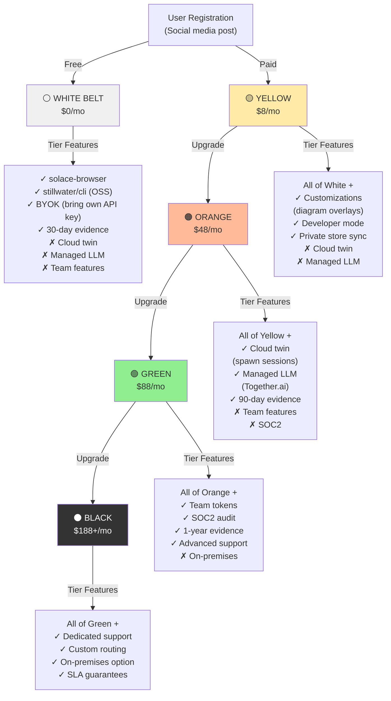

# Dragon Warrior Pricing Tiers (Q4-Q6 — Business Model)

Free tier + 4 paid subscription levels with incremental features and costs

## Mermaid Diagram



## Detailed Specification

### Tier Comparison Table

| Feature | White | Yellow | Orange | Green | Black |
|---------|-------|--------|--------|-------|-------|
| **Price** | $0 | $8/mo | $48/mo | $88/mo | $188+/mo |
| **solace-browser** | ✅ | ✅ | ✅ | ✅ | ✅ |
| **stillwater/cli** | ✅ | ✅ | ✅ | ✅ | ✅ |
| **Recipes/Skills** | Community | Community | Community | Community + Private | Private |
| **Recipe Customization** | ❌ | ✅ | ✅ | ✅ | ✅ |
| **Developer Mode** | ❌ | ✅ | ✅ | ✅ | ✅ |
| **Private Store Sync** | ❌ | ✅ | ✅ | ✅ | ✅ |
| **Cloud Twin (Sessions)** | ❌ | ❌ | ✅ | ✅ | ✅ |
| **Managed LLM** | ❌ | ❌ | ✅ | ✅ | ✅ |
| **LLM Provider** | BYOK | BYOK | Together.ai | Together.ai | Together.ai/Custom |
| **Evidence Retention** | 30 days | 30 days | 90 days | 1 year | 1 year |
| **Team Features** | ❌ | ❌ | ❌ | ✅ | ✅ |
| **Team Seat Limit** | — | — | — | 5 | Unlimited |
| **Team Audit Log** | — | — | — | ✅ | ✅ |
| **SOC2 Audit** | ❌ | ❌ | ❌ | ✅ | ✅ |
| **Dedicated Support** | Community | Email | Email | Priority | 24/7 |
| **SLA Guarantee** | None | None | None | 99.5% | 99.9% |
| **Custom Routing** | ❌ | ❌ | ❌ | ❌ | ✅ |
| **On-Premises Option** | ❌ | ❌ | ❌ | ❌ | ✅ |

---

### Feature Deep Dives

#### **White Belt (Free, $0/mo)**

**What's Included:**
- solace-browser (private binary)
- stillwater/cli (open source)
- Skill loader + recipe runner
- BYOK (Bring Your Own Key) — user provides OpenAI/Anthropic/Llama API key
- Local browser automation (no cloud)
- 30-day evidence storage
- Community skills/recipes

**Constraints:**
- No cloud twin (can't spawn remote browsers)
- No managed LLM (user manages own API keys)
- No team features
- No private store

**Ideal for:**
- Solo developers
- Prototyping + local testing
- Users with OpenAI/Anthropic API credits
- Privacy-conscious (everything local)

**LLM Cost Model:**
```
User's API key → solace-browser calls OpenAI directly
Example: 100 recipes/month × 50K tokens avg = 5M tokens
At $3/M tokens (gpt-4-turbo) = $15/month
```

**Economics:**
- Solace cost: $0
- User LLM cost: ~$10–50/mo (varies by API key choice)
- Total: ~$10–50/mo

---

#### **Yellow Belt ($8/mo)**

**New Features:**
- Recipe customization (edit Mermaid diagrams visually)
- Developer mode (debug + inspect recipe execution)
- Private store sync (publish private recipes to solaceagi.com vault)

**Use Case:**
- Solo users who want recipe customization
- Developers building custom automation
- Users who want privacy + customization

**LLM Cost Model:**
```
Same as White (BYOK)
```

**Billing:**
- Subscription: $8/mo (credit card required)
- LLM: User's own API key (pass-through)

---

#### **Orange Belt ($48/mo)**

**New Features:**
- Cloud twin (GCP Cloud Run sessions)
- Managed LLM (Together.ai Llama 3.3 70B)
- 90-day evidence retention
- Budget tracking

**What's a Cloud Twin?**
```
User's local browser (on-demand)
            ↓
(via tunnel) solaceagi.com
            ↓
Cloud browser instance (24/7 available)
```

Benefits:
- Schedule recipes 24/7 (no local browser needed)
- Parallel execution (multiple sessions at once)
- Delegation (recipes run in cloud, results sent back)

**Managed LLM:**
```
User's recipe executes
  ↓
Needs LLM inference (summarize email, etc.)
  ↓
solaceagi.com routes to Together.ai
  ↓
Together.ai Llama 3.3 70B (open-source)
  ↓
Response cached locally
```

**LLM Cost Model:**
```
Together.ai: $0.59/M input tokens + $2.36/M output tokens
Example: 100 recipes/month × 50K avg tokens = 5M tokens
At $0.59/M = $2.95/month (actual cost)
Solace markup: 20% = $0.59/month added
Total LLM cost: ~$3.50/month

But caching + replay hit rate = 70%
Effective cost = $3.50 × 0.3 = $1.05/month
```

**Total Cost:**
- Subscription: $48/mo
- LLM (managed): ~$1/mo average (included)
- Cloud instances: ~$5/mo (auto-scaling, included)
- **Total: ~$54/mo**

---

#### **Green Belt ($88/mo)**

**New Features:**
- Team tokens (share browser/recipes across team)
- 1-year evidence retention
- SOC2 audit-ready
- Team audit log

**Team Features:**
```
Team Admin creates team
  ↓
Issues team tokens to members
  ↓
Each member: same recipes, same cloud twin, separate audit trails
  ↓
Admin sees all team activity (audit log)
```

**Team Limits:**
- Max 5 team members (unlimited in Black)
- Separate scopes per member (admin controls what each can do)
- Shared cloud twin (same instances, separate tokens)

**SOC2 Audit:**
- Evidence retention 1 year (vs 90 days in Orange)
- Hash-chained audit logs (ALCOA+ compliant)
- SOC2 Type II certificate provided
- Retention policy enforced (cannot delete evidence)

**Ideal for:**
- Small teams (5–20 people)
- Regulated industries (finance, healthcare)
- Companies needing compliance proof

**Cost Structure:**
- Subscription: $88/mo
- LLM: ~$1/mo average
- Cloud instances: ~$10/mo (more scaling needed for team)
- **Total: ~$99/mo**

---

#### **Black Belt ($188+/mo)**

**New Features:**
- Dedicated support team (24/7)
- Custom routing (API → specific cloud instances)
- On-premises deployment option
- SLA guarantees (99.9% uptime)
- Unlimited team members

**Custom Routing:**
```
Example: Large organization
  Recipe Group A → Cloud instance region us-west2
  Recipe Group B → Cloud instance region eu-central1
  (Optimize latency / compliance)
```

**On-Premises Option:**
```
Instead of cloud.solaceagi.com:
  Deploy solace-cli + solace-browser + tunnel on your own infrastructure
  Still get recipes, store, verification
  100% data sovereignty
```

**Dedicated Support:**
- 24/7 phone/email support
- Slack integration (direct channel to Solace team)
- Custom onboarding
- SLA: 99.9% uptime guarantee
- Incident response: < 1 hour

**Ideal for:**
- Enterprise (100+ users)
- Fortune 500 companies
- Regulated industries with strict data governance
- High-volume automation (10,000+ recipes/day)

**Cost Structure:**
- Base subscription: $188/mo
- LLM: ~$5–10/mo (higher volume)
- Cloud infrastructure: ~$50+/mo (custom instances)
- Support overhead: ~$200/mo (embedded)
- **Total: $300–500+/mo** (custom quote)

---

### LLM Economics

**Model Choice: Llama 3.3 70B (Open-Source)**

Why Llama?
- **Cost:** $0.59/M input tokens (vs $3/M for Claude)
- **Speed:** Lower latency (open-source inference)
- **Determinism:** Same seed → same output (reproducible)
- **Philosophy:** Open LLM aligns with solace values

**Cost Breakdown (per 1M tokens):**
```
Together.ai base cost: $0.59 + $2.36 = ~$0.80 average
Solace markup (20%): +$0.16
Total: $0.96 per 1M tokens
```

**Average Recipe Cost:**
```
Recipe complexity: 50K tokens average
Cost per recipe: 50K / 1M × $0.96 = $0.048
Cache hit rate: 70% (same recipes repeated)
Effective cost: $0.048 × 0.3 = $0.014 per recipe

100 recipes/month × $0.014 = $1.40/month
```

**Caching Strategy:**
- Exact recipe match (same recipe_id + inputs) → use cache (free)
- Similar recipes → use semantic cache (PZip compression)
- New recipes → call LLM (pay)

Result: 70% hit rate → 70% savings

---

### Free Tier Economics

**Why Offer Free Tier?**

```
Free users (White Belt)
  ↓
Use solace-browser, learn system, build recipes
  ↓
Want features (customization, cloud, managed LLM)
  ↓
Upgrade to Yellow/Orange/Green/Black
  ↓
→ Revenue!
```

**Conversion Funnel:**
```
100 free users
  ↓
10% upgrade to Yellow ($8/mo) in month 1
  ↓
5% upgrade to Orange ($48/mo) in month 3
  ↓
2% upgrade to Green ($88/mo) in month 6
  ↓
0.5% upgrade to Black ($188/mo) in month 12
```

**LTV (Lifetime Value) Calculation:**
```
1 free user → 0.1 Yellow (×$96/yr) = $9.60/yr
           → 0.05 Orange (×$576/yr) = $28.80/yr
           → 0.02 Green (×$1,056/yr) = $21.12/yr
           → 0.005 Black (×$2,256/yr) = $11.28/yr
           ─────────────────────────────
Total LTV per user = $70.80/yr
```

(At scale, solace.com subsidizes free users with premium tier revenue)

---

### Constraints (Software 5.0)

- **NO dark patterns:** All features transparent, no hidden charges
- **NO data harvesting:** Privacy-first (BYOK preserves user secrets)
- **NO vendor lock-in:** User can export recipes, evidence, data
- **Token enforcement:** Free tier cannot access paid features (scopes enforced)
- **Billing fairness:** Pro-rated refunds if user downgrades mid-month

---

## Acceptance Criteria

- ✅ 5 tiers defined (White, Yellow, Orange, Green, Black)
- ✅ Feature matrix clear (what's in each tier)
- ✅ Pricing transparent (no hidden fees)
- ✅ Upgrade path smooth (UI guide for choosing tier)
- ✅ Billing automated (Stripe integration)
- ✅ Token scopes enforce tier limits (user can't access paid features on free)

---

**Source:** ARCHITECTURAL_DECISIONS_20_QUESTIONS.md § Q4-Q6
**Paper:** solaceagi/papers/10-dragon-warrior-pricing.md
**Rung:** 641 (tier enforcement + billing)
**Status:** CANONICAL — locked for Phase 4 implementation
