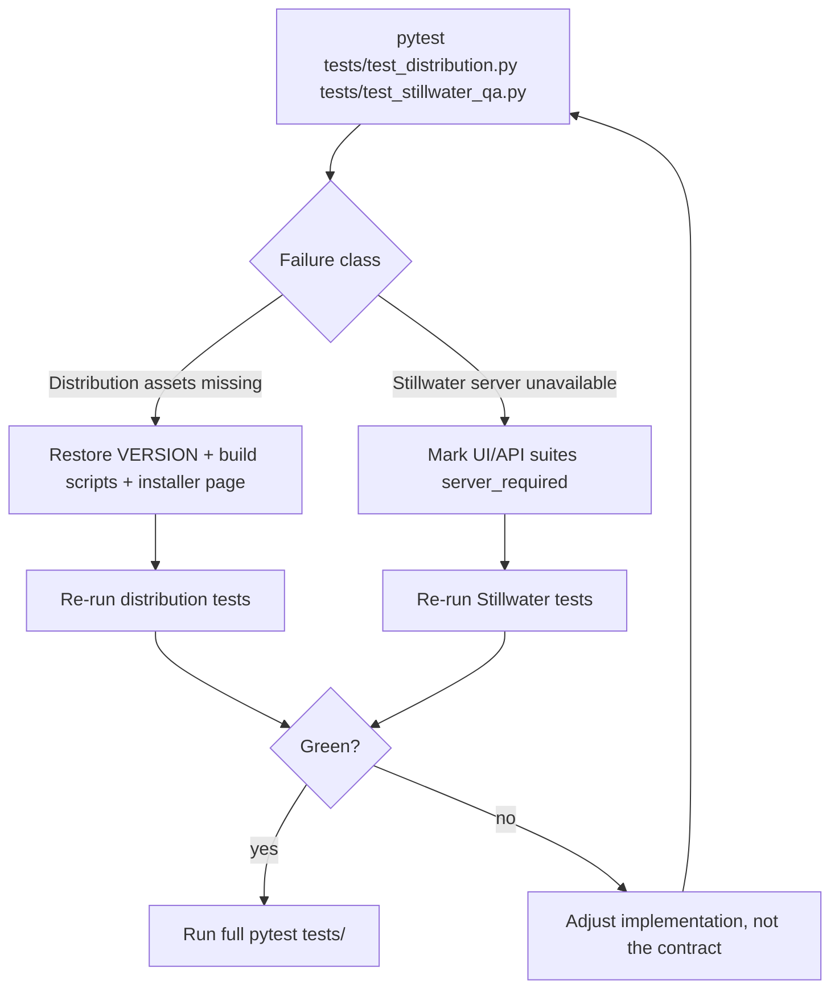

# TASK-002 Test Recovery

States:
- Distribution path fails closed until required artifacts exist.
- Stillwater path skips with an explicit reason when the external server is unavailable.
- Full-suite verification is required before marking TASK-002 complete.
