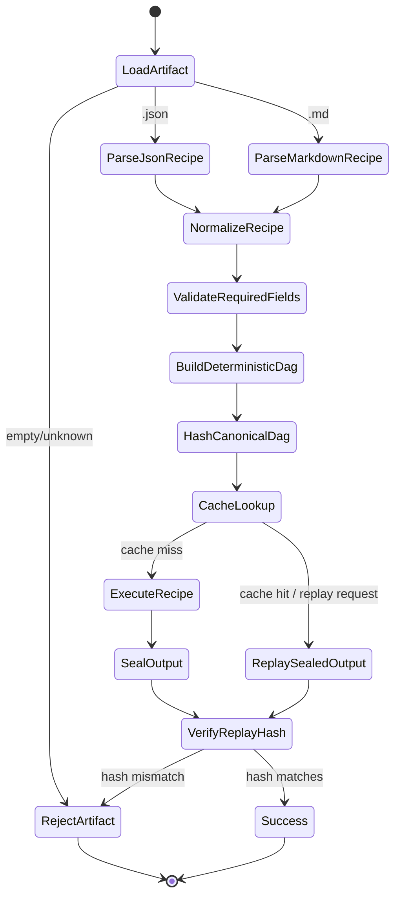

# TASK-001 Recipe Hardening

## Goal

Prove deterministic recipe parsing and replay behavior across the mixed recipe corpus.

## Flow

## Notes

- Parsing must be stable under whitespace-only changes.
- JSON recipes normalize multiple legacy shapes into one deterministic DAG view.
- Replay never calls the browser or an LLM; it compares canonical sealed artifacts only.
- Invalid JSON, missing fields, empty files, unknown actions, and circular DAGs must raise typed errors.
