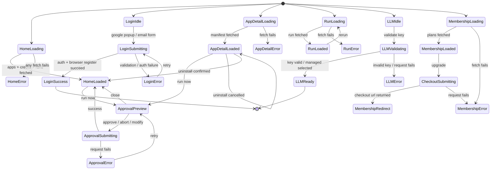

# TASK-002 Frontend State Machines

## Page Flow

## Notes

- Every page has exactly `loading`, `loaded`, and `error` states.
- Approval uses a nested FSM because both Home and App Detail can open it.
- Login has both popup auth and email/password auth, but they share one submit/error path.
- `RunDetailPage` re-run returns to `RunLoading` so the UI can refresh from the same endpoint.
