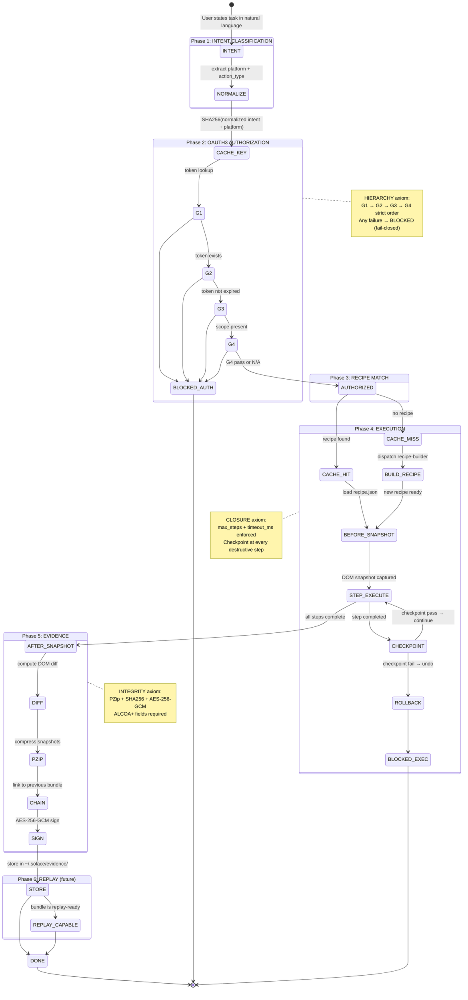
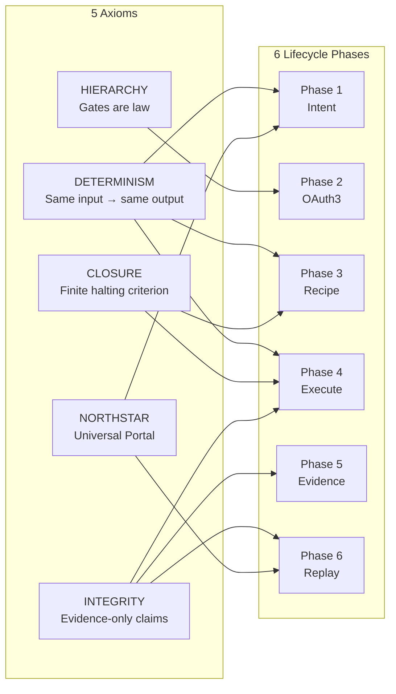
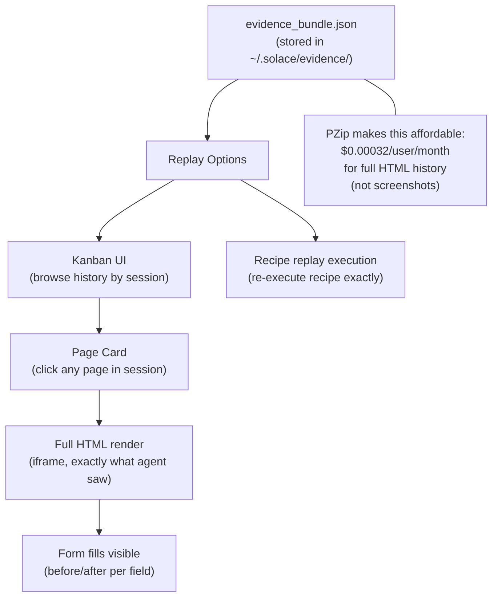

# Diagram: Browser Action Lifecycle

**ID:** browser-action-lifecycle
**Version:** 1.0.0
**Type:** Lifecycle diagram + state machine
**Primary Axiom:** All 5 Axioms (one lifecycle touches all)
**Tags:** lifecycle, intent, oauth3, action, evidence, replay, determinism, closure, integrity, hierarchy, northstar

---

## Purpose

The browser action lifecycle traces a single browser action from user intent through to a replayable evidence artifact. It is the complete, end-to-end view of what happens when SolaceBrowser executes a task. Every major subsystem is represented: intent classification (recipe engine), authorization (OAuth3 gate), execution (browser-snapshot + recipe replay), and evidence (browser-evidence + chain).

---

## Diagram: Complete Lifecycle (All Phases)



---

## Diagram: Axiom Coverage Per Phase



---

## Diagram: Replay Capability



---

## Lifecycle Timing Summary

| Phase | Mechanism | Latency | Cost |
|-------|---------|---------|------|
| 1: Intent | haiku LLM | < 500ms | ~$0.0001 |
| 2: OAuth3 | haiku + vault | < 300ms | ~$0.0001 |
| 3: Recipe Match (hit) | hash lookup | < 100ms | $0.000 |
| 3: Recipe Match (miss) | sonnet LLM | 30-120s | ~$0.03 |
| 4: Execute (hit) | haiku + playwright | 1-5s | ~$0.0005 |
| 4: Execute (miss) | sonnet + playwright | 30-120s | ~$0.05 |
| 5: Evidence | CPU + PZip + haiku | < 500ms | ~$0.0001 |
| 6: Replay capability | CPU | 0ms (pre-built) | $0.000 |
| **Total (cache hit)** | — | **< 7s** | **~$0.001** |
| **Total (cache miss)** | — | **< 3 min** | **~$0.05** |

---

## Lifecycle Artifact Manifest

Every lifecycle execution MUST produce the following artifacts:

```
Artifacts per lifecycle run:
  classified_intent.json    — Phase 1 output
  gate_audit.json           — Phase 2 output (all 4 gates)
  recipe.json               — Phase 3 output (served or built)
  execution_trace.json      — Phase 4 output (step-by-step)
  before_snapshot.pzip      — Phase 4/5 boundary
  after_snapshot.pzip       — Phase 4/5 boundary
  evidence_bundle.json      — Phase 5 output (ALCOA+ signed)

Optional artifacts (cold-miss path):
  pm_triplet.json           — Phase 3 (new recipe built)
  test_result.json          — Phase 3 validation
```

Missing any required artifact = incomplete lifecycle = rung target NOT achieved.

---

## Notes

### Why 6 Phases?

Each phase has a distinct responsibility and a distinct failure mode:
1. **Intent** can fail if the input is ambiguous
2. **OAuth3** can fail if consent is not established
3. **Recipe** can fail on cache miss (triggers cold-miss path)
4. **Execute** can fail if DOM changed or max_steps exceeded
5. **Evidence** can fail if PZip or chain is unavailable
6. **Replay** is not a failure mode — it is a future capability built from Phase 5 artifacts

Collapsing phases would mean one failure mode could silently mask another.

### The Replay Loop (Why It Matters)

Phase 6 (Replay) closes the loop: every action executed is automatically replayable. This is the + Enduring and + Available ALCOA+ principles in action. More practically, it is what allows the Kanban history UI to exist: every page the agent visited, every form fill it made, every action it took — all replayable and inspectable by the user.

No other browser automation tool stores full HTML replay history at this cost or with this completeness.

---

## Related Artifacts

- `diagrams/browser-multi-layer-architecture.md` — 5-layer view of same pipeline
- `diagrams/oauth3-enforcement-flow.md` — Phase 2 detail
- `diagrams/recipe-engine-fsm.md` — Phase 3 FSM detail
- `diagrams/evidence-pipeline.md` — Phase 5 pipeline detail
- `diagrams/part11-alcoa-mapping.md` — Phase 5 compliance mapping
