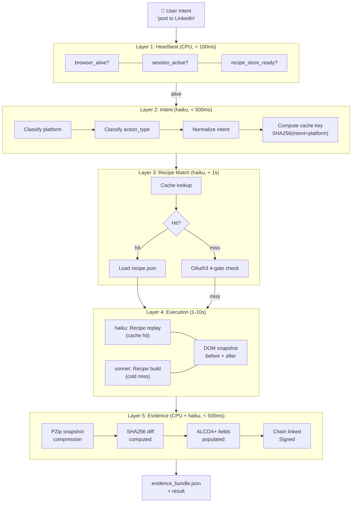
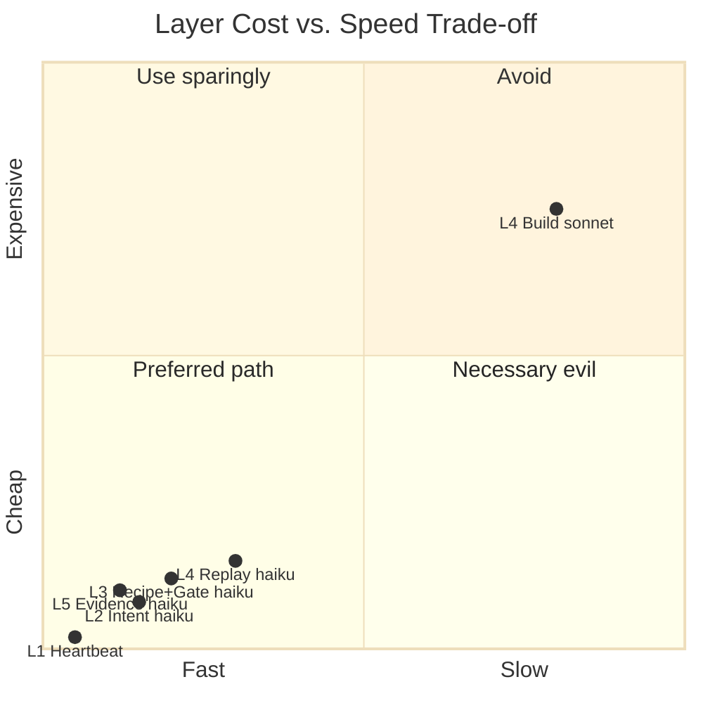
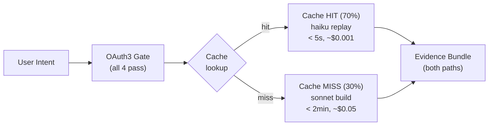

# Diagram: Browser Multi-Layer Architecture

**ID:** browser-multi-layer-architecture
**Version:** 1.0.0
**Type:** Architecture diagram
**Primary Axiom:** NORTHSTAR (all layers serve the Universal Portal vision)
**Tags:** architecture, layers, heartbeat, intent, recipe, execution, evidence, cost-model

---

## Purpose

The 5-layer browser architecture is the core design of SolaceBrowser's intelligence stack. Each layer is optimized for a specific trade-off of speed, cost, and correctness. The layered design ensures that 70% of tasks (cache hits) are served in < 5 seconds at ~$0.001/task, while cold-miss tasks use a more expensive model only when necessary.

The architecture extends the triple-twin model to add a browser-specific evidence layer at the bottom.

---

## Diagram: 5-Layer Architecture



---

## Diagram: Layer Cost Model



---

## Diagram: Cache Hit vs. Miss Flow



---

## Layer Specification Table

| Layer | Trigger | Model | Target Latency | Target Cost | Input | Output |
|-------|---------|-------|---------------|-------------|-------|--------|
| 1: Heartbeat | Every request | CPU | < 100ms | $0.000 | None | heartbeat.json |
| 2: Intent | After L1 PASS | haiku | < 500ms | ~$0.0001 | Natural language | classified_intent.json |
| 3: Recipe Match | After L2 | haiku | < 1s | ~$0.0002 | intent + platform | recipe.json OR cold_miss |
| 3: OAuth3 Gate | After cache check | haiku | < 500ms | ~$0.0001 | recipe + token | gate_audit.json |
| 4: Execute (hit) | Gate PASS + hit | haiku | 1-5s | ~$0.0005 | recipe + snapshot | execution_trace.json |
| 4: Execute (miss) | Gate PASS + miss | sonnet | 30-120s | ~$0.03-0.05 | intent + DOM | recipe.json + trace |
| 5: Evidence | After execute | haiku | < 500ms | ~$0.0001 | trace + snapshots | evidence_bundle.json |

---

## Notes

### Why 5 Layers (Not 3)?

The triple-twin model (Heartbeat / LLM / CPU) is extended with two additional layers specific to browser automation:

1. **Recipe Match** separates the cache lookup from the execution, enabling a haiku-cost path for cache hits without involving a heavier model.
2. **Evidence** is separated from execution because evidence packaging has its own compliance requirements (ALCOA+, Part 11) and should not be coupled to execution errors.

### Layer 3 OAuth3 Integration

OAuth3 gate is in Layer 3 (not Layer 1) because the gate check requires the normalized intent + platform — which Layer 2 produces. Gate without intent = scopeless gate = BLOCKED.

### Economics (Why This Architecture Wins)

```
At 70% hit rate:
  0.70 × $0.001 (hit) + 0.30 × $0.05 (miss) = $0.0157/task

vs. LLM-every-task:
  1.00 × $0.05 = $0.05/task

Savings: 68% reduction in per-task LLM cost
At 10,000 tasks/month: $314 vs. $500 = $186/month saved per user
```

### PZip in Layer 5

Layer 5 applies PZip compression to before/after snapshots before signing. This enables full HTML snapshot storage at near-zero marginal cost ($0.00032/user/month at scale). Full HTML snapshots (not screenshots) are required for ALCOA+ "Original" compliance and for recipe replay.

---

## Related Artifacts

- `combos/full-browser-task.md` — full implementation of this 5-layer pipeline
- `diagrams/recipe-engine-fsm.md` — Layer 3 recipe engine FSM
- `diagrams/oauth3-enforcement-flow.md` — Layer 3 OAuth3 gate detail
- `diagrams/evidence-pipeline.md` — Layer 5 evidence pipeline detail
