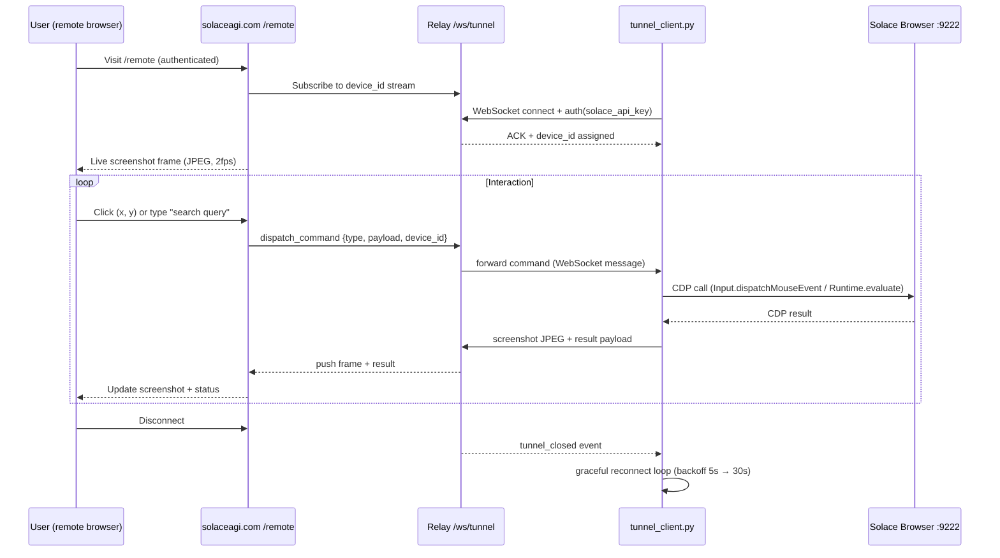

# Paper 38: Remote Browser Control via Tunnel

**Author:** Auth 65537
**Project:** solace-browser + solaceagi.com
**Version:** 1.0 (2026-03-03)
**Status:** Canonical
**Cross-references:** Paper 04 (YinYang Dual-Rail Browser), Paper 06 (Part 11 Evidence), Paper 12 (Deployment Surface Mapping)

---

## Problem

A local Solace Browser running on a user's machine (port 9222) is invisible to the cloud. The
user can control it from `localhost:8791`, but the moment they step away from their desk — or
want to delegate control to a teammate — they lose access.

The naive solution is to forward port 9222 to the public internet. This is dangerous: the Chrome
DevTools Protocol (CDP) running on 9222 has no authentication layer. Anyone who reaches that port
can read DOM contents, intercept credentials, and execute arbitrary JavaScript.

We need remote control **without** exposing raw CDP to the internet. The tunnel architecture
solves this by keeping port 9222 strictly local while routing all commands through an
authenticated, OAuth3-scoped WebSocket relay on solaceagi.com.

---

## Architecture

```
USER'S MACHINE                         SOLACE CLOUD (solaceagi.com)
─────────────────────────────────      ────────────────────────────────────────
  Solace Browser (Playwright)            Cloud Run: FastAPI + WebSocket relay
  → listening on localhost:9222     ←──── wss://www.solaceagi.com/ws/tunnel
                                              │
  tunnel_client.py                           │  authenticated by solace_api_key
  → connects outbound (initiator)            │  device registered as sha256(uid+name)
  → relays CDP ↔ WebSocket                   │
                                             │
  Web UI (localhost:8791)          User at https://www.solaceagi.com/remote
  → local-only fallback                      │
                                       Screenshot stream (2fps JPEG)
                                       Command dispatch (click / type / eval)
```

The client always initiates the outbound WebSocket connection. No inbound ports are opened.
Cloud relay forwards commands in, screenshots out. CDP never leaves the machine.

---

## Mermaid Diagram: Data Flow



---

## Security

### Authentication

Every tunnel WebSocket connection presents the user's `solace_api_key` in the first frame:

```json
{ "type": "auth", "api_key": "sk_browser_xyz789..." }
```

The relay validates this key against Firestore before accepting any further messages. An invalid
key closes the connection immediately with code `4401`.

### Device Registration

The relay assigns a deterministic device ID:

```python
device_id = sha256(f"{user_id}:{device_name}".encode()).hexdigest()[:16]
```

This means the same physical machine always gets the same device ID. The `/remote` page
displays a device selector when a user has multiple registered machines.

### OAuth3 Scope Gating

Commands dispatched through the tunnel are validated against the user's active OAuth3 scopes.
A command targeting Gmail requires the `gmail.read` scope token in the user's vault. The relay
rejects out-of-scope commands before they reach `tunnel_client.py`.

### End-to-End Encryption

All traffic flows over TLS (`wss://`). The CDP messages inside the WebSocket are never stored on
the relay — the relay is a stateless forwarder. Screenshots are ephemeral (not persisted unless
the user explicitly saves them to the evidence vault).

### Anti-CSRF

The `/remote` page uses the Firebase Auth session cookie (SameSite=Strict) plus the
`solace_api_key` header. Direct WebSocket connections from third-party pages are rejected by
CORS policy on the relay endpoint.

---

## Implementation

### tunnel_client.py (local)

```python
import asyncio, websockets, json, base64
from playwright.async_api import async_playwright

RELAY = "wss://www.solaceagi.com/ws/tunnel"
CDP_PORT = 9222

async def run(api_key: str, device_name: str):
    async with websockets.connect(RELAY) as ws:
        # 1. Authenticate
        await ws.send(json.dumps({"type": "auth", "api_key": api_key,
                                   "device_name": device_name}))
        ack = json.loads(await ws.recv())
        device_id = ack["device_id"]
        print(f"Tunnel open: device_id={device_id}")

        # 2. Command loop
        async for raw in ws:
            cmd = json.loads(raw)
            if cmd["type"] == "screenshot":
                shot = await capture_screenshot()
                await ws.send(json.dumps({"type": "frame",
                                          "jpeg": base64.b64encode(shot).decode()}))
            elif cmd["type"] == "cdp":
                result = await send_cdp(cmd["method"], cmd["params"])
                await ws.send(json.dumps({"type": "cdp_result", "result": result,
                                          "seq": cmd.get("seq")}))
```

### Relay endpoint (cloud, FastAPI)

```python
@app.websocket("/ws/tunnel")
async def tunnel_relay(ws: WebSocket, db=Depends(get_db)):
    await ws.accept()
    auth_frame = await ws.receive_json()
    user = await validate_api_key(auth_frame["api_key"], db)
    if not user:
        await ws.close(code=4401); return

    device_id = register_device(user.user_id, auth_frame["device_name"])
    DEVICE_REGISTRY[device_id] = ws  # in-memory, per-instance

    try:
        async for message in ws.iter_json():
            await route_to_subscriber(device_id, message)
    finally:
        DEVICE_REGISTRY.pop(device_id, None)
```

### Screenshot Streaming

`tunnel_client.py` sends a frame every 500ms during an active remote session (2fps). When no
remote viewer is connected, streaming pauses automatically — keeping bandwidth near zero when
the tunnel is idle.

---

## Use Cases

**1. Mobile-to-desktop delegation**
User starts a morning briefing recipe on their laptop, leaves for a meeting, then checks progress
from their phone via `solaceagi.com/remote`. They see the live browser and can type a follow-up
query without returning to their desk.

**2. Teammate handoff**
A Dragon Team member shares their `device_id` with a colleague. The colleague connects via
`/remote?device=<device_id>` (requires team-scoped OAuth3 token). They continue the browser
session collaboratively.

**3. Cloud-scheduled triggers with local execution**
Cloud Scheduler fires a recipe at 6am. The recipe needs the user's local browser (for OAuth3
cookies). The relay wakes `tunnel_client.py` via a push message, the local browser executes,
results sync to the evidence vault. The user wakes up to a completed task.

**4. Support and debugging**
A support agent at Solace (with explicit user consent and a time-limited scope token) connects
to the user's browser to reproduce a bug. The session is logged to the Part 11 evidence vault.
The user can revoke the token at any time from `/vault`.

---

## Summary

The tunnel architecture gives Solace Browser genuine remote control without the security risks
of port forwarding. The local machine stays in control (initiates the connection, validates
scopes, executes CDP). The cloud is a relay, not a proxy. TLS + OAuth3 + device registration
combine to make this safe for production use — including regulated environments that require
Part 11 audit trails.

This paper pairs with Paper 06 (Part 11 Evidence) for the audit-trail specification and Paper
04 (YinYang Dual-Rail Browser) for the local/cloud execution model.
