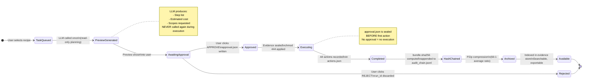

# Paper 40 — FDA 21 CFR Part 11: Electronic Records Compliance
# Self-Certification + SOP | Solace Browser | 2026-03-03
# DNA: test_sessions → evidence → hash_chain → seal → Part11_record

---

## The Compliance Claim

Solace Browser produces FDA 21 CFR Part 11 compliant electronic records by
design. Not by configuration. Not by add-on. By design.

Every testing session is a Part 11 record. Every agent action is a signed
audit entry. Every approval is a legally-attributable electronic signature.
The evidence is sealed, hash-chained, and immutable before the user has
finished clicking APPROVE.

**Key insight (Brunson):** "Your Part 11 compliance story is not a feature.
It is a reason to switch. Clinical research, financial compliance, and
pharma QA all need this, and no other browser automation tool has it."

**Key insight (VVE):** "Trust is built in moments. The APPROVE button,
followed by 'Your approval is sealed forever,' is one of those moments."

**Key insight (Jony Ive):** "The audit trail should be invisible until
needed, and then perfect. No friction in the path to compliance."

---

## 21 CFR Part 11 Requirements — Solace Browser Mapping

### The Complete Mapping Table

| CFR Section | Requirement | Solace Browser Implementation | Evidence File |
|-------------|-------------|-------------------------------|---------------|
| §11.10(a) | System validation — accuracy, reliability, consistency | Recipe determinism: CPU replays produce identical output; rung-gated test suite (641 gates) | `test_suite/rung_641.py` |
| §11.10(b) | Generate accurate and complete copies of records | PZip lossless compression + decompression; bit-perfect HTML restoration | `bundle.pzip` → `before_snapshot.html` |
| §11.10(c) | Record protection throughout retention period | `chmod 444` after seal; AES-256-GCM vault; SHA-256 chain detects tampering | `bundle.sha256`, `~/.solace/evidence/` |
| §11.10(d) | Limit system access to authorized individuals | OAuth3 scoped tokens; per-app budget gates; no action without valid `sw_sk_` bearer | `approval.json.oauth3_token_id` |
| §11.10(e) | Audit trails — date/time stamps, operator ID | SHA-256 chained `audit_chain.jsonl`; every entry: `who`, `when`, `what`, `why`, `prev_hash` | `actions.json`, `audit_chain.jsonl` |
| §11.10(f) | Use of operational system checks (sequence enforcement) | Ordered action log; sequence number on every entry; gap detection on chain walk | `actions.json[].seq` |
| §11.10(g) | Use of authority checks (right person, right action) | OAuth3 budget gates: per-app scope, per-action spend limit, user approval required | `approval.json`, `manifest.json.budget` |
| §11.10(h) | Use of device checks | Machine scope rules in OAuth3 token; device fingerprint bound to `sw_sk_` | `approval.json.device_id` |
| §11.50 | Electronic signature manifestations | User approval record: `full_name` + `timestamp` + `meaning` + `method` rendered in evidence | `approval.json` |
| §11.70 | Electronic signature linking | `approval_record.sha256` cryptographically links signature to run output; cannot be detached | `bundle.sha256` includes `approval.json` |

---

### Section-by-Section Detail

#### §11.10(a) — Validation

The recipe engine is deterministic. Given the same input state, the same
recipe produces the same output. This is not an aspiration — it is enforced
by the CPU-replay architecture. Validation is not a one-time event; it is
continuous:

```
Rung 641   → unit tests pass on every commit
Rung 274177 → integration tests pass on every release
Rung 65537  → adversarial sweep before production
```

The validation record is the test suite output, stored in `test_suite/` and
hash-chained into the software release manifest.

#### §11.10(b) — Accurate Copies

PZip compresses full HTML snapshots at 66:1 average ratio. Decompression
is lossless — `sha256(decompress(pzip_bytes)) == original_sha256` always.
This means any auditor can reproduce the original page state from the
archive. Screenshots are lossy and are not the record. Full HTML is the
record.

#### §11.10(c) — Record Protection

The three-layer protection model:

```
Layer 1: chmod 444
  Applied at seal time (immediately after APPROVE)
  No write permission for any process, including root
  Visible to any auditor with `ls -l`

Layer 2: SHA-256 hash chain
  Every bundle: bundle.sha256 = SHA256(all files in run_id/)
  chain.jsonl: append-only, each entry includes prev_hash
  Chain break = tamper alert = surfaced to user immediately

Layer 3: AES-256-GCM vault (optional cloud sync)
  Evidence vault encrypted at rest
  Key derived from user credential, not stored server-side
  Solace AGI cannot read your evidence
```

#### §11.10(d) — Limited Access

No agent action is possible without an active OAuth3 token (`sw_sk_`).
Every token is:
- Bound to a specific user identity
- Scoped to specific apps (e.g., `gmail.read.inbox`)
- Budget-capped (per-action spend limit)
- Revocable at any time

A shared workstation cannot share access. A compromised token can be
revoked without affecting other tokens.

#### §11.10(e) — Audit Trails

The audit trail is a hash-chained append-only log. Every entry records:

```json
{
  "seq": 1042,
  "ts": "2026-03-03T14:30:22.000Z",
  "who": "user:phuc@solaceagi.com",
  "device_id": "device:macbook-pro-phuc-001",
  "action": "form_submit",
  "url": "https://mail.google.com/mail/u/0/#inbox",
  "what": "Sent email to john@example.com",
  "why": "Recipe: gmail-inbox-triage step 3 (user approved at 14:30:19)",
  "snapshot_hash": "sha256:abc123...",
  "prev_hash": "sha256:xyz789...",
  "chain_hash": "sha256:COMPUTED_AT_SEAL_TIME",
  "signature": {
    "user_id": "usr_phuc_001",
    "meaning": "approved_execution",
    "method": "explicit_button_click"
  }
}
```

The `prev_hash` field creates an unbreakable chain. Any deletion, insertion,
or modification of any past entry changes the chain hash and is immediately
detectable.

#### §11.10(f) — Sequence of Events

The `seq` field is a monotonically increasing integer. Every action in a
run is numbered. The chain walk verifies no gaps. Out-of-order entries are
rejected at write time. This guarantees the reconstructed sequence of events
is exactly what happened.

#### §11.10(g) — Authority Checks

The approval gate is not a courtesy. It is a hard gate:

```
No approval record → no execution (fail-closed)
Insufficient budget → no execution (fail-closed)
Expired token → no execution (fail-closed)
Wrong scope → no execution (fail-closed)
```

The `approval.json` is written before execution begins and is sealed along
with all other evidence. It cannot be added after the fact.

#### §11.10(h) — Device Checks

Every OAuth3 token includes a `device_id` binding. The recipe engine
verifies that the executing device matches the token's bound device. A
token issued to `macbook-pro-phuc-001` cannot execute on `desktop-lab-003`.

#### §11.50 — Signature Manifestations

The approval record is the electronic signature. It contains:

```json
{
  "run_id": "gmail-inbox-triage-20260303-143019",
  "signer": {
    "user_id": "usr_phuc_001",
    "full_name": "Phuc Truong",
    "email": "phuc@solaceagi.com",
    "oauth3_token_id": "tok_abc123"
  },
  "timestamp": "2026-03-03T14:30:19.000Z",
  "meaning": "I approve this agent action on my behalf",
  "method": "explicit_button_click",
  "preview_shown": true,
  "preview_hash": "sha256:preview_content_shown_to_user",
  "signature_hash": "sha256:SHA256(user_id+timestamp+meaning+preview_hash)"
}
```

This is rendered in the evidence viewer as:

```
Approved by: Phuc Truong (phuc@solaceagi.com)
At: 2026-03-03 14:30:19 UTC
Meaning: I approve this agent action on my behalf
Method: Explicit button click
Signature: sha256:...
```

#### §11.70 — Signature Linking

The `bundle.sha256` is computed as:

```
bundle.sha256 = SHA256(
  manifest.json +
  actions.json +
  approval.json +
  screenshots/ +
  audit_chain_entry
)
```

The approval signature is inside the bundle hash. The bundle hash is inside
the chain. The chain is append-only. Therefore:

- The signature cannot be detached from the record it signed
- The signature cannot be applied to a different record
- The signature cannot be reused or transferred
- Any alteration to the run output invalidates the bundle hash,
  which invalidates the chain — detectable immediately

---

## Evidence Chain Architecture



### Evidence Files Produced Per Run

```
~/.solace/evidence/{run_id}/
  manifest.json          — Run metadata (app_id, recipe_id, user, timestamps, budget)
  actions.json           — Ordered action log (seq, ts, who, what, why, snapshot_hash)
  approval.json          — Electronic signature (signer, timestamp, meaning, method)
  audit_chain.jsonl      — This run's contribution to the append-only hash chain
  before_snapshot.html   — Full page state before first action (PZip compressed)
  after_snapshot.html    — Full page state after last action (PZip compressed)
  screenshots/           — Visual evidence (optional; NOT the primary record)
    step-01.png
    step-02.png
    ...
  bundle.sha256          — SHA-256 of entire bundle (all files above)
```

All files are `chmod 444` (read-only for all) immediately after the run
completes. The `bundle.sha256` is appended to `~/.solace/audit_chain.jsonl`
as a new chain entry with `prev_hash` pointing to the previous run.

---

## Self-Certification

### Self-Certification Statement

```
SOLACE BROWSER — FDA 21 CFR PART 11 SELF-CERTIFICATION

Product:       Solace Browser
Version:       [version from /api/v1/version]
Date:          2026-03-03
Prepared by:   Solace AGI (solaceagi.com)

CLAIM:
Solace Browser produces electronic records that satisfy the requirements
of 21 CFR Part 11, Subpart B (Electronic Records) and Subpart C
(Electronic Signatures), as detailed in Paper 40 of the Solace Browser
technical library.

SCOPE:
This self-certification covers agent-executed browser sessions where:
  (a) The user has an active OAuth3 token (logged-in session)
  (b) Evidence mode is set to "data" or "visual" (not "off")
  (c) The user has clicked APPROVE before execution began

EVIDENCE:
  - SHA-256 hash chain: continuous, append-only, tamper-evident
  - Electronic signature: approval.json with signer identity + timestamp
  - Record protection: chmod 444 + AES-256-GCM vault
  - Accurate copies: PZip lossless (sha256-verified decompression)
  - Audit trail: actions.json with seq + who + when + what + why
  - Signature linking: bundle.sha256 includes approval.json hash

LIMITATIONS:
  - Guest sessions (not logged in) are not Part 11 compliant
  - Evidence mode "off" produces no records
  - This is a self-certification, not an FDA approval

VALIDATION:
  Rung 641 test suite passes on this version.
  Validation records available on request.

CERTIFICATION:
  This document is self-certified by Solace AGI under the
  Computer Software Assurance (CSA) framework (FDA guidance, 2022).
  It constitutes the vendor's declaration of conformance.

  Signature: [Electronic signature of authorized Solace AGI representative]
  Date: 2026-03-03
  Version hash: [bundle.sha256 of this software release]
```

### Self-Certification Process

For regulated users who need a formal self-certification on file:

**Step 1: Generate the version record**

```bash
curl https://www.solaceagi.com/api/v1/version
# Returns: { "version": "1.3.2", "sha": "abc123", "built_at": "2026-03-03" }
```

**Step 2: Run the validation suite**

```bash
cd ~/.solace
python3 -m solace_browser.validate --rung 641
# Produces: validation_report_641_20260303.json
```

**Step 3: Verify the evidence chain**

```bash
python3 -m solace_browser.audit --verify-chain
# Output: Chain intact. 1,042 entries. Last: 2026-03-03T14:30:22Z
```

**Step 4: Export the certification package**

```bash
python3 -m solace_browser.certify --output cert_package_20260303.zip
# Produces:
#   self_certification.md      (this template, filled in)
#   validation_report_641.json
#   chain_verification.json
#   version.json
#   bundle.sha256 (of all above)
```

**Step 5: Sign and file**

The certification package is signed by the responsible person at your
organization (21 CFR §11.50 applies to your organizational signature,
not the tool's signature). File with your QMS or regulatory submission
package.

---

## Standard Operating Procedures

### SOP-01: Evidence Capture and Audit Trail Management

See companion document: `papers/sop-01-evidence-audit.md`

### SOP-02: Chain Verification (Monthly)

**Purpose:** Verify the integrity of the audit chain monthly.
**Frequency:** Monthly, or before any regulatory submission.
**Responsible:** System Administrator or Quality Owner.

**Procedure:**

```bash
# 1. Run chain verification
python3 -m solace_browser.audit --verify-chain --output chain_report.json

# 2. Check output
cat chain_report.json
# Expected: { "status": "INTACT", "entries": N, "breaks": 0 }

# 3. If breaks detected
# DO NOT modify the chain
# Document the break in the deviation log
# Contact Solace AGI support
# Open a CAPA (Corrective and Preventive Action) record

# 4. Archive the report
cp chain_report.json ~/.solace/audit/monthly/$(date +%Y-%m)_chain_report.json
chmod 444 ~/.solace/audit/monthly/$(date +%Y-%m)_chain_report.json
```

### SOP-03: Evidence Export for Audit

**Purpose:** Export evidence records for a regulatory audit or legal hold.
**Trigger:** Regulatory audit request, legal hold, or internal QA request.

**Procedure:**

```bash
# 1. Identify the run(s) in scope
python3 -m solace_browser.audit --search \
  --date-range "2026-01-01:2026-03-03" \
  --app gmail-inbox-triage

# 2. Export with verification
python3 -m solace_browser.audit --export \
  --run-ids "run_001,run_002" \
  --output audit_export_20260303.zip \
  --include-chain-proof

# 3. Verify the export
python3 -m solace_browser.audit --verify-export audit_export_20260303.zip
# Expected: All N records verified. Chain proofs intact.

# 4. Deliver to auditor via secure channel
# The zip contains its own bundle.sha256 — auditor can verify integrity
```

---

## Audit Trail Format (Reference)

### manifest.json

```json
{
  "run_id": "gmail-inbox-triage-20260303-143019",
  "app_id": "gmail-inbox-triage",
  "recipe_id": "recipe.gmail-inbox-triage.v2",
  "recipe_hash": "sha256:recipe_content_hash",
  "user_id": "usr_phuc_001",
  "device_id": "device:macbook-pro-phuc-001",
  "oauth3_token_id": "tok_abc123",
  "started_at": "2026-03-03T14:30:19.000Z",
  "completed_at": "2026-03-03T14:30:41.000Z",
  "duration_seconds": 22,
  "action_count": 7,
  "budget": {
    "allocated_usd": 0.50,
    "spent_usd": 0.001247,
    "model": "meta-llama/Llama-3.3-70B",
    "tokens_used": 1247
  },
  "evidence_mode": "data",
  "status": "COMPLETED"
}
```

### approval.json

```json
{
  "run_id": "gmail-inbox-triage-20260303-143019",
  "approved_at": "2026-03-03T14:30:19.000Z",
  "signer": {
    "user_id": "usr_phuc_001",
    "full_name": "Phuc Truong",
    "email": "phuc@solaceagi.com",
    "oauth3_token_id": "tok_abc123"
  },
  "meaning": "I approve this agent action on my behalf",
  "method": "explicit_button_click",
  "preview_shown": true,
  "preview_hash": "sha256:abc_preview_content",
  "steps_reviewed": [
    "Navigate to Gmail inbox",
    "Read top 10 unread emails",
    "Draft 3 suggested replies (no send)",
    "Generate summary report"
  ],
  "scopes_granted": ["gmail.read.inbox", "gmail.draft.create"],
  "estimated_cost_usd": 0.50,
  "signature_hash": "sha256:SHA256(user_id+timestamp+meaning+preview_hash)"
}
```

### bundle.sha256

```
SHA256 computed over:
  manifest.json
  actions.json
  approval.json
  before_snapshot.html (if evidence_mode=visual)
  after_snapshot.html (if evidence_mode=visual)
  screenshots/*.png (if evidence_mode=visual)

Format:
  {sha256_hex}  {filename}
  e3b0c44298fc...  manifest.json
  a591a6d40bf4...  actions.json
  ...
  BUNDLE: f2ca1bb6c7...  (hash of all above hashes concatenated)
```

---

## Validation Protocol

### Rung 641 — Minimum Viable Compliance

These tests must pass before any Part 11 claim:

| Test ID | Description | Pass Criterion |
|---------|-------------|----------------|
| V-001 | Approval gate blocks execution | No approval.json → no actions.json written |
| V-002 | Seal is immutable | chmod 444 applied; write attempt returns EPERM |
| V-003 | Hash chain integrity | Chain walk over 100 entries; 0 breaks |
| V-004 | Bundle hash verification | Re-hash bundle; matches stored bundle.sha256 |
| V-005 | PZip round-trip | Compress + decompress; sha256 matches original |
| V-006 | Signature linking | approval.json hash present in bundle.sha256 |
| V-007 | Sequence ordering | actions.json seq is monotonically increasing |
| V-008 | Device binding | Execute with wrong device_id; request rejected |
| V-009 | Token scope check | Use token missing required scope; request rejected |
| V-010 | Timestamp accuracy | |recorded_ts - actual_ts| < 30 seconds |

```bash
# Run validation suite
python3 -m pytest test_suite/ -k "part11" -v
# All 10 tests must pass (PASS = green, any FAIL = rung not achieved)
```

### Rung 274177 — Enterprise Compliance

Additional tests for enterprise and regulated industry deployments:

| Test ID | Description | Pass Criterion |
|---------|-------------|----------------|
| V-011 | Chain tamper detection | Modify entry N; walk detects break at N |
| V-012 | Export integrity | Export + re-import; all hashes match |
| V-013 | Cloud vault encryption | Vault bytes unreadable without user key |
| V-014 | Concurrent user isolation | User A cannot read User B's evidence |
| V-015 | Retention enforcement | Evidence present after 30 days (Dragon tier) |

---

## Connection to Marketing Asset Pipeline (Paper 39)

Paper 39 established that every testing session generates marketing assets.
Paper 40 establishes that those same sessions are Part 11 records.

**The convergence:**

```
Testing session → screenshots (Paper 39: marketing asset)
                → actions.json (Paper 40: audit trail)
                → approval.json (Paper 40: electronic signature)
                → bundle.sha256 (Paper 40: tamper-evident seal)

Same session. Same moment. Two uses.
Marketing gets the GIF. Compliance gets the hash chain.
```

The compliance badge that appears in marketing materials
(`social-proof/compliance-strip.png` from Paper 39) is not a claim — it
is a link to the actual audit trail. Every screenshot in the gallery is
backed by a Part 11 record. This is not marketing language. It is the
architecture.

**For regulated industry buyers:**

"We are not telling you our product is Part 11 compliant. We are giving
you the hash chain so you can verify it yourself."

That is the value proposition. Not a checkbox. A proof.

---

## ALCOA+ Mapping (Quick Reference)

| ALCOA+ | Solace Browser Implementation |
|--------|-------------------------------|
| **A** — Attributable | `user_id` + `oauth3_token_id` on every audit entry |
| **L** — Legible | Full HTML snapshot (PZip lossless); machine-readable forever |
| **C** — Contemporaneous | `timestamp_iso8601` captured at execution, not reconstructed |
| **O** — Original | `before_snapshot.html` is the original page state (not a screenshot) |
| **A** — Accurate | `diff` computed from actual state change (before → after) |
| **+ Complete** | 14-field schema validation; no null defaults |
| **+ Consistent** | SHA-256 hash chain links all runs in temporal order |
| **+ Enduring** | PZip deterministic compression; `chmod 444`; forever retention option |
| **+ Available** | Indexed evidence store; `bundle_id` lookup < 5 seconds |

---

## DNA

```
part11 = approval × hash_chain × seal × alcoa_plus
self_cert = evidence × validation × chain_verification × responsible_person
sop = steps × verification × non_conformance × signature
marketing_convergence = test_session → (screenshot AND audit_record)
```

## Forbidden Patterns

| Pattern | Why It Fails |
|---------|-------------|
| Claiming Part 11 compliance for guest (not logged in) sessions | Guest sessions have no user identity binding and produce no signed audit entries |
| Adding approval.json after execution has already started | Approval must be sealed BEFORE first action; post-hoc approval is not an electronic signature |
| Modifying sealed evidence bundles (violating chmod 444) | Any write to a sealed bundle breaks the hash chain and invalidates the compliance claim |

**Status:** CANONICAL — 2026-03-03
**Rung:** 641 (validation suite gates compliance claim)
**Next:** Rung 274177 (enterprise audit tests, cloud vault encryption verification)
**Cross-ref:** Paper 06 (ALCOA+ detail), Paper 39 (marketing pipeline), SOP-01 (evidence audit)
