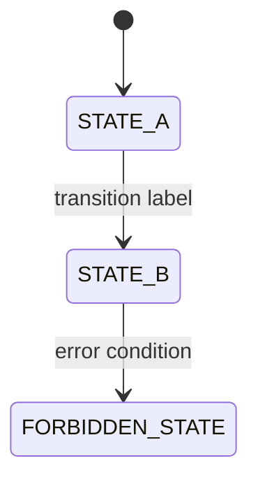

# PrimeWiki Standards — SolaceBrowser

**Version**: 2.0.0 (Prime Mermaid enforcement)
**Authority**: 65537
**Status**: ENFORCED
**Last Updated**: 2026-02-21

> *"Be water."* — Bruce Lee
> Every page is a state. Every action is a transition. Every selector is a portal.

---

## The One Rule

**Prime Mermaid is the ONLY format for PrimeWiki knowledge.**

```
FORBIDDEN: JSON_AS_SOURCE_OF_TRUTH
FORBIDDEN: YAML_AS_SOURCE_OF_TRUTH
FORBIDDEN: SINGLE_FILE_WITHOUT_SHA256
```

JSON/YAML may be generated FROM Prime Mermaid as derived transport (for recipe lookup).
JSON/YAML must NEVER be the source that humans or agents read to understand a page.

---

## Directory Structure

```
primewiki/
  {platform}/                    ← one dir per platform/site
    {platform}-{feature}.mmd     ← canonical Mermaid body (SHA256 source)
    {platform}-{feature}.sha256  ← drift detector
    {platform}-{feature}.prime-mermaid.md  ← human spec + verification
  archive/                       ← deprecated JSON, non-PM files
  PRIMEWIKI_STANDARDS.md         ← this file
  PRIMEWIKI_INDEX.md             ← navigation index across all platforms
  PRIMEMERMAID_TEMPLATE_FIXED.md ← legacy template (reference)
```

### Supported Platform Dirs

| Dir | Platform | PM Status |
|-----|----------|-----------|
| `linkedin/` | LinkedIn | ✅ ACTIVE (PM triplets) |
| `gmail/` | Gmail | ✅ ACTIVE (PM triplets) |
| `notion/` | Notion | ✅ ACTIVE (PM triplets) |
| `reddit/` | Reddit | ✅ ACTIVE (PM triplets) |
| `hackernews/` | HackerNews | ✅ ACTIVE (PM triplets) |
| `amazon/` | Amazon | 🟡 LEGACY (single .md, no SHA256 yet) |
| `archive/` | Deprecated files | ❌ ARCHIVED |

---

## Prime Mermaid Triplet Format (REQUIRED)

Every platform knowledge document MUST be a triplet:

### 1. `{name}.mmd` — Canonical Body



Rules:
- Pure Mermaid syntax only (no comments, no YAML front matter)
- LF newlines
- SCREAMING_SNAKE_CASE for states
- Prefix `FORBIDDEN_` for forbidden/error states
- Gates must have `GATE` or `CHECK` in name

### 2. `{name}.sha256` — Drift Detector

```
{sha256hash}  {name}.mmd
```

Compute with: `sha256sum {name}.mmd > {name}.sha256`

### 3. `{name}.prime-mermaid.md` — Human Spec

Required sections:
1. Header (Node ID, version, format, authority, status, dates)
2. Canonical Files table (with SHA256)
3. Selector Map (state → CSS selector)
4. Embedded Mermaid diagram (for render without .mmd file)
5. Drift detection command

---

## Forbidden Patterns

```yaml
FORBIDDEN_PATTERNS:
  JSON_AS_SOURCE_OF_TRUTH:
    description: "A .json file is the primary record of page knowledge"
    detect: "primewiki/*.json (outside archive/)"
    fix: "Convert to PM triplet; move JSON to archive/"

  YAML_AS_SOURCE_OF_TRUTH:
    description: "A .yaml/.yml file describes page selectors or flows"
    detect: "primewiki/*.yaml"
    fix: "Convert to PM triplet"

  ORPHANED_MMD:
    description: ".mmd file exists without matching .sha256 and .prime-mermaid.md"
    detect: "find primewiki/ -name '*.mmd' | check for matching triplet"
    fix: "Add sha256sum + prime-mermaid.md wrapper"

  SHA256_MISMATCH:
    description: "SHA256 in .sha256 doesn't match actual .mmd bytes"
    detect: "sha256sum -c {platform}/{name}.sha256"
    fix: "If .mmd changed intentionally: recompute sha256. If not: investigate drift."

  STALE_JSON_IN_PRIMEWIKI:
    description: "JSON file exists in primewiki/ (not archive/)"
    detect: "ls primewiki/*.json"
    fix: "Move to archive/"
```

---

## Verification Commands

```bash
# Verify all SHA256s are correct
cd primewiki
for dir in linkedin gmail notion reddit hackernews; do
  for sha_file in $dir/*.sha256; do
    [ -f "$sha_file" ] && (cd $dir && sha256sum -c $(basename $sha_file))
  done
done

# Check for stale JSON (should print nothing)
find primewiki/ -name "*.json" -not -path "*/archive/*"

# Check for orphaned .mmd files (no matching .sha256)
for mmd in primewiki/**/*.mmd; do
  sha="${mmd%.mmd}.sha256"
  [ ! -f "$sha" ] && echo "ORPHANED: $mmd"
done
```

---

## Public vs Private Split

**solace-browser (this repo — public OSS)**:
- Generic platform knowledge: LinkedIn, Gmail, Notion, Reddit, HackerNews, etc.
- Standard automation patterns that work for any user
- No personal sessions, no personal profiles, no private data

**solace-marketing (private repo)**:
- Personal PrimeWiki snapshots (specific accounts, personal profiles)
- Personal session data, credentials patterns
- Private marketing intelligence

Rule: If it has a username, account ID, or personal identifying info → `solace-marketing`.
If it describes a platform generically → `solace-browser`.

---

## Adding a New Platform

```bash
# 1. Create platform dir
mkdir primewiki/{platform}

# 2. Write canonical Mermaid body
# primewiki/{platform}/{platform}-page-flow.mmd
# (State machine or flowchart, SCREAMING_SNAKE_CASE states)

# 3. Compute SHA256
sha256sum primewiki/{platform}/{platform}-page-flow.mmd > primewiki/{platform}/{platform}-page-flow.sha256

# 4. Write human spec
# primewiki/{platform}/{platform}-page-flow.prime-mermaid.md
# (Include: selector map, embedded diagram, drift detection command)

# 5. Add to PRIMEWIKI_INDEX.md

# 6. Commit the triplet
git add primewiki/{platform}/
git commit -m "feat(primewiki): add {platform} PM triplet"
```

---

## Legacy Migration

Files in `archive/` are historical artifacts. They are NOT maintained.
To reference data from archived files: convert to PM triplet format.

| Archived File | PM Successor |
|--------------|-------------|
| `gmail-oauth2-authentication.primewiki.json` | `gmail/gmail-oauth2.prime-mermaid.md` |
| `reddit_login_page.primewiki.json` | `reddit/reddit-login.prime-mermaid.md` |
| `reddit_homepage_loggedout.primewiki.json` | `reddit/reddit-login.prime-mermaid.md` |
| `reddit_subreddit_page.primewiki.json` | `reddit/reddit-login.prime-mermaid.md` |

**Auth**: 65537 | **Northstar**: Phuc_Forecast
