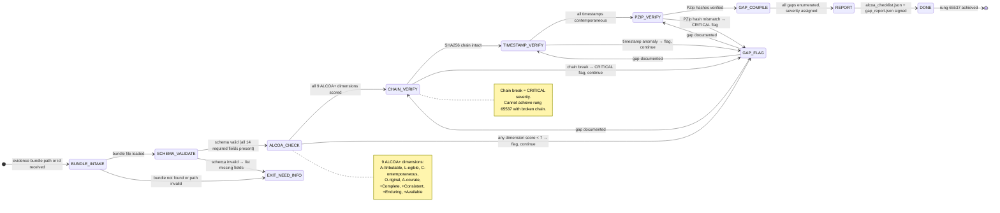

# Recipe: Evidence Review

> "The regulatory auditor walks in with a checklist. Every field must be there. Every timestamp must be real. Every signature must verify. There is no 'mostly compliant.'"
> — Phuc Truong, CRIO founder, Harvard '98

The Evidence Review recipe is the compliance gate for evidence bundles. Before any bundle is accepted as regulatory-grade evidence — for internal audit, customer reporting, or regulatory submission — it must pass this recipe. The recipe checks every ALCOA+ dimension, verifies the SHA256 chain, confirms timestamps are contemporaneous, and validates PZip hashes.

```
REVIEW FLOW:
  BUNDLE_INTAKE → SCHEMA_VALIDATE → ALCOA_CHECK → CHAIN_VERIFY →
  TIMESTAMP_VERIFY → PZIP_VERIFY → GAP_COMPILE → REPORT

HALTING CRITERION: all 9 ALCOA+ dimensions scored,
                   chain verified, gaps enumerated, report signed
```

**Rung target:** 65537
**Lane:** A (produces alcoa_checklist.json + gap_report.json as verifiable artifacts)
**Time estimate:** 30-120 seconds depending on bundle size and chain depth
**Agent:** Evidence Reviewer (swarms/evidence-reviewer.md)

---



---

## Prerequisites

- [ ] Evidence bundle file path or bundle_id provided
- [ ] PZip decompressor available (for hash recomputation)
- [ ] SHA256 verification tool available
- [ ] Token vault readable (to verify token_id references)
- [ ] Evidence store index accessible (for chain walk)

---

## Step 1: Schema Validation

**Action:** Load evidence bundle, validate against schema, confirm all 14 required fields present.

**Required fields (14):**
```
schema_version, bundle_id, action_id, action_type,
before_snapshot_pzip_hash, after_snapshot_pzip_hash, diff_hash,
oauth3_token_id, timestamp_iso8601, sha256_chain_link, signature,
alcoa_fields (nested object), rung_achieved, created_by
```

**Gap if:** Any required field missing → severity HIGH.

---

## Step 2: ALCOA+ Dimension Scoring

**Action:** Score each of the 9 ALCOA+ dimensions (0-10 scale) with evidence.

### A — Attributable (0-10)
```
Check: oauth3_token_id present and resolvable to valid consent record
Score 9-10: token_id resolves to active, valid consent
Score 5-8:  token_id present but consent record not verified
Score 0-4:  token_id missing, null, or does not resolve
```

### L — Legible (0-10)
```
Check: before_snapshot is full HTML (not screenshot, not summary)
Verify: pzip_decompress(before_snapshot_pzip_hash) → HTML with DOCTYPE
Score 9-10: full HTML, parseable, > 5KB
Score 5-8:  HTML present but truncated or partial
Score 0-4:  screenshot only, or plaintext summary
```

### C — Contemporaneous (0-10)
```
Check: timestamp_iso8601 is within ±30 seconds of action window
Verify: |timestamp - action_timestamp| < 30 seconds
Score 9-10: timestamp within 10 seconds of action
Score 5-8:  timestamp 10-60 seconds from action
Score 0-4:  timestamp > 60 seconds from action, or predates action
```

### O — Original (0-10)
```
Check: before_snapshot is original page content, not summary or screenshot
Verify: HTML length > 1000 bytes, DOCTYPE present, no "[SUMMARY]" markers
Score 9-10: full original HTML with all source content
Score 5-8:  HTML present but some elements stripped
Score 0-4:  screenshot-only, AI summary, or truncated to < 1000 bytes
```

### A — Accurate (0-10)
```
Check: diff is non-null and consistent with action_type
Verify: diff computed from before → after, action_type change is visible in diff
Score 9-10: diff shows exactly what action changed, consistent with stated action_type
Score 5-8:  diff present but possibly incomplete
Score 0-4:  diff empty for state-changing action, or diff inconsistent with action
```

### +Complete (0-10)
```
Check: all 14 required fields present, no null values in non-optional fields
Score 9-10: all fields present, no nulls
Score 5-8:  1-2 optional fields missing
Score 0-4:  required fields missing
```

### +Consistent (0-10)
```
Check: sha256_chain_link matches previous bundle's bundle_id
Verify: chain walk shows unbroken sequence
Score 9-10: chain intact, no breaks
Score 0: chain broken (CRITICAL — cannot be > 0 if chain is broken)
```

### +Enduring (0-10)
```
Check: PZip hash is deterministic (same input → same hash)
Verify: recompute pzip_hash from original file, compare to stored
Score 9-10: PZip hash matches on recompute
Score 5-8:  PZip present but hash not recomputable (missing source)
Score 0-4:  PZip hash mismatch (file corruption indicator)
```

### +Available (0-10)
```
Check: bundle retrievable from evidence store by bundle_id
Verify: index lookup returns bundle within 5 seconds
Score 9-10: retrievable in < 5 seconds
Score 5-8:  retrievable but slow (5-30 seconds)
Score 0-4:  not indexed, not retrievable by id
```

---

## Step 3: SHA256 Chain Verification

**Action:** Walk the chain from current bundle back 10 links (configurable).

**Chain walk protocol:**
```
current = bundle
for i in range(chain_depth):
  prev_id = current.sha256_chain_link
  prev = load_bundle(prev_id)
  if prev is None: CHAIN_BREAK at depth i → CRITICAL gap
  if sha256(prev) != prev_id: HASH_MISMATCH → CRITICAL gap
  current = prev
```

**Output:** `chain_verification.json` with chain depth verified, break location if any.

---

## Step 4: Timestamp Verification

**Action:** Verify timestamps are contemporaneous (not backdated or postdated).

**Checks:**
```
1. timestamp_iso8601 parses as valid ISO 8601
2. timestamp within 30 seconds of action_timestamp
3. timestamp not in future (> now() + 60 seconds = anomaly)
4. timestamp later than previous bundle in chain (monotonic)
```

---

## Step 5: PZip Hash Verification

**Action:** Recompute PZip hash from source file, compare to stored.

**Protocol:**
```
stored_hash  = bundle.before_snapshot_pzip_hash
source_file  = evidence_store/snapshots/<bundle_id>_before.pzip
recomputed   = pzip_hash(source_file)
match        = stored_hash == recomputed
```

**Gap if mismatch:** PZIP_HASH_MISMATCH → severity CRITICAL (file corruption).

---

## Step 6: Gap Compilation + Report

**Action:** Aggregate all gaps, assign severity, produce remediation plan.

**Severity assignment:**
```
CRITICAL: chain break | PZip hash mismatch | timestamp > 5 min off | no oauth3_token_id
HIGH:     missing ALCOA dimension score < 3 | missing required fields | signature invalid
MEDIUM:   score 3-6 on any dimension | timestamp 60-300 seconds off
LOW:      score 6-7 on any dimension | minor schema gaps
```

**Report structure:** `alcoa_checklist.json` + `gap_report.json` + `remediation_plan.json`.

---

## Evidence Requirements

| Evidence Type | Required | Format |
|--------------|---------|-------|
| alcoa_checklist.json | Yes | All 9 dimensions scored |
| gap_report.json | Yes | All gaps with severity |
| chain_verification.json | Yes | Chain walk results |
| pzip_verification.json | Yes | Per-snapshot hash results |
| remediation_plan.json | Yes | Remediation for each gap |
| review_evidence_bundle.json | Yes | This review itself is evidenced |

---

## GLOW Score

| Dimension | Score | Notes |
|-----------|-------|-------|
| **G**oal alignment | 10/10 | ALCOA+ compliance is the exact goal |
| **L**everage | 9/10 | One review validates full Part 11 compliance |
| **O**rthogonality | 10/10 | Review never modifies — audit only |
| **W**orkability | 10/10 | SHA256 and PZip verification are deterministic; ALCOA+ criteria are explicit |

**Overall GLOW: 9.75/10**

---

## Skill Requirements

```yaml
required_skills:
  - prime-safety       # god-skill; no bundle modification; no retroactive evidence
  - browser-evidence   # ALCOA+ field map; SHA256 chain; PZip verification; Part 11 schema
```

## Compliance Standards

This recipe satisfies requirements for:
- **21 CFR Part 11** — Electronic records and electronic signatures
- **ALCOA+ data integrity** — FDA guidance for data integrity in regulated industries
- **ISO 27001 Annex A.12.4** — Logging and monitoring
- **SOC 2 Type II** — Availability and integrity criteria (when bundled with access controls)
