```mermaid
stateDiagram-v2
    direction LR
    [*] --> INTAKE : user_intent + platform received
    INTAKE --> INTENT_NORMALIZE : intent parsed, action_type classified
    INTENT_NORMALIZE --> CACHE_LOOKUP : SHA256 cache key computed
    CACHE_LOOKUP --> INTENT_MISMATCH_CHECK : cache hit found
    INTENT_MISMATCH_CHECK --> DONE : existing recipe verified + returned
    INTENT_MISMATCH_CHECK --> PORTAL_BUILD : existing recipe stale/broken
    CACHE_LOOKUP --> OAUTH3_SCOPE_DECLARE : cache miss confirmed
    OAUTH3_SCOPE_DECLARE --> DOM_SNAPSHOT : scopes declared for recipe
    DOM_SNAPSHOT --> PORTAL_BUILD : snapshot captured, ref-map built
    DOM_SNAPSHOT --> EXIT_NEED_INFO : page unavailable or auth required
    PORTAL_BUILD --> STEP_BUILD : portals identified (ARIA-first)
    STEP_BUILD --> TEST_EXECUTE : recipe.json drafted with portals + steps
    TEST_EXECUTE --> EVIDENCE : all steps pass
    TEST_EXECUTE --> PORTAL_BUILD : step fails → revisit portal selection
    EVIDENCE --> CACHE_STORE : evidence_bundle.json signed
    CACHE_STORE --> DONE : pm_triplet.json stored, recipe cached
    DONE --> [*] : rung 274177 achieved

    note right of INTENT_NORMALIZE
        Normalization:
        "post to LinkedIn" → "linkedin.create_post"
        "send email" → "gmail.compose.send"
        Canonical form = cache key input
    end note

    note right of PORTAL_BUILD
        Portal strategy (ARIA first):
        1. aria[role="button"][name="Post"]
        2. role + text content
        3. CSS structural
        4. XPath (last resort)
    end note
```

# Recipe: Recipe Builder

> "I fear not the man who has practiced 10,000 kicks once, but I fear the man who has practiced one kick 10,000 times."
> — Bruce Lee

> Applied to recipes: one recipe replayed 10,000 times beats 10,000 one-off LLM calls.

The Recipe Builder is the cold-miss handler for the recipe engine. When a user's intent has no cached recipe (cache miss), this recipe orchestrates the full build cycle: intent analysis, DOM snapshot, portal identification, step construction, OAuth3 scope declaration, test execution, and evidence-based caching.

```
COLD MISS FLOW:
  USER_INTENT → INTENT_NORMALIZE → CACHE_MISS_CONFIRMED → DOM_SNAPSHOT →
  PORTAL_BUILD → STEP_BUILD → TEST → EVIDENCE → CACHE

HALTING CRITERION: recipe.json cached with test_result PASS,
                   pm_triplet.json stored, evidence_bundle.json signed
```

**Rung target:** 274177
**Lane:** A (produces recipe.json as verifiable artifact)
**Time estimate:** 30-120 seconds (depends on DOM complexity + LLM response)
**Agent:** Recipe Builder (swarms/recipe-builder.md)

---



---

## Prerequisites

- [ ] User intent provided in natural language
- [ ] Platform identified (or inferable from intent)
- [ ] Active browser session for target platform
- [ ] OAuth3 token with appropriate scopes (or consent flow triggered)
- [ ] Recipe cache store accessible

---

## Step 1: Intent Normalization + Cache Lookup

**Action:** Normalize user intent to canonical form, compute SHA256 cache key, check cache.

**Normalization rules:**
```
Raw:        "I want to post something to my LinkedIn"
Normalized: "linkedin.create_post"
Cache key:  sha256("linkedin.create_post" + "linkedin" + "write")
```

**Cache lookup:** If hit → verify existing recipe → return (skip build).
**Cache miss:** proceed to portal build.

**Artifact emitted:** `intent_analysis.json`
```json
{
  "intent_raw": "<user's original phrasing>",
  "intent_normalized": "linkedin.create_post",
  "platform": "linkedin",
  "action_type": "write",
  "cache_key": "<sha256>",
  "cache_hit": false
}
```

---

## Step 2: Declare OAuth3 Scopes

**Action:** Before any DOM interaction, declare the scopes this recipe will require.

**Scope declaration:**
```json
{
  "recipe_scopes": ["linkedin.create_post"],
  "destructive": false,
  "step_up_required": false,
  "scope_rationale": "Recipe navigates to LinkedIn feed and submits a post"
}
```

**Gate:** Scope declaration must be explicit before recipe proceeds. SCOPELESS_RECIPE is forbidden.

---

## Step 3: DOM Snapshot

**Action:** Capture fresh DOM snapshot of target page using browser-snapshot.

**Snapshot protocol:**
1. Navigate to platform's action-relevant page
2. Capture full DOM snapshot (AI mode: _snapshotForAI)
3. Build RoleRefMap (bidirectional: ref → element, element → ref)
4. Confirm snapshot freshness (< 5 seconds old)

**Artifact emitted:** `snapshot.json` with ref-map embedded.

---

## Step 4: Portal Identification

**Action:** From the DOM snapshot, identify portals (elements) needed for each recipe step.

**Portal identification strategy (in order):**
1. ARIA role + accessible name: `aria/[role="button"][name="Start a post"]`
2. Role + visible text: `:text("Start a post")`
3. CSS structural selector
4. XPath (last resort)

Each portal must include a healing chain with at least 2 fallback strategies.

**Artifact emitted:** `portals.json` with all portals + healing chains.

---

## Step 5: Step Construction

**Action:** Build the ordered step sequence from portals + intent.

**Step structure per step:**
```json
{
  "step": 1,
  "action": "click",
  "target_ref": 42,
  "selector": "aria/[role='button'][name='Start a post']",
  "healing_chain": ["[aria-label='Start a post']", ".share-box__open"],
  "checkpoint": true,
  "rollback": "navigate_back",
  "max_retry": 2,
  "timeout_ms": 5000
}
```

**CLOSURE enforcement:** max_steps declared before first step. No unbounded sequences.

---

## Step 6: Test Execution

**Action:** Execute recipe against live DOM. All steps must pass.

**Test protocol:**
- Before-state snapshot captured
- Steps executed in order
- Checkpoint asserted at each checkpoint step
- After-state snapshot captured
- Diff computed (proves action took effect)

**Gate:** test_result.status == "PASS" required. No caching on FAIL.

---

## Step 7: Evidence + Cache

**Action:** Package evidence bundle, sign it, link to chain, store recipe in cache.

**Cache entry:**
```json
{
  "cache_key": "<sha256>",
  "recipe_id": "<sha256>",
  "recipe_version": "1.0.0",
  "test_result": "PASS",
  "cached_at": "<ISO8601>",
  "evidence_bundle_id": "<sha256>"
}
```

**PM Triplet:**
```json
{
  "problem": "User wants to create a post on LinkedIn",
  "method": "Navigate to feed, click 'Start a post', type content, submit",
  "metric": "Post appears in feed within 10 seconds of execution"
}
```

---

## Evidence Requirements

| Evidence Type | Required | Format |
|--------------|---------|-------|
| intent_analysis.json | Yes | Normalized intent + cache miss confirmation |
| snapshot.json | Yes | Fresh DOM snapshot with ref-map |
| portals.json | Yes | All portals with healing chains |
| recipe.json | Yes | Complete recipe with all required fields |
| test_result.json | Yes | Step-by-step test execution results |
| evidence_bundle.json | Yes | Before/after snapshots + diff + chain link |
| pm_triplet.json | Yes | Problem/Method/Metric documentation |

---

## GLOW Score

| Dimension | Score | Notes |
|-----------|-------|-------|
| **G**oal alignment | 10/10 | Cold-miss handler is essential for recipe hit rate growth |
| **L**everage | 10/10 | Every built recipe reduces future LLM costs by ~10x via caching |
| **O**rthogonality | 9/10 | Build and execute are separate steps |
| **W**orkability | 9/10 | TEST_EXECUTE gates caching — no untested recipe is cached |

**Overall GLOW: 9.5/10**

---

## Skill Requirements

```yaml
required_skills:
  - prime-safety            # god-skill; no caching unvalidated recipes
  - browser-recipe-engine   # recipe structure; never-worse; CLOSURE
  - browser-snapshot        # DOM capture; ref-map; portal identification
  - browser-oauth3-gate     # scope declaration; pre-execution gate
  - browser-evidence        # before/after snapshots; evidence bundle
```
