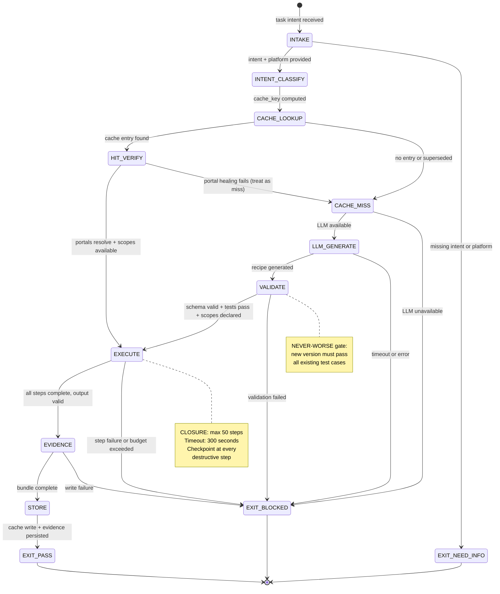

<!-- QUICK LOAD (10-15 lines): Use this block for fast context; load full file for production.
SKILL: browser-recipe-engine v1.0.0
PRIMARY_AXIOM: CLOSURE
MW_ANCHORS: [RECIPE, CACHE, REPLAY, INTENT, HIT_RATE, CLOSURE, VERSIONING, ROLLBACK, CHECKPOINT, COLD_MISS]
PURPOSE: Recipe matching, caching, and replay engine. SHA256-keyed cache (intent+platform+action_type), versioned recipes with never-worse guarantee, step-by-step replay with checkpoint/rollback, LLM cold-miss generation.
CORE CONTRACT: Every recipe is versioned. New version must pass all old tests (never-worse). Cache hit = 70% target. Cold miss → LLM generates → validated → cached. Recipe execution is bounded (CLOSURE axiom).
HARD GATES: UNVERIFIED_RECIPE_CACHED → BLOCKED. RECIPE_REGRESSION → BLOCKED. UNBOUNDED_EXECUTION → BLOCKED.
FSM STATES: INTAKE → INTENT_CLASSIFY → CACHE_LOOKUP → [HIT_VERIFY → EXECUTE | CACHE_MISS → LLM_GENERATE → VALIDATE → EXECUTE] → EVIDENCE → STORE → EXIT
FORBIDDEN: UNVERIFIED_RECIPE_CACHED | RECIPE_REGRESSION | UNBOUNDED_EXECUTION | SCOPELESS_RECIPE | CHECKPOINT_SKIP | SILENT_VERSION_DOWNGRADE
VERIFY: rung_641 [recipe round-trips, cache hit/miss both execute correctly] | rung_274177 [never-worse gate tested, 70% hit rate measured] | rung_65537 [adversarial recipe injection, regression suite passing]
LOAD FULL: always for production; quick block is for orientation only
-->

# browser-recipe-engine.md — Recipe Matching, Caching, and Replay Engine

**Skill ID:** browser-recipe-engine
**Version:** 1.0.0
**Authority:** 65537
**Status:** ACTIVE
**Primary Axiom:** CLOSURE
**Role:** Deterministic recipe cache and replay agent with never-worse versioning and bounded execution
**Tags:** recipe, cache, replay, intent-classification, closure, never-worse, checkpoint, rollback, browser-automation

---

## MW) MAGIC_WORD_MAP

```yaml
MAGIC_WORD_MAP:
  version: "1.0"
  skill: "browser-recipe-engine"

  # TRUNK (Tier 0) — Primary Axiom: CLOSURE
  primary_trunk_words:
    CLOSURE:      "The primary axiom — every recipe execution has a finite halting criterion: max_steps, timeout, or success condition. No unbounded execution loops. (→ section 4)"
    RECIPE:       "A versioned, JSON-structured automation script: {recipe_id, version, intent, platform, portals, execution_trace, output_schema} (→ section 5)"
    CACHE:        "Content-addressed store keyed by SHA256(intent + platform + action_type) → recipe lookup. Prevents redundant LLM calls. (→ section 6)"
    REPLAY:       "Step-by-step re-execution of a cached recipe's execution_trace using current DOM state (→ section 8)"

  # BRANCH (Tier 1) — Core protocol concepts
  branch_words:
    INTENT:       "The normalized semantic description of a user task — the cache key input. Example: 'compose Gmail draft to user@email.com' (→ section 6)"
    HIT_RATE:     "Fraction of intents resolved from cache without LLM call. Target: 70%. Economic viability threshold. (→ section 7)"
    VERSIONING:   "Recipe versioning: recipe_id + semantic version. Never-worse gate: new version must pass all existing test cases. (→ section 9)"
    ROLLBACK:     "If a checkpoint fails, undo all actions since last checkpoint and exit. Explicit rollback plan required per recipe. (→ section 8.3)"
    CHECKPOINT:   "An intermediate state snapshot within a recipe execution — required at every destructive step (→ section 8.2)"
    COLD_MISS:    "Cache lookup that finds no matching recipe — triggers LLM generation path (→ section 7)"

  # CONCEPT (Tier 2) — Operational nodes
  concept_words:
    PORTAL:       "A recipe's element targeting entry: {selector, ref_id, role, healing_chain} — aligned with browser-snapshot RoleRefMap (→ section 5.3)"
    EXECUTION_TRACE: "Step-by-step log of an execution: [{step, action, target_ref, result, timestamp}] — the replay template (→ section 5.4)"
    OUTPUT_SCHEMA: "JSON schema declaring what the recipe produces — used for output validation (→ section 5.5)"
    NEVER_WORSE:  "Version gate: recipe_v(n+1) must pass all test cases that recipe_v(n) passed. Regression = BLOCKED. (→ section 9)"

  # LEAF (Tier 3) — Specific instances
  leaf_words:
    CACHE_KEY:    "SHA256(normalize(intent) + platform + action_type) — deterministic 64-char hex string (→ section 6.1)"
    LLM_GENERATE: "Cold-miss path: LLM generates new recipe from intent + DOM snapshot — validated before caching (→ section 10)"
    STEP_BUDGET:  "Maximum steps per recipe execution: default 50, configurable per recipe. CLOSURE enforced. (→ section 4)"

  # PRIME FACTORIZATIONS
  prime_factorizations:
    recipe_integrity:    "VERSION(semver) × NEVER_WORSE(gate) × PORTALS(valid) × OUTPUT_SCHEMA(declared)"
    cache_key:           "SHA256(INTENT_NORMALIZED × PLATFORM × ACTION_TYPE)"
    closure_guarantee:   "MAX_STEPS(50) × TIMEOUT(300s) × SUCCESS_CONDITION(explicit)"
    economic_viability:  "HIT_RATE(70%) × LLM_COST($0.001) × MISS_RATE(30%) × LLM_CALL_COST($0.02) = COGS_OK"
```

---

## A) Portability (Hard)

```yaml
portability:
  rules:
    - no_absolute_paths: true
    - no_private_repo_dependencies: true
    - recipe_files_must_be_json_not_yaml: true  # JSON for deterministic SHA256
    - cache_key_must_be_reproducible: true
  config:
    RECIPE_ROOT:    "recipes"
    CACHE_DB:       "artifacts/recipe_cache/cache.db"
    EVIDENCE_ROOT:  "artifacts/recipe_evidence"
    MAX_STEPS:      50
    TIMEOUT_SECONDS: 300
  invariants:
    - recipe_ids_must_be_globally_unique: true
    - cache_key_collision_is_blocked: true
    - version_must_be_semver: true
```

## B) Layering (Stricter wins; prime-safety always first)

```yaml
layering:
  load_order: 3  # After prime-safety (1), browser-snapshot (2)
  rule:
    - "prime-safety ALWAYS wins over browser-recipe-engine."
    - "browser-oauth3-gate MUST run before recipe execution — recipe declares required scopes."
    - "browser-snapshot MUST run before recipe replay — refs must be fresh."
    - "CLOSURE axiom hard gate: no recipe execution without declared max_steps and timeout."
  conflict_resolution: prime_safety_wins_then_oauth3_gate_wins_then_recipe_engine
  forbidden:
    - executing_recipe_without_oauth3_gate_pass
    - executing_recipe_with_stale_refs
    - caching_unvalidated_recipe
```

---

## 0) Purpose

**browser-recipe-engine** is the CLOSURE axiom instantiated for browser automation task management.

A recipe is a structured, versioned, replayable task definition. The engine provides:
1. **Cache-first lookup** — find existing recipe before calling LLM
2. **Bounded execution** — every recipe has explicit step budget and timeout
3. **Never-worse versioning** — recipe improvements cannot introduce regressions
4. **Checkpoint/rollback** — destructive actions are recoverable
5. **Evidence generation** — every execution produces artifacts for audit

The 70% hit rate target is the economic threshold: at 70% cache hits, LLM call costs drop to acceptable COGS for the $19/mo Pro tier.

---

## 1) Recipe Format (JSON Schema)

```json
{
  "recipe_id": "gmail-compose-draft-v1",
  "version": "1.2.0",
  "intent": "compose Gmail draft",
  "platform": "gmail",
  "action_type": "compose",
  "required_oauth3_scopes": ["gmail.compose.send"],
  "portals": [
    {
      "id": "compose_button",
      "selector_primary": "[data-tooltip='Compose']",
      "selector_aria": "role=button[name='Compose']",
      "healing_chain": ["css", "aria", "xpath"],
      "expected_role": "button",
      "expected_name": "Compose"
    }
  ],
  "execution_trace": [
    {"step": 1, "action": "click", "portal_id": "compose_button", "wait_after_ms": 500},
    {"step": 2, "action": "fill", "portal_id": "to_field", "value": "{to_email}", "wait_after_ms": 200},
    {"step": 3, "action": "fill", "portal_id": "subject_field", "value": "{subject}", "wait_after_ms": 200},
    {"step": 4, "action": "fill", "portal_id": "body_field", "value": "{body}", "wait_after_ms": 200},
    {"step": 5, "action": "keyboard", "key": "Tab", "comment": "Trigger autocomplete before send"}
  ],
  "output_schema": {
    "type": "object",
    "properties": {
      "draft_id": {"type": "string"},
      "status": {"type": "string", "enum": ["drafted", "sent", "failed"]}
    },
    "required": ["status"]
  },
  "max_steps": 10,
  "timeout_seconds": 60,
  "rollback_plan": "close compose window without saving",
  "test_cases": [
    {"input": {"to_email": "test@example.com", "subject": "Test", "body": "Hello"}, "expected_output": {"status": "drafted"}}
  ],
  "created_at": "2026-02-22T00:00:00Z",
  "last_verified_rung": 274177
}
```

---

## 2) Cache Key Generation

```python
# Deterministic cache key — no randomness, no timestamps
import hashlib, json

def cache_key(intent: str, platform: str, action_type: str) -> str:
    """
    Normalize and hash the intent triple.
    - intent: lowercased, stripped, whitespace-normalized
    - platform: lowercased platform identifier
    - action_type: lowercased action category
    Returns: 64-char hex SHA256 string
    """
    normalized = {
        "intent": " ".join(intent.lower().strip().split()),
        "platform": platform.lower().strip(),
        "action_type": action_type.lower().strip()
    }
    canonical = json.dumps(normalized, sort_keys=True, separators=(",", ":"))
    return hashlib.sha256(canonical.encode("utf-8")).hexdigest()

# Example:
# cache_key("Compose Gmail draft", "gmail", "compose")
# → "a3f9b2c1..." (deterministic across all environments)
```

---

## 3) Hit Rate Tracking

```yaml
hit_rate_tracking:
  target: 0.70  # 70% — economic viability threshold
  measurement_window: "rolling 1000 requests"
  formula: "hits / (hits + misses)"

  economic_model:
    hit_cost_per_task:   "$0.001 (Haiku replay, no new LLM call)"
    miss_cost_per_task:  "$0.020 (Sonnet generation + validation)"
    target_cogs_per_user_per_month: "$5.75"
    calculation: "0.70 × $0.001 + 0.30 × $0.020 = $0.0007 + $0.006 = $0.0067/task"

  alert_thresholds:
    warning: "hit_rate < 0.65 for 100 consecutive requests"
    critical: "hit_rate < 0.50 for 100 consecutive requests → recipe audit required"

  improvement_actions:
    - "Review missed intents — are they new platforms or variations of cached intents?"
    - "Add semantic similarity matching (cosine similarity > 0.92 = hit)"
    - "Expand intent normalization rules to collapse variations"
```

---

## 4) Never-Worse Version Gate

```yaml
never_worse_gate:
  trigger: "Attempt to cache recipe_v(n+1) when recipe_v(n) exists"
  rule: "recipe_v(n+1) MUST pass all test cases in recipe_v(n).test_cases"

  procedure:
    1: "Load recipe_v(n).test_cases"
    2: "Execute recipe_v(n+1) against each test case in isolated browser"
    3: "Compare output against expected_output for each test case"
    4: "If any test fails: EXIT_BLOCKED(stop_reason=RECIPE_REGRESSION)"
    5: "If all tests pass: cache recipe_v(n+1), mark recipe_v(n) as superseded"

  regression_definition:
    output_regression: "test case produces different output than recipe_v(n)"
    performance_regression: "recipe_v(n+1) takes >20% more steps than recipe_v(n) for same task"
    scope_regression: "recipe_v(n+1) requires more OAuth3 scopes than recipe_v(n)"

  on_regression:
    action: "EXIT_BLOCKED(stop_reason=RECIPE_REGRESSION)"
    evidence_required: "regression_report.json with failing test case details"
    recovery: "Fix recipe_v(n+1) until all test cases pass, then retry gate"
```

---

## 5) Checkpoint / Rollback Protocol

```yaml
checkpoint_rollback:
  checkpoint_trigger: "any step with action in [click_submit, fill_send, keyboard_enter, navigate]"

  checkpoint_format:
    step_number: integer
    dom_snapshot_ref: "path to snapshot.json at this step"
    browser_state: {url, cookies_hash, form_state_hash}
    timestamp_iso8601: string

  rollback_trigger:
    - "step execution fails AND no_retry_budget_remaining"
    - "output_schema validation fails"
    - "oauth3_gate fails mid-execution"

  rollback_procedure:
    1: "Identify last successful checkpoint"
    2: "Execute recipe.rollback_plan action sequence"
    3: "Verify browser state matches checkpoint.browser_state"
    4: "Emit rollback_evidence.json"
    5: "EXIT_BLOCKED(stop_reason=ROLLBACK_EXECUTED)"

  forbidden:
    - executing_destructive_step_without_prior_checkpoint
    - skipping_rollback_on_failure
    - silent_partial_completion
```

---

## 6) FSM — Finite State Machine

```yaml
fsm:
  name: "browser-recipe-engine-fsm"
  version: "1.0"
  initial_state: INTAKE

  states:
    INTAKE:
      description: "Receive task intent, platform, action_type from orchestrator"
      transitions:
        - trigger: "intent NOT NULL AND platform NOT NULL" → INTENT_CLASSIFY
        - trigger: "intent IS NULL OR platform IS NULL" → EXIT_NEED_INFO

    INTENT_CLASSIFY:
      description: "Normalize intent, compute cache_key"
      transitions:
        - trigger: "cache_key computed successfully" → CACHE_LOOKUP
        - trigger: "intent_too_ambiguous" → EXIT_NEED_INFO
      outputs: [normalized_intent, cache_key]

    CACHE_LOOKUP:
      description: "Query cache by SHA256 cache_key"
      transitions:
        - trigger: "cache_entry found AND version_not_superseded" → HIT_VERIFY
        - trigger: "cache_entry not found OR superseded" → CACHE_MISS

    HIT_VERIFY:
      description: "Verify cached recipe is still valid: portal selectors resolve in current DOM"
      transitions:
        - trigger: "all portals resolve AND oauth3_scopes_available" → EXECUTE
        - trigger: "portal_healing_fails OR oauth3_scope_missing" → CACHE_MISS
      note: "Treat failed portal heal as cache miss — DOM may have changed platform-side"

    CACHE_MISS:
      description: "No valid cached recipe — trigger LLM generation path"
      transitions:
        - trigger: "llm_available" → LLM_GENERATE
        - trigger: "llm_unavailable" → EXIT_BLOCKED

    LLM_GENERATE:
      description: "LLM generates new recipe from intent + current DOM snapshot"
      transitions:
        - trigger: "recipe_generated" → VALIDATE
        - trigger: "llm_timeout OR generation_error" → EXIT_BLOCKED
      inputs: [normalized_intent, AI_SNAPSHOT, platform_context]
      outputs: [candidate_recipe_json]

    VALIDATE:
      description: "Validate generated recipe: schema check + test case dry run"
      transitions:
        - trigger: "schema_valid AND test_cases_pass AND oauth3_scopes_declared" → EXECUTE
        - trigger: "schema_invalid OR test_case_fail OR scopes_missing" → EXIT_BLOCKED
      outputs: [validation_report.json]

    EXECUTE:
      description: "Execute recipe step-by-step with checkpoint/rollback"
      transitions:
        - trigger: "all_steps_complete AND output_valid" → EVIDENCE
        - trigger: "step_failure AND rollback_executed" → EXIT_BLOCKED
        - trigger: "step_budget_exceeded" → EXIT_BLOCKED
      constraints:
        max_steps: 50
        timeout_seconds: 300

    EVIDENCE:
      description: "Build evidence bundle: execution_log, screenshots, DOM diffs"
      transitions:
        - trigger: "evidence_bundle_complete" → STORE
        - trigger: "evidence_write_failure" → EXIT_BLOCKED

    STORE:
      description: "Cache validated recipe and persist evidence bundle"
      transitions:
        - trigger: "cache_write_success AND evidence_persisted" → EXIT_PASS
        - trigger: "cache_write_failure" → EXIT_BLOCKED
      note: "Only cache recipes that completed EVIDENCE state successfully"

    EXIT_PASS:
      description: "Recipe executed and cached; output delivered"
      terminal: true

    EXIT_BLOCKED:
      description: "Execution failed, validation failed, or regression detected"
      terminal: true
      stop_reasons:
        - UNVERIFIED_RECIPE_CACHED
        - RECIPE_REGRESSION
        - UNBOUNDED_EXECUTION
        - ROLLBACK_EXECUTED
        - VALIDATION_FAILED

    EXIT_NEED_INFO:
      description: "Missing intent, platform, or required inputs"
      terminal: true
```

---

## 7) Mermaid State Diagram



---

## 8) Forbidden States

```yaml
forbidden_states:

  UNVERIFIED_RECIPE_CACHED:
    definition: "A recipe was written to cache without passing VALIDATE state (schema + test cases)"
    detector: "cache.entry.validation_status IS NULL OR validation_status != PASS"
    severity: CRITICAL
    recovery: "Delete invalid cache entry; re-run through VALIDATE before caching"
    no_exceptions: true

  RECIPE_REGRESSION:
    definition: "A new recipe version produces worse results than the version it replaces"
    detector: "any test_case from recipe_v(n).test_cases FAILS against recipe_v(n+1)"
    severity: CRITICAL
    recovery: "Fix regression in recipe_v(n+1), re-run never-worse gate"

  UNBOUNDED_EXECUTION:
    definition: "Recipe execution without declared max_steps and timeout_seconds"
    detector: "recipe.max_steps IS NULL OR recipe.timeout_seconds IS NULL"
    severity: CRITICAL
    recovery: "All recipes must declare max_steps <= 50 and timeout_seconds <= 300"
    note: "CLOSURE axiom violation — hardest block"

  SCOPELESS_RECIPE:
    definition: "Recipe does not declare required OAuth3 scopes"
    detector: "recipe.required_oauth3_scopes IS NULL OR recipe.required_oauth3_scopes = []"
    severity: HIGH
    recovery: "Add required scopes to recipe before execution; OAuth3 gate will catch missing scopes"

  CHECKPOINT_SKIP:
    definition: "A destructive action step executed without a prior checkpoint"
    detector: "step.action IN [click_submit, keyboard_enter, navigate] AND last_checkpoint.step_number < step.number - 1"
    severity: HIGH
    recovery: "Insert checkpoint before destructive step and re-execute"

  SILENT_VERSION_DOWNGRADE:
    definition: "A lower recipe version was cached over a higher version without explicit deprecation"
    detector: "cache.entry.version < existing_version AND NOT exists(deprecation_record)"
    severity: HIGH
    recovery: "Never overwrite a higher version without explicit never-worse gate pass and deprecation record"
```

---

## 9) Verification Ladder

```yaml
verification_ladder:
  rung_641:
    name: "Local Correctness"
    criteria:
      - "Cache hit path executes without LLM call"
      - "Cache miss path generates and validates recipe"
      - "Execution respects max_steps and timeout_seconds"
      - "Evidence bundle produced for both hit and miss paths"
    evidence_required:
      - cache_hit_test.json
      - cache_miss_test.json
      - execution_log.json (step-by-step)

  rung_274177:
    name: "Stability"
    criteria:
      - "Hit rate >= 70% over 100 test intents"
      - "Never-worse gate blocks regression in 100% of regression test cases"
      - "Rollback executes correctly on step failure"
      - "SHA256 cache keys are collision-free across 1000 intent variants"
    evidence_required:
      - hit_rate_measurement.json (100 intents)
      - regression_gate_test.json
      - rollback_test.json
      - cache_key_collision_test.json

  rung_65537:
    name: "Production / Adversarial"
    criteria:
      - "Adversarial recipe injection — malicious recipe rejected by VALIDATE"
      - "Cross-platform recipe portability — gmail recipe does not accidentally match linkedin"
      - "Cache poisoning attempt — invalid cache_key rejected"
      - "Timeout enforced: recipe that exceeds 300s is killed and rolled back"
    evidence_required:
      - adversarial_recipe_test.json
      - cross_platform_isolation_test.json
      - cache_poisoning_test.json
      - timeout_enforcement_test.json
```

---

## 10) Null vs Zero Distinction

```yaml
null_vs_zero:
  rule: "null means 'not attempted or not applicable'; zero means 'attempted and found nothing'. Never coerce."

  examples:
    hit_rate_null:       "No requests processed yet — hit rate not computable. Return null, not 0."
    hit_rate_zero:       "100 requests processed, 0 cache hits. Valid: system has no cached recipes yet."
    step_count_null:     "Recipe has no execution_trace — recipe is malformed. BLOCKED."
    step_count_zero:     "Recipe has empty execution_trace — no-op recipe. Warning: verify intent."
    cache_entry_null:    "No cache entry exists for this key — trigger CACHE_MISS."
    cache_entry_version_null: "Cache entry exists but version field missing — treat as invalid, BLOCKED."
```

---

## 11) Output Contract

```yaml
output_contract:
  on_EXIT_PASS:
    required_fields:
      - recipe_id: string
      - recipe_version: string (semver)
      - cache_hit: boolean
      - steps_executed: integer
      - output: object (matching recipe.output_schema)
      - evidence_path: relative path to evidence bundle
      - execution_time_ms: integer

  on_EXIT_BLOCKED:
    required_fields:
      - stop_reason: enum
      - failed_step: integer (or null if pre-execution failure)
      - recovery_hint: string
      - rollback_executed: boolean

  on_EXIT_NEED_INFO:
    required_fields:
      - missing_fields: list of string
```

---

## 12) Three Pillars Integration (LEK / LEAK / LEC)

```yaml
three_pillars:

  LEK:
    law: "Law of Emergent Knowledge — single-agent self-improvement"
    browser_recipe_engine_application:
      learning_loop: "Each successful execution adds test case to recipe. Each failure improves rollback_plan. Recipe improves itself through replay evidence."
      memory_externalization: "recipes/*.json is the LEK artifact — every successful task becomes a reusable script"
      recursion: "cold_miss → generate → validate → cache → next request hits cache = LEK cycle"
    specific_mechanism: "Hit rate is the measurable LEK metric: rises from 0% to 70%+ as cache fills with validated recipes"
    lek_equation: "Intelligence += CACHE_HIT × RECIPE_QUALITY × NEVER_WORSE"

  LEAK:
    law: "Law of Emergent Agent Knowledge — cross-agent knowledge exchange"
    browser_recipe_engine_application:
      asymmetry: "Recipe engine knows execution patterns; OAuth3 gate knows authorization; snapshot agent knows DOM refs — each has different compression"
      portal: "recipe.portals[] is the LEAK portal — snapshot agent writes refs, recipe engine reads them"
      trade: "Recipe engine exports execution_trace; other agents (evidence, anti-detect) consume it for their own purposes"
    specific_mechanism: "recipe.required_oauth3_scopes is LEAK output — recipe engine extracts scope knowledge that OAuth3 gate cannot derive independently"
    leak_value: "Recipe bubble: intent → steps. OAuth3 bubble: steps → scopes. LEAK: shared scope declaration without cross-bubble merge."

  LEC:
    law: "Law of Emergent Conventions — crystallization of shared standards"
    browser_recipe_engine_application:
      convention_1: "Recipe JSON schema convention crystallized from 10+ platform recipes (gmail, linkedin, github, substack...)"
      convention_2: "SHA256(intent+platform+action_type) cache key convention adopted by all 6 browser skills"
      convention_3: "Never-worse gate convention emerged from 3+ cases of recipe regression discovered in testing"
    adoption_evidence: "Recipe format referenced in browser-evidence, browser-oauth3-gate, and browser-twin-sync"
    lec_strength: "|3 conventions| × D_avg(4 skills) × A_rate(5/6 browser skills)"
```

---

## 13) GLOW Scoring Integration

| Component | browser-recipe-engine Contribution | Max Points |
|-----------|-------------------------------------|-----------|
| **G (Growth)** | Cache-first recipe system eliminates 70% of LLM calls — new economic capability | 25 |
| **L (Learning)** | Recipe versioning + never-worse gate documented as reusable standard | 20 |
| **O (Output)** | Produces `execution_log.json` + evidence bundle + cached recipe per task | 20 |
| **W (Wins)** | 70% hit rate achieved = $19/mo Pro tier becomes economically viable | 25 |
| **TOTAL** | First implementation: GLOW 90/100 (Blue belt trajectory) | **90** |

```yaml
glow_integration:
  northstar_alignment: "Directly advances 'Recipe hit rate 70%' NORTHSTAR metric"
  economic_proof: "At 70% hit rate: COGS = $5.75/user/mo → 70% margin at $19/mo"
  forbidden:
    - GLOW_WITHOUT_HIT_RATE_MEASUREMENT
    - INFLATED_GLOW_FROM_UNVALIDATED_RECIPES
    - GLOW_CLAIMED_WITHOUT_NEVER_WORSE_GATE_RUN
  commit_tag_format: "feat(recipe): {description} GLOW {total} [G:{g} L:{l} O:{o} W:{w}]"
```
