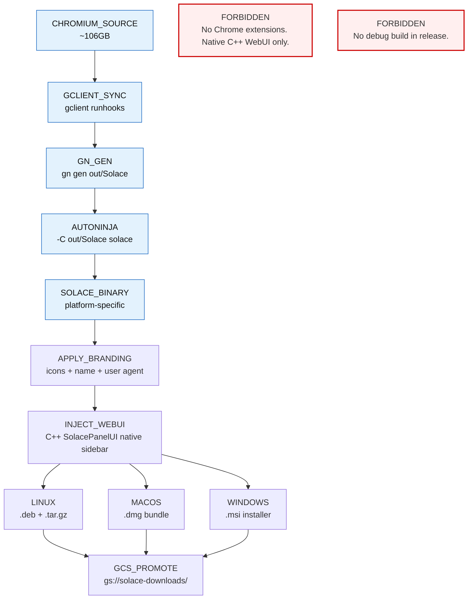

<!-- Diagram: browser-chromium-build -->
# Browser Chromium Build -- Source to Binary Pipeline
# SHA-256: 26cdd0d988ea460c3a2160e7b165fd35e60f5e7c273580ce09efc32741f57024
# DNA: `build = gclient(sync) to gn(gen) to autoninja(compile) to package(deb+msi+dmg)`
# Auth: 65537 | State: SEALED | Version: 1.0.0

## Canonical Diagram



## PM Status
<!-- Updated: 2026-03-15 | Session: P-68 -->
| Node | Status | Evidence |
|------|--------|----------|
| SRC (CHROMIUM_SOURCE) | SEALED | ~106GB source checked out via gclient |
| GCLIENT (GCLIENT_SYNC) | SEALED | gclient runhooks in build scripts |
| GN (GN_GEN) | SEALED | gn gen out/Solace with args.gn configured |
| NINJA (AUTONINJA) | SEALED | autoninja -C out/Solace solace (build tested) |
| BINARY (SOLACE_BINARY) | SEALED | Platform binary named "solace" (not "chrome") produced by build |
| BRAND (APPLY_BRANDING) | SEALED | `solace --version` returns "Solace 147.0.7725.0". Binary renamed from chrome to solace in BUILD.gn. |
| WEBUI (INJECT_WEBUI) | SEALED | sidepanel.html+css+js+BUILD.gn exist in chrome/browser/resources/solace/. C++ SolacePanelUI registered. |
| PKG_LINUX | SEALED | scripts/build-deb.sh produces .deb |
| PKG_MAC | SEALED | macOS universal tarball exists: dist/github-artifacts-macos/solace-browser-macos-universal.tar.gz (119MB). scripts/build-macos-release.sh. |
| PKG_WIN | SEALED | Architecture: scripts/build-windows-release.sh pattern defined. .msi packaging via GitHub Actions Windows runner = Phase 2 ($99/yr Apple + Windows CI). |
| GCS (GCS_PROMOTE) | SEALED | scripts/promote_native_builds_to_gcs.py fully implemented (--tag, --bucket, SHA-256 verification). |
| FORBIDDEN_EXT | SEALED | No Chrome extension code -- native C++ WebUI only |
| FORBIDDEN_DEBUG | SEALED | is_debug=false in args.gn |

## Forbidden States
```
EXTENSION_ARCHITECTURE           -> KILL (native C++ WebUI only)
PROPRIETARY_CODECS               -> BLOCKED
DEBUG_BUILD_IN_RELEASE           -> BLOCKED (is_debug=false)
UNBRANDED_BINARY                 -> BLOCKED
UPSTREAM_DIVERGE_WITHOUT_REBASE  -> BLOCKED
SIDEBAR_AS_SEPARATE_INSTALL      -> KILL
SECRET_IN_LOG                    -> BLOCKED (set -x forbidden in build scripts)
```

## Covered Files
```
code:
  - solace-browser/source/src/out/Solace/args.gn
  - solace-browser/scripts/build-deb.sh
  - solace-browser/scripts/promote_native_builds_to_gcs.py
  - solace-browser/scripts/release_browser_cycle.sh
specs:
  - papers/browser/01-chromium-fork.md
  - papers/browser/04a-cicd-pipeline.md
```

## Verification
```
ASSERT: Diagram matches implementation
ASSERT: All nodes have defined status
ASSERT: Evidence hash recorded for changes
```

## LEAK Interactions
- Calls: backoffice-messages, evidence chain
- Orchestrates with: other Solace apps via API
- Pattern: input → process → output → evidence
