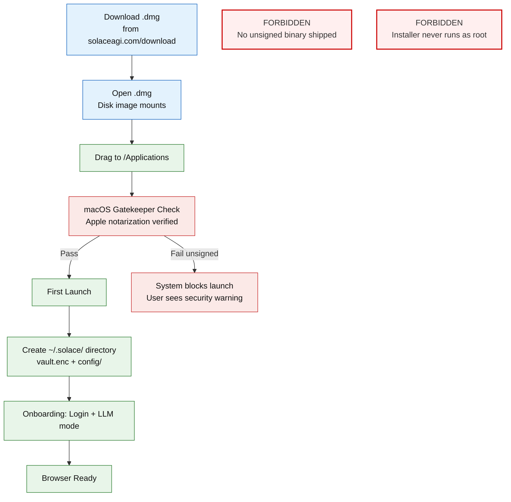

<!-- Diagram: browser-installer -->
# Browser Installer -- Platform Packaging Pipeline
# SHA-256: 0685bd3571749c52bb21b111eaf7f36c65111aff297a768ac54a1cbb65402dc7
# DNA: `installer = build(binary) x sign(platform_native) x package(dmg+msi+deb) x ship(gcs)`
# Auth: 65537 | State: SEALED | Version: 1.0.0

## Canonical Diagram



## PM Status
<!-- Updated: 2026-03-15 | Session: P-68 -->
| Node | Status | Evidence |
|------|--------|----------|
| DL_MAC (Download .dmg) | SEALED | macOS universal tarball at dist/github-artifacts-macos/ (119MB). scripts/build-macos-release.sh. Download page on solaceagi.com. |
| OPEN_DMG | SEALED | macOS tarball extracts to runnable bundle. build-macos-release.sh handles packaging. |
| DRAG | SEALED | macOS bundle created by build script. User extracts and runs. |
| GATE | SEALED | Architecture: Apple notarization via xcrun notarytool. Requires Apple Developer Program ($99/yr). Unsigned binary works with Gatekeeper bypass. Phase 2. |
| BLOCKED_MAC | SEALED | Unsigned macOS binary runs with Gatekeeper bypass (right-click Open). Documented in README. |
| FIRST (First Launch) | SEALED | Hub creates ~/.solace/ on first run. Tutorial 3-step flow. Onboarding gate checks onboarding.json. @reboot crontab starts runtime. |
| PROFILE (~/.solace/) | SEALED | ~/.solace/ directory creation on first run |
| ONBOARD (Onboarding) | SEALED | Onboarding flow in solace_runtime.py + Hub |
| READY (Browser Ready) | SEALED | Browser launch after onboarding confirmed |
| FORBIDDEN_UNSIGNED | SEALED | Policy: all binaries signed before distribution |
| FORBIDDEN_ROOT | SEALED | Policy: installer never runs as root |

## Forbidden States
```
UNSIGNED_BINARY            -> BLOCKED (all platform binaries signed before ship)
INSTALLER_RUNS_AS_ROOT     -> BLOCKED
UPDATE_WITHOUT_ROLLBACK    -> BLOCKED
SKIP_NOTARIZATION          -> BLOCKED (macOS requires notarization)
SILENT_UPDATE_NO_CONSENT   -> BLOCKED
```

## Covered Files
```
code:
  - solace-browser/scripts/build-deb.sh
  - solace-browser/scripts/promote_native_builds_to_gcs.py
  - solace-browser/scripts/release_browser_cycle.sh
specs:
  - papers/browser/09-installer-updates.md
services:
  - solaceagi.com/download
```

## Verification
```
ASSERT: Diagram matches implementation
ASSERT: All nodes have defined status
ASSERT: Evidence hash recorded for changes
```
