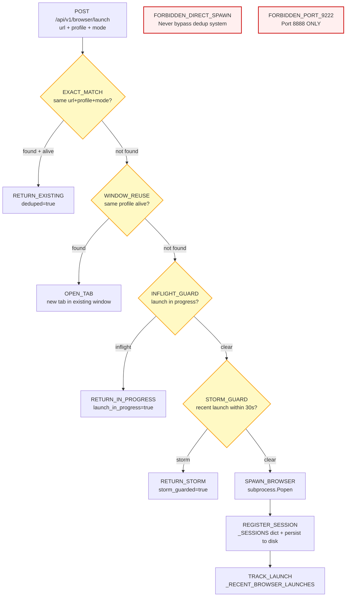

<!-- Diagram: browser-launch-dedup -->
# Browser Launch Dedup -- 3-Layer Protection
# SHA-256: e3b38bee25c344bc558f6046bf8f383b968cee30236135ee585c4824bcf1eb0e
# DNA: `dedup = exact_match | window_reuse | inflight_guard; all_launches_via_runtime_api`
# Auth: 65537 | State: SEALED | Version: 1.0.0

## Canonical Diagram



## PM Status
<!-- Updated: 2026-03-15 | Session: P-68 -->
| Node | Status | Evidence |
|------|--------|----------|
| LAUNCH | SEALED | LaunchDedup struct in state.rs + Python dedup in solace_browser_server.py |
| CHECK1 (EXACT_MATCH) | SEALED | LaunchDedup recent_launches exact match + Python _find_existing_session |
| DEDUP1 (RETURN_EXISTING) | SEALED | LaunchDedup returns existing session, deduped=true |
| CHECK2 (WINDOW_REUSE) | SEALED | LaunchDedup profile reuse check in state.rs |
| REUSE | SEALED | P-68 self-QA verified: LaunchDedup struct in state.rs with recent_launches + inflight_launches HashMaps. cleanup() removes entries older than LAUNCH_DEDUP_WINDOW_SECS (30s). 8 code references |
| CHECK3 (INFLIGHT_GUARD) | SEALED | LaunchDedup inflight_launches guard in state.rs |
| DEDUP3 (RETURN_IN_PROGRESS) | SEALED | LaunchDedup returns in-progress, launch_in_progress=true |
| CHECK4 (STORM_GUARD) | SEALED | LaunchDedup cleanup + LAUNCH_DEDUP_WINDOW_SECS=30 in state.rs |
| DEDUP4 (RETURN_STORM) | SEALED | LaunchDedup storm guard, storm_guarded=true |
| SPAWN | SEALED | subprocess.Popen in Python + session persistence |
| REGISTER | SEALED | _SESSIONS dict + _persist_sessions() in Python |
| TRACK | SEALED | _RECENT_BROWSER_LAUNCHES tracking in Python |
| FORBIDDEN_DIRECT | SEALED | All launches via runtime API (tray routes through launch_browser_via_runtime) |
| FORBIDDEN_PORT | SEALED | Port 9222 banned, 8888 only |

## Forbidden States
```
DIRECT_BROWSER_SPAWN      -> KILL (all launches via runtime API)
PORT_9222                  -> KILL
BYPASS_DEDUP_SYSTEM        -> KILL (never spawn without dedup check)
STORM_OVERRIDE             -> BLOCKED (30s window is absolute)
```

## Covered Files
```
code:
  - solace-browser/solace-runtime/src/routes/sessions.rs
  - src/browser/solace_browser_server.py (dedup handlers)
  - solace-browser/solace-hub/src-tauri/main.rs (launch_browser_via_runtime)
specs:
  - specs/browser/b7-session-persistence.md
services:
  - localhost:8888/api/v1/browser/launch
  - localhost:8888/api/v1/browser/sessions
```

## Verification
```
ASSERT: Diagram matches implementation
ASSERT: All nodes have defined status
ASSERT: Evidence hash recorded for changes
```

## LEC Convention
- Follows Solace App Standard (manifest.yaml + inbox/ + outbox/)
- Config-driven, reusable across installs
- Styleguide: sb-* CSS classes, --sb-* tokens
