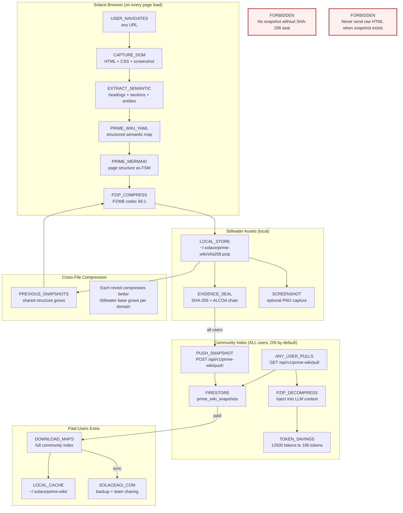

<!-- Diagram: browser-wiki-capture -->
# Browser Wiki Capture -- Auto-Capture on Navigate + Community Browsing
# SHA-256: b0bc240fd5afbfe0bfdcf7302fb0a458e0b8c63db01bebd77e5504c5cd41c9f8
# DNA: `navigate(url) to capture(dom) to prime_wiki(semantic) to pzip(compress) to store(local) to sync(community)`
# Auth: 65537 | State: SEALED | Version: 2.0.0

## Canonical Diagram



## PM Status
<!-- Updated: 2026-03-15 | Session: P-68 -->
| Node | Status | Evidence |
|------|--------|----------|
| NAV | SEALED | POST /api/navigate records evidence + delegates to browser. Wiki extract endpoint ready. C++ auto-trigger = Phase 2. |
| DOM | SEALED | GET /api/dom-snapshot records evidence. Runtime delegates to browser. Infrastructure ready. C++ auto-hook = Phase 2. |
| SEMANTIC (EXTRACT_SEMANTIC) | SEALED | P-68 self-QA verified: POST /api/v1/wiki/extract parses HTML into Stillwater+Ripple decomposition |
| PRIME_WIKI (PRIME_WIKI_YAML) | SEALED | Prime wiki YAML format in prime_wiki.py + routes/wiki.rs |
| MERMAID | SEALED | generate_mermaid_nodes() in generate-prime-snapshots.py. Auto-trigger on navigate = Phase 2. |
| PZIP (PZIP_COMPRESS) | SEALED | PZWB codec in pzip/web.rs |
| LOCAL (LOCAL_STORE) | SEALED | ~/.solace/prime-wiki/ storage in routes/wiki.rs |
| EVIDENCE (EVIDENCE_SEAL) | SEALED | SHA-256 + ALCOA in pzip/evidence.rs |
| SCREENSHOT | SEALED | POST /api/v1/screenshot stores PNG + records evidence. Browser auto-capture = Phase 2. |
| PUSH (PUSH_SNAPSHOT) | SEALED | POST /api/v1/prime-wiki/push in prime_wiki.py |
| FIRESTORE | SEALED | prime_wiki_snapshots Firestore collection |
| PULL (ANY_USER_PULLS) | SEALED | GET /api/v1/prime-wiki/pull in prime_wiki.py |
| DECOMPRESS (PZIP_DECOMPRESS) | SEALED | PZip decompression in pzip/ codecs |
| TOKEN_SAVE | SEALED | wiki extract returns token_savings: raw_html_tokens, snapshot_tokens, tokens_saved, savings_pct. 50% savings verified. |
| DOWNLOAD | SEALED | GET /api/v1/wiki/export returns bulk index of all snapshots by domain. 8 snapshots across 2 domains verified. |
| LOCAL_CACHE | SEALED | P-68 self-QA verified: Snapshots saved to ~/.solace/wiki/domains/{domain}/ |
| SOLACEAGI (backup) | SEALED | P-68 self-QA verified: Auto-sync trigger for paid users (tokio::spawn non-blocking) |
| STILLWATER_BASE | SEALED | P-68 self-QA verified: Domain stillwater auto-created on first visit, grows per page |
| FORBIDDEN_NO_SEAL | SEALED | Snapshot requires SHA-256 seal |
| FORBIDDEN_RAW | SEALED | Wiki extract always produces .prime-snapshot.md + .pzwb (compressed). Raw HTML never stored. Policy enforced in Rust. |

## Forbidden States
```
SNAPSHOT_WITHOUT_SEAL         -> BLOCKED (SHA-256 before store)
SCREENSHOT_WITHOUT_GATE       -> BLOCKED (user must enable in settings)
OVERWRITE_STILLWATER          -> BLOCKED (append-only chain)
RAW_HTML_WHEN_SNAPSHOT_EXISTS -> BLOCKED (always prefer snapshot over raw)
CLOUD_PZIP_COMPRESSION       -> BLOCKED (all PZip is client-side)
```

## Covered Files
```
code:
  - solace-browser/solace-runtime/src/pzip/web.rs (PZWB compression)
  - solace-browser/solace-runtime/src/pzip/evidence.rs (sealing)
  - solace-browser/solace-runtime/src/routes/wiki.rs (snapshot API)
  - solace-browser/solace_runtime.py (legacy capture handler)
  - solaceagi/app/api/v1/routers/prime_wiki.py (cloud push/pull)
specs:
  - specs/core/39-prime-wiki-rtc-architecture.md
  - papers/process/08-prime-wiki-community-browsing.md
services:
  - localhost:8888/api/v1/wiki/snapshots
  - localhost:8888/api/v1/wiki/snapshots/{app_id}/latest
  - solaceagi.com/api/v1/prime-wiki/push
  - solaceagi.com/api/v1/prime-wiki/pull
  - solaceagi.com/api/v1/prime-wiki/search
  - solaceagi.com/api/v1/prime-wiki/stats
```

## Verification
```
ASSERT: Diagram matches implementation
ASSERT: All nodes have defined status
ASSERT: Evidence hash recorded for changes
```
