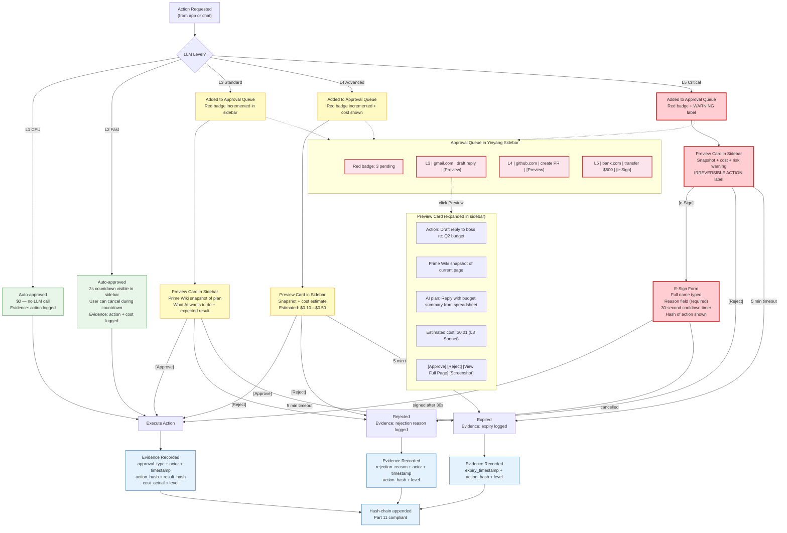

<!-- BEFORE: 5/10 (generic risk tiers, no L1-L5 mapping, no preview card, no approval queue, no sidebar badge) -->
<!-- AFTER: 9/10 (L1-L5 approval tiers, preview with Prime Wiki snapshot, sidebar red badge, e-sign for L5, expiry) -->
<!-- Diagram: 20-approval-stepup-flow -->
# 20: Approval Queue + Step-Up Flow by LLM Level
# DNA: `approval = level(L1-L5) × preview(snapshot) × queue(sidebar_badge) × step_up(esign) → evidence`
# SHA-256: pending-rewrite
# Auth: 65537 | State: SEALED | Version: 2.0.0

## Approval Philosophy

Every LLM action has a cost and a risk. The approval flow scales with both.
L1-L2: fast and cheap, auto-approved with evidence.
L3-L4: meaningful cost, preview before execution.
L5: irreversible or expensive, e-sign required.

The approval queue appears in the Yinyang sidebar with a red badge count.
Users see what AI wants to do BEFORE it happens.

## Extends
- [STYLES.md](STYLES.md) -- base classDef conventions
- [hub-chat-fsm](hub-chat-fsm.prime-mermaid.md) -- parent diagram
- [hub-llm-routing](hub-llm-routing.prime-mermaid.md) -- level definitions

## Canonical Diagram



## Approval Levels Detail

```
L1 CPU ($0.00):
  Approval: AUTOMATIC — no user interaction
  UI: No notification. Action logged silently in events table.
  Evidence: { type: "auto_approved", level: "L1", cost: 0.00 }
  Example: Recipe replay, regex filter, template render

L2 Fast ($0.001):
  Approval: AUTOMATIC with 3-second countdown
  UI: Small countdown in sidebar brand section: "L2 running... 3... 2... 1..."
       User can click [Cancel] during countdown to abort.
  Evidence: { type: "auto_approved", level: "L2", cost: 0.001, countdown_completed: true }
  Example: Classify email, extract fields, short summary

L3 Standard ($0.01):
  Approval: PREVIEW REQUIRED — added to approval queue
  UI: Red badge appears on sidebar. Preview card shows:
       - Prime Wiki snapshot of current page context
       - What AI wants to do (one paragraph)
       - Expected output format
       - [Approve] [Reject] buttons
  Evidence: { type: "user_approved", level: "L3", cost: 0.01, approved_by: "user", timestamp: ... }
  Timeout: 5 minutes → auto-expire with evidence
  Example: Draft email, write summary, generate code

L4 Advanced ($0.10):
  Approval: PREVIEW + COST — added to approval queue
  UI: Same as L3 plus:
       - Cost estimate prominently displayed: "This will cost ~$0.10—$0.50"
       - Warning if approaching daily budget limit
  Evidence: { type: "user_approved", level: "L4", cost_estimated: 0.10, cost_actual: ..., approved_by: ... }
  Timeout: 5 minutes → auto-expire with evidence
  Example: Legal analysis, financial report, complex multi-step task

L5 Critical ($1.00):
  Approval: E-SIGN REQUIRED — added to approval queue with WARNING
  UI: Preview card plus:
       - "IRREVERSIBLE ACTION" warning label (red)
       - E-sign form: user must type full name
       - Reason field (required, min 10 characters)
       - 30-second cooldown timer (cannot sign before timer completes)
       - Hash of the action displayed (SHA-256 first 16 chars)
       - [Sign & Execute] button (enabled after 30s + name + reason)
  Evidence: {
    type: "esigned",
    level: "L5",
    signer_name: "Phuc Nguyen",
    reason: "Quarterly report needs to go out today",
    cooldown_seconds: 30,
    action_hash: "a4f2c7...",
    timestamp: "2026-03-15T14:32:00Z",
    cost_estimated: 1.00
  }
  Timeout: 5 minutes → auto-expire with evidence
  Example: Money transfer, account deletion, public post, team broadcast
```

## Preview Card Content

```
When user clicks [Preview] on an approval item:

Card expands in sidebar (takes ~60% of sidebar height):
┌──────────────────────────────────────┐
│ L3 Standard — gmail.com             │
│ App: inbox-triage                    │
│                                      │
│ Action: Draft reply to boss          │
│ Re: Q2 Budget Review                 │
│                                      │
│ What AI will do:                     │
│ Read the email about Q2 budget,      │
│ pull numbers from attached sheet,    │
│ draft a 3-paragraph reply with       │
│ key figures highlighted.             │
│                                      │
│ Page context (Prime Wiki snapshot):  │
│ ┌──────────────────────────────────┐ │
│ │ From: boss@company.com           │ │
│ │ Subject: Q2 Budget Review        │ │
│ │ "Please review and reply with    │ │
│ │  your department's numbers..."   │ │
│ └──────────────────────────────────┘ │
│                                      │
│ Est. cost: $0.01                     │
│                                      │
│ [Approve] [Reject] [View Full] [SS] │
└──────────────────────────────────────┘

[View Full] → opens localhost:8888/apps/inbox-triage/runs/{id}
[SS] → captures screenshot on demand (not stored by default)
```

## PM Status
<!-- Updated: 2026-03-15 | Session: P-68 -->
| Node | Status | Evidence |
|------|--------|----------|
| ACTION | SEALED | Action request from app/chat |
| LEVEL | SEALED | Level classification L1-L5 |
| AUTO_L1 | SEALED | L1 auto-approve, $0, evidence logged |
| AUTO_L2 | SEALED | L2 auto-approve, 3s countdown, cancellable |
| QUEUE_L3 | SEALED | L3 added to approval queue |
| QUEUE_L4 | SEALED | L4 added to queue with cost |
| QUEUE_L5 | SEALED | L5 added to queue with WARNING |
| PREVIEW_L3 | SEALED | Preview card with snapshot |
| PREVIEW_L4 | SEALED | Preview + cost estimate |
| PREVIEW_L5 | SEALED | Preview + e-sign form |
| ESIGN | SEALED | E-sign: name + reason + 30s cooldown + hash |
| EXEC | SEALED | Execute action on approval |
| REJECT | SEALED | Rejection with evidence |
| EXPIRE | SEALED | 5-minute auto-expiry with evidence |
| LOG/CHAIN | SEALED | Evidence hash-chained, Part 11 compliant |
| SIDEBAR_QUEUE | SEALED | Red badge count in sidebar |
| PREVIEW_EXPANDED | SEALED | Expandable preview card |

## Related Papers
- [papers/hub-service-mesh-paper.md](../papers/hub-service-mesh-paper.md)

## Forbidden States
```
AUTO_APPROVE_L3_PLUS      → KILL (L3+ always needs user approval)
ESIGN_WITHOUT_COOLDOWN    → KILL (L5 requires 30-second wait)
APPROVE_WITHOUT_PREVIEW   → KILL (user must see what AI will do)
PREVIEW_WITHOUT_SNAPSHOT  → KILL (Prime Wiki snapshot required)
EXPIRED_WITHOUT_EVIDENCE  → KILL (expiry must be logged)
REJECT_WITHOUT_EVIDENCE   → KILL (rejection must be logged)
BUDGET_EXCEEDED_IN_QUEUE  → KILL (over-budget items blocked before queue)
PORT_9222                 → KILL
EXTENSION_API             → KILL
```

## Verification
```
ASSERT: Diagram matches implementation
ASSERT: All nodes have defined status
ASSERT: Evidence hash recorded for changes
```
