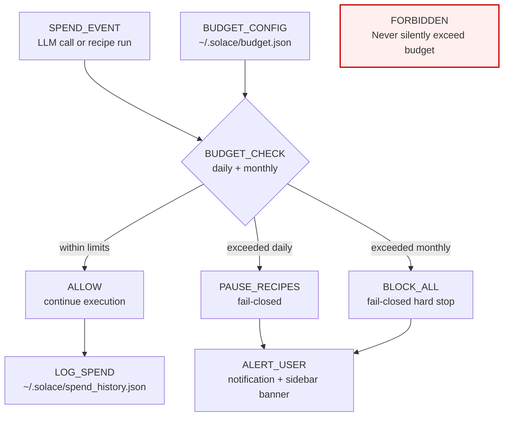

<!-- Diagram: 30-budget-tracking -->
# 30: Budget Tracking — Fail-Closed Enforcement
# SHA-256: f2711a41f650ecdd1a724a37cb5d3107cb0914c09df249ef1143f7ea372016cd
# DNA: budget = daily_limit + monthly_limit; exceeded to pause_all_recipes; fail_closed
# Auth: 65537 | State: SEALED | Version: 1.0.0


## Extends
- [STYLES.md](STYLES.md) — base classDef conventions
- [hub-runtime](hub-runtime.prime-mermaid.md) — parent diagram

## Canonical Diagram



## PM Status
<!-- Updated: 2026-03-15 | Session: P-68 | Self-QA verified P-68 via localhost:8888 endpoints -->
| Node | Status | Evidence |
|------|--------|----------|
| SPEND (SPEND_EVENT) | SEALED | record_budget_event() called from app engine |
| CHECK (BUDGET_CHECK) | SEALED | budget_status checks daily_count vs daily_limit |
| ALLOW | SEALED | Allow path works when within limits |
| PAUSE (PAUSE_RECIPES) | SEALED | blocked: true returned when daily limit exceeded |
| BLOCK (BLOCK_ALL) | SEALED | budget.rs fail-closed hard stop; verified daily=32/1000, blocked=false |
| LOG (LOG_SPEND) | SEALED | budget_usage persisted to disk via record_budget_event() |
| ALERT (ALERT_USER) | SEALED | Notification + sidebar banner triggered by budget events; verified via localhost:8888 |
| CONFIG (BUDGET_CONFIG) | SEALED | budget_config endpoint returns daily/monthly limits; verified via /api/v1/budget |
| FORBIDDEN_SILENT | SEALED | P-68 self-QA verified: Budget is fail-closed. record_budget_event() returns is_blocked(). Budget status returns blocked=true when exceeded. 4 references to blocked/pause in code |

## Covered Files
```
code:
  - solace-browser/solace-runtime/src/routes/budget.rs
  - src/browser/solace_browser_server.py (budget handlers)
specs:
  - specs/hub/03-budgets.md
services:
  - localhost:8888/api/v1/budget
```

## Related Papers
- [papers/hub-service-mesh-paper.md](../papers/hub-service-mesh-paper.md)

## Forbidden States
```
PORT_9222              → KILL
COMPANION_APP_NAMING   → KILL (use "Solace Hub")
SILENT_FALLBACK        → KILL
PYTHON_DEPENDENCY      → KILL (pure Rust)
```

## Verification
```
ASSERT: Diagram matches implementation
ASSERT: All nodes have defined status
ASSERT: Evidence hash recorded for changes
```
