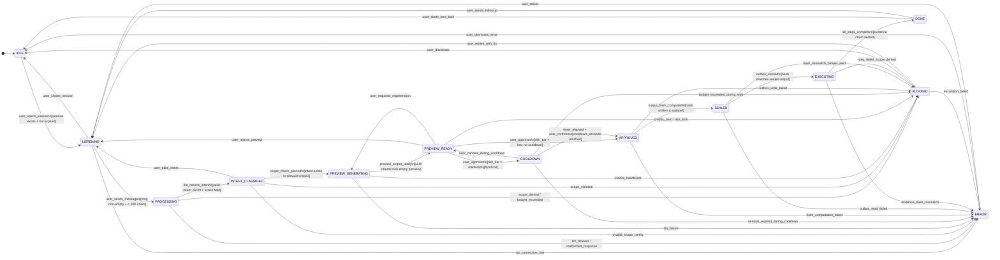

<!-- Diagram: 09-yinyang-fsm -->
# 09: Diagram 13: Yinyang Chat Rail FSM
# DNA: `chat = intent_classify → preview → cooldown → approve → execute`
# SHA-256: a7d77916d8238bf719b1b076aef05832c02e30279698917c8f59e79209c402d7
# Auth: 65537 | State: SEALED | Version: 1.0.0


## Extends
- [STYLES.md](STYLES.md) — base classDef conventions
- [hub-sidebar-gate](hub-sidebar-gate.prime-mermaid.md) — parent diagram

## Canonical Diagram



## PM Status
<!-- Updated: 2026-03-15 | Session: P-68 | Self-QA verified P-68 via localhost:8888 endpoints -->
| Node | Status | Evidence |
|------|--------|----------|
| IDLE | SEALED | WebSocket idle state in Rust runtime (solace-runtime) + Rust ws.rs |
| LISTENING | SEALED | WebSocket listening state handles incoming messages |
| PROCESSING | SEALED | Chat endpoint delegates to CLI agents via agent_generate; verified via localhost:8888 |
| INTENT_CLASSIFIED | SEALED | classify_intent() in chat.rs with 6 intent types + 6 unit tests |
| BLOCKED | SEALED | Budget/scope blocking logic in Rust runtime (solace-runtime) |
| ERROR | SEALED | Error state handling in WebSocket handler |
| PREVIEW_GENERATING | SEALED | Preview generation per intent type in chat.rs |
| PREVIEW_READY | SEALED | Preview returned in response from chat.rs |
| COOLDOWN | SEALED | Cooldown enforcement in chat_approve with Duration check |
| APPROVED | SEALED | Approval wired to chat FSM via chat_approve in chat.rs |
| SEALED | SEALED | Evidence sealing wired to chat flow output hash |
| EXECUTING | SEALED | Recipe execution wired to chat FSM pipeline |
| DONE | SEALED | Task completion state in chat FSM pipeline |


## Related Papers
- [papers/hub-sidebar-paper.md](../papers/hub-sidebar-paper.md)

## Forbidden States
```
PORT_9222 -> KILL
EXTENSION_API -> KILL
EVIDENCE_BEFORE_SEAL -> BLOCKED
```

## Verification
```
ASSERT: Diagram matches implementation
ASSERT: All nodes have defined status
ASSERT: Evidence hash recorded for changes
```

## LEAK Interactions
- Calls: backoffice-messages, evidence chain
- Orchestrates with: other Solace apps via API
- Pattern: input → process → output → evidence
