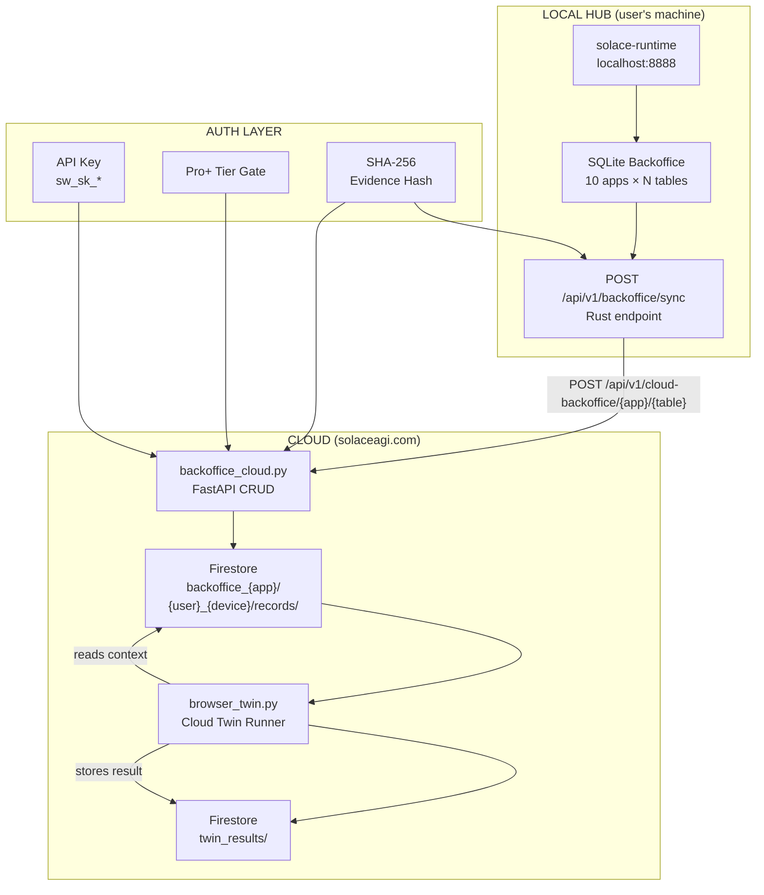

<!-- Diagram: hub-cloud-backoffice -->
# Cloud Backoffice Sync — Local SQLite → Firestore → Cloud Twin
# DNA: `cloud_backoffice = local_sqlite × sync(firestore) × twin(read) → evidence(hash)`
# Auth: 65537 | State: GOOD | Version: 1.1.0

## Canonical Diagram



## PM Status

| Node | Status | Evidence |
|------|--------|----------|
| RT (solace-runtime) | SEALED | 41 MCP tools, 88+ apps, localhost:8888 |
| SQL (SQLite Backoffice) | SEALED | 10 apps, CRUD working (session P-73) |
| SYNC (local sync endpoint) | PENDING | Rust route needed in solace-runtime |
| CRUD (FastAPI cloud routes) | SEALED | 7 routes, 24/24 tests pass, tier gate + user isolation |
| FS (Firestore collections) | SEALED | backoffice_{app}_{table} collections, user_id namespaced |
| TWIN (Cloud Twin reads FS) | GOOD | POST /twin/run/{twin_id} reads backoffice context |
| RESULT (twin_results) | GOOD | twin_results Firestore collection, hash-chained evidence |
| KEY (API Key auth) | SEALED | sw_sk_* pattern, get_current_user dep |
| TIER (Pro+ gate) | SEALED | Tier check in auth middleware |
| HASH (Evidence hash) | SEALED | SHA-256 pattern from remote.py |

## Data Flow

```
1. LOCAL: App runs → writes to SQLite backoffice
2. SYNC:  Runtime reads SQLite → POST each table to cloud
3. CLOUD: FastAPI validates auth + tier → writes to Firestore
4. TWIN:  Cloud Twin reads Firestore context → runs app logic
5. EVIDENCE: Every sync/read produces hash-chained audit entry
```

## Firestore Schema

```
backoffice_{app_id}/{user_id}_{device_id}/records/{record_id}
  ├── id: string (UUID)
  ├── created_at: string (ISO 8601)
  ├── updated_at: string (ISO 8601)
  ├── created_by: string (user_id or "system")
  ├── evidence_hash: string (SHA-256)
  ├── synced_at: string (ISO 8601)
  ├── source_device: string (device_id)
  └── ... (app-specific columns from SQLite schema)
```

## Sync Protocol

```
Push (local → cloud):
  1. Read records from SQLite WHERE updated_at > last_sync_at
  2. For each record: POST /api/v1/cloud-backoffice/{app_id}/{table}
  3. Record evidence: {app, table, record_count, hash, timestamp}
  4. Update last_sync_at in local sync state

Pull (cloud → local):
  NOT IMPLEMENTED (one-way push for v1.0)
  Future: GET /api/v1/cloud-backoffice/{app_id}/{table}?since={timestamp}
```

## Forbidden States

- `SYNC_WITHOUT_AUTH` — KILL (every sync must authenticate)
- `CROSS_USER_DATA` — KILL (user_id namespacing mandatory)
- `CLOUD_WRITES_LOCAL` — KILL (push-only in v1.0)
- `SYNC_WITHOUT_EVIDENCE` — KILL (every sync produces hash)
- `FREE_TIER_SYNC` — KILL (Pro+ only)
- `BARE_EXCEPT` — KILL (typed exceptions only)
- `FLOAT_MONETARY` — KILL (Decimal for cost tracking)

## Extends

- specs/hub/diagrams/hub-evidence.prime-mermaid.md (evidence chain)
- specs/hub/diagrams/hub-domain-tab-coordination.prime-mermaid.md (domain model)
- remote.py (Firestore CRUD pattern — COPY THIS)
- vault_sync.py (auth + propagation pattern)
