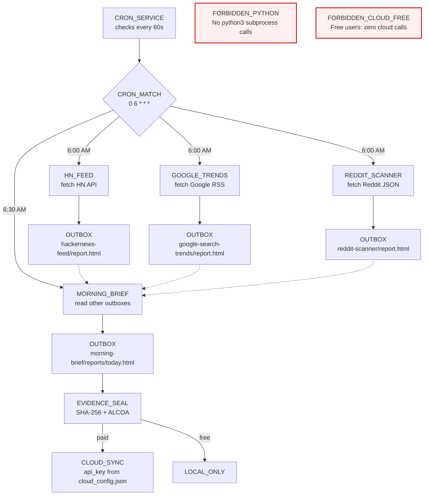

<!-- Diagram: 14-cron-morning-cycle -->
# 14: Cron + Morning Cycle
# SHA-256: cf41cb4a74cb5348d81ccf627960036a5c1a231a95bbff95339b884e5e6fda91
# DNA: `cron(6am) → feeds(parallel) → morning_brief(synthesize) → evidence(seal) → sync(paid)`
# Auth: 65537 | State: SEALED | Version: 1.0.0


## Extends
- [STYLES.md](STYLES.md) — base classDef conventions
- [hub-runtime](hub-runtime.prime-mermaid.md) — parent diagram

## Canonical Diagram



## PM Status
<!-- Updated: 2026-03-14 | Session: P-67 -->
| Node | Status | Evidence |
|------|--------|----------|
| CRON | SEALED | cron.rs 60s loop + schedules.json + tests |
| MATCH (CRON_MATCH) | SEALED | Cron expression matching in cron.rs |
| HN | SEALED | hackernews-feed/run.py fetches HN API + tests |
| GOOGLE | SEALED | google-search-trends/run.py fetches Google RSS + tests |
| REDDIT | SEALED | reddit-scanner/run.py fetches Reddit JSON + tests |
| OUTBOX_HN | SEALED | hackernews-feed/outbox/report.html produced |
| OUTBOX_GOOGLE | SEALED | google-search-trends/outbox/report.html produced |
| OUTBOX_REDDIT | SEALED | reddit-scanner/outbox/report.html produced |
| BRIEF | SEALED | morning-brief/run.py reads other outboxes + LLM synthesis |
| OUTBOX_BRIEF | SEALED | morning-brief/reports/today.html produced |
| EVIDENCE | SEALED | Evidence sealing in pzip/evidence.rs |
| SYNC | SEALED | Cloud sync for paid users in cloud.rs |
| LOCAL | SEALED | Local-only path for free users |
| FORBIDDEN_PYTHON | SEALED | No python3 subprocess calls — all run via app engine |
| FORBIDDEN_CLOUD_FREE | SEALED | Free users get zero cloud calls |

## Covered Files
```
code:
  - solace-browser/solace-runtime/src/cron.rs
  - solace-browser/solace-runtime/src/app_engine/runner.rs
  - data/default/apps/hackernews-feed/run.py
  - data/default/apps/google-search-trends/run.py
  - data/default/apps/reddit-scanner/run.py
  - data/default/apps/morning-brief/run.py
  - scripts/run-morning-cycle.sh
  - ~/.solace/daemon/schedules.json
services:
  - localhost:8888/api/schedules
```


## Related Papers
- [papers/hub-three-realms-paper.md](../papers/hub-three-realms-paper.md)

## Forbidden States
```
PORT_9222              → KILL
COMPANION_APP_NAMING   → KILL (use "Solace Hub")
SILENT_FALLBACK        → KILL
PYTHON_DEPENDENCY      → KILL (pure Rust)
```

## Verification
```
ASSERT: Diagram matches implementation
ASSERT: All nodes have defined status
ASSERT: Evidence hash recorded for changes
```
