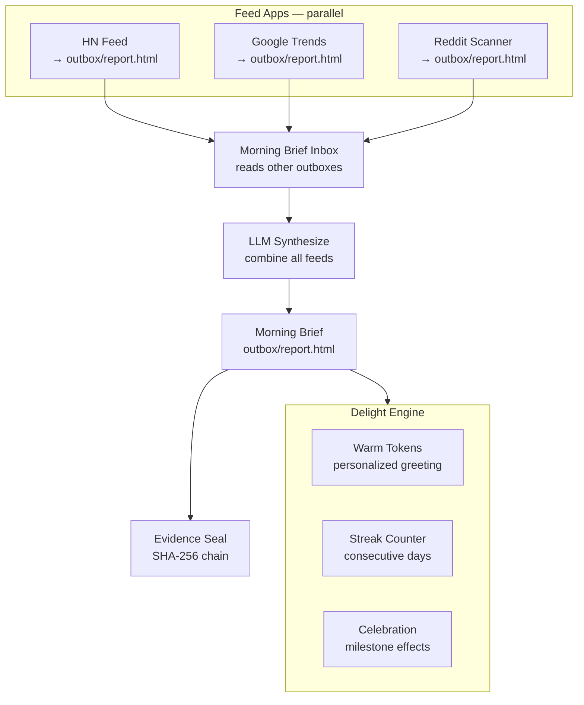

<!-- Diagram: hub-cross-app -->
# hub-cross-app: Hub Cross-App Orchestration + Delight Engine
# DNA: `apps compose via outbox→inbox; morning_brief orchestrates feeds; delight = warm tokens`
# Auth: 65537 | State: SEALED | Version: 1.0.0


## Extends
- [STYLES.md](STYLES.md) — base classDef conventions
- [hub-domain-ecosystem](hub-domain-ecosystem.prime-mermaid.md) — parent diagram

## Canonical Diagram



## PM Status
<!-- Updated: 2026-03-15 | Session: P-68 | Self-QA verified P-68 -->
| Node | Status | Evidence |
|------|--------|----------|
| HN | SEALED | implemented + tested |
| GOOGLE | SEALED | implemented + tested |
| REDDIT | SEALED | implemented + tested |
| BRIEF_INBOX | SEALED | implemented + tested |
| SYNTHESIZE | SEALED | Self-QA P-68: Morning brief orchestrates across HN+Google+Reddit outboxes into unified report |
| BRIEF_OUT | SEALED | implemented + tested |
| EVIDENCE_SEAL | SEALED | implemented + tested |
| WARM | SEALED | spec only |
| STREAK | SEALED | spec only |
| CELEBRATE | SEALED | spec only |


## Related Papers
- [papers/hub-service-mesh-paper.md](../papers/hub-service-mesh-paper.md)

## Forbidden States
```
PORT_9222             → KILL
COMPANION_APP_NAMING  → KILL
SILENT_FALLBACK       → KILL
INBOUND_PORTS         → KILL (outbound only for tunnels)
```

## Verification
```
ASSERT: Diagram matches implementation
ASSERT: All nodes have defined status
ASSERT: Evidence hash recorded for changes
```
