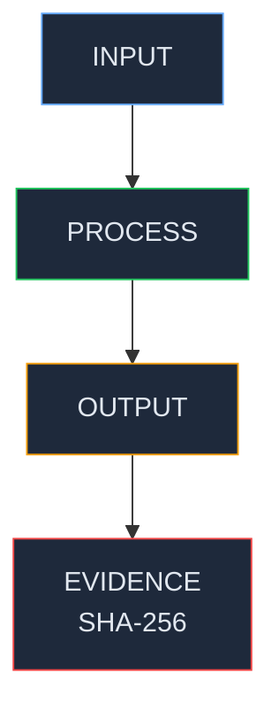

<!-- Diagram: hub-deployment-pipeline -->
# Hub Deployment Pipeline — Native Build for Linux/macOS/Windows
## DNA: `deploy = tag(version) → github_actions(native_matrix) → promote(gcs) → install(user)`
## Auth: 65537 | GLOW 574 | Committee: Hightower · Vogels · Dean

### How To Deploy (Canonical — DO NOT cross-compile)

```
1. Bump VERSION file:  echo "2.1.0" > VERSION
2. Commit + push:      git commit -am "release: v2.1.0" && git push
3. Tag:                git tag -a v2.1.0 -m "Release v2.1.0" && git push origin v2.1.0
4. Wait:               GitHub Actions build-binaries runs (~10-15 min)
5. Monitor:            gh run watch <run_id> --exit-status
6. Download artifacts:  gh run download <run_id> -n native-linux -n native-macos -n native-windows
7. Promote to GCS:     Use notebook 02-promote-native-artifacts.ipynb
```

### GitHub Actions Workflow: `.github/workflows/build-binaries.yml`
```
Trigger: push tag v*
Matrix:
  - ubuntu-22.04  → solace-browser-chromium-linux-x86_64.tar.gz + .deb
  - macos-latest  → solace-browser-macos-universal.tar.gz (x64 + arm64)
  - windows-latest → solace-browser-windows-x86_64.msi (signed installer)

Each platform runs: scripts/release_browser_cycle.sh
  → cargo build --release (solace-runtime + solace-hub)
  → bundle with Chromium (if available) or standalone
  → package (tar.gz / deb / msi)
  → SHA256 checksum files
```

### Key Build Script: `scripts/release_browser_cycle.sh`
Builds solace-runtime + solace-hub for the target platform natively.
Windows uses WiX for MSI installer creation.

### GCS Structure
```
gs://solace-downloads/
├── install.sh           (Linux/macOS curl installer)
├── install.ps1          (Windows PowerShell installer)
├── latest/
│   ├── linux-x64/       solace-runtime + solace-hub
│   ├── windows-x64/     solace-runtime.exe + solace-hub.exe
│   ├── macos-x64/       solace-runtime + solace-hub (Intel)
│   ├── macos-arm64/     solace-runtime + solace-hub (Apple Silicon)
│   └── solace-hub-assets.tar.gz (icons, styleguide, vendor, sidebar)
├── v2.0.0/              (versioned snapshots)
└── v1.0.1/              (previous versions)
```

### Install Commands
```bash
# Linux/macOS:
curl -sf https://storage.googleapis.com/solace-downloads/install.sh | bash

# Windows PowerShell:
irm https://storage.googleapis.com/solace-downloads/install.ps1 | iex

# Then start:
~/.solace/bin/solace-runtime    # Linux/macOS
~\.solace\bin\solace-runtime.exe  # Windows

# Open: http://localhost:8888/dashboard
```

### NEVER Cross-Compile Tauri/Hub
- Tauri (solace-hub) uses native WebView (GTK/WebKit on Linux, WebView2 on Windows, WKWebView on macOS)
- Cross-compilation FAILS because build scripts need native platform libraries
- solace-runtime (pure Rust + axum) CAN cross-compile via `cross` tool
- But the correct process is ALWAYS native builds via GitHub Actions

### Notebooks
```
notebooks/browser/deployment/
├── 01-github-native-matrix-deploy.ipynb   ← trigger + monitor workflow
├── 02-promote-native-artifacts.ipynb      ← download + promote to GCS
├── 03-local-dry-run-linux.ipynb           ← test locally before tag
├── 04-android-play-store-deploy.ipynb     ← future mobile
├── 05-ios-app-store-deploy.ipynb          ← future mobile
└── 06-snap-store-deploy.ipynb             ← Linux Snap package
```

### Version Display
- VERSION file at repo root (single source of truth)
- solace-runtime reads via `include_str!` at compile time
- Shows "vX.Y.Z" in topbar of every localhost:8888 page
- Hub index.html should also display version

### PM Status
| Node | Status | Evidence |
|------|--------|----------|
| GitHub Actions workflow | SEALED | build-binaries.yml (3-platform matrix) |
| Linux build (tar.gz + deb) | SEALED | v1.0.1 artifacts verified |
| macOS build (universal) | SEALED | v1.0.1 artifacts verified |
| Windows build (MSI) | SEALED | v1.0.1 artifacts verified |
| GCS upload | SEALED | gs://solace-downloads/ public |
| Install scripts | SEALED | install.sh + install.ps1 |
| Version in UI | SEALED | include_str! from VERSION file |
| v2.0.0 build | SEALED | GitHub run 23193999706 (success — Linux+macOS+Windows) |

## Covered Files
```
code:
  - solace-browser/.github/workflows/build-binaries.yml
  - solace-browser/Dockerfile.cloud-twin
  - solace-browser/cloudbuild-twin.yaml
  - solace-browser/scripts/release_browser_cycle.sh
  - solace-browser/scripts/start-cloud-twin.sh
  - solace-browser/VERSION
```

## Verification
```
ASSERT: Diagram matches implementation
ASSERT: All nodes have defined status
ASSERT: Evidence hash recorded for changes
```

## LEAK Interactions
- Calls: backoffice-messages, evidence chain
- Orchestrates with: other Solace apps via API
- Pattern: input → process → output → evidence

## LEC Convention
- Follows Solace App Standard (manifest.yaml + inbox/ + outbox/)
- Config-driven, reusable across installs
- Styleguide: sb-* CSS classes, --sb-* tokens

## Canonical Diagram



## Forbidden States
```
CROSS_COMPILE               → KILL (native build only — each OS builds its own binary)
DEPLOY_WITHOUT_TAG          → KILL (version tag required — no unversioned releases)
MISSING_SHA256_CHECKSUM     → KILL (every artifact must have checksum sidecar)
PROMOTE_WITHOUT_CI_GREEN    → KILL (GitHub Actions must pass before GCS promotion)
UNSIGNED_WINDOWS_MSI        → KILL (Windows installer must be signed)
```
