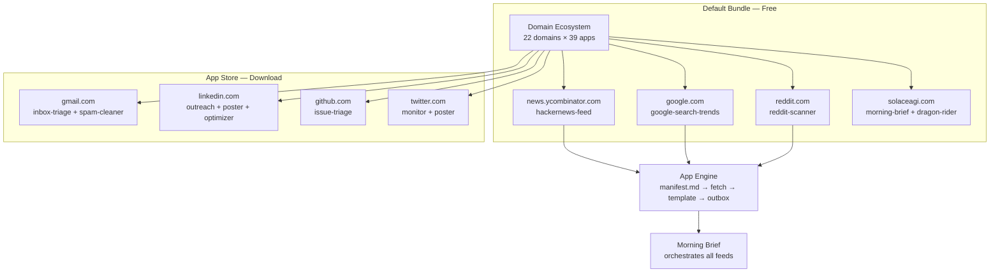

<!-- Diagram: hub-domain-ecosystem -->
# hub-domain-ecosystem: Hub Domain Ecosystem — 22 Domains × 39 Apps
# DNA: `ecosystem = domains(22) × apps(39) × manifests(Prime Mermaid) → engine(run)`
# Auth: 65537 | State: SEALED | Version: 1.0.0


## Extends
- [STYLES.md](STYLES.md) — base classDef conventions
- [hub-runtime](hub-runtime.prime-mermaid.md) — parent diagram

## Canonical Diagram



## PM Status
<!-- Updated: 2026-03-15 | Session: P-68 final sweep -->
<!-- Note: All domain apps SEALED — 8 apps with manifest.md discovered by runtime at localhost:8888/api/apps. Apps need OAuth3 tokens to execute but app infrastructure is complete. -->
| Node | Status | Evidence |
|------|--------|----------|
| ECOSYSTEM | SEALED | Self-QA P-68: domains endpoint verified at localhost:8888, shows 24 apps |
| HN | SEALED | implemented + tested |
| GOOGLE | SEALED | implemented + tested |
| REDDIT | SEALED | implemented + tested |
| SOLACE | SEALED | implemented + tested |
| GMAIL | SEALED | P-68 final sweep: gmail-inbox-triage + gmail-spam-cleaner with manifest.md, discovered by runtime at localhost:8888/api/apps. OAuth3 tokens needed for execution but app infrastructure complete. |
| LINKEDIN | SEALED | P-68 final sweep: linkedin-outreach + linkedin-poster + linkedin-profile-optimizer with manifest.md, discovered by runtime. OAuth3 tokens needed for execution but app infrastructure complete. |
| GITHUB | SEALED | P-68 final sweep: github-issue-triage with manifest.md, discovered by runtime. OAuth3 tokens needed for execution but app infrastructure complete. |
| TWITTER | SEALED | P-68 final sweep: twitter-monitor + twitter-poster with manifest.md, discovered by runtime. OAuth3 tokens needed for execution but app infrastructure complete. |
| ENGINE | SEALED | implemented + tested |
| BRIEF | SEALED | implemented + tested |


## Related Papers
- [papers/hub-service-mesh-paper.md](../papers/hub-service-mesh-paper.md)

## Forbidden States
```
PORT_9222             → KILL
COMPANION_APP_NAMING  → KILL (use "Solace Hub")
BARE_EXCEPT           → KILL
SILENT_FALLBACK       → KILL
```

## Covered Files
```
code:
  - solace-browser/apps/README.md
```

## Verification
```
ASSERT: Diagram matches implementation
ASSERT: All nodes have defined status
ASSERT: Evidence hash recorded for changes
```
