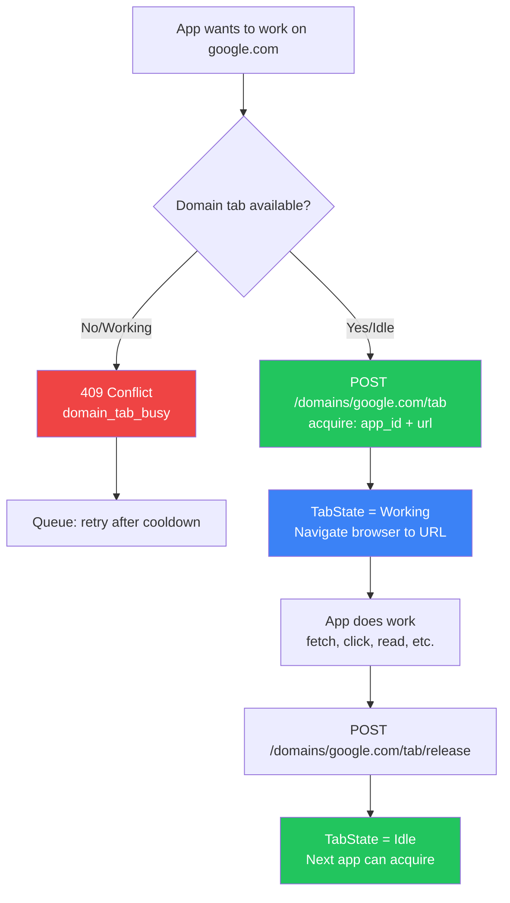
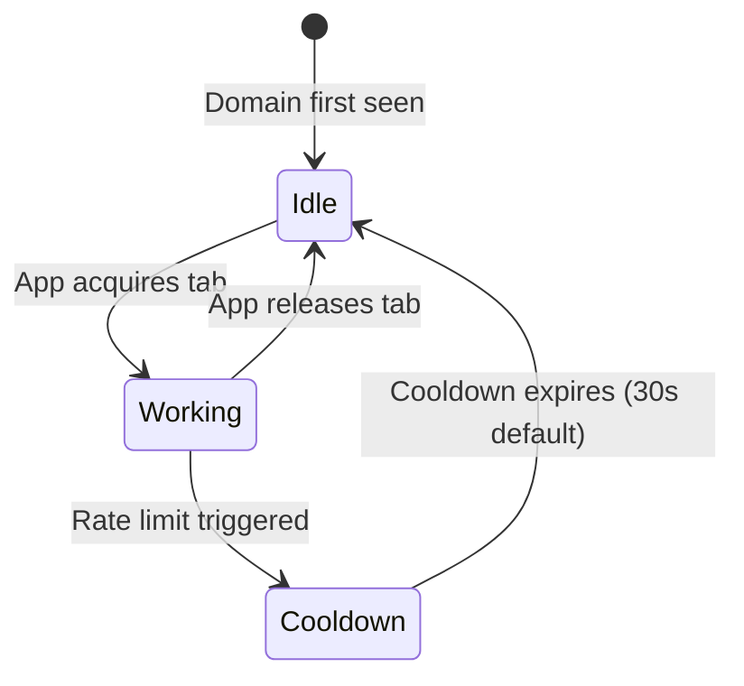

<!-- Diagram: hub-domain-tab-coordination -->
# Hub Domain Tab Coordination (GLOW 564)
## DNA: `tab(domain) = acquire(app) → work(url) → release(); 1_tab_per_domain`
## Auth: 65537 | Paper 55 | Committee: Hickey · Dean · Gregg

### Architecture Rule
```
SINGLE BROWSER MODE (default):
  browser = 1 per session (kill all before launch)
  tabs    = 1 per domain  (apps queue, acquire/release)
  result  = predictable, reportable, throttled

MULTI BROWSER MODE (advanced):
  browser = N per session (allow_duplicate=true or mode="multi")
  tabs    = still 1 per domain per session
  result  = power users, cloud twin, parallel automation
```

### Einstein Thought Experiment: The Domain Train Station
> Imagine each domain (google.com, reddit.com) is a **train station**.
> Each station has exactly **one platform** (one tab).
> Apps are **passengers** wanting to board the train at that platform.
> Only one passenger can use the platform at a time.
> When done, they step off → next passenger boards.
> Subdomain consideration: mail.google.com and drive.google.com
> share the google.com station (same root domain = same tab).



### State Machine


### API Endpoints
| Method | Path | Purpose |
|--------|------|---------|
| GET | /api/v1/domains/tabs | List all active domain tabs |
| GET | /api/v1/domains/:domain/tab | Check tab availability |
| POST | /api/v1/domains/:domain/tab | Acquire tab (409 if busy) |
| POST | /api/v1/domains/:domain/tab/release | Release after work done |

### DomainTab State
```rust
pub struct DomainTab {
    pub domain: String,           // "google.com"
    pub current_url: String,      // "https://google.com/trends"
    pub session_id: String,       // browser session owning this tab
    pub active_app_id: Option<String>,  // which app is working
    pub last_activity: String,    // ISO 8601 timestamp
    pub tab_state: TabState,      // Idle | Working | Cooldown
}
```

### Subdomain Strategy (Future)
- `mail.google.com` → root domain `google.com` → shares tab
- `drive.google.com` → root domain `google.com` → shares tab
- Exception list for platforms that treat subdomains as separate services
- Configurable via domain config: `subdomain_policy: "shared" | "separate"`

### Cloud Twin Extension
When cloud twin is deployed (solaceagi.com managed service):
- Each cloud twin gets its own session (headless browser)
- Domain tab coordination runs IDENTICALLY in cloud
- Same API, same 1-tab-per-domain rule
- Difference: cloud twins can run 24/7, local sleeps with machine

### Sealed Nodes (ALL COMPLETE — GLOW 586)
- [x] DomainTab struct in state.rs
- [x] TabState enum (Idle/Working/Cooldown)
- [x] acquire endpoint (409 on conflict + cooldown)
- [x] release endpoint (cooldown → idle after 30s)
- [x] list tabs endpoint
- [x] get tab status endpoint
- [x] Integration with app_engine runner (auto acquire/release around app runs)
- [x] Subdomain root extraction (extract_root_domain: mail.google.com → google.com)
- [x] Cooldown timer (30s tokio::spawn, auto-release to Idle)
- [x] WebSocket notification on tab state change (domain_tab_changed to all sidebars)

## Forbidden States
```
MULTI_TAB_SAME_DOMAIN       → KILL (1 tab per domain — acquire/release enforced)
ACQUIRE_WITHOUT_RELEASE     → KILL (leaked tabs block all apps on that domain)
SKIP_COOLDOWN               → KILL (30s cooldown after release — prevents thrashing)
SUBDOMAIN_GETS_OWN_TAB      → KILL (mail.google.com shares google.com tab)
WORK_WITHOUT_ACQUIRE        → KILL (no browser action before domain tab acquired)
```

## Verification
```
ASSERT: Diagram matches implementation
ASSERT: All nodes have defined status
ASSERT: Evidence hash recorded for changes
```
