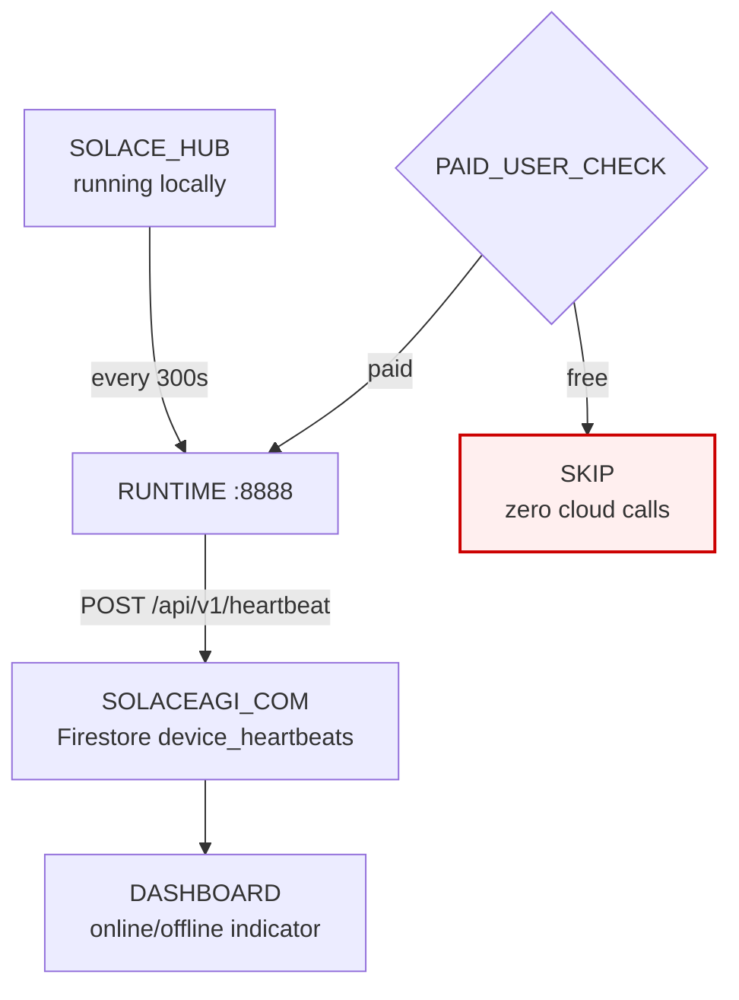

<!-- Diagram: 26-heartbeat-cloud-ping -->
# 26: Heartbeat — Hub Cloud Health Ping
# SHA-256: 2ab506e2ced7ea470eaa9a1e5e0f85fabb31d2c4648e3e3c898ea5122bc8d7c0
# DNA: heartbeat = hub(every_300s) to cloud(store_firestore) to dashboard(online_offline)
# Auth: 65537 | State: SEALED | Version: 1.0.0


## Extends
- [STYLES.md](STYLES.md) — base classDef conventions
- [hub-runtime](hub-runtime.prime-mermaid.md) — parent diagram

## Canonical Diagram



## PM Status
<!-- Updated: 2026-03-14 | Session: P-67 -->
| Node | Status | Evidence |
|------|--------|----------|
| HUB (SOLACE_HUB) | SEALED | Hub running locally, spawns runtime |
| RUNTIME | SEALED | Runtime :8888 with cloud.rs heartbeat |
| CLOUD (SOLACEAGI_COM) | SEALED | Firestore device_heartbeats collection + heartbeat.py |
| DASH (DASHBOARD) | SEALED | Dashboard online/offline indicator in dashboard.html |
| PAID_GATE (PAID_USER_CHECK) | SEALED | Paid user check before heartbeat in cloud.rs |
| SKIP | SEALED | Free users get zero cloud calls |


## Related Papers
- [papers/hub-three-realms-paper.md](../papers/hub-three-realms-paper.md)

## Forbidden States
```
FREE_USER_HEARTBEAT -> BLOCKED (paid only)
HEARTBEAT_WITHOUT_API_KEY -> BLOCKED
```

## Covered Files
```
code:
  - solace-browser/solace-runtime/src/cloud.rs
  - solaceagi/app/api/v1/routers/heartbeat.py
services:
  - solaceagi.com/api/v1/heartbeat
```

## Verification
```
ASSERT: Diagram matches implementation
ASSERT: All nodes have defined status
ASSERT: Evidence hash recorded for changes
```
