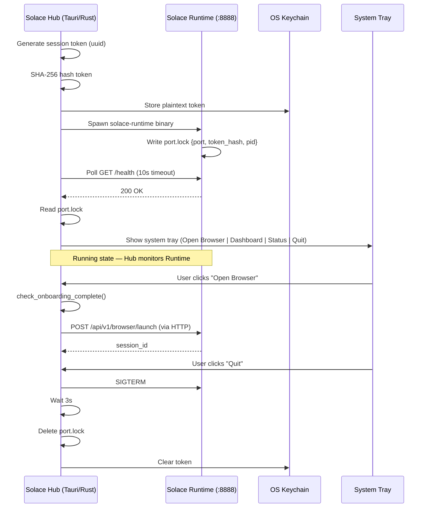

<!-- Diagram: 04-hub-lifecycle -->
# 04: Hub Lifecycle — Startup to Shutdown
# SHA-256: 2af457f420c20a73f15d49ef47e9b64fb4f27dccfbceb8019263ebd66d42492f
# DNA: `hub = generate_token → store_keychain → spawn_runtime → wait_health → tray → shutdown(sigterm+cleanup)`
# Auth: 65537 | State: SEALED | Version: 1.0.0


## Extends
- [STYLES.md](STYLES.md) — base classDef conventions

## Canonical Diagram



## PM Status
<!-- Updated: 2026-03-14 | Session: P-67 -->
No flowchart nodes — sequence diagram covers Hub lifecycle.
Overall: SEALED


## Related Papers
- [papers/hub-three-realms-paper.md](../papers/hub-three-realms-paper.md)

## Forbidden States
```
BROWSER_WITHOUT_HUB     -> KILL (Hub must start first)
DIRECT_BROWSER_SPAWN    -> KILL (all launches via runtime API)
PORT_9222               -> KILL
PLAINTEXT_TOKEN_FILE    -> KILL (token in keychain only, hash in port.lock)
```

## Covered Files
```
code:
  - solace-browser/solace-hub/src-tauri/main.rs
  - solace-browser/solace-hub/src-tauri/Cargo.toml
specs:
  - specs/hub/solacehub-instructions.md
services:
  - localhost:8888/health
```

## Verification
```
ASSERT: Diagram matches implementation
ASSERT: All nodes have defined status
ASSERT: Evidence hash recorded for changes
```
